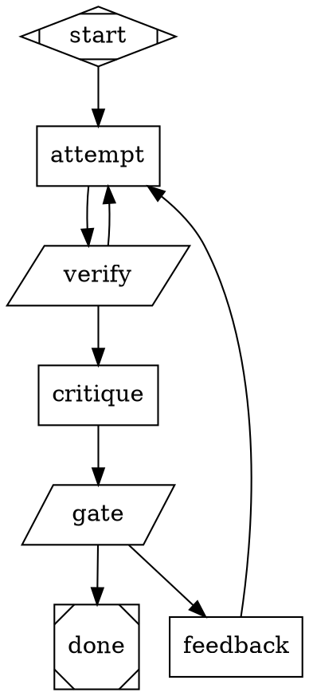

# Attractor Assessment — Full Notes

Captured 2026-07-28. Sources: deep exploration of `./attractor` (strongdm) and
`./amplifier-bundle-attractor` (microsoft), plus attractor-expert briefing
(resumable session: `0000000000000000-91c3f8ab75694a91_attractor-expert`).
Runtime claims verified against `engine.py`, not just spec prose.

---

## 1. The Original StrongDM Concept (`./attractor`)

- **The repo is not code — it's three NLSpecs** (~5,700 lines) meant to be handed
  to a coding agent: "implement Attractor from this spec."
  - `attractor-spec.md` (2,090 lines) — the pipeline runner spec (core artifact)
  - `coding-agent-loop-spec.md` (1,467 lines) — programmable agent-loop library
  - `unified-llm-spec.md` (2,169 lines) — multi-provider LLM client
- **Aspiration:** "build your own version of Attractor to create your own
  **software factory**" (README.md:3). Spec is the durable artifact;
  implementations are regenerable cattle. Each spec carries its own
  Definition-of-Done checklist so an agent can self-validate.
- **Lineage (interpretation, not spec-documented):** the industrialized successor
  to the Ralph Wiggum loop (ghuntley) — agent in `while(true)`, state in
  files/git. Attractor = define the **basin of attraction explicitly as a graph**:
  retry edges, goal gates, `retry_target` jumps keep pulling execution back until
  convergence. NOTE: the repo never explains the name; the dynamical-systems
  reading is inference strongly supported by the design's shape.
- **"The graph is the workflow"** (attractor-spec.md:29). DOT chosen because it's
  natively a graph language, free visualization, human-readable, PR-reviewable.
- **Philosophy:** declarative over imperative ("authors do not write control
  flow"); headless engine + separable frontends (event stream); backend-agnostic
  codergen; "fidelity of control is the point" (agent as library, not CLI black
  box); provider-alignment (byte-for-byte native tool/prompt parity).
- **Load-bearing interfaces:** edge selection (§3.3), goal gates (§3.4), context
  fidelity (§5.4), status-file contract (Appendix C). Everything else pluggable.

## 2. The Bundle (`./amplifier-bundle-attractor`)

Full implementation, not a wrapper. 23 documented extensions (`specs/EXTENSIONS.md`),
backward compatible with community `.dot` files.

- **Entry points:** `bundles/attractor-pipeline.yaml` (session IS the pipeline;
  `loop-pipeline` orchestrator), `attractor-interactive.yaml` (agent with
  `run_pipeline` tool), `attractor-agent.yaml` (standalone coding agent).
- **Modules (13):** `loop-pipeline`, `loop-agent`, `pipeline-runner` (the
  `attractor` CLI), `unified-llm-client`, `remote-source`,
  `tool-{report-outcome, pipeline-run, pipeline-status, dashboard-query,
  apply-patch}`, `hooks-{tool-truncation, pipeline-progress, pipeline-observability}`.
- **Per-node execution:** each `box` node spawns a fresh `loop-agent` child
  session; `profiles:` map routes `llm_provider` → child agent bundle. Results
  map to a full Outcome via `report_outcome` tool or pure-JSON response.
- **attractor-expert agent MUST be consulted** for any `.dot` authoring
  (context/pipeline-awareness.md:102-111). `context/engine-semantics.md` is the
  source of truth over spec prose.
- **Key docs:** docs/PIPELINE_DESIGN_PRINCIPLES.md, PIPELINE_PATTERNS.md,
  ROUTING-REFERENCE.md, DOT-AUTHORING-GUIDE.md, APP-INTEGRATION-GUIDE.md
  (incl. recipes-vs-attractor "when to use each").
- **Checkpoint ≠ resume:** checkpoint.json is a crash-observability record;
  engine always starts from the start node. Resume is a *graph pattern*:
  parallelogram file-state guards emitting `done`/`todo` (example 12).
- **Examples:** tutorials 01–12, practical/ (bug-fix, refactor, test-gen,
  pr-review, feature-build, multi-lens-review), patterns/
  (★ convergence-factory.dot, conversational-gate.dot).

### Engine gotchas (shipped ≠ spec prose — will bite)

1. `box` nodes CAN route and set context (via report_outcome).
2. **FAIL is fail-fast** — does NOT traverse plain edges. Routes only via
   `condition="outcome=fail"`, `runs_on=always|failure`, or retry targets.
3. `last_response` between nodes truncated to **200 chars** except `fidelity=full`.
   Need prose downstream → `full` + shared `thread_id`, or write files.
4. Route on `tool.last_line` (last non-empty stdout line), NOT `tool.output`.
5. No matching edge + not FAIL → branch **terminates SUCCESS silently**.
6. `outcome=` resolves `preferred_label` FIRST, then status (ext #22, gap ATX-5).
7. Dotted keys expand in `tool_command`/`tool_env`, NOT in `prompt` (only
   `$goal`, `$context`, plain keys).
8. Tool CWD = `context.target_dir` → `graph.source_dir` → process default.
   CLI gotcha: process cwd must equal `--cwd` for box-node pipelines.
9. No backend / no `llm_model` → RAISE (fail-loud).
10. Goal-gate ceiling: `_MAX_GOAL_GATE_RETRIES = 50`; total steps ≤ nodes × 50.
11. `house` (manager loop) is experimental; example 11 is a known-failing fixture.

## 3. THE POINT (what we've been missing)

> **A pipeline's job is not to describe the steps. It is to shape a space so
> that quality becomes the only stable resting place.**

An LLM node is a noisy operator. You can't make a single call reliable; you CAN
build a shape where noise gets corrected instead of accumulated. You are not
orchestrating LLM calls — you are building an **error-correcting code around a
noisy channel**.

### The math (converts aesthetics into arithmetic)

| Shape | Per-step reliability | 6 steps |
|---|---|---|
| Linear A→B→C→D→E→F | 0.90 | **0.53** (coin flip) |
| Linear | 0.95 | 0.74 |
| Each risky step wrapped in verify→retry (2 tries) | 0.90 → ~0.99 eff. | **0.94** |

Chains multiply variance; loops divide it. Adding steps makes linear pipelines
worse; adding gates makes looped pipelines better.

### Cycles, not DAGs

`plan → implement → test → done` is a flowchart that *reports* failure. An
attractor makes `done` **structurally unreachable** until evidence says so
(goal gates at the exit + corrective back-edges). A DAG in DOT syntax = a
recipe with extra steps.

### The three-question test (for every .dot we own)

1. **Is there a cycle?** (`dot_graph analyze --analysis cycles` empty → flowchart)
2. **Is the exit gated on evidence**, not step-completion? (test passed / file
   exists / validator returned 0 — vs "last node finished talking")
3. **Would it still land if any one LLM node had a bad day?** (one mediocre
   generation silently propagating → no basin, just a conveyor belt)

### Flowchart vs attractor

| | Flowchart of LLM steps | Attractor pipeline |
|---|---|---|
| Topology | DAG | Cyclic, with sinks |
| Exit | Last node finished | Goal gate / deterministic predicate |
| Failure | Propagates or aborts | Routes back into the basin |
| Node count grows with | task detail | quality dimensions |
| Variance | compounds | absorbed by loops |
| Reruns | same quality distribution | converges |
| Prompts | "do step N correctly" | "advance the goal; code will check you" |

**Mental flip:** stop asking "what are the steps?" Ask "what would make me
believe this is done, and what pulls the work back when it isn't?"
**Design the gate first, the loop second, the steps last.**

## 4. Design Principles

1. **Tier discipline.** Model for judgment, `parallelogram` for typing/glue.
   Self-test per box node: "is the model here for judgment, or just to type?"
   Never use a model as a format translator.
2. **Cheap gate first, expensive gate second.** pytest before LLM critique. Always.
3. **Route on observed evidence, not typed sentinels.** Agent does real work →
   code observes result (exit code, git diff, file presence) > LLM writes prose
   → grep → printf sentinel > LLM emits exact routing keyword.
4. **Output protocols chosen deliberately:** SF (Skip the Format — agent makes
   the real edit, git diff captures), MLE (Make it LLM-Easy — single keywords,
   `grep -qi`), V+R (Validate + Retry with the exact error fed back).
5. **Loops need a hard bound.** Deterministic exit predicate > max_retries cap >
   composite. The LLM is never the sole stop condition.
6. **Verdict nodes must emit evidence.** Distinguish confident-FAIL from
   insufficient-evidence; diagnose structural vs stochastic variance before
   scaling run count.
7. **Feedback must accumulate.** Retry without critique = coin re-flip; retry
   with written critique of prior attempt = descent. Write the single
   highest-leverage next change to `.ai/feedback/`; generator reads it first.
   `loop_restart="true"` clears execution state but PRESERVES `context_updates`
   — the carry-learning-forward mechanism.
8. **Parallelism for disagreement, not throughput.** Independent lenses;
   divergence is signal (multi-lens-review).

### Golden rules (bundle's own expert context)

- Every inference is a `box` node; never call the LLM client from a tool node.
- Code nodes are glue only.
- Copy the nearest proven pipeline before inventing.
- Route verdicts via `report_outcome`, not free-text JSON.
- `dot_graph validate` after every edit.
- Author fail-loud: explicit FAIL edges, explicit `llm_model`, `${var:-default}`.

### Anti-pattern catalog

| Anti-pattern | Fix |
|---|---|
| LLM as format translator (generate a diff) | SF — agent edits, `git diff` captures |
| LLM-emitted routing sentinel | Agent writes file → grep → printf |
| Prompt/validator drift | Generalize notice or DRY via `describe_checks()` |
| `goal_gate=true` without `retry_target` | Gate with no recovery just fails |
| `condition="status=success"` | It's `outcome=`, not `status=` |
| `full` fidelity everywhere | Only where continuity matters |
| >10 nodes | Context dilution; fewer, well-prompted nodes |
| Cycle with no conditional exit | Infinite loop (capped, but still) |

## 5. When Is an Attractor Pipeline the Right Tool?

> Reach for an attractor pipeline when **the work must converge to a checkable
> standard, and you'll run it more than once.**

Qualifying signals (want ≥2): (1) verifiable definition of done exists;
(2) first attempts routinely aren't good enough; (3) repeated shape (amortizes).

Do NOT use when: one-shot exploratory (delegate), structure not knowable in
advance (let the agent decide), no mechanical success signal (ceremony over
chat). A pipeline whose gates are all LLM opinion is strictly worse than asking
the agent directly.

**Recipes vs attractor (the blurred line):** recipes = staged sequential work
with human approval gates. Attractor = machine-verified convergence.
**If the .dot has no cycle, it should probably have been a recipe.**

## 6. Canonical Examples to Study (in order)

Tier 1 (`examples/pipelines/`): 03 conditional-routing → 04 retry-with-fallback
(first real attractor) → 02 plan-implement-test (goal_gate) → 07 fidelity-modes
→ 05 parallel-fan-out.

Tier 2 ★: **`examples/patterns/convergence-factory.dot`** — the "true attractor"
exemplar: generate → validate (mechanical) → assess (semantic) → check →
feedback (Pyramid Summary to `.ai/feedback/`) → `loop_restart` back to generate.
The critique accumulates, not just the artifact. Also `conversational-gate.dot`.

Tier 3 (`practical/`): multi-lens-review (3 providers × 3 lenses, disagreement
as signal), bug-fix / refactor / test-gen (runnable samples), 10-full-attractor
(feature index — don't imitate density), 09-manager-supervisor (experimental).

## 7. The Reference Shape (7 nodes, 2 gates, 2 cycles — validated)

Visible in it: SF (agent edits, code observes), cheap-gate-first, file-based
routing via printf (no LLM-typed sentinels), accumulating feedback,
loop_restart resetting execution but not learning, bounded loop.

## 8. The Prescription for "Too Linear / Too Scripted"

1. **Diagnostic:** run `dot_graph analyze --analysis cycles` on every .dot we
   own. Zero cycles → not an attractor pipeline. That count is the baseline.
2. **Invert authoring order:** name the sink → build the gate → build the loop
   → only then the work nodes.
3. **Reprompt work nodes:** from "Step 3 of 6: write unit tests per the plan"
   to "Advance $goal. Read .ai/feedback/ and address prior critique. Code will
   verify your work." Position-responsibility → goal-responsibility.
4. **Audit every box node** for judgment-vs-typing; convert typing to
   parallelogram (removes variance AND yields deterministic routing signal).
5. **Make feedback accumulate** (highest-leverage, subtlest change).
6. **Use fan-out for independent readings**; treat divergence as signal.

## 9. Sharpest Diagnostic Question

For each pipeline we've built: **what is the machine-checkable definition of
done?** If there isn't one, the fix isn't a better graph — it's finding the
gate first. Everything else follows.

## 10. Open Confidence Edges (expert's own caveats)

- `house`/manager-loop experimental — prototype before designing around it.
- Example 11 (manager + child dotfile + HITL) is a known-failing regression fixture.
- `outcome=` → `preferred_label` resolution (ATX-5): audit pipelines routing on
  `outcome=success` where nodes also set labels.
- Verify `context.target_dir` / process-cwd alignment with a live smoke run.

## Related leverage context (skill: amplifier-tool-leverage-patterns)

Four leverage levels for Amplifier-powered tools: L1 = .dot attractor pipelines
(composable into larger flows / Resolve dot-graph resolver), L2 = Python lib,
L3 = tool modules, L4 = CLI. DRY rule: logic lives in ONE home — for LLM-logic
tools the .dot files ARE the logic; for deterministic tools the lib is home and
.dot shells out. Build only levels a real consumer demands.
