# Goal Plan Attractor Implementation Plan

> **For execution:** Use `/build-like-ken` mode.
>
> **Approved design:** `docs/plans/2026-08-22-goal-plan-attractor-design.md` at exact commit `4054c549f162740875494d723a554490d76975ea` (blob `8de490f12dd6c43d80d471299b675f4161929b98`). Do not execute this plan against another design revision.

**Goal:** Build the approved static `goal_plan_smoke` Attractor family so a fixed three-lane dependency plan runs in process-isolated Git worktrees, integrates only independently verified commits, proves one final HEAD, and optionally delivers one independently confirmed exact-head pull request.

**Architecture:** A harness-owned immutable launch descriptor is the first trust root. A separately installed external bootstrap authenticates itself, Git, the interpreter/executable, the exact committed plan blob, and checked-out plan bytes before it may parse plan-controlled trust; it then materializes byte-exact non-writable runtime/supervisor Git blobs and `execve`s the parent Attractor only after changing OS CWD to the canonical target repository. The reviewed parent DOT owns admission revalidation, explicit dependency waves, accountable process-per-worktree children, budgets, parent verification, sequential integration, correction, final proof, delivery, cleanup authority, finalization, and four terminal carriers.

**Tech Stack:** Graphviz DOT; source-backed Amplifier Attractor modules (`pipeline-runner`, `loop-pipeline`, `unified-llm-client`, `remote-source`); Python 3.11+ standard library; Linux procfs, process groups, `waitpid`, `CLOCK_BOOTTIME`, and `fcntl.flock`; Git commits/refs/worktrees; system `python3 -m pytest`; `python_check`; Graphviz `dot`; GitHub CLI or GitHub REST for independent delivery proof.

**Verification approach:** Run static Python checks first, then source-backed Attractor parser/lint with `--strict`, Graphviz render, system-Python unit and complete fault-matrix tests, and finally the real descriptor/bootstrap/parent/multi-child path in a temporary GitHub-backed repository. The live proof must show Wave-1 overlap, mechanical CWD isolation, authoritative per-child wait status, feedback-dependent correction, both verifier envelopes, candidate worktrees, sequential integration with aggregate verification after every merge, bounded coherence correction, a one-HEAD final sweep plus `final-aggregate-after-sweep`, exact-head PR delivery, `PreTerminalCleanup`, immutable finalization, and the correct carrier. Missing Graphviz or unavailable delivery credentials/permission is reported exactly as `BLOCKED`; it is never waived or turned into a pass.

## Global Constraints

The following project-wide requirements are copied verbatim from the final approved design; every task inherits them.

- `plan.json` is versioned design-time and audit data. It is not a runtime scheduling manifest: runtime must not iterate its `lanes` or `waves` to decide what runs next. The generated DOT owns dispatch and contains the actual program.
- The bootstrap trust root is a required immutable `launch_descriptor.json` created and owned by the trusted invoking harness or production deployment configuration. It is never stored in the target repository, `state_root`, `worktree_root`, any Git worktree, or `delivery_state_root`, and no target-repository or plan-directed process may create, replace, repair, or select it.
- The working-copy plan cannot authenticate itself.
- `schema_version` is a string with exact value `goal-plan.plan/v5`.
- `launch_descriptor.json` uses exact schema `goal-plan.launch-descriptor/v1`, rejects unknown fields, and contains exact `descriptor_version: 1`.
- `attractor_runner_argv_prefix` is a required immutable non-empty `list[str]`. The only permitted exact forms are `["/absolute/path/to/attractor"]` or `["/absolute/path/to/python", "-m", "amplifier_module_pipeline_runner.cli"]`.
- `trusted_launcher_argv_prefix` is a required immutable non-empty `list[str]` authenticated only after descriptor/plan-blob validation. The only permitted exact forms are `["/absolute/external/path/to/goal-plan-bootstrap"]` or `["/absolute/path/to/python", "/absolute/external/path/to/goal_plan_bootstrap.py"]`.
- `provider` is a non-empty compiled provider ID. Every parent-spawned lane, correction, and delivery runner argv contains `--provider` immediately followed by that exact compiled provider ID; the value is immutable across restart/resume.
- Launch every lane, integration-correction, and delivery child from one immutable `attractor_runner_argv_prefix` with the exact compiled `provider`.
- Execute every supervisor start and control operation from one separately immutable external `trusted_supervisor_argv_prefix`; no supervisor operation uses PATH, a shell command string, or a target-repository interpreter/script.
- After handoff, execute every safety-critical gate, budget/process/worktree control, cleanup, finalizer, and recovery operation only through the external `trusted_runtime_argv_prefix` or `trusted_supervisor_argv_prefix`; target-repository runtime files remain source evidence and are never a safety-critical executable.
- `realpath(/proc/self/cwd) == canonical_target_repo`.
- `realpath(resolve_runner_cwd("--cwd", ".")) == canonical_target_repo`.
- `realpath(resolve_dot_operand("pipelines/PLAN_SLUG/PLAN_SLUG.dot")) == canonical_target_repo/pipelines/PLAN_SLUG/PLAN_SLUG.dot`.
- `state_root` and, when present, `delivery_state_root` are absolute, external, pairwise disjoint, and neither equal to, ancestors of, nor descendants of the target repository root, Git common directory, compiled-source directory, any registered Git worktree, or `worktree_root`.
- `launch_control_root` and the exact descriptor/bootstrap realpaths are additionally disjoint from all those roots and worktrees, including `state_root`; no run-owned root may contain them or be contained by them.
- Record every post-approval lane, integration, candidate-verification, and delivery worktree in `run-owned-worktrees.json`; reject foreign paths and when current `FULL` authority permits Git cleanup, clean up only exact recorded run-owned worktrees.
- The lifecycle enum is exactly `CREATING`, `ACTIVE`, `REMOVING`, `REMOVED`, or `PRESERVED_RESIDUAL`.
- Require every lane and integration-correction child to execute a deterministic `ReserveGlobalAttempt` node before each adaptive attempt; process starts/restarts never stand in for attempt accounting.
- `max_total_attempts` counts only verification-bearing adaptive attempts whose reservation is consumed when the complete child-attempt envelope is classified.
- `max_process_launches` and `max_integration_corrections` are separate positive locked budgets.
- `poll_wait_seconds` is exactly `30` and `engine_step_multiplier` is exactly `50`.
- `ceil(max_child_seconds / poll_wait_seconds) + branch_nonpoll_steps < branch_node_count * 50`.
- `parent_total_step_upper_bound < parent_node_count * engine_step_multiplier`.
- Every lane and integration-correction verifier that runs in an adaptive child uses a deterministic `ChildAttemptVerifierEnvelope`.
- Every parent-side lane or aggregate verifier runs through one checked-in deterministic `VerifierExecutionEnvelope`.
- Require a durable commit before a lane can be integrated.
- Have the parent independently rerun each lane verifier against the exact commit proposed for integration through the shared read-only verifier envelope.
- Integrate passing lane commits sequentially.
- Run the aggregate verifier through the same envelope after every integration, before every coherence review, and after the final all-lane sweep.
- After coherence passes, rerun every lane verifier at one exact final integration HEAD, then require `final-aggregate-after-sweep` at that same HEAD before completion.
- Keep the complete compiled pipeline directory byte-immutable throughout the run; source mutation is infrastructure failure, never corrective lane work.
- Separate the approved product baseline from the later execution-source commit that contains the complete compiled pipeline, and bind both identities through every runtime and evidence boundary.
- `PLAN_SLUG.md` is required in `history_anchor` mode and must not contain the anchor fields themselves.
- Composition first commits that identity-stable plan artifact, records its commit and blob hash in `plan.json`, materializes the final DOT, and commits the complete compiled pipeline directory.
- Compile one immutable canonical `delivery_branch`, the ref produced by prefixing it with `refs/heads/`, remote mapping, collision policy, and final-HEAD creation source into the plan and every delivery/recovery record. Never force-push or accept a same-named branch owned by another run.
- Implement the delivery child by adapting the proven `deliver_pr.dot` topology into a supervised child running in a clean disposable final-HEAD worktree whose generated state is rooted only at external `delivery_state_root`, then independently verify that the remote PR points at the exact integrated HEAD.
- `FULL` only when all four current verdicts are exactly `PASS`.
- `EXTERNAL_ONLY` only while `trusted_runtime_binding_verdict == PASS` and any parent/target-source/compiled-source verdict is `RED` or `UNKNOWN`.
- `NONE` when trusted-runtime validation is `RED` or `UNKNOWN` before invocation, or becomes red during the attempt.
- Route every intended terminal state through `PreTerminalCleanup`, let that phase choose the final status from real process/worktree state, and only then publish durable terminal result/status/token/carrier evidence.
- The four exact parent carrier nodes are `CompleteCarrier`, `ResidualsCarrier`, `InfraCarrier`, and `AbortedCarrier`.
- Every successful finalizer/carrier token edge uses `context.tool.last_line=TOKEN && outcome=success`, where `TOKEN` is the literal token declared by that carrier node.
- Every tool source also has a separate exact `condition="outcome=fail"` route to infrastructure handling.
- End in one of four explicit terminal states: `COMPLETE`, `RESIDUALS_READY`, `INFRA_FAILURE`, or `ABORTED`.
- `PRELAUNCH_INFRASTRUCTURE_BLOCKED` and `RECOVERY_INFRASTRUCTURE_BLOCKED` are harness-only outcomes, not `GOAL_PLAN:*` terminal states. Both use fixed process exit code `78`.
- `preapproved` is a valid unattended headless standalone mode.
- `approval_mode=required` is valid only for a standalone parent invocation with exact `human_gate_transport=console`, exact runner flag `--on-human-gate console`, `isatty(stdin) == true`, and an attached `/dev/tty` that admission can open for both reading and writing.
- Lane, correction, and delivery children always use `--on-human-gate fail`; only the attached standalone parent plan gate may interview a person.
- Do not invoke literal `/goal`, launch `amplifier run` child processes, depend on app-cli private coordination, add per-box `session_cwd`, add non-Linux schema-v1 supervision, create a resolver, create a hidden scheduler/work queue/pool, dynamically compile child DOT, let a lane certify itself, auto-deliver residual work, merge/deploy the PR, replace goalify/goal-batch composition, or reimplement/wrap `goaltractor`.
- Runtime Python uses only the standard library, explicit UTF-8 file I/O, canonical JSON, absolute validated executables, no PATH lookup, no `/usr/bin/env`, no shell-constructed supervisor/child argv, and no managed-cache mutation.
- The expected checked-in footprint is exactly the 13 files under `pipelines/goal_plan_smoke/` listed in the approved design plus one `README.md` entry.
- Parse and render the parent, lane, correction, and delivery DOT files with Graphviz; run the immutable runner prefix's `lint --strict` on the entry graph and all three subgraphs; run `python_check` on all three checked-in Python implementation files and their tests; run tests with system Python exactly as `python3 -m pytest pipelines/goal_plan_smoke/python/tests -q`; and run the live temporary-repository smoke and complete named fault matrix.
- Read `AGENTS.md`, `docs/primer.md`, and `docs/RUBRIC.md` again immediately before Tasks 17-21 and audit every DOT against the rubric before the compiled commit.
- Every local task checkpoint commit and the two authoritative history-anchor/compiled commits must include the Amplifier attribution trailer required by repository-wide agent guidance.

---

## Phase 1: Content-address anchor and trusted bootstrap

### Task 1: Commit the identity-stable companion guide anchor

**Description:** Create the immutable companion guide before any compiled artifact references its history anchor.

**Goal:** Produce the `history_anchor` blob and two durable SHA identities without introducing self-referential fields.

**Specification:** Capture the current HEAD as `product_base_sha`; write `goal_plan_smoke.md` without `product_base_sha`, `plan_commit_sha`, `execution_source_sha`, blob IDs, or descriptor hashes; commit it alone; then capture the commit as `plan_commit_sha`.

**Acceptance Criteria:** The anchor commit changes exactly one file; `git show "$PLAN_COMMIT_SHA:pipelines/goal_plan_smoke/goal_plan_smoke.md"` equals the working file; the product base is the anchor's parent; forbidden anchor-field names do not occur in the guide.

**Files:**
- Create: `pipelines/goal_plan_smoke/goal_plan_smoke.md`

**Interfaces:**
- Consumes: approved design `docs/plans/2026-08-22-goal-plan-attractor-design.md`; current repository HEAD.
- Produces: immutable guide blob; shell values recoverable later as `PLAN_COMMIT_SHA=$(git log --format=%H -- pipelines/goal_plan_smoke/goal_plan_smoke.md | tail -1)` and `PRODUCT_BASE_SHA=$(git rev-parse "$PLAN_COMMIT_SHA^")`.

**Model Roles:**
- implementation_model_role: `fast`
- review_model_role: `critique`
- escalated_model_role: `reasoning`

**Implementation**

Create the file exactly as follows:

```markdown
# Goal Plan Smoke Pipeline

`goal_plan_smoke` is the canonical fixed three-lane member of the Goal Plan
Attractor family. It demonstrates a reviewed static dependency graph, not a
runtime scheduler: `lane_a` and `lane_b` run concurrently in separate Git
worktrees and child Attractor processes; `lane_c` starts only after both Wave 1
commits are independently verified, integrated in stable order, and followed by
green aggregate checks.

The parent owns admission, budgets, process supervision, candidate verification,
ownership, integration, aggregate/coherence/final gates, recovery, cleanup,
terminal carriers, and optional PR delivery. A descriptor-authenticated external
bootstrap materializes the trusted runtime and supervisor from exact committed
Git blobs before the parent starts. Checked-in Python is source evidence, not the
first executable trust root.

## Required external inputs

- Linux with readable procfs and `CLOCK_BOOTTIME`
- an absolute source-backed Attractor runner prefix
- credentials for the immutable provider selected at composition time
- pairwise-disjoint absolute `launch_control_root`, `state_root`,
  `worktree_root`, and `delivery_state_root`
- an immutable harness-owned launch descriptor and byte-exact external bootstrap
- a GitHub-backed temporary target repository and credentials when delivery is
  enabled
- Graphviz `dot` for mandatory render verification

## Runtime shape

1. The harness authenticates the launch descriptor, exact committed plan blob,
   external bootstrap, Git, interpreter, provider, and closed environment.
2. The bootstrap extracts and seals runtime/supervisor blobs, changes to the
   canonical target repository, and `execve`s the parent with literal `--cwd .`.
3. Wave 1 fans out to `lane_a` and `lane_b`; their accountable reapers capture
   real wait status. `lane_b` must use changed verifier feedback to correct its
   seeded first failure.
4. The parent verifies candidate commits in clean detached worktrees, enforces
   ownership, integrates sequentially, and runs aggregate verification after
   every merge.
5. Wave 2 runs `lane_c` only after both dependencies are green and integrated.
6. A controlled first coherence review routes through one bounded supervised
   integration correction, then affected-closure proof, fresh coherence, final
   sweep, and `final-aggregate-after-sweep` all bind one exact final HEAD.
7. Optional delivery uses one immutable no-force branch and an external-state
   child; the parent independently queries the remote PR head.
8. Preterminal cleanup chooses the final status before immutable finalization and
   one of four explicit carriers.

## Terminal contract

The only caller tokens are `GOAL_PLAN:COMPLETE`,
`GOAL_PLAN:RESIDUALS_READY`, `GOAL_PLAN:INFRA_FAILURE`, and
`GOAL_PLAN:ABORTED`. Only `GOAL_PLAN:COMPLETE` denotes success. Harness failures
before the graph starts use the separate blocked tokens and exit 78.

## Verification

Run the Python static/test commands, source-backed lint for all four DOT files,
Graphviz rendering, the real three-lane headless scenario, the complete fault
matrix, and the independent exact-head delivery query described in the
implementation plan. Missing Graphviz or remote credentials is a blocker, not a
pass.
```

Execute:

```bash
PRODUCT_BASE_SHA=$(git rev-parse HEAD)
mkdir -p pipelines/goal_plan_smoke
python3 - <<'PY'
from pathlib import Path

path = Path("pipelines/goal_plan_smoke/goal_plan_smoke.md")
content = """# Goal Plan Smoke Pipeline

`goal_plan_smoke` is the canonical fixed three-lane member of the Goal Plan
Attractor family. It demonstrates a reviewed static dependency graph, not a
runtime scheduler: `lane_a` and `lane_b` run concurrently in separate Git
worktrees and child Attractor processes; `lane_c` starts only after both Wave 1
commits are independently verified, integrated in stable order, and followed by
green aggregate checks.

The parent owns admission, budgets, process supervision, candidate verification,
ownership, integration, aggregate/coherence/final gates, recovery, cleanup,
terminal carriers, and optional PR delivery. A descriptor-authenticated external
bootstrap materializes the trusted runtime and supervisor from exact committed
Git blobs before the parent starts. Checked-in Python is source evidence, not the
first executable trust root.

## Required external inputs

- Linux with readable procfs and `CLOCK_BOOTTIME`
- an absolute source-backed Attractor runner prefix
- credentials for the immutable provider selected at composition time
- pairwise-disjoint absolute `launch_control_root`, `state_root`,
  `worktree_root`, and `delivery_state_root`
- an immutable harness-owned launch descriptor and byte-exact external bootstrap
- a GitHub-backed temporary target repository and credentials when delivery is
  enabled
- Graphviz `dot` for mandatory render verification

## Runtime shape

1. The harness authenticates the launch descriptor, exact committed plan blob,
   external bootstrap, Git, interpreter, provider, and closed environment.
2. The bootstrap extracts and seals runtime/supervisor blobs, changes to the
   canonical target repository, and `execve`s the parent with literal `--cwd .`.
3. Wave 1 fans out to `lane_a` and `lane_b`; their accountable reapers capture
   real wait status. `lane_b` must use changed verifier feedback to correct its
   seeded first failure.
4. The parent verifies candidate commits in clean detached worktrees, enforces
   ownership, integrates sequentially, and runs aggregate verification after
   every merge.
5. Wave 2 runs `lane_c` only after both dependencies are green and integrated.
6. A controlled first coherence review routes through one bounded supervised
   integration correction, then affected-closure proof, fresh coherence, final
   sweep, and `final-aggregate-after-sweep` all bind one exact final HEAD.
7. Optional delivery uses one immutable no-force branch and an external-state
   child; the parent independently queries the remote PR head.
8. Preterminal cleanup chooses the final status before immutable finalization and
   one of four explicit carriers.

## Terminal contract

The only caller tokens are `GOAL_PLAN:COMPLETE`,
`GOAL_PLAN:RESIDUALS_READY`, `GOAL_PLAN:INFRA_FAILURE`, and
`GOAL_PLAN:ABORTED`. Only `GOAL_PLAN:COMPLETE` denotes success. Harness failures
before the graph starts use the separate blocked tokens and exit 78.

## Verification

Run the Python static/test commands, source-backed lint for all four DOT files,
Graphviz rendering, the real three-lane headless scenario, the complete fault
matrix, and the independent exact-head delivery query described in the
implementation plan. Missing Graphviz or remote credentials is a blocker, not a
pass.
"""
path.write_text(content, encoding="utf-8")
PY
! grep -Eq 'product_base_sha|plan_commit_sha|execution_source_sha|descriptor_sha256|plan_blob_id' pipelines/goal_plan_smoke/goal_plan_smoke.md
git add pipelines/goal_plan_smoke/goal_plan_smoke.md
git diff --cached --name-only | grep -Fx pipelines/goal_plan_smoke/goal_plan_smoke.md
git commit -m "docs: anchor the goal plan smoke contract" \
  -m "🤖 Generated with [Amplifier](https://github.com/microsoft/amplifier)" \
  -m "Co-Authored-By: Amplifier <240397093+microsoft-amplifier@users.noreply.github.com>"
PLAN_COMMIT_SHA=$(git rev-parse HEAD)
test "$(git rev-parse "$PLAN_COMMIT_SHA^")" = "$PRODUCT_BASE_SHA"
printf 'PRODUCT_BASE_SHA=%s\nPLAN_COMMIT_SHA=%s\n' "$PRODUCT_BASE_SHA" "$PLAN_COMMIT_SHA"
```

**Static Analysis**

```bash
git diff --check "$PRODUCT_BASE_SHA..$PLAN_COMMIT_SHA"
```

Expected: exit 0 and no output.

**Verification**

```bash
test "$(git show "$PLAN_COMMIT_SHA:pipelines/goal_plan_smoke/goal_plan_smoke.md" | sha256sum | cut -d' ' -f1)" = "$(sha256sum pipelines/goal_plan_smoke/goal_plan_smoke.md | cut -d' ' -f1)"
```

Expected: exit 0.

**Commit**

The commit is created by the implementation command above. Do not amend or modify the anchor file afterward.

```bash
test "$(git rev-parse HEAD)" = "$PLAN_COMMIT_SHA"
git show --no-patch --format='%H %s' "$PLAN_COMMIT_SHA"
```

### Task 2: Implement descriptor-first bootstrap authentication

**Description:** Build the bootstrap's strict JSON, filesystem, executable-identity, committed-plan, and descriptor validation primitives.

**Goal:** Ensure no plan-controlled trust field is read before the immutable external descriptor authenticates launcher, Git, interpreter, committed plan blob, and checked-out plan bytes.

**Specification:** Use standard library only; reject unknown fields, symlinks, writable trusted files, relative paths, PATH lookup, extra/reordered CLI arguments, noncanonical JSON, hash mismatch, wrong exact plan path/blob, working-copy tampering, and environment drift; blocked initial/recovery calls exit 78 with exact external schemas/tokens.

**Acceptance Criteria:** `self-check` succeeds for one valid fixture; every descriptor/launcher/Git/interpreter/plan fault fails before the test spy records a `trusted_launcher_binding` read; blocked records are atomic, schema-valid, and outside the target repository.

**Files:**
- Create: `pipelines/goal_plan_smoke/python/goal_plan_bootstrap.py`

**Interfaces:**
- Consumes: `goal-plan.launch-descriptor/v1`; exact CLI `self-check --launch-descriptor PATH --plan PATH --evidence PATH`.
- Produces: `goal-plan.trusted-launcher-self-check/v2` evidence; helper contracts `canonical_bytes`, `sha256_file`, `atomic_create`, `validate_descriptor`, `authenticate_plan`, and `blocked` used by Task 3.

**Model Roles:**
- implementation_model_role: `reasoning`
- review_model_role: `critique`
- escalated_model_role: `critical-ops`

**Implementation**

Write one complete module with these exact public constants and functions; keep helper names/signatures unchanged because later tests and `plan.json` bind them:

```python
from __future__ import annotations

import argparse
import hashlib
import json
import os
import stat
import subprocess
import sys
import tempfile
from pathlib import Path
from typing import Any, NoReturn

DESCRIPTOR_SCHEMA = "goal-plan.launch-descriptor/v1"
BOOTSTRAP_CLI_SCHEMA = "goal-plan.bootstrap-cli/v1"
SELF_CHECK_SCHEMA = "goal-plan.trusted-launcher-self-check/v2"
PRELAUNCH_SCHEMA = "goal-plan.prelaunch-result/v1"
RECOVERY_SCHEMA = "goal-plan.recovery-result/v1"
PLAN_SCHEMA = "goal-plan.plan/v5"
EXIT_BLOCKED = 78

DESCRIPTOR_KEYS = {
    "schema_version", "descriptor_version", "execution_source_sha",
    "repository_identity", "target_repo", "plan_path", "plan_blob_id",
    "plan_blob_sha256", "plan_blob_length", "trusted_launcher_argv_prefix",
    "trusted_launcher_prefix_sha256", "trusted_launcher_identity",
    "trusted_git_argv_prefix", "trusted_git_prefix_sha256", "trusted_git_identity",
    "trusted_interpreter_or_executable_argv_prefix",
    "trusted_interpreter_or_executable_prefix_sha256",
    "trusted_interpreter_or_executable_identity", "provider", "closed_environment",
    "created_from", "descriptor_sha256",
}

def canonical_bytes(value: Any) -> bytes:
    return (json.dumps(value, sort_keys=True, separators=(",", ":"), ensure_ascii=False) + "\n").encode("utf-8")

def digest(value: Any) -> str:
    return hashlib.sha256(canonical_bytes(value)).hexdigest()

def sha256_file(path: Path) -> str:
    h = hashlib.sha256()
    with path.open("rb") as stream:
        for chunk in iter(lambda: stream.read(1024 * 1024), b""):
            h.update(chunk)
    return h.hexdigest()

def require_absolute_regular(path: Path, *, writable: bool = False) -> os.stat_result:
    if not path.is_absolute() or path.is_symlink():
        raise ValueError(f"unsafe path: {path}")
    info = path.lstat()
    if not stat.S_ISREG(info.st_mode):
        raise ValueError(f"not regular: {path}")
    if not writable and info.st_mode & 0o222:
        raise ValueError(f"trusted file is writable: {path}")
    return info

def read_strict_json(path: Path, allowed: set[str]) -> dict[str, Any]:
    require_absolute_regular(path)
    raw = path.read_bytes()
    value = json.loads(raw.decode("utf-8"))
    if not isinstance(value, dict) or set(value) != allowed:
        raise ValueError(f"schema keys mismatch: {path}")
    return value

def atomic_create(path: Path, value: Any, mode: int = 0o444) -> str:
    path.parent.mkdir(parents=True, exist_ok=True, mode=0o700)
    payload = canonical_bytes(value)
    fd = os.open(path, os.O_WRONLY | os.O_CREAT | os.O_EXCL | os.O_NOFOLLOW, 0o600)
    try:
        os.write(fd, payload)
        os.fsync(fd)
    finally:
        os.close(fd)
    os.chmod(path, mode)
    dfd = os.open(path.parent, os.O_RDONLY | os.O_DIRECTORY)
    try:
        os.fsync(dfd)
    finally:
        os.close(dfd)
    if path.read_bytes() != payload:
        raise ValueError(f"reread mismatch: {path}")
    return hashlib.sha256(payload).hexdigest()

def run_closed(prefix: list[str], suffix: list[str], cwd: Path | None, env: dict[str, str]) -> subprocess.CompletedProcess[bytes]:
    if not prefix or any(not token for token in prefix) or not Path(prefix[0]).is_absolute():
        raise ValueError("non-absolute executable prefix")
    return subprocess.run(prefix + suffix, cwd=cwd, env=env, stdin=subprocess.DEVNULL,
                          stdout=subprocess.PIPE, stderr=subprocess.PIPE, check=False, timeout=30)

def validate_identity(prefix: list[str], expected_prefix_hash: str, identity: dict[str, Any]) -> None:
    if digest(prefix) != expected_prefix_hash:
        raise ValueError("prefix hash mismatch")
    if not prefix or not Path(prefix[0]).is_absolute() or prefix[0] == "/usr/bin/env":
        raise ValueError("absolute direct prefix required")
    absolute_tokens = [token for token in prefix if token.startswith("/")]
    entries = identity.get("entries")
    if not isinstance(entries, list) or len(entries) != len(absolute_tokens):
        raise ValueError("identity entry cardinality")
    for token, expected in zip(absolute_tokens, entries, strict=True):
        candidate = Path(token)
        info = require_absolute_regular(candidate)
        observed = {
            "path": token,
            "realpath": str(candidate.resolve(strict=True)),
            "mode": stat.S_IMODE(info.st_mode),
            "length": info.st_size,
            "sha256": sha256_file(candidate),
        }
        if observed != expected:
            raise ValueError(f"trusted prefix identity mismatch: {token}")
        if info.st_mode & 0o222:
            raise ValueError(f"trusted prefix token writable: {token}")

def validate_descriptor(path: Path) -> dict[str, Any]:
    doc = read_strict_json(path, DESCRIPTOR_KEYS)
    if doc["schema_version"] != DESCRIPTOR_SCHEMA or doc["descriptor_version"] != 1:
        raise ValueError("descriptor schema/version")
    unhashed = {key: value for key, value in doc.items() if key != "descriptor_sha256"}
    if digest(unhashed) != doc["descriptor_sha256"]:
        raise ValueError("descriptor hash")
    validate_identity(doc["trusted_launcher_argv_prefix"], doc["trusted_launcher_prefix_sha256"], doc["trusted_launcher_identity"])
    validate_identity(doc["trusted_git_argv_prefix"], doc["trusted_git_prefix_sha256"], doc["trusted_git_identity"])
    validate_identity(doc["trusted_interpreter_or_executable_argv_prefix"], doc["trusted_interpreter_or_executable_prefix_sha256"], doc["trusted_interpreter_or_executable_identity"])
    closed = doc["closed_environment"]
    if set(closed) != {"plain_values", "environment_sha256"}:
        raise ValueError("closed environment schema")
    if not isinstance(closed["plain_values"], dict) or any(
        not isinstance(key, str) or not isinstance(value, str)
        for key, value in closed["plain_values"].items()
    ):
        raise ValueError("closed environment values")
    if digest({"plain_values": closed["plain_values"]}) != closed["environment_sha256"]:
        raise ValueError("closed environment hash")
    return doc

def authenticate_plan(descriptor: dict[str, Any], checked_out_plan: Path) -> tuple[dict[str, Any], bytes]:
    repo = Path(descriptor["target_repo"]["realpath"])
    if checked_out_plan != repo / descriptor["plan_path"] or checked_out_plan.is_symlink():
        raise ValueError("plan path mismatch")
    git = descriptor["trusted_git_argv_prefix"]
    env = descriptor["closed_environment"]["plain_values"]
    object_spec = f'{descriptor["execution_source_sha"]}:{descriptor["plan_path"]}'
    resolved = run_closed(git, ["-C", str(repo), "rev-parse", "--verify", object_spec], repo, env)
    if resolved.returncode != 0 or resolved.stdout.decode().strip() != descriptor["plan_blob_id"]:
        raise ValueError("plan blob id")
    blob = run_closed(git, ["-C", str(repo), "cat-file", "blob", descriptor["plan_blob_id"]], repo, env)
    if blob.returncode != 0 or len(blob.stdout) != descriptor["plan_blob_length"]:
        raise ValueError("plan blob read")
    if hashlib.sha256(blob.stdout).hexdigest() != descriptor["plan_blob_sha256"]:
        raise ValueError("plan blob hash")
    if checked_out_plan.read_bytes() != blob.stdout:
        raise ValueError("checked-out plan differs from committed blob")
    plan = json.loads(blob.stdout.decode("utf-8"))
    if plan.get("schema_version") != PLAN_SCHEMA:
        raise ValueError("plan schema")
    binding = plan["trusted_launcher_binding"]
    if plan["trusted_launcher_argv_prefix"] != descriptor["trusted_launcher_argv_prefix"]:
        raise ValueError("plan launcher prefix")
    if binding["launch_descriptor_schema"] != DESCRIPTOR_SCHEMA:
        raise ValueError("launcher binding descriptor schema")
    if plan["provider"] != descriptor["provider"]:
        raise ValueError("provider mismatch")
    return plan, blob.stdout

def blocked(kind: str, root: Path, reason: str, observations: dict[str, Any]) -> NoReturn:
    recovery = kind == "recovery"
    token = "RECOVERY_INFRASTRUCTURE_BLOCKED" if recovery else "PRELAUNCH_INFRASTRUCTURE_BLOCKED"
    schema = RECOVERY_SCHEMA if recovery else PRELAUNCH_SCHEMA
    path = root / ("recovery/recovery-result.json" if recovery else "prelaunch/prelaunch-result.json")
    record = {"schema_version": schema, "operation": kind, "token": token,
              "exit_code": EXIT_BLOCKED, "reason": reason, "observations": observations}
    record["record_sha256"] = digest(record)
    atomic_create(path, record)
    print(token)
    raise SystemExit(EXIT_BLOCKED)

def self_check(args: argparse.Namespace) -> int:
    descriptor = validate_descriptor(Path(args.launch_descriptor))
    plan, blob = authenticate_plan(descriptor, Path(args.plan))
    record = {"schema_version": SELF_CHECK_SCHEMA, "descriptor_sha256": descriptor["descriptor_sha256"],
              "plan_blob_id": descriptor["plan_blob_id"], "plan_blob_sha256": hashlib.sha256(blob).hexdigest(),
              "trusted_launcher_binding_sha256": plan["trusted_launcher_binding"]["binding_sha256"],
              "provider": descriptor["provider"], "verdict": "PASS"}
    record["record_sha256"] = digest(record)
    atomic_create(Path(args.evidence), record)
    print("TRUSTED_LAUNCHER_SELF_CHECK:PASS")
    return 0
```

Complete Task 2 with this exact single-command parser. Task 3 replaces this
parser and `main` block with the closed four-command parser shown in that task.

```python
def parser() -> argparse.ArgumentParser:
    root = argparse.ArgumentParser(allow_abbrev=False)
    sub = root.add_subparsers(dest="command", required=True)
    check = sub.add_parser("self-check", allow_abbrev=False)
    check.add_argument("--launch-descriptor", required=True)
    check.add_argument("--plan", required=True)
    check.add_argument("--evidence", required=True)
    return root

def main(argv: list[str] | None = None) -> int:
    args = parser().parse_args(argv)
    if args.command == "self-check":
        return self_check(args)
    raise AssertionError(args.command)

if __name__ == "__main__":
    try:
        raise SystemExit(main())
    except (ValueError, OSError, json.JSONDecodeError, subprocess.SubprocessError) as exc:
        sys.stderr.write(f"bootstrap error: {exc}\n")
        raise SystemExit(EXIT_BLOCKED)
```

**Static Analysis**

```bash
python_check pipelines/goal_plan_smoke/python/goal_plan_bootstrap.py
python3 -m compileall -q pipelines/goal_plan_smoke/python/goal_plan_bootstrap.py
```

Expected: `python_check` reports success; compileall exits 0 with no output.

**Verification**

```bash
python3 pipelines/goal_plan_smoke/python/goal_plan_bootstrap.py --help | grep -E 'self-check'
```

Expected: output contains `self-check` and exit 0.

**Commit**

```bash
git add pipelines/goal_plan_smoke/python/goal_plan_bootstrap.py
git commit -m "feat: authenticate goal plan launch descriptors" \
  -m "🤖 Generated with [Amplifier](https://github.com/microsoft/amplifier)" \
  -m "Co-Authored-By: Amplifier <240397093+microsoft-amplifier@users.noreply.github.com>"
```

### Task 3: Complete trusted-runtime materialization, rehydration, and parent handoff

**Description:** Add exact Git-blob extraction, sealed runtime binding, deterministic rehydration, and CWD-bound parent `execve`.

**Goal:** Make the external bootstrap the only first-admission and recovery owner while ensuring extracted code cannot execute until all source/external identities are green.

**Specification:** Implement exact `materialize-runtime`, `rehydrate-runtime`, and `launch-parent` suffixes; use `cat-file blob` bytes, `O_EXCL|O_NOFOLLOW`, fsync, `0444` files and `0555` directory; never repair a present bad bundle; authenticate descriptor/plan at the start of every subcommand; `launch-parent` validates canonical JSON argv, changes to target repo, proves CWD, then calls `os.execve` with the closed environment.

**Acceptance Criteria:** First materialization and absent-bundle rehydration produce byte-identical sealed files/binding; second valid materialization is idempotent; present mismatch is blocked; `launch-parent` test spy observes exact argv/environment and target-repository CWD.

**Files:**
- Modify: `pipelines/goal_plan_smoke/python/goal_plan_bootstrap.py`

**Interfaces:**
- Consumes: Task 2 helpers; exact runtime/supervisor source blob descriptors from authenticated plan; canonical parent argv JSON.
- Produces: `goal-plan.trusted-runtime-binding/v3`; exact prefixes `[interpreter_realpath, external_runtime.py]` and `[interpreter_realpath, external_supervisor.py]`; parent process handoff.

**Model Roles:**
- implementation_model_role: `reasoning`
- review_model_role: `critique`
- escalated_model_role: `critical-ops`

**Implementation**

Append these complete functions and extend the parser/main branches:

```python
BINDING_SCHEMA = "goal-plan.trusted-runtime-binding/v3"

def git_blob(descriptor: dict[str, Any], repo: Path, entry: dict[str, Any]) -> bytes:
    env = descriptor["closed_environment"]["plain_values"]
    git = descriptor["trusted_git_argv_prefix"]
    spec = f'{descriptor["execution_source_sha"]}:{entry["path"]}'
    oid = run_closed(git, ["-C", str(repo), "rev-parse", "--verify", spec], repo, env)
    if oid.returncode != 0 or oid.stdout.decode().strip() != entry["blob_id"]:
        raise ValueError(f'blob id mismatch: {entry["path"]}')
    out = run_closed(git, ["-C", str(repo), "cat-file", "blob", entry["blob_id"]], repo, env)
    if out.returncode != 0 or len(out.stdout) != entry["length"] or hashlib.sha256(out.stdout).hexdigest() != entry["sha256"]:
        raise ValueError(f'blob bytes mismatch: {entry["path"]}')
    return out.stdout

def _write_blob(path: Path, payload: bytes) -> None:
    fd = os.open(path, os.O_WRONLY | os.O_CREAT | os.O_EXCL | os.O_NOFOLLOW, 0o600)
    try:
        os.write(fd, payload)
        os.fsync(fd)
    finally:
        os.close(fd)
    os.chmod(path, 0o444)
    if path.read_bytes() != payload:
        raise ValueError("materialized reread mismatch")

def _binding_payload(descriptor: dict[str, Any], plan: dict[str, Any], bundle_hash: str,
                     bundle_dir: Path, runtime_entry: dict[str, Any], supervisor_entry: dict[str, Any]) -> dict[str, Any]:
    interpreter = Path(descriptor["trusted_interpreter_or_executable_argv_prefix"][0]).resolve()
    runtime_path = bundle_dir / "goal_plan_runtime.py"
    supervisor_path = bundle_dir / "goal_plan_supervisor.py"
    payload = {
        "schema_version": BINDING_SCHEMA,
        "launch_descriptor_path": plan["trusted_runtime_binding_policy"]["launch_descriptor_path_input"],
        "launch_descriptor_sha256": descriptor["descriptor_sha256"],
        "plan_blob_identity": {"id": descriptor["plan_blob_id"], "sha256": descriptor["plan_blob_sha256"], "length": descriptor["plan_blob_length"]},
        "execution_source_sha": descriptor["execution_source_sha"],
        "runtime_bundle_hash": bundle_hash,
        "trusted_runtime_definition_sha256": plan["trusted_runtime_definition"]["definition_sha256"],
        "trusted_launcher_argv_prefix": descriptor["trusted_launcher_argv_prefix"],
        "trusted_launcher_binding_sha256": plan["trusted_launcher_binding"]["binding_sha256"],
        "source_blobs": [runtime_entry, supervisor_entry],
        "external_files": [
            {"role": "runtime", "path": str(runtime_path), "realpath": str(runtime_path.resolve()), "mode": "0444", "length": runtime_entry["length"], "sha256": runtime_entry["sha256"]},
            {"role": "supervisor", "path": str(supervisor_path), "realpath": str(supervisor_path.resolve()), "mode": "0444", "length": supervisor_entry["length"], "sha256": supervisor_entry["sha256"]},
        ],
        "trusted_git_argv_prefix": descriptor["trusted_git_argv_prefix"],
        "trusted_git_identity": descriptor["trusted_git_identity"],
        "trusted_interpreter_argv_prefix": [str(interpreter)],
        "trusted_interpreter_identity": descriptor["trusted_interpreter_or_executable_identity"],
        "closed_environment": descriptor["closed_environment"],
        "trusted_runtime_argv_prefix": [str(interpreter), str(runtime_path)],
        "trusted_supervisor_argv_prefix": [str(interpreter), str(supervisor_path)],
        "materialization_commands": [],
    }
    payload["binding_sha256"] = digest(payload)
    return payload

def materialize(args: argparse.Namespace, *, recovery: bool) -> int:
    descriptor = validate_descriptor(Path(args.launch_descriptor))
    plan, _ = authenticate_plan(descriptor, Path(args.plan))
    repo = Path(args.target_repo).resolve()
    if repo != Path(descriptor["target_repo"]["realpath"]):
        raise ValueError("target repo mismatch")
    if args.execution_source_sha != descriptor["execution_source_sha"]:
        raise ValueError("execution source mismatch")
    definition = plan["trusted_runtime_definition"]
    runtime_entry, supervisor_entry = definition["source_blobs"]
    runtime_bytes = git_blob(descriptor, repo, runtime_entry)
    supervisor_bytes = git_blob(descriptor, repo, supervisor_entry)
    bundle_hash = digest({"definition": definition["definition_sha256"], "execution_source_sha": args.execution_source_sha,
                          "descriptor_sha256": descriptor["descriptor_sha256"], "plan_blob_sha256": descriptor["plan_blob_sha256"],
                          "runtime": runtime_entry, "supervisor": supervisor_entry,
                          "interpreter": descriptor["trusted_interpreter_or_executable_identity"]})
    bundle_dir = Path(args.state_root).resolve() / "trusted-runtime" / bundle_hash
    binding_path = Path(args.binding).resolve()
    if binding_path != bundle_dir / "trusted-runtime-binding.json":
        raise ValueError("binding path mismatch")
    expected = _binding_payload(descriptor, plan, bundle_hash, bundle_dir, runtime_entry, supervisor_entry)
    if bundle_dir.exists():
        if not recovery and binding_path.exists() and json.loads(binding_path.read_text(encoding="utf-8")) == expected:
            print("TRUSTED_RUNTIME:MATERIALIZED")
            return 0
        raise ValueError("present trusted-runtime bundle is not replaceable")
    bundle_dir.parent.mkdir(parents=True, exist_ok=True, mode=0o700)
    staging = Path(tempfile.mkdtemp(prefix=f".{bundle_hash}.", dir=bundle_dir.parent))
    try:
        _write_blob(staging / "goal_plan_runtime.py", runtime_bytes)
        _write_blob(staging / "goal_plan_supervisor.py", supervisor_bytes)
        atomic_create(staging / "trusted-runtime-binding.json", expected)
        os.chmod(staging, 0o555)
        os.rename(staging, bundle_dir)
        dfd = os.open(bundle_dir.parent, os.O_RDONLY | os.O_DIRECTORY)
        try:
            os.fsync(dfd)
        finally:
            os.close(dfd)
    finally:
        if staging.exists():
            os.rmdir(staging)
    if json.loads(binding_path.read_text(encoding="utf-8")) != expected:
        raise ValueError("binding final reread mismatch")
    print("TRUSTED_RUNTIME:REHYDRATED" if recovery else "TRUSTED_RUNTIME:MATERIALIZED")
    return 0

def launch_parent(args: argparse.Namespace) -> int:
    descriptor = validate_descriptor(Path(args.launch_descriptor))
    checked_out_plan = (
        Path(descriptor["target_repo"]["realpath"]) / descriptor["plan_path"]
    )
    authenticate_plan(descriptor, checked_out_plan)
    binding = json.loads(Path(args.binding).read_text(encoding="utf-8"))
    if binding["schema_version"] != BINDING_SCHEMA or digest({k: v for k, v in binding.items() if k != "binding_sha256"}) != binding["binding_sha256"]:
        raise ValueError("trusted-runtime binding")
    target = Path(args.target_repo).resolve()
    if target != Path(descriptor["target_repo"]["realpath"]):
        raise ValueError("parent target repo")
    argv = json.loads(Path(args.parent_argv_json).read_text(encoding="utf-8"))
    if not isinstance(argv, list) or argv[:3] != descriptor["created_from"]["parent_argv_prefix"]:
        raise ValueError("parent argv schema")
    os.chdir(target)
    if Path("/proc/self/cwd").resolve() != target:
        raise ValueError("parent chdir proof")
    env = descriptor["closed_environment"]["plain_values"] | {
        "GOAL_PLAN_TRUSTED_PYTHON": binding["trusted_runtime_argv_prefix"][0],
        "GOAL_PLAN_TRUSTED_RUNTIME": binding["trusted_runtime_argv_prefix"][1],
        "GOAL_PLAN_TRUSTED_SUPERVISOR": binding["trusted_supervisor_argv_prefix"][1],
    }
    os.execve(argv[0], argv, env)
    raise AssertionError("execve returned")
```

Replace Task 2's `parser` and `main` definitions with this complete closed parser
and dispatch block. `allow_abbrev=False` applies at the root and every subparser,
and every option is declared in the approved order:

```python
def parser() -> argparse.ArgumentParser:
    root = argparse.ArgumentParser(allow_abbrev=False)
    sub = root.add_subparsers(dest="command", required=True)

    check = sub.add_parser("self-check", allow_abbrev=False)
    check.add_argument("--launch-descriptor", required=True)
    check.add_argument("--plan", required=True)
    check.add_argument("--evidence", required=True)

    materialize_parser = sub.add_parser("materialize-runtime", allow_abbrev=False)
    materialize_parser.add_argument("--launch-descriptor", required=True)
    materialize_parser.add_argument("--plan", required=True)
    materialize_parser.add_argument("--target-repo", required=True)
    materialize_parser.add_argument("--execution-source-sha", required=True)
    materialize_parser.add_argument("--state-root", required=True)
    materialize_parser.add_argument("--binding", required=True)

    rehydrate_parser = sub.add_parser("rehydrate-runtime", allow_abbrev=False)
    rehydrate_parser.add_argument("--launch-descriptor", required=True)
    rehydrate_parser.add_argument("--plan", required=True)
    rehydrate_parser.add_argument("--target-repo", required=True)
    rehydrate_parser.add_argument("--execution-source-sha", required=True)
    rehydrate_parser.add_argument("--state-root", required=True)
    rehydrate_parser.add_argument("--binding", required=True)

    launch = sub.add_parser("launch-parent", allow_abbrev=False)
    launch.add_argument("--launch-descriptor", required=True)
    launch.add_argument("--binding", required=True)
    launch.add_argument("--target-repo", required=True)
    launch.add_argument("--parent-argv-json", required=True)
    return root


def main(argv: list[str] | None = None) -> int:
    args = parser().parse_args(argv)
    try:
        if args.command == "self-check":
            return self_check(args)
        if args.command == "materialize-runtime":
            return materialize(args, recovery=False)
        if args.command == "rehydrate-runtime":
            return materialize(args, recovery=True)
        if args.command == "launch-parent":
            return launch_parent(args)
        raise AssertionError(args.command)
    except (
        ValueError,
        OSError,
        json.JSONDecodeError,
        subprocess.SubprocessError,
    ) as exc:
        operation = "recovery" if args.command == "rehydrate-runtime" else "prelaunch"
        blocked(
            operation,
            Path(args.launch_descriptor).resolve().parent,
            str(exc),
            {"command": args.command},
        )


if __name__ == "__main__":
    raise SystemExit(main())
```

**Static Analysis**

```bash
python_check pipelines/goal_plan_smoke/python/goal_plan_bootstrap.py
python3 -m compileall -q pipelines/goal_plan_smoke/python/goal_plan_bootstrap.py
```

Expected: success, no compile output.

**Verification**

```bash
python3 pipelines/goal_plan_smoke/python/goal_plan_bootstrap.py --help | grep -E 'materialize-runtime|rehydrate-runtime|launch-parent'
```

Expected: all three names appear and exit 0.

**Commit**

```bash
git add pipelines/goal_plan_smoke/python/goal_plan_bootstrap.py
git commit -m "feat: seal the goal plan trusted runtime" \
  -m "🤖 Generated with [Amplifier](https://github.com/microsoft/amplifier)" \
  -m "Co-Authored-By: Amplifier <240397093+microsoft-amplifier@users.noreply.github.com>"
```

## Phase 2: Trusted runtime and process supervision

### Task 4: Implement runtime CLI, canonical evidence, and admission gates

**Description:** Create the sealed runtime command surface and exact admission checks used by every parent/child DOT safety node.

**Goal:** Centralize post-handoff deterministic policy without importing or executing target-working-copy runtime code.

**Specification:** Strict subcommands; canonical atomic JSON; binding validation before every action; repository/source/plan/DOT/runner/provider/approval/engine-step checks; graph-plan correspondence; no scheduling from `plan.json`.

**Acceptance Criteria:** `self-check --format json` names exact CLI/schema support; valid admission emits `ADMISSION:PASS`; each prefix/provider/CWD/DOT/plan/source/step mismatch emits `ADMISSION:INFRA`, writes evidence, exits nonzero, and performs no Git mutation.

**Files:**
- Create: `pipelines/goal_plan_smoke/python/goal_plan_runtime.py`

**Interfaces:**
- Consumes: `goal-plan.trusted-runtime-binding/v3`, authenticated `plan.json`, parent invocation values/environment.
- Produces: strict runtime CLI and `goal-plan.admission/v1` evidence; `RuntimeContext` and helper functions consumed by Tasks 5-9.

**Model Roles:**
- implementation_model_role: `reasoning`
- review_model_role: `critique`
- escalated_model_role: `critical-ops`

**Implementation**

Create the module with a frozen runtime context and one decorator-like binding gate. The complete initial command surface is:

```python
from __future__ import annotations

import argparse
import fcntl
import hashlib
import json
import math
import os
import platform
import re
import shlex
import stat
import subprocess
import sys
import tempfile
import time
import urllib.error
import urllib.parse
import urllib.request
from dataclasses import dataclass
from pathlib import Path
from typing import Any, Callable

CLI_SCHEMA = "goal-plan.runtime-cli/v1"
BINDING_SCHEMA = "goal-plan.trusted-runtime-binding/v3"
PLAN_SCHEMA = "goal-plan.plan/v5"


def canonical_bytes(value: Any) -> bytes:
    return (json.dumps(value, sort_keys=True, separators=(",", ":"), ensure_ascii=False) + "\n").encode("utf-8")


def digest(value: Any) -> str:
    return hashlib.sha256(canonical_bytes(value)).hexdigest()


def sha256_path(path: Path) -> str:
    return hashlib.sha256(path.read_bytes()).hexdigest()


def atomic_replace(path: Path, value: Any, mode: int = 0o444) -> str:
    path.parent.mkdir(parents=True, exist_ok=True)
    payload = canonical_bytes(value)
    fd, name = tempfile.mkstemp(prefix=f".{path.name}.", dir=path.parent)
    try:
        with os.fdopen(fd, "wb", closefd=True) as stream:
            stream.write(payload); stream.flush(); os.fsync(stream.fileno())
        os.chmod(name, mode)
        os.replace(name, path)
        dfd = os.open(path.parent, os.O_RDONLY | os.O_DIRECTORY)
        try: os.fsync(dfd)
        finally: os.close(dfd)
    finally:
        if os.path.exists(name): os.unlink(name)
    return hashlib.sha256(payload).hexdigest()


def run(argv: list[str], *, cwd: Path, env: dict[str, str] | None = None, timeout: int = 30) -> subprocess.CompletedProcess[bytes]:
    if not argv or not Path(argv[0]).is_absolute():
        raise ValueError("absolute argv required")
    return subprocess.run(argv, cwd=cwd, env=env, stdin=subprocess.DEVNULL,
                          stdout=subprocess.PIPE, stderr=subprocess.PIPE, timeout=timeout, check=False)

@dataclass(frozen=True)
class RuntimeContext:
    binding_path: Path
    binding: dict[str, Any]
    target_repo: Path
    state_root: Path
    worktree_root: Path | None
    execution_source_sha: str
    plan: dict[str, Any]


def load_binding(path: Path) -> dict[str, Any]:
    if not path.is_absolute() or path.is_symlink():
        raise ValueError("unsafe binding path")
    value = json.loads(path.read_text(encoding="utf-8"))
    if value.get("schema_version") != BINDING_SCHEMA:
        raise ValueError("binding schema")
    expected = digest({key: item for key, item in value.items() if key != "binding_sha256"})
    if expected != value.get("binding_sha256"):
        raise ValueError("binding hash")
    for entry in value["external_files"]:
        p = Path(entry["path"])
        info = p.lstat()
        if p.is_symlink() or info.st_mode & 0o222 or sha256_path(p) != entry["sha256"]:
            raise ValueError(f'bound file drift: {p}')
    return value


def load_context(args: argparse.Namespace) -> RuntimeContext:
    binding_path = Path(args.trusted_runtime_binding).resolve()
    binding = load_binding(binding_path)
    target = Path(args.target_repo).resolve()
    state = Path(args.state_root).resolve()
    plan_path = target / "pipelines/goal_plan_smoke/plan.json"
    plan = json.loads(plan_path.read_text(encoding="utf-8"))
    if plan.get("schema_version") != PLAN_SCHEMA or plan["trusted_runtime_definition"]["definition_sha256"] != binding["trusted_runtime_definition_sha256"]:
        raise ValueError("plan/runtime definition mismatch")
    worktree = Path(args.worktree_root).resolve() if getattr(args, "worktree_root", None) else None
    return RuntimeContext(binding_path, binding, target, state, worktree,
                          args.execution_source_sha, plan)


def git(ctx: RuntimeContext, suffix: list[str], cwd: Path | None = None, timeout: int = 30) -> subprocess.CompletedProcess[bytes]:
    return run(ctx.binding["trusted_git_argv_prefix"] + suffix, cwd=cwd or ctx.target_repo,
               env=ctx.binding["closed_environment"]["plain_values"], timeout=timeout)


def normalize_fetch_remote(value: str) -> str:
    if re.match(r"^[^/@:\s]+@[^/:\s]+:.+$", value):
        user_host, path = value.split(":", 1)
        host = user_host.split("@", 1)[1].lower()
        port: int | None = None
    else:
        parsed = urllib.parse.urlparse(value)
        if parsed.scheme not in {"https", "ssh"} or not parsed.hostname:
            raise ValueError(f"unsupported remote URL: {value}")
        host = parsed.hostname.lower()
        port = parsed.port
        path = parsed.path
        default = 443 if parsed.scheme == "https" else 22
        if port == default:
            port = None
    normalized_path = path.strip("/")
    if normalized_path.endswith(".git"):
        normalized_path = normalized_path[:-4]
    if not normalized_path:
        raise ValueError("empty remote repository path")
    host_port = f"{host}:{port}" if port is not None else host
    return f"{host_port}/{normalized_path}"


def validate_history_anchor(ctx: RuntimeContext) -> dict[str, Any]:
    target = ctx.plan["target_repo"]
    if target.get("identity_mode") != "history_anchor":
        raise ValueError("history-anchor identity required")
    plan_commit = target["plan_commit_sha"]
    product_base = target["product_base_sha"]
    path = target["plan_path"]
    expected_blob_hash = target["plan_blob_sha256"]
    for sha in (plan_commit, product_base, ctx.execution_source_sha):
        probe = git(ctx, ["cat-file", "-e", f"{sha}^{{commit}}"])
        if probe.returncode != 0:
            raise ValueError(f"history object missing: {sha}")
    blob = git(ctx, ["show", f"{plan_commit}:{path}"])
    if (
        blob.returncode != 0
        or hashlib.sha256(blob.stdout).hexdigest() != expected_blob_hash
    ):
        raise ValueError("history-anchor blob")
    relationships = [
        (product_base, plan_commit),
        (plan_commit, ctx.execution_source_sha),
        (product_base, ctx.execution_source_sha),
    ]
    for ancestor, descendant in relationships:
        if git(ctx, ["merge-base", "--is-ancestor", ancestor, descendant]).returncode != 0:
            raise ValueError(f"history ancestry: {ancestor} !<= {descendant}")
    return {
        "plan_commit_sha": plan_commit,
        "product_base_sha": product_base,
        "execution_source_sha": ctx.execution_source_sha,
        "plan_blob_sha256": expected_blob_hash,
    }


def self_check(_args: argparse.Namespace) -> int:
    print(json.dumps({"schema_version": CLI_SCHEMA, "binding_schema": BINDING_SCHEMA,
                      "platform": "linux", "subcommands": sorted(COMMANDS)}))
    return 0


def admission(args: argparse.Namespace) -> int:
    ctx = load_context(args)
    failures: list[str] = []
    if platform.system() != "Linux" or not Path("/proc/self/cwd").exists(): failures.append("linux_procfs")
    if Path("/proc/self/cwd").resolve() != ctx.target_repo: failures.append("os_cwd")
    if Path(args.runner_cwd).resolve() != ctx.target_repo: failures.append("runner_cwd")
    dot = Path(args.parent_dot).resolve()
    expected_dot = ctx.target_repo / "pipelines/goal_plan_smoke/goal_plan_smoke.dot"
    if dot != expected_dot: failures.append("parent_dot_path")
    blob = git(ctx, ["show", f'{ctx.execution_source_sha}:pipelines/goal_plan_smoke/goal_plan_smoke.dot'])
    if blob.returncode != 0 or hashlib.sha256(blob.stdout).hexdigest() != sha256_path(dot): failures.append("parent_dot_blob")
    if ctx.plan["provider"] != args.provider: failures.append("provider")
    if ctx.plan["approval_mode"] != args.approval_mode: failures.append("approval")
    if ctx.plan["approval_mode"] == "preapproved" and args.human_gate_transport != "none": failures.append("transport")
    budget = ctx.plan["engine_step_budget"]
    for branch in budget["branches"]:
        lhs = math.ceil(branch["max_child_seconds"] / 30) + branch["branch_nonpoll_steps"]
        if not lhs < branch["branch_node_count"] * 50: failures.append(f'step:{branch["id"]}')
    if not budget["parent_total_step_upper_bound"] < budget["parent_node_count"] * 50: failures.append("parent_steps")
    record = {"schema_version": "goal-plan.admission/v1", "failures": failures,
              "execution_source_sha": ctx.execution_source_sha, "parent_dot_sha256": sha256_path(dot),
              "binding_sha256": ctx.binding["binding_sha256"], "provider": args.provider,
              "verdict": "PASS" if not failures else "INFRA"}
    record["record_sha256"] = digest(record)
    atomic_replace(Path(args.output), record)
    print("ADMISSION:PASS" if not failures else "ADMISSION:INFRA")
    return 0 if not failures else 2
```

Add the following exact shell-command validator and closed Task 4 command
registry/parser after `admission`. The parser names every Task 4 option explicitly;
later tasks replace `COMMANDS` and `build_parser` with the complete supersets shown
in those tasks.

```python
FORBIDDEN_SHELL_FRAGMENTS = ("|", ">", "<", "$(", "`", "&&", "||", ";", "\n", "\r")


def decode_dot_string(value: str) -> str:
    return bytes(value, "utf-8").decode("unicode_escape")


def dot_tool_commands(dot_text: str) -> list[str]:
    pattern = re.compile(r'tool_command="((?:\\.|[^"\\])*)"')
    return [decode_dot_string(match.group(1)) for match in pattern.finditer(dot_text)]


def validate_safety_tool_command(command: str) -> list[str]:
    if any(fragment in command for fragment in FORBIDDEN_SHELL_FRAGMENTS):
        raise ValueError(f"forbidden shell syntax: {command}")
    tokens = shlex.split(command, posix=True)
    if len(tokens) < 4:
        raise ValueError(f"short safety command: {command}")
    if tokens[:3] != [
        "exec",
        "$GOAL_PLAN_TRUSTED_PYTHON",
        "$GOAL_PLAN_TRUSTED_RUNTIME",
    ] and tokens[:3] != [
        "exec",
        "$GOAL_PLAN_TRUSTED_PYTHON",
        "$GOAL_PLAN_TRUSTED_SUPERVISOR",
    ]:
        raise ValueError(f"unbound safety prefix: {command}")
    if any(token == "" for token in tokens):
        raise ValueError("empty shell token")
    return tokens


def validate_parent_tool_commands(dot: Path) -> None:
    commands = dot_tool_commands(dot.read_text(encoding="utf-8"))
    if not commands:
        raise ValueError("parent DOT has no tool commands")
    for command in commands:
        if command.startswith("printf "):
            if command not in {
                "printf 'INTENDED:COMPLETE'",
                "printf 'INTENDED:RESIDUALS_READY'",
                "printf 'INTENDED:INFRA_FAILURE'",
                "printf 'INTENDED:ABORTED'",
            }:
                raise ValueError(f"unapproved printf command: {command}")
            continue
        validate_safety_tool_command(command)


def admission(args: argparse.Namespace) -> int:
    ctx = load_context(args)
    failures: list[str] = []
    if platform.system() != "Linux" or not Path("/proc/self/cwd").exists():
        failures.append("linux_procfs")
    if Path("/proc/self/cwd").resolve() != ctx.target_repo:
        failures.append("os_cwd")
    if Path(args.runner_cwd).resolve() != ctx.target_repo:
        failures.append("runner_cwd")
    dot = Path(args.parent_dot).resolve()
    expected_dot = ctx.target_repo / "pipelines/goal_plan_smoke/goal_plan_smoke.dot"
    if dot != expected_dot:
        failures.append("parent_dot_path")
    else:
        try:
            validate_parent_tool_commands(dot)
        except (UnicodeDecodeError, ValueError) as exc:
            failures.append(f"tool_command:{exc}")
    blob = git(
        ctx,
        [
            "show",
            f"{ctx.execution_source_sha}:pipelines/goal_plan_smoke/goal_plan_smoke.dot",
        ],
    )
    if (
        blob.returncode != 0
        or not dot.is_file()
        or hashlib.sha256(blob.stdout).hexdigest() != sha256_path(dot)
    ):
        failures.append("parent_dot_blob")
    if ctx.plan["provider"] != args.provider:
        failures.append("provider")
    if ctx.plan["approval_mode"] != args.approval_mode:
        failures.append("approval")
    if ctx.plan["approval_mode"] == "preapproved":
        if args.human_gate_transport != "none":
            failures.append("transport")
    elif (
        args.human_gate_transport != "console"
        or not sys.stdin.isatty()
        or not Path("/dev/tty").exists()
    ):
        failures.append("console_tty")
    budget = ctx.plan["engine_step_budget"]
    if budget["poll_wait_seconds"] != 30 or budget["engine_step_multiplier"] != 50:
        failures.append("engine_constants")
    for branch in budget["branches"]:
        lhs = (
            math.ceil(branch["max_child_seconds"] / budget["poll_wait_seconds"])
            + branch["branch_nonpoll_steps"]
        )
        rhs = branch["branch_node_count"] * budget["engine_step_multiplier"]
        if not lhs < rhs:
            failures.append(f'step:{branch["id"]}')
    parent_rhs = budget["parent_node_count"] * budget["engine_step_multiplier"]
    if not budget["parent_total_step_upper_bound"] < parent_rhs:
        failures.append("parent_steps")
    record = {
        "schema_version": "goal-plan.admission/v1",
        "failures": failures,
        "execution_source_sha": ctx.execution_source_sha,
        "parent_dot_sha256": sha256_path(dot) if dot.is_file() else None,
        "binding_sha256": ctx.binding["binding_sha256"],
        "provider": args.provider,
        "verdict": "PASS" if not failures else "INFRA",
    }
    record["record_sha256"] = digest(record)
    atomic_replace(Path(args.output), record)
    print("ADMISSION:PASS" if not failures else "ADMISSION:INFRA")
    return 0 if not failures else 2


COMMANDS: dict[str, Callable[[argparse.Namespace], int]] = {
    "self-check": self_check,
    "admission": admission,
}


def build_parser() -> argparse.ArgumentParser:
    root = argparse.ArgumentParser(allow_abbrev=False)
    sub = root.add_subparsers(dest="command", required=True)

    check = sub.add_parser("self-check", allow_abbrev=False)
    check.add_argument("--format", choices=("json",), required=True)

    admit = sub.add_parser("admission", allow_abbrev=False)
    admit.add_argument("--target-repo", required=True)
    admit.add_argument("--execution-source-sha", required=True)
    admit.add_argument("--state-root", required=True)
    admit.add_argument("--worktree-root", required=True)
    admit.add_argument("--launch-descriptor", required=True)
    admit.add_argument("--launch-descriptor-sha256", required=True)
    admit.add_argument("--parent-dot", required=True)
    admit.add_argument("--runner-cwd", required=True)
    admit.add_argument("--provider", required=True)
    admit.add_argument("--approval-mode", choices=("required", "preapproved"), required=True)
    admit.add_argument("--human-gate-transport", choices=("none", "console"), required=True)
    admit.add_argument("--output", required=True)
    admit.add_argument("--trusted-runtime-binding", required=True)
    return root


def main(argv: list[str] | None = None) -> int:
    args = build_parser().parse_args(argv)
    return COMMANDS[args.command](args)


if __name__ == "__main__":
    try:
        raise SystemExit(main())
    except (
        json.JSONDecodeError,
        OSError,
        subprocess.SubprocessError,
        ValueError,
    ) as exc:
        sys.stderr.write(f"runtime error: {exc}\n")
        raise SystemExit(2)
```

**Static Analysis**

```bash
python_check pipelines/goal_plan_smoke/python/goal_plan_runtime.py
python3 -m compileall -q pipelines/goal_plan_smoke/python/goal_plan_runtime.py
```

Expected: success and no compile output.

**Verification**

```bash
python3 pipelines/goal_plan_smoke/python/goal_plan_runtime.py self-check --format json | python3 -m json.tool >/dev/null
```

Expected: exit 0.

**Commit**

```bash
git add pipelines/goal_plan_smoke/python/goal_plan_runtime.py
git commit -m "feat: add goal plan runtime admission" \
  -m "🤖 Generated with [Amplifier](https://github.com/microsoft/amplifier)" \
  -m "Co-Authored-By: Amplifier <240397093+microsoft-amplifier@users.noreply.github.com>"
```

### Task 5: Add root safety, compiled-source, and run-owned worktree lifecycle

**Description:** Implement phase-aware external-root checks, immutable compiled-source manifests/gates, and exact run-owned worktree registry transitions.

**Goal:** Prevent path alias/foreign-worktree/source-mutation hazards and make every worktree lifecycle recoverable from durable evidence.

**Specification:** Canonicalize through nearest existing parents; enforce preapproval disjointness; postapproval allow only exact flat registered worktrees; schemas and lifecycle enum exactly match the design; no force removal; complete path/mode/length/byte source comparison.

**Acceptance Criteria:** Valid roots and CREATING→ACTIVE→REMOVING→REMOVED pass; symlink overlap, foreign child, wrong branch/SHA/common-dir, dirty removal, source add/delete/mode/byte change return INFRA; `PRESERVED_RESIDUAL` is accepted only with a matching residual manifest.

**Files:**
- Modify: `pipelines/goal_plan_smoke/python/goal_plan_runtime.py`

**Interfaces:**
- Consumes: `RuntimeContext`; `goal-plan.compiled-source-manifest/v1`; `goal-plan.run-owned-worktrees/v1`.
- Produces: CLI `root-gate`, `compiled-source-gate`, `worktree-prepare`, `worktree-remove`, `worktree-reconcile`; tokens `ROOTS:PASS|INFRA`, `COMPILED_SOURCE:PASS|INFRA`, `WORKTREE:ACTIVE|REMOVED|INFRA`.

**Model Roles:**
- implementation_model_role: `coding`
- review_model_role: `critique`
- escalated_model_role: `critical-ops`

**Implementation**

Add exact helpers and subcommands:

```python
WORKTREE_STATES = {"CREATING", "ACTIVE", "REMOVING", "REMOVED", "PRESERVED_RESIDUAL"}

def manifest_tree(root: Path, *, exclude_git: bool = True) -> list[dict[str, Any]]:
    entries: list[dict[str, Any]] = []
    for path in sorted(root.rglob("*"), key=lambda item: item.relative_to(root).as_posix()):
        rel = path.relative_to(root).as_posix()
        if exclude_git and (rel == ".git" or rel.startswith(".git/")): continue
        info = path.lstat(); mode = stat.S_IMODE(info.st_mode)
        item: dict[str, Any] = {"path": rel, "mode": mode}
        if stat.S_ISREG(info.st_mode): item |= {"type": "file", "length": info.st_size, "sha256": sha256_path(path)}
        elif stat.S_ISDIR(info.st_mode): item["type"] = "dir"
        elif stat.S_ISLNK(info.st_mode): item |= {"type": "symlink", "target": os.readlink(path)}
        else: raise ValueError(f"unsupported filesystem entry: {path}")
        entries.append(item)
    return entries

def compiled_source(ctx: RuntimeContext, cwd: Path) -> tuple[str, list[dict[str, Any]]]:
    prefix = Path("pipelines/goal_plan_smoke")
    tree = git(ctx, ["ls-tree", "-r", "--full-tree", ctx.execution_source_sha, str(prefix)])
    if tree.returncode != 0: raise ValueError("ls-tree compiled source")
    expected: list[dict[str, Any]] = []
    for line in tree.stdout.decode().splitlines():
        meta, rel = line.split("\t", 1); mode, kind, oid = meta.split()
        if kind != "blob" or mode not in {"100644", "100755"}: raise ValueError("compiled source non-blob")
        blob = git(ctx, ["cat-file", "blob", oid])
        expected.append({"path": rel, "mode": mode, "length": len(blob.stdout), "sha256": hashlib.sha256(blob.stdout).hexdigest()})
    actual = []
    for item in expected:
        path = cwd / item["path"]
        actual.append({"path": item["path"], "mode": "100755" if path.stat().st_mode & 0o111 else "100644",
                       "length": path.stat().st_size, "sha256": sha256_path(path)})
    return ("PASS" if actual == expected else "INFRA", expected)

def load_registry(path: Path) -> dict[str, Any]:
    if not path.exists(): return {"schema_version": "goal-plan.run-owned-worktrees/v1", "entries": []}
    value = json.loads(path.read_text(encoding="utf-8"))
    if value.get("schema_version") != "goal-plan.run-owned-worktrees/v1": raise ValueError("registry schema")
    if any(entry["lifecycle"] not in WORKTREE_STATES for entry in value["entries"]): raise ValueError("registry lifecycle")
    return value

def registry_transition(path: Path, key: tuple[str, str], expected: str | None, new: str, evidence: dict[str, Any]) -> None:
    registry = load_registry(path); matches = [entry for entry in registry["entries"] if (entry["kind"], entry["id"]) == key]
    if matches:
        entry = matches[0]
        if expected is not None and entry["lifecycle"] != expected: raise ValueError("worktree state conflict")
        entry |= evidence; entry["lifecycle"] = new
    else:
        if expected is not None: raise ValueError("missing worktree entry")
        registry["entries"].append({"kind": key[0], "id": key[1], "lifecycle": new} | evidence)
    registry["entries"].sort(key=lambda item: (item["kind"], item["id"]))
    registry["record_sha256"] = digest({k: v for k, v in registry.items() if k != "record_sha256"})
    atomic_replace(path, registry)
```

Replace the earlier `compiled_source` helper with the version below, then insert
the remaining functions before `COMMANDS` and replace `COMMANDS`/`build_parser`
with the exact Task 5 supersets shown here.

```python
def compiled_source(
    ctx: RuntimeContext,
    cwd: Path,
) -> tuple[str, list[dict[str, Any]], list[dict[str, Any]]]:
    prefix = "pipelines/goal_plan_smoke"
    tree = git(
        ctx,
        ["ls-tree", "-rz", "--full-tree", ctx.execution_source_sha, prefix],
    )
    if tree.returncode != 0:
        raise ValueError("ls-tree compiled source")
    expected: list[dict[str, Any]] = []
    for raw in tree.stdout.split(b"\0"):
        if not raw:
            continue
        meta, rel_bytes = raw.split(b"\t", 1)
        mode, kind, oid = meta.decode("ascii").split()
        rel = rel_bytes.decode("utf-8")
        if kind != "blob" or mode not in {"100644", "100755"}:
            raise ValueError(f"compiled source non-blob: {rel}")
        blob = git(ctx, ["cat-file", "blob", oid])
        if blob.returncode != 0:
            raise ValueError(f"compiled source blob unreadable: {rel}")
        expected.append(
            {
                "path": rel,
                "mode": mode,
                "length": len(blob.stdout),
                "sha256": hashlib.sha256(blob.stdout).hexdigest(),
            }
        )
    expected.sort(key=lambda item: item["path"])

    actual: list[dict[str, Any]] = []
    compiled_root = cwd / prefix
    if compiled_root.is_symlink() or not compiled_root.is_dir():
        return "INFRA", expected, actual
    for path in sorted(
        compiled_root.rglob("*"),
        key=lambda item: item.relative_to(cwd).as_posix(),
    ):
        if path.is_dir() and not path.is_symlink():
            continue
        rel = path.relative_to(cwd).as_posix()
        info = path.lstat()
        if not stat.S_ISREG(info.st_mode):
            actual.append(
                {
                    "path": rel,
                    "mode": f"{stat.S_IMODE(info.st_mode):06o}",
                    "length": info.st_size,
                    "sha256": None,
                }
            )
            continue
        actual.append(
            {
                "path": rel,
                "mode": "100755" if info.st_mode & 0o111 else "100644",
                "length": info.st_size,
                "sha256": sha256_path(path),
            }
        )
    return ("PASS" if actual == expected else "INFRA", expected, actual)


def canonical_absent_or_existing(path: Path) -> Path:
    if not path.is_absolute():
        raise ValueError(f"absolute path required: {path}")
    missing: list[str] = []
    cursor = path
    while not cursor.exists():
        missing.append(cursor.name)
        parent = cursor.parent
        if parent == cursor:
            raise ValueError(f"no existing parent: {path}")
        cursor = parent
    if cursor.is_symlink():
        raise ValueError(f"symlink parent: {cursor}")
    resolved = cursor.resolve(strict=True)
    for name in reversed(missing):
        if name in {"", ".", ".."}:
            raise ValueError(f"unsafe path segment: {path}")
        resolved = resolved / name
    return resolved


def overlaps(left: Path, right: Path) -> bool:
    return left == right or left in right.parents or right in left.parents


def git_stdout(
    ctx: RuntimeContext,
    cwd: Path,
    suffix: list[str],
) -> str:
    result = git(ctx, ["-C", str(cwd), *suffix], cwd=cwd)
    if result.returncode != 0:
        raise ValueError(
            f"git command failed: {suffix!r}: {result.stderr.decode('utf-8', 'replace')}"
        )
    return result.stdout.decode("utf-8").strip()


def registered_worktrees(ctx: RuntimeContext) -> dict[Path, dict[str, str | None]]:
    result = git(ctx, ["worktree", "list", "--porcelain"])
    if result.returncode != 0:
        raise ValueError("git worktree list failed")
    records: dict[Path, dict[str, str | None]] = {}
    current: dict[str, str | None] = {}
    for line in result.stdout.decode("utf-8").splitlines() + [""]:
        if line == "":
            if current:
                path = Path(str(current["worktree"])).resolve(strict=True)
                records[path] = current
                current = {}
            continue
        key, _, value = line.partition(" ")
        current[key] = value if value else None
    return records


def resolve_head_token(ctx: RuntimeContext, token: str) -> str:
    if token == "current_integration":
        path = ctx.state_root / "integration/current-head.json"
        value = json.loads(path.read_text(encoding="utf-8"))
        token = value["head_sha"]
    if not re.fullmatch(r"[0-9a-f]{40}", token):
        raise ValueError(f"full SHA required: {token}")
    probe = git(ctx, ["cat-file", "-e", f"{token}^{{commit}}"])
    if probe.returncode != 0:
        raise ValueError(f"missing commit: {token}")
    return token


def root_gate(args: argparse.Namespace) -> int:
    ctx = load_context(args)
    roots = {
        "target_repo": ctx.target_repo,
        "git_common_dir": Path(
            git_stdout(ctx, ctx.target_repo, ["rev-parse", "--git-common-dir"])
        ).resolve(),
        "compiled_source": ctx.target_repo / "pipelines/goal_plan_smoke",
        "state_root": canonical_absent_or_existing(Path(args.state_root)),
        "worktree_root": canonical_absent_or_existing(Path(args.worktree_root)),
    }
    if args.delivery_state_root:
        roots["delivery_state_root"] = canonical_absent_or_existing(
            Path(args.delivery_state_root)
        )
    if args.launch_control_root:
        roots["launch_control_root"] = canonical_absent_or_existing(
            Path(args.launch_control_root)
        )
    failures: list[str] = []
    external_names = [
        name
        for name in (
            "state_root",
            "worktree_root",
            "delivery_state_root",
            "launch_control_root",
        )
        if name in roots
    ]
    protected_names = ["target_repo", "git_common_dir", "compiled_source"]
    for index, left_name in enumerate(external_names):
        for right_name in external_names[index + 1 :] + protected_names:
            if overlaps(roots[left_name], roots[right_name]):
                failures.append(f"{left_name}:{right_name}")
    registry_path = Path(args.registry)
    registry = load_registry(registry_path)
    actual = registered_worktrees(ctx)
    if args.phase == "preapproval":
        if roots["worktree_root"].exists() and any(roots["worktree_root"].iterdir()):
            failures.append("nonempty_worktree_root")
        for path in actual:
            if path == roots["worktree_root"] or roots["worktree_root"] in path.parents:
                failures.append(f"foreign_preapproval_worktree:{path}")
    else:
        active = {
            Path(entry["path"]).resolve(): entry
            for entry in registry["entries"]
            if entry["lifecycle"] != "REMOVED"
        }
        for immediate in (
            list(roots["worktree_root"].iterdir())
            if roots["worktree_root"].exists()
            else []
        ):
            if immediate.resolve() not in active:
                failures.append(f"foreign_child:{immediate.resolve()}")
        for path, entry in active.items():
            if path.parent != roots["worktree_root"]:
                failures.append(f"nonflat:{path}")
            if path not in actual:
                failures.append(f"unregistered:{path}")
            if entry["lifecycle"] == "PRESERVED_RESIDUAL":
                if not args.residual_manifest:
                    failures.append(f"residual_without_manifest:{path}")
                else:
                    manifest = json.loads(
                        Path(args.residual_manifest).read_text(encoding="utf-8")
                    )
                    named = {Path(item["path"]).resolve() for item in manifest["entries"]}
                    if path not in named:
                        failures.append(f"residual_not_named:{path}")
    record = {
        "schema_version": "goal-plan.root-gate/v1",
        "phase": args.phase,
        "roots": {name: str(path) for name, path in roots.items()},
        "failures": failures,
        "verdict": "PASS" if not failures else "INFRA",
    }
    record["record_sha256"] = digest(record)
    atomic_replace(Path(args.output), record)
    token = "ROOTS:PASS" if not failures else "ROOTS:INFRA"
    print(token)
    return 0 if not failures else 2


def compiled_source_gate(args: argparse.Namespace) -> int:
    ctx = load_context(args)
    cwd = Path(args.cwd).resolve(strict=True)
    verdict, expected, actual = compiled_source(ctx, cwd)
    record = {
        "schema_version": "goal-plan.compiled-source-gate/v1",
        "cwd": str(cwd),
        "execution_source_sha": ctx.execution_source_sha,
        "expected": expected,
        "actual": actual,
        "verdict": verdict,
    }
    record["record_sha256"] = digest(record)
    atomic_replace(Path(args.output), record)
    token = f"COMPILED_SOURCE:{verdict}"
    print(token)
    return 0 if verdict == "PASS" else 2


def prove_worktree(
    ctx: RuntimeContext,
    path: Path,
    expected_head: str,
    branch: str | None,
    detached: bool,
) -> dict[str, Any]:
    records = registered_worktrees(ctx)
    if path not in records:
        raise ValueError(f"missing worktree registration: {path}")
    head = git_stdout(ctx, path, ["rev-parse", "--verify", "HEAD"])
    if head != expected_head:
        raise ValueError(f"worktree HEAD mismatch: {path}")
    common = Path(git_stdout(ctx, path, ["rev-parse", "--git-common-dir"])).resolve()
    target_common = Path(
        git_stdout(ctx, ctx.target_repo, ["rev-parse", "--git-common-dir"])
    ).resolve()
    if common != target_common:
        raise ValueError("worktree common directory mismatch")
    record = records[path]
    observed_branch = record.get("branch")
    if detached:
        if "detached" not in record:
            raise ValueError("detached worktree expected")
    else:
        expected_ref = f"refs/heads/{branch}"
        if observed_branch != expected_ref:
            raise ValueError(f"worktree branch mismatch: {observed_branch}")
    return {
        "path": str(path),
        "expected_head_sha": expected_head,
        "head_sha": head,
        "branch": branch,
        "detached": detached,
        "git_common_dir": str(common),
    }


def worktree_prepare(args: argparse.Namespace) -> int:
    ctx = load_context(args)
    path = canonical_absent_or_existing(Path(args.path))
    if ctx.worktree_root is None or path.parent != ctx.worktree_root:
        raise ValueError("worktree path is not an immediate run-root child")
    if path.exists():
        raise ValueError(f"worktree path already exists: {path}")
    head = resolve_head_token(ctx, args.head)
    detached = bool(args.detached)
    branch = None if detached else args.branch
    if not detached and not branch:
        branch = f"goal-plan/{ctx.plan['plan_id']}/{args.kind}-{args.id}"
    evidence = {
        "path": str(path),
        "expected_head_sha": head,
        "branch": branch,
        "detached": detached,
        "git_common_dir": str(
            Path(
                git_stdout(
                    ctx,
                    ctx.target_repo,
                    ["rev-parse", "--git-common-dir"],
                )
            ).resolve()
        ),
    }
    registry = Path(args.registry)
    registry_transition(
        registry,
        (args.kind, args.id),
        None,
        "CREATING",
        evidence,
    )
    suffix = ["worktree", "add"]
    if detached:
        suffix.append("--detach")
    else:
        suffix.extend(["-b", str(branch)])
    suffix.extend([str(path), head])
    created = git(ctx, suffix)
    if created.returncode != 0:
        raise ValueError(created.stderr.decode("utf-8", "replace"))
    proof = prove_worktree(ctx, path, head, branch, detached)
    registry_transition(
        registry,
        (args.kind, args.id),
        "CREATING",
        "ACTIVE",
        proof,
    )
    print("WORKTREE:ACTIVE")
    return 0


def worktree_remove(args: argparse.Namespace) -> int:
    ctx = load_context(args)
    registry_path = Path(args.registry)
    registry = load_registry(registry_path)
    matches = [
        entry
        for entry in registry["entries"]
        if entry["kind"] == args.kind and entry["id"] == args.id
    ]
    if len(matches) != 1 or matches[0]["lifecycle"] != "ACTIVE":
        raise ValueError("active worktree record required")
    entry = matches[0]
    path = Path(entry["path"]).resolve(strict=True)
    prove_worktree(
        ctx,
        path,
        entry["expected_head_sha"],
        entry.get("branch"),
        bool(entry["detached"]),
    )
    status = git(
        ctx,
        [
            "-C",
            str(path),
            "status",
            "--porcelain=v2",
            "--untracked-files=all",
            "--ignored=matching",
        ],
        cwd=path,
    )
    if status.returncode != 0 or status.stdout:
        raise ValueError("dirty worktree cannot be removed")
    registry_transition(
        registry_path,
        (args.kind, args.id),
        "ACTIVE",
        "REMOVING",
        {"remove_started_at_boottime": time.clock_gettime(time.CLOCK_BOOTTIME)},
    )
    removed = git(ctx, ["worktree", "remove", str(path)])
    if removed.returncode != 0:
        raise ValueError(removed.stderr.decode("utf-8", "replace"))
    pruned = git(ctx, ["worktree", "prune"])
    if pruned.returncode != 0:
        raise ValueError("git worktree prune failed")
    if path.exists() or path in registered_worktrees(ctx):
        raise ValueError("worktree removal did not converge")
    registry_transition(
        registry_path,
        (args.kind, args.id),
        "REMOVING",
        "REMOVED",
        {"removed_at_boottime": time.clock_gettime(time.CLOCK_BOOTTIME)},
    )
    print("WORKTREE:REMOVED")
    return 0


def worktree_reconcile(args: argparse.Namespace) -> int:
    ctx = load_context(args)
    registry = load_registry(Path(args.registry))
    actual = registered_worktrees(ctx)
    failures: list[str] = []
    for entry in registry["entries"]:
        path = Path(entry["path"])
        lifecycle = entry["lifecycle"]
        if lifecycle == "REMOVED":
            if path.exists() or path.resolve() in actual:
                failures.append(f"removed_present:{path}")
            continue
        if lifecycle == "CREATING" and not path.exists() and path.resolve() not in actual:
            continue
        if lifecycle == "REMOVING" and not path.exists() and path.resolve() not in actual:
            registry_transition(
                Path(args.registry),
                (entry["kind"], entry["id"]),
                "REMOVING",
                "REMOVED",
                {"reconciled_at_boottime": time.clock_gettime(time.CLOCK_BOOTTIME)},
            )
            continue
        try:
            prove_worktree(
                ctx,
                path.resolve(strict=True),
                entry["expected_head_sha"],
                entry.get("branch"),
                bool(entry["detached"]),
            )
        except (OSError, ValueError) as exc:
            failures.append(f"{entry['kind']}:{entry['id']}:{exc}")
    record = {
        "schema_version": "goal-plan.worktree-reconciliation/v1",
        "failures": failures,
        "verdict": "PASS" if not failures else "INFRA",
    }
    record["record_sha256"] = digest(record)
    atomic_replace(Path(args.output), record)
    token = "WORKTREE:ACTIVE" if not failures else "WORKTREE:INFRA"
    print(token)
    return 0 if not failures else 2


COMMANDS = {
    "self-check": self_check,
    "admission": admission,
    "root-gate": root_gate,
    "compiled-source-gate": compiled_source_gate,
    "worktree-prepare": worktree_prepare,
    "worktree-remove": worktree_remove,
    "worktree-reconcile": worktree_reconcile,
}


def add_context_arguments(parser: argparse.ArgumentParser, *, worktree: bool) -> None:
    parser.add_argument("--target-repo", required=True)
    parser.add_argument("--execution-source-sha", required=True)
    parser.add_argument("--state-root", required=True)
    if worktree:
        parser.add_argument("--worktree-root", required=True)


def add_binding_last(parser: argparse.ArgumentParser) -> None:
    parser.add_argument("--trusted-runtime-binding", required=True)


def build_parser() -> argparse.ArgumentParser:
    root = argparse.ArgumentParser(allow_abbrev=False)
    sub = root.add_subparsers(dest="command", required=True)

    check = sub.add_parser("self-check", allow_abbrev=False)
    check.add_argument("--format", choices=("json",), required=True)

    admit = sub.add_parser("admission", allow_abbrev=False)
    add_context_arguments(admit, worktree=True)
    admit.add_argument("--launch-descriptor", required=True)
    admit.add_argument("--launch-descriptor-sha256", required=True)
    admit.add_argument("--parent-dot", required=True)
    admit.add_argument("--runner-cwd", required=True)
    admit.add_argument("--provider", required=True)
    admit.add_argument("--approval-mode", choices=("required", "preapproved"), required=True)
    admit.add_argument("--human-gate-transport", choices=("none", "console"), required=True)
    admit.add_argument("--output", required=True)
    add_binding_last(admit)

    roots = sub.add_parser("root-gate", allow_abbrev=False)
    add_context_arguments(roots, worktree=True)
    roots.add_argument("--launch-control-root")
    roots.add_argument("--delivery-state-root")
    roots.add_argument("--registry", required=True)
    roots.add_argument("--phase", choices=("preapproval", "postapproval"), required=True)
    roots.add_argument("--residual-manifest")
    roots.add_argument("--output", required=True)
    add_binding_last(roots)

    source = sub.add_parser("compiled-source-gate", allow_abbrev=False)
    add_context_arguments(source, worktree=False)
    source.add_argument("--cwd", required=True)
    source.add_argument("--output", required=True)
    add_binding_last(source)

    prepare = sub.add_parser("worktree-prepare", allow_abbrev=False)
    add_context_arguments(prepare, worktree=True)
    prepare.add_argument("--kind", choices=("lane", "integration", "candidate", "delivery"), required=True)
    prepare.add_argument("--id", required=True)
    prepare.add_argument("--path", required=True)
    prepare.add_argument("--head", required=True)
    prepare.add_argument("--branch")
    prepare.add_argument("--detached", action="store_true")
    prepare.add_argument("--registry", required=True)
    add_binding_last(prepare)

    remove = sub.add_parser("worktree-remove", allow_abbrev=False)
    add_context_arguments(remove, worktree=True)
    remove.add_argument("--kind", choices=("lane", "integration", "candidate", "delivery"), required=True)
    remove.add_argument("--id", required=True)
    remove.add_argument("--registry", required=True)
    add_binding_last(remove)

    reconcile = sub.add_parser("worktree-reconcile", allow_abbrev=False)
    add_context_arguments(reconcile, worktree=True)
    reconcile.add_argument("--registry", required=True)
    reconcile.add_argument("--output", required=True)
    add_binding_last(reconcile)
    return root
```

**Static Analysis**

```bash
python_check pipelines/goal_plan_smoke/python/goal_plan_runtime.py
python3 -m compileall -q pipelines/goal_plan_smoke/python/goal_plan_runtime.py
```

Expected: success.

**Verification**

```bash
python3 -m pytest -q pipelines/goal_plan_smoke/python/tests -k 'root or compiled_source or worktree' || test $? -eq 5
```

Expected: before Task 13 creates tests, pytest exits 5 only; after Task 13, selected tests pass.

**Commit**

```bash
git add pipelines/goal_plan_smoke/python/goal_plan_runtime.py
git commit -m "feat: enforce goal plan source and worktree identity" \
  -m "🤖 Generated with [Amplifier](https://github.com/microsoft/amplifier)" \
  -m "Co-Authored-By: Amplifier <240397093+microsoft-amplifier@users.noreply.github.com>"
```

### Task 6: Implement separate flocked budgets and deadline closure

**Description:** Add the v4 budget ledger and exact-once reservation state machines.

**Goal:** Bound adaptive attempts, process launches, correction launches, and wall time independently under concurrency and recovery.

**Specification:** `fcntl.flock(LOCK_EX)` around read/validate/atomic-replace; `CLOCK_BOOTTIME`; boot-ID binding; separate reservation maps/states; correction and process reservations atomic; conservative crash consumption; no counter borrowing/reset.

**Acceptance Criteria:** Concurrent reservations receive unique IDs and never exceed ceilings; attempt classification consumes once; correction STARTED requires ack and every authoritative terminal consumes; ambiguous launch is not released; deadline closes permanently and blocks all future reservation kinds.

**Files:**
- Modify: `pipelines/goal_plan_smoke/python/goal_plan_runtime.py`

**Interfaces:**
- Consumes: plan `global_budgets`; exact IDs/definition hashes/evidence paths.
- Produces: `goal-plan.run-budget/v4`; CLI `budget-init`, `reserve-process`, `reserve-correction`, `reserve-attempt`, `mark-attempt-started`, `classify-attempt`, `budget-close`, `budget-reconcile` and closed tokens.

**Model Roles:**
- implementation_model_role: `reasoning`
- review_model_role: `critique`
- escalated_model_role: `critical-ops`

**Implementation**

Add one lock transaction and state transitions; do not duplicate budget arithmetic in DOT:

```python
def boottime() -> float:
    return time.clock_gettime(time.CLOCK_BOOTTIME)

def boot_id() -> str:
    return Path("/proc/sys/kernel/random/boot_id").read_text(encoding="utf-8").strip()

def ledger_txn(path: Path, lock_path: Path, fn: Callable[[dict[str, Any]], tuple[dict[str, Any], Any]]) -> Any:
    lock_path.parent.mkdir(parents=True, exist_ok=True)
    with lock_path.open("a+b") as lock:
        fcntl.flock(lock.fileno(), fcntl.LOCK_EX)
        current = json.loads(path.read_text(encoding="utf-8")) if path.exists() else {}
        updated, result = fn(current)
        updated["record_sha256"] = digest({k: v for k, v in updated.items() if k != "record_sha256"})
        atomic_replace(path, updated)
        fcntl.flock(lock.fileno(), fcntl.LOCK_UN)
        return result

def ensure_open(ledger: dict[str, Any]) -> None:
    if ledger["boot_id"] != boot_id(): raise ValueError("budget boot id")
    if ledger["closed"]: raise ValueError(f'budget closed: {ledger["closed_reason"]}')
    if boottime() >= ledger["deadline_boottime"]: raise TimeoutError("global_deadline")

def reserve_attempt(ledger: dict[str, Any], subject: str, process_run_id: str, local_attempt: int,
                    verifier_hash: str) -> tuple[dict[str, Any], str]:
    ensure_open(ledger)
    key = digest([subject, process_run_id, local_attempt, verifier_hash])
    existing = ledger["attempt_reservations"].get(key)
    if existing:
        expected = [subject, process_run_id, local_attempt, verifier_hash]
        if existing["tuple"] != expected: raise ValueError("attempt tuple collision")
        return ledger, key
    active = sum(item["state"] in {"RESERVED", "STARTED"} for item in ledger["attempt_reservations"].values())
    consumed = sum(item["state"] == "CONSUMED" for item in ledger["attempt_reservations"].values())
    if active + consumed + 1 > ledger["max_total_attempts"]: raise ValueError("max_total_attempts")
    ledger["attempt_reservations"][key] = {"tuple": [subject, process_run_id, local_attempt, verifier_hash],
                                            "state": "RESERVED", "reserved_at_boottime": boottime()}
    return ledger, key

def reserve_process(ledger: dict[str, Any], kind: str, process_id: str, process_run_id: str,
                    launch_hash: str) -> tuple[dict[str, Any], str]:
    ensure_open(ledger)
    used = sum(item["state"] in {"RESERVED", "CONSUMED"} for item in ledger["process_launch_reservations"].values())
    if used + 1 > ledger["max_process_launches"]: raise ValueError("max_process_launches")
    ordinal = used + 1; key = f'{ledger["plan_id"]}/{ledger["run_id"]}/launch/{ordinal}'
    ledger["process_launch_reservations"][key] = {"kind": kind, "process_id": process_id,
        "process_run_id": process_run_id, "launch_hash": launch_hash, "state": "RESERVED",
        "reserved_at_boottime": boottime()}
    return ledger, key

def reserve_correction(ledger: dict[str, Any], correction_id: str, process_run_id: str,
                       closure_hash: str, launch_hash: str) -> tuple[dict[str, Any], dict[str, str]]:
    ensure_open(ledger)
    active = sum(item["state"] in {"RESERVED", "STARTED"} for item in ledger["correction_reservations"].values())
    consumed = sum(item["state"] == "CONSUMED" for item in ledger["correction_reservations"].values())
    if active + consumed >= ledger["max_integration_corrections"]: raise ValueError("max_integration_corrections")
    ledger, launch = reserve_process(ledger, "correction", correction_id, process_run_id, launch_hash)
    ordinal = active + consumed + 1
    key = f'{ledger["plan_id"]}/{ledger["run_id"]}/correction/{ordinal}'
    ledger["correction_reservations"][key] = {"ordinal": ordinal, "correction_id": correction_id,
        "process_run_id": process_run_id, "closure_hash": closure_hash,
        "process_launch_reservation_id": launch, "state": "RESERVED"}
    return ledger, {"correction_round_id": key, "process_launch_reservation_id": launch}
```

Insert the following complete state transitions and CLI handlers before
`COMMANDS`. Then extend `COMMANDS` and wrap Task 5's `build_parser` exactly as
shown. Each transition is idempotent only when its bound evidence is identical.

```python
ATTEMPT_STATES = {"RESERVED", "STARTED", "CONSUMED", "RELEASED_NO_ATTEMPT"}
PROCESS_STATES = {"RESERVED", "CONSUMED", "RELEASED_NO_PROCESS", "TERMINAL"}
CORRECTION_STATES = {"RESERVED", "STARTED", "CONSUMED", "RELEASED"}


def validate_ledger(ledger: dict[str, Any]) -> None:
    required = {
        "schema_version",
        "plan_id",
        "run_id",
        "plan_hash",
        "product_base_sha",
        "execution_source_sha",
        "provider",
        "boot_id",
        "started_at_boottime",
        "deadline_boottime",
        "max_pipeline_seconds",
        "max_total_attempts",
        "max_process_launches",
        "max_integration_corrections",
        "attempt_reservations",
        "process_launch_reservations",
        "correction_reservations",
        "active_process_run_ids",
        "closed",
        "closed_reason",
        "closed_at_boottime",
    }
    if ledger.get("schema_version") != "goal-plan.run-budget/v4":
        raise ValueError("budget schema")
    if not required <= set(ledger):
        raise ValueError("budget required fields")
    if any(
        item["state"] not in ATTEMPT_STATES
        for item in ledger["attempt_reservations"].values()
    ):
        raise ValueError("attempt reservation state")
    if any(
        item["state"] not in PROCESS_STATES
        for item in ledger["process_launch_reservations"].values()
    ):
        raise ValueError("process reservation state")
    if any(
        item["state"] not in CORRECTION_STATES
        for item in ledger["correction_reservations"].values()
    ):
        raise ValueError("correction reservation state")


def ledger_txn(
    path: Path,
    lock_path: Path,
    fn: Callable[[dict[str, Any]], tuple[dict[str, Any], Any]],
) -> Any:
    lock_path.parent.mkdir(parents=True, exist_ok=True)
    with lock_path.open("a+b") as lock:
        fcntl.flock(lock.fileno(), fcntl.LOCK_EX)
        try:
            current = (
                json.loads(path.read_text(encoding="utf-8"))
                if path.exists()
                else {}
            )
            if current:
                validate_ledger(current)
                expected_hash = digest(
                    {key: value for key, value in current.items() if key != "record_sha256"}
                )
                if current.get("record_sha256") != expected_hash:
                    raise ValueError("budget ledger hash")
            updated, result = fn(current)
            validate_ledger(updated)
            updated["record_sha256"] = digest(
                {key: value for key, value in updated.items() if key != "record_sha256"}
            )
            atomic_replace(path, updated)
            return result
        finally:
            fcntl.flock(lock.fileno(), fcntl.LOCK_UN)


def transition_bound(
    mapping: dict[str, dict[str, Any]],
    reservation_id: str,
    allowed: set[str],
    new_state: str,
    evidence_field: str,
    evidence_hash: str,
) -> None:
    if reservation_id not in mapping:
        raise ValueError(f"unknown reservation: {reservation_id}")
    item = mapping[reservation_id]
    if item["state"] == new_state:
        if item.get(evidence_field) != evidence_hash:
            raise ValueError(f"conflicting idempotent transition: {reservation_id}")
        return
    if item["state"] not in allowed:
        raise ValueError(
            f"illegal transition {item['state']} -> {new_state}: {reservation_id}"
        )
    item["state"] = new_state
    item[evidence_field] = evidence_hash
    item[f"{new_state.lower()}_at_boottime"] = boottime()


def mark_attempt_started(
    ledger: dict[str, Any],
    reservation_id: str,
    start_evidence_hash: str,
) -> tuple[dict[str, Any], str]:
    transition_bound(
        ledger["attempt_reservations"],
        reservation_id,
        {"RESERVED"},
        "STARTED",
        "start_evidence_sha256",
        start_evidence_hash,
    )
    return ledger, reservation_id


def classify_attempt(
    ledger: dict[str, Any],
    reservation_id: str,
    envelope_path: Path,
    expected_subject: str,
    expected_process_run_id: str,
    expected_local_attempt: int,
    expected_verifier_hash: str,
) -> tuple[dict[str, Any], str]:
    envelope = json.loads(envelope_path.read_text(encoding="utf-8"))
    if envelope.get("schema_version") != "goal-plan.child-attempt-verifier-envelope/v1":
        raise ValueError("child envelope schema")
    envelope_hash = sha256_path(envelope_path)
    reservation = ledger["attempt_reservations"].get(reservation_id)
    expected_tuple = [
        expected_subject,
        expected_process_run_id,
        expected_local_attempt,
        expected_verifier_hash,
    ]
    if reservation is None or reservation["tuple"] != expected_tuple:
        raise ValueError("attempt tuple/evidence mismatch")
    identity_tuple = [
        envelope["lane_or_correction_id"],
        envelope["process_run_id"],
        envelope["local_attempt"],
        envelope["verifier_definition_sha256"],
    ]
    if identity_tuple != expected_tuple:
        raise ValueError("child envelope attempt identity")
    pre_hash = envelope["pre"]["candidate_state_sha256"]
    post_hash = envelope["post"]["candidate_state_sha256"]
    if pre_hash != post_hash or envelope["verifier_result_discarded"]:
        if envelope["verdict"] != "INFRA":
            raise ValueError("mutating verifier did not classify INFRA")
    classification_hash = digest(
        {
            "envelope_sha256": envelope_hash,
            "verdict": envelope["verdict"],
            "pre_candidate_state_sha256": pre_hash,
            "post_candidate_state_sha256": post_hash,
        }
    )
    transition_bound(
        ledger["attempt_reservations"],
        reservation_id,
        {"STARTED"},
        "CONSUMED",
        "classification_sha256",
        classification_hash,
    )
    reservation["envelope_path"] = str(envelope_path)
    reservation["envelope_sha256"] = envelope_hash
    reservation["verdict"] = envelope["verdict"]
    return ledger, envelope["verdict"]


def release_attempt_no_start(
    ledger: dict[str, Any],
    reservation_id: str,
    proof_hash: str,
) -> tuple[dict[str, Any], str]:
    transition_bound(
        ledger["attempt_reservations"],
        reservation_id,
        {"RESERVED"},
        "RELEASED_NO_ATTEMPT",
        "release_proof_sha256",
        proof_hash,
    )
    return ledger, reservation_id


def consume_process(
    ledger: dict[str, Any],
    reservation_id: str,
    process_evidence_hash: str,
) -> tuple[dict[str, Any], str]:
    transition_bound(
        ledger["process_launch_reservations"],
        reservation_id,
        {"RESERVED"},
        "CONSUMED",
        "process_evidence_sha256",
        process_evidence_hash,
    )
    process_run_id = ledger["process_launch_reservations"][reservation_id][
        "process_run_id"
    ]
    active = set(ledger["active_process_run_ids"])
    active.add(process_run_id)
    ledger["active_process_run_ids"] = sorted(active)
    return ledger, reservation_id


def process_terminal(
    ledger: dict[str, Any],
    reservation_id: str,
    result_hash: str,
) -> tuple[dict[str, Any], str]:
    transition_bound(
        ledger["process_launch_reservations"],
        reservation_id,
        {"CONSUMED"},
        "TERMINAL",
        "supervisor_result_sha256",
        result_hash,
    )
    process_run_id = ledger["process_launch_reservations"][reservation_id][
        "process_run_id"
    ]
    ledger["active_process_run_ids"] = sorted(
        value
        for value in ledger["active_process_run_ids"]
        if value != process_run_id
    )
    return ledger, reservation_id


def release_process_no_start(
    ledger: dict[str, Any],
    reservation_id: str,
    proof_hash: str,
) -> tuple[dict[str, Any], str]:
    transition_bound(
        ledger["process_launch_reservations"],
        reservation_id,
        {"RESERVED"},
        "RELEASED_NO_PROCESS",
        "release_proof_sha256",
        proof_hash,
    )
    return ledger, reservation_id


def correction_started(
    ledger: dict[str, Any],
    correction_round_id: str,
    ack_hash: str,
) -> tuple[dict[str, Any], str]:
    transition_bound(
        ledger["correction_reservations"],
        correction_round_id,
        {"RESERVED"},
        "STARTED",
        "supervisor_ack_sha256",
        ack_hash,
    )
    return ledger, correction_round_id


def correction_consumed(
    ledger: dict[str, Any],
    correction_round_id: str,
    result_hash: str,
) -> tuple[dict[str, Any], str]:
    transition_bound(
        ledger["correction_reservations"],
        correction_round_id,
        {"STARTED"},
        "CONSUMED",
        "supervisor_result_sha256",
        result_hash,
    )
    return ledger, correction_round_id


def correction_released(
    ledger: dict[str, Any],
    correction_round_id: str,
    no_launch_proof_hash: str,
) -> tuple[dict[str, Any], str]:
    transition_bound(
        ledger["correction_reservations"],
        correction_round_id,
        {"RESERVED"},
        "RELEASED",
        "no_launch_proof_sha256",
        no_launch_proof_hash,
    )
    launch_id = ledger["correction_reservations"][correction_round_id][
        "process_launch_reservation_id"
    ]
    release_process_no_start(ledger, launch_id, no_launch_proof_hash)
    return ledger, correction_round_id


def close_for_deadline(
    ledger: dict[str, Any],
) -> tuple[dict[str, Any], list[str]]:
    if ledger["boot_id"] != boot_id():
        raise ValueError("budget boot id")
    now = boottime()
    if now < ledger["deadline_boottime"]:
        raise ValueError("deadline has not elapsed")
    if ledger["closed"]:
        if ledger["closed_reason"] != "global_deadline":
            raise ValueError("budget closed for another reason")
        return ledger, sorted(ledger["active_process_run_ids"])
    ledger["closed"] = True
    ledger["closed_reason"] = "global_deadline"
    ledger["closed_at_boottime"] = now
    return ledger, sorted(ledger["active_process_run_ids"])


def budget_init(args: argparse.Namespace) -> int:
    binding = load_binding(Path(args.trusted_runtime_binding).resolve(strict=True))
    target = Path("/proc/self/cwd").resolve(strict=True)
    plan = json.loads(
        (target / "pipelines/goal_plan_smoke/plan.json").read_text(encoding="utf-8")
    )
    if plan["schema_version"] != PLAN_SCHEMA:
        raise ValueError("plan schema")
    limits = plan["global_budgets"]
    start = boottime()
    ledger = {
        "schema_version": "goal-plan.run-budget/v4",
        "plan_id": plan["plan_id"],
        "run_id": args.run_id,
        "plan_hash": hashlib.sha256(canonical_bytes(plan)).hexdigest(),
        "product_base_sha": plan["product_base_sha"],
        "execution_source_sha": args.execution_source_sha,
        "provider": plan["provider"],
        "runtime_bundle_hash": binding["runtime_bundle_hash"],
        "trusted_runtime_binding_sha256": binding["binding_sha256"],
        "boot_id": boot_id(),
        "started_at_boottime": start,
        "deadline_boottime": start + limits["max_pipeline_seconds"],
        "max_pipeline_seconds": limits["max_pipeline_seconds"],
        "max_total_attempts": limits["max_total_attempts"],
        "max_process_launches": limits["max_process_launches"],
        "max_integration_corrections": limits["max_integration_corrections"],
        "attempt_reservations": {},
        "process_launch_reservations": {},
        "correction_reservations": {},
        "active_process_run_ids": [],
        "closed": False,
        "closed_reason": None,
        "closed_at_boottime": None,
    }
    ledger["record_sha256"] = digest(ledger)
    output = Path(args.output)
    if output.exists():
        existing = json.loads(output.read_text(encoding="utf-8"))
        if existing != ledger:
            raise ValueError("incompatible existing budget")
    else:
        atomic_replace(output, ledger)
    Path(args.lock).parent.mkdir(parents=True, exist_ok=True)
    Path(args.lock).touch(mode=0o600, exist_ok=True)
    print("BUDGET:INITIALIZED")
    return 0


def reserve_attempt_command(args: argparse.Namespace) -> int:
    load_binding(Path(args.trusted_runtime_binding).resolve(strict=True))
    ledger_path = Path(args.budget_ledger)
    lock_path = Path(args.budget_lock)
    current = json.loads(ledger_path.read_text(encoding="utf-8"))
    subject_attempts = [
        item["tuple"][2]
        for item in current["attempt_reservations"].values()
        if item["tuple"][0] == args.subject
        and item["tuple"][1] == args.process_run_id
        and item["state"] != "RELEASED_NO_ATTEMPT"
    ]
    local_attempt = (
        max(subject_attempts, default=0) + 1
        if args.local_attempt == "next"
        else int(args.local_attempt)
    )
    reservation_id = ledger_txn(
        ledger_path,
        lock_path,
        lambda ledger: reserve_attempt(
            ledger,
            args.subject,
            args.process_run_id,
            local_attempt,
            args.verifier_definition_sha256,
        ),
    )
    record = {
        "schema_version": "goal-plan.attempt-reservation/v1",
        "reservation_id": reservation_id,
        "subject": args.subject,
        "process_run_id": args.process_run_id,
        "local_attempt": local_attempt,
        "verifier_definition_sha256": args.verifier_definition_sha256,
    }
    record["record_sha256"] = digest(record)
    atomic_replace(Path(args.output), record)
    print("ATTEMPT_RESERVED")
    return 0


def mark_attempt_started_command(args: argparse.Namespace) -> int:
    load_binding(Path(args.trusted_runtime_binding).resolve(strict=True))
    reservation = json.loads(Path(args.reservation).read_text(encoding="utf-8"))
    evidence = {
        "schema_version": "goal-plan.attempt-start/v1",
        "reservation_id": reservation["reservation_id"],
        "started_at_boottime": boottime(),
    }
    evidence["record_sha256"] = digest(evidence)
    ledger_txn(
        Path(args.budget_ledger),
        Path(args.budget_lock),
        lambda ledger: mark_attempt_started(
            ledger,
            reservation["reservation_id"],
            evidence["record_sha256"],
        ),
    )
    atomic_replace(Path(args.output), evidence)
    print("ATTEMPT_STARTED")
    return 0


def classify_attempt_command(args: argparse.Namespace) -> int:
    load_binding(Path(args.trusted_runtime_binding).resolve(strict=True))
    reservation = json.loads(Path(args.reservation).read_text(encoding="utf-8"))
    verdict = ledger_txn(
        Path(args.budget_ledger),
        Path(args.budget_lock),
        lambda ledger: classify_attempt(
            ledger,
            reservation["reservation_id"],
            Path(args.envelope),
            reservation["subject"],
            reservation["process_run_id"],
            reservation["local_attempt"],
            reservation["verifier_definition_sha256"],
        ),
    )
    record = {
        "schema_version": "goal-plan.attempt-classification/v1",
        "reservation_id": reservation["reservation_id"],
        "envelope_path": str(Path(args.envelope).resolve(strict=True)),
        "envelope_sha256": sha256_path(Path(args.envelope)),
        "verdict": verdict,
    }
    record["record_sha256"] = digest(record)
    atomic_replace(Path(args.output), record)
    token = f"ATTEMPT_CLASSIFIED:{verdict}"
    print(token)
    return 0 if verdict in {"PASS", "FAIL"} else 2


def reserve_process_command(args: argparse.Namespace) -> int:
    load_binding(Path(args.trusted_runtime_binding).resolve(strict=True))
    reservation_id = ledger_txn(
        Path(args.budget_ledger),
        Path(args.budget_lock),
        lambda ledger: reserve_process(
            ledger,
            args.kind,
            args.process_id,
            args.process_run_id,
            args.launch_hash,
        ),
    )
    record = {
        "schema_version": "goal-plan.process-launch-reservation/v1",
        "reservation_id": reservation_id,
        "process_kind": args.kind,
        "process_id": args.process_id,
        "process_run_id": args.process_run_id,
        "launch_hash": args.launch_hash,
    }
    record["record_sha256"] = digest(record)
    atomic_replace(Path(args.output), record)
    print("PROCESS:RESERVED")
    return 0


def reserve_correction_command(args: argparse.Namespace) -> int:
    load_binding(Path(args.trusted_runtime_binding).resolve(strict=True))
    result = ledger_txn(
        Path(args.budget_ledger),
        Path(args.budget_lock),
        lambda ledger: reserve_correction(
            ledger,
            args.correction_id,
            args.process_run_id,
            args.closure_hash,
            args.launch_hash,
        ),
    )
    record = {
        "schema_version": "goal-plan.correction-reservation/v1",
        **result,
        "correction_id": args.correction_id,
        "process_run_id": args.process_run_id,
    }
    record["record_sha256"] = digest(record)
    atomic_replace(Path(args.output), record)
    print("CORRECTION:RESERVED")
    return 0


def transition_command(args: argparse.Namespace) -> int:
    load_binding(Path(args.trusted_runtime_binding).resolve(strict=True))
    evidence_hash = sha256_path(Path(args.evidence))
    operations: dict[
        str,
        Callable[[dict[str, Any], str, str], tuple[dict[str, Any], str]],
    ] = {
        "process-consumed": consume_process,
        "process-terminal": process_terminal,
        "process-release": release_process_no_start,
        "correction-started": correction_started,
        "correction-consumed": correction_consumed,
        "correction-release": correction_released,
        "attempt-release": release_attempt_no_start,
    }
    ledger_txn(
        Path(args.budget_ledger),
        Path(args.budget_lock),
        lambda ledger: operations[args.command](
            ledger,
            args.reservation_id,
            evidence_hash,
        ),
    )
    record = {
        "schema_version": "goal-plan.budget-transition/v1",
        "operation": args.command,
        "reservation_id": args.reservation_id,
        "evidence_path": str(Path(args.evidence).resolve(strict=True)),
        "evidence_sha256": evidence_hash,
    }
    record["record_sha256"] = digest(record)
    atomic_replace(Path(args.output), record)
    print("BUDGET:TRANSITIONED")
    return 0


def budget_close_command(args: argparse.Namespace) -> int:
    load_binding(Path(args.trusted_runtime_binding).resolve(strict=True))
    active = ledger_txn(
        Path(args.budget_ledger),
        Path(args.budget_lock),
        close_for_deadline,
    )
    record = {
        "schema_version": "goal-plan.budget-closure/v1",
        "closed_reason": "global_deadline",
        "active_process_run_ids": active,
    }
    record["record_sha256"] = digest(record)
    atomic_replace(Path(args.output), record)
    print("BUDGET:CLOSED_GLOBAL_DEADLINE")
    return 0


def budget_reconcile_command(args: argparse.Namespace) -> int:
    load_binding(Path(args.trusted_runtime_binding).resolve(strict=True))

    def reconcile_ledger(
        ledger: dict[str, Any],
    ) -> tuple[dict[str, Any], dict[str, Any]]:
        validate_ledger(ledger)
        if ledger["boot_id"] != boot_id():
            raise ValueError("budget boot id")
        now = boottime()
        if now < ledger["started_at_boottime"]:
            raise ValueError("decreasing boottime")
        if now >= ledger["deadline_boottime"] and not ledger["closed"]:
            ledger, active = close_for_deadline(ledger)
        else:
            active = sorted(ledger["active_process_run_ids"])
        summary = {
            "closed": ledger["closed"],
            "closed_reason": ledger["closed_reason"],
            "active_process_run_ids": active,
        }
        return ledger, summary

    summary = ledger_txn(
        Path(args.budget_ledger),
        Path(args.budget_lock),
        reconcile_ledger,
    )
    record = {
        "schema_version": "goal-plan.budget-reconciliation/v1",
        **summary,
        "verdict": "PASS",
    }
    record["record_sha256"] = digest(record)
    atomic_replace(Path(args.output), record)
    print("BUDGET:RECONCILED")
    return 0


COMMANDS.update(
    {
        "budget-init": budget_init,
        "reserve-attempt": reserve_attempt_command,
        "mark-attempt-started": mark_attempt_started_command,
        "classify-attempt": classify_attempt_command,
        "reserve-process": reserve_process_command,
        "reserve-correction": reserve_correction_command,
        "process-consumed": transition_command,
        "process-terminal": transition_command,
        "process-release": transition_command,
        "correction-started": transition_command,
        "correction-consumed": transition_command,
        "correction-release": transition_command,
        "attempt-release": transition_command,
        "budget-close": budget_close_command,
        "budget-reconcile": budget_reconcile_command,
    }
)

_build_parser_task5 = build_parser


def _subparsers(root: argparse.ArgumentParser) -> Any:
    for action in root._actions:
        if isinstance(action, argparse._SubParsersAction):
            return action
    raise AssertionError("subparser action missing")


def add_budget_paths(parser: argparse.ArgumentParser) -> None:
    parser.add_argument("--budget-ledger", required=True)
    parser.add_argument("--budget-lock", required=True)


def build_parser() -> argparse.ArgumentParser:
    root = _build_parser_task5()
    sub = _subparsers(root)

    init = sub.add_parser("budget-init", allow_abbrev=False)
    init.add_argument("--state-root", required=True)
    init.add_argument("--run-id", required=True)
    init.add_argument("--execution-source-sha", required=True)
    init.add_argument("--output", required=True)
    init.add_argument("--lock", required=True)
    add_binding_last(init)

    attempt = sub.add_parser("reserve-attempt", allow_abbrev=False)
    attempt.add_argument("--subject", required=True)
    attempt.add_argument("--process-run-id", required=True)
    attempt.add_argument("--local-attempt", required=True)
    attempt.add_argument("--verifier-definition-sha256", required=True)
    add_budget_paths(attempt)
    attempt.add_argument("--output", required=True)
    add_binding_last(attempt)

    started = sub.add_parser("mark-attempt-started", allow_abbrev=False)
    started.add_argument("--reservation", required=True)
    add_budget_paths(started)
    started.add_argument("--output", required=True)
    add_binding_last(started)

    classified = sub.add_parser("classify-attempt", allow_abbrev=False)
    classified.add_argument("--reservation", required=True)
    classified.add_argument("--envelope", required=True)
    add_budget_paths(classified)
    classified.add_argument("--output", required=True)
    add_binding_last(classified)

    process = sub.add_parser("reserve-process", allow_abbrev=False)
    process.add_argument("--kind", choices=("lane", "correction", "delivery"), required=True)
    process.add_argument("--process-id", required=True)
    process.add_argument("--process-run-id", required=True)
    process.add_argument("--launch-hash", required=True)
    add_budget_paths(process)
    process.add_argument("--output", required=True)
    add_binding_last(process)

    correction = sub.add_parser("reserve-correction", allow_abbrev=False)
    correction.add_argument("--correction-id", required=True)
    correction.add_argument("--process-run-id", required=True)
    correction.add_argument("--closure-hash", required=True)
    correction.add_argument("--launch-hash", required=True)
    add_budget_paths(correction)
    correction.add_argument("--output", required=True)
    add_binding_last(correction)

    for name in (
        "process-consumed",
        "process-terminal",
        "process-release",
        "correction-started",
        "correction-consumed",
        "correction-release",
        "attempt-release",
    ):
        transition = sub.add_parser(name, allow_abbrev=False)
        transition.add_argument("--reservation-id", required=True)
        transition.add_argument("--evidence", required=True)
        add_budget_paths(transition)
        transition.add_argument("--output", required=True)
        add_binding_last(transition)

    close = sub.add_parser("budget-close", allow_abbrev=False)
    add_budget_paths(close)
    close.add_argument("--output", required=True)
    add_binding_last(close)

    reconcile = sub.add_parser("budget-reconcile", allow_abbrev=False)
    add_budget_paths(reconcile)
    reconcile.add_argument("--output", required=True)
    add_binding_last(reconcile)
    return root
```

**Static Analysis**

```bash
python_check pipelines/goal_plan_smoke/python/goal_plan_runtime.py
python3 -m compileall -q pipelines/goal_plan_smoke/python/goal_plan_runtime.py
```

Expected: success.

**Verification**

```bash
python3 -m pytest -q pipelines/goal_plan_smoke/python/tests -k budget || test $? -eq 5
```

Expected: before Task 14, pytest exits 5 only; after Task 14, selected tests pass.

**Commit**

```bash
git add pipelines/goal_plan_smoke/python/goal_plan_runtime.py
git commit -m "feat: separate goal plan execution budgets" \
  -m "🤖 Generated with [Amplifier](https://github.com/microsoft/amplifier)" \
  -m "Co-Authored-By: Amplifier <240397093+microsoft-amplifier@users.noreply.github.com>"
```

### Task 7: Implement dirty-child and clean-parent verifier envelopes

**Description:** Add both verifier integrity envelopes and deterministic token normalization.

**Goal:** Prove verifiers cannot manufacture, stage, commit, delete, ignore, or escape product state while preserving legitimate dirty adaptive work.

**Specification:** Child snapshot includes HEAD, raw index, `ls-files --stage -z`, cached raw diff, full tracked/untracked/ignored filesystem, compiled source, absent output-root baseline, and equal candidate hash; parent envelope requires immutable expected HEAD and clean ignored-aware porcelain before/after; both force all outputs under external output root.

**Acceptance Criteria:** Normal dirty child PASS/FAIL remains nondiscarded; any tracked/untracked/ignored/staged/index/HEAD/mode/symlink/source mutation plus apparent PASS becomes INFRA; clean parent verifier maps exit 0→PASS, 1→FAIL, other/timeout/start/integrity fault→INFRA.

**Files:**
- Modify: `pipelines/goal_plan_smoke/python/goal_plan_runtime.py`

**Interfaces:**
- Consumes: verifier definition/hash, attempt reservation/token, expected HEAD/CWD policy, external output root.
- Produces: `goal-plan.child-attempt-verifier-envelope/v1`, `goal-plan.verifier-envelope/v2`; exact last-line tokens `CHILD_ATTEMPT_VERIFIER:*` and `VERIFIER_ENVELOPE:*`.

**Model Roles:**
- implementation_model_role: `reasoning`
- review_model_role: `critique`
- escalated_model_role: `critical-ops`

**Implementation**

Add complete snapshot and execution functions:

```python
def command_evidence(argv: list[str], cwd: Path) -> dict[str, Any]:
    result = run(argv, cwd=cwd)
    return {"argv": argv, "exit_code": result.returncode,
            "stdout_hex": result.stdout.hex(), "stderr_hex": result.stderr.hex(),
            "stdout_sha256": hashlib.sha256(result.stdout).hexdigest(),
            "stderr_sha256": hashlib.sha256(result.stderr).hexdigest()}

def git_bytes(ctx: RuntimeContext, cwd: Path, suffix: list[str]) -> bytes:
    result = git(ctx, ["-C", str(cwd)] + suffix, cwd=cwd)
    if result.returncode != 0: raise ValueError(f"git command failed: {suffix}")
    return result.stdout

def dirty_snapshot(ctx: RuntimeContext, cwd: Path) -> dict[str, Any]:
    git_file = cwd / ".git"
    git_dir_text = git_file.read_text(encoding="utf-8").strip() if git_file.is_file() else ""
    index_path = Path(git_dir_text.removeprefix("gitdir: ").strip()) / "index" if git_dir_text else git_file / "index"
    raw_index = index_path.read_bytes() if index_path.exists() else b""
    source_verdict, source_manifest = compiled_source(ctx, cwd)
    snapshot = {
        "head": git_bytes(ctx, cwd, ["rev-parse", "--verify", "HEAD"]).decode().strip(),
        "raw_index_length": len(raw_index), "raw_index_sha256": hashlib.sha256(raw_index).hexdigest(),
        "index_tree_hex": git_bytes(ctx, cwd, ["ls-files", "--stage", "-z"]).hex(),
        "staged_hex": git_bytes(ctx, cwd, ["diff", "--cached", "--raw", "-z", "--no-abbrev", "--full-index"]).hex(),
        "filesystem": manifest_tree(cwd), "compiled_source_verdict": source_verdict,
        "compiled_source_manifest_sha256": digest(source_manifest),
    }
    snapshot["candidate_state_sha256"] = digest(snapshot)
    return snapshot

def verifier_env(output_root: Path) -> dict[str, str]:
    values = {"GOAL_PLAN_VERIFIER_OUTPUT_ROOT": str(output_root), "TMPDIR": str(output_root / "tmp"),
              "XDG_CACHE_HOME": str(output_root / "xdg-cache"), "PYTHONPYCACHEPREFIX": str(output_root / "pycache"),
              "COVERAGE_FILE": str(output_root / "coverage/.coverage")}
    for value in values.values(): Path(value).parent.mkdir(parents=True, exist_ok=True)
    return values

def child_envelope(ctx: RuntimeContext, cwd: Path, verifier: list[str], timeout: int,
                   output_root: Path, identity: dict[str, Any], evidence_path: Path) -> str:
    if output_root.exists() or ctx.target_repo in output_root.parents or cwd in output_root.parents:
        raise ValueError("unsafe verifier output root")
    before_parent = manifest_tree(output_root.parent) if output_root.parent.exists() else []
    pre = dirty_snapshot(ctx, cwd); output_root.mkdir(parents=True)
    timed_out = False
    try:
        result = subprocess.run(verifier + ["--output-root", str(output_root)], cwd=cwd,
            env=os.environ | verifier_env(output_root), stdin=subprocess.DEVNULL,
            stdout=subprocess.PIPE, stderr=subprocess.PIPE, timeout=timeout, check=False)
        exit_code = result.returncode
    except subprocess.TimeoutExpired:
        exit_code = None; timed_out = True
    post = dirty_snapshot(ctx, cwd); integrity = pre == post
    verdict = "PASS" if integrity and exit_code == 0 else "FAIL" if integrity and exit_code == 1 else "INFRA"
    record = {"schema_version": "goal-plan.child-attempt-verifier-envelope/v1", **identity,
              "pre": pre, "post": post, "output_root_baseline": before_parent,
              "verifier_output_root": str(output_root), "verifier_output_manifest": manifest_tree(output_root),
              "verifier_argv": verifier + ["--output-root", str(output_root)], "verifier_exit_code": exit_code,
              "verifier_timed_out": timed_out, "verifier_result_discarded": not integrity,
              "verdict": verdict}
    record["record_sha256"] = digest(record); atomic_replace(evidence_path, record)
    token = f"CHILD_ATTEMPT_VERIFIER:{verdict}"; print(token); return token

def parent_envelope(ctx: RuntimeContext, cwd: Path, expected_head: str, verifier: list[str], timeout: int,
                    output_root: Path, invocation: dict[str, Any], evidence_path: Path) -> str:
    pre_head = git_bytes(ctx, cwd, ["rev-parse", "--verify", "HEAD"]).decode().strip()
    status_args = ["status", "--porcelain=v2", "--untracked-files=all", "--ignored=matching"]
    pre_status = git_bytes(ctx, cwd, status_args); pre_fs = manifest_tree(cwd); pre_source = compiled_source(ctx, cwd)
    if pre_head != expected_head or pre_status or pre_source[0] != "PASS": raise ValueError("parent envelope precondition")
    output_root.mkdir(parents=True)
    timed_out = False
    try:
        result = subprocess.run(verifier + ["--output-root", str(output_root)], cwd=cwd,
            env=os.environ | verifier_env(output_root), stdin=subprocess.DEVNULL,
            stdout=subprocess.PIPE, stderr=subprocess.PIPE, timeout=timeout, check=False)
        exit_code = result.returncode
    except subprocess.TimeoutExpired:
        exit_code = None; timed_out = True
    post_head = git_bytes(ctx, cwd, ["rev-parse", "--verify", "HEAD"]).decode().strip()
    post_status = git_bytes(ctx, cwd, status_args); post_fs = manifest_tree(cwd); post_source = compiled_source(ctx, cwd)
    integrity = pre_head == post_head == expected_head and pre_status == post_status == b"" and pre_fs == post_fs and pre_source == post_source
    verdict = "PASS" if integrity and exit_code == 0 else "FAIL" if integrity and exit_code == 1 else "INFRA"
    record = {"schema_version": "goal-plan.verifier-envelope/v2", **invocation,
              "expected_head_sha": expected_head, "pre_head_sha": pre_head, "post_head_sha": post_head,
              "pre_status_hex": pre_status.hex(), "post_status_hex": post_status.hex(),
              "pre_worktree_manifest": pre_fs, "post_worktree_manifest": post_fs,
              "pre_compiled_source": pre_source, "post_compiled_source": post_source,
              "verifier_argv": verifier + ["--output-root", str(output_root)], "verifier_exit_code": exit_code,
              "verifier_timed_out": timed_out, "verifier_output_manifest": manifest_tree(output_root),
              "verifier_result_discarded": not integrity, "verdict": verdict}
    record["record_sha256"] = digest(record); atomic_replace(evidence_path, record)
    token = f"VERIFIER_ENVELOPE:{verdict}"; print(token); return token
```

Insert these exact command adapters before `COMMANDS`, extend `COMMANDS`, and
wrap Task 6's parser with the closed option sets below. The adapters resolve
verifier argv from the authenticated plan and reject a definition-hash mismatch
before invoking either envelope.

```python
def load_envelope_context(
    binding_path: Path,
    cwd: Path,
) -> RuntimeContext:
    binding = load_binding(binding_path.resolve(strict=True))
    worktree = cwd.resolve(strict=True)
    plan_path = worktree / "pipelines/goal_plan_smoke/plan.json"
    plan = json.loads(plan_path.read_text(encoding="utf-8"))
    if plan.get("schema_version") != PLAN_SCHEMA:
        raise ValueError("plan schema")
    state_root = binding_path.resolve(strict=True).parents[2]
    return RuntimeContext(
        binding_path.resolve(strict=True),
        binding,
        worktree,
        state_root,
        worktree.parent,
        binding["execution_source_sha"],
        plan,
    )


def verifier_definition(
    plan: dict[str, Any],
    subject: str,
    definition_sha256: str,
) -> dict[str, Any]:
    lane_ids = {lane["id"] for lane in plan["lanes"]}
    if subject in lane_ids:
        matches = [lane["verifier"] for lane in plan["lanes"] if lane["id"] == subject]
        if len(matches) != 1:
            raise ValueError(f"lane verifier missing: {subject}")
        definition = matches[0]
    else:
        definition = plan["aggregate_verifier"]
    if definition["definition_sha256"] != definition_sha256:
        raise ValueError("verifier definition hash")
    argv = definition.get("argv")
    if not isinstance(argv, list) or not argv:
        raise ValueError("verifier argv")
    if argv[-2:] == ["--output-root", "{verifier_output_root}"]:
        definition = dict(definition)
        definition["argv"] = argv[:-2]
    elif "--output-root" in argv:
        raise ValueError("verifier output-root interface")
    return definition


def child_verifier_envelope_command(args: argparse.Namespace) -> int:
    cwd = Path(args.cwd).resolve(strict=True)
    ctx = load_envelope_context(Path(args.trusted_runtime_binding), cwd)
    reservation = json.loads(Path(args.reservation).read_text(encoding="utf-8"))
    if (
        reservation["subject"] != args.subject
        or reservation["process_run_id"] != args.process_run_id
        or reservation["verifier_definition_sha256"]
        != args.verifier_definition_sha256
    ):
        raise ValueError("reservation/child-envelope identity")
    definition = verifier_definition(
        ctx.plan,
        args.subject,
        args.verifier_definition_sha256,
    )
    identity = {
        "attempt_reservation_id": reservation["reservation_id"],
        "attempt_token": reservation["record_sha256"],
        "process_run_id": args.process_run_id,
        "local_attempt": reservation["local_attempt"],
        "lane_or_correction_id": args.subject,
        "integration_base_sha": reservation.get(
            "integration_base_sha",
            ctx.execution_source_sha,
        ),
        "verifier_definition_sha256": definition["definition_sha256"],
        "child_envelope_definition_sha256": ctx.plan[
            "child_attempt_verifier_envelope"
        ]["definition_sha256"],
    }
    token = child_envelope(
        ctx,
        cwd,
        definition["argv"],
        int(definition["timeout_seconds"]),
        Path(args.output_root).resolve(),
        identity,
        Path(args.evidence).resolve(),
    )
    return 0 if token != "CHILD_ATTEMPT_VERIFIER:INFRA" else 2


def verifier_envelope_command(args: argparse.Namespace) -> int:
    cwd = Path(args.cwd).resolve(strict=True)
    ctx = load_envelope_context(Path(args.trusted_runtime_binding), cwd)
    definition = verifier_definition(
        ctx.plan,
        args.subject,
        args.verifier_definition_sha256,
    )
    invocation = {
        "invocation_id": args.invocation_id,
        "verification_kind": args.verification_kind,
        "product_base_sha": ctx.plan["product_base_sha"],
        "execution_source_sha": ctx.execution_source_sha,
        "cwd_policy": args.cwd_policy,
        "cwd": str(cwd),
        "envelope_definition_sha256": ctx.plan["verifier_execution_envelope"][
            "definition_sha256"
        ],
        "verifier_definition_sha256": definition["definition_sha256"],
    }
    token = parent_envelope(
        ctx,
        cwd,
        args.expected_head_sha,
        definition["argv"],
        int(definition["timeout_seconds"]),
        Path(args.output_root).resolve(),
        invocation,
        Path(args.evidence).resolve(),
    )
    return 0 if token != "VERIFIER_ENVELOPE:INFRA" else 2


COMMANDS.update(
    {
        "child-verifier-envelope": child_verifier_envelope_command,
        "verifier-envelope": verifier_envelope_command,
    }
)

_build_parser_task6 = build_parser


def build_parser() -> argparse.ArgumentParser:
    root = _build_parser_task6()
    sub = _subparsers(root)

    child = sub.add_parser("child-verifier-envelope", allow_abbrev=False)
    child.add_argument("--subject", required=True)
    child.add_argument("--process-run-id", required=True)
    child.add_argument("--reservation", required=True)
    child.add_argument("--cwd", required=True)
    child.add_argument("--verifier-definition-sha256", required=True)
    child.add_argument("--output-root", required=True)
    child.add_argument("--evidence", required=True)
    add_binding_last(child)

    parent = sub.add_parser("verifier-envelope", allow_abbrev=False)
    parent.add_argument("--subject", required=True)
    parent.add_argument(
        "--verification-kind",
        choices=(
            "candidate_lane",
            "aggregate_after_merge",
            "affected_closure_lane",
            "affected_closure_aggregate",
            "pre_coherence_aggregate",
            "final_sweep_lane",
            "final_aggregate_after_sweep",
        ),
        required=True,
    )
    parent.add_argument("--invocation-id", required=True)
    parent.add_argument("--cwd", required=True)
    parent.add_argument("--cwd-policy", choices=("candidate_verification_worktree", "integration_worktree"), required=True)
    parent.add_argument("--expected-head-sha", required=True)
    parent.add_argument("--verifier-definition-sha256", required=True)
    parent.add_argument("--output-root", required=True)
    parent.add_argument("--evidence", required=True)
    add_binding_last(parent)
    return root
```

**Static Analysis**

```bash
python_check pipelines/goal_plan_smoke/python/goal_plan_runtime.py
python3 -m compileall -q pipelines/goal_plan_smoke/python/goal_plan_runtime.py
```

Expected: success.

**Verification**

```bash
python3 -m pytest -q pipelines/goal_plan_smoke/python/tests -k envelope || test $? -eq 5
```

Expected: before Task 15, pytest exits 5 only; after Task 15, selected tests pass.

**Commit**

```bash
git add pipelines/goal_plan_smoke/python/goal_plan_runtime.py
git commit -m "feat: bind goal plan verifier integrity" \
  -m "🤖 Generated with [Amplifier](https://github.com/microsoft/amplifier)" \
  -m "Co-Authored-By: Amplifier <240397093+microsoft-amplifier@users.noreply.github.com>"
```

### Task 8: Implement candidate verification, ownership, integration, review, and final proof

**Description:** Add candidate-worktree lifecycle, isolated ownership calculation, merge journal/rollback, fresh-review classification, affected closure, and exact-head final gates.

**Goal:** Permit integration only from parent-verified owned commits and make every correction invalidate/reprove the affected DAG closure.

**Specification:** Candidate must descend from current base and execution source; verify in clean detached registered worktree; ownership uses cumulative delta subtraction; integration stable `lane_a`, `lane_b`, `lane_c`; aggregate after each merge; rollback only product FAIL; review schema exact; final sweep and post-sweep aggregate bind one HEAD.

**Acceptance Criteria:** Good candidates integrate in order; out-of-ownership and compiled-source writes reject; aggregate FAIL restores pre-merge HEAD; INFRA never becomes correction; multi-owner review computes `{lane_a,lane_b,lane_c}` closure; stale/malformed review cannot pass; final proof rejects any mixed HEAD.

**Files:**
- Modify: `pipelines/goal_plan_smoke/python/goal_plan_runtime.py`

**Interfaces:**
- Consumes: Tasks 5-7 worktree/registry/envelope operations; lane contracts and static DAG.
- Produces: strict commands `candidate-verify`, `ownership-check`, `integrate`, `rollback`, `aggregate-classify`, `fresh-review-classify`, `affected-closure`, `freeze-final-head`, `final-proof-classify` and their versioned journals/tokens.

**Model Roles:**
- implementation_model_role: `reasoning`
- review_model_role: `critique`
- escalated_model_role: `critical-ops`

**Implementation**

Implement exact static order and closure without a generic runtime scheduler:

```python
LANE_ORDER = ("lane_a", "lane_b", "lane_c")
DAG = {"lane_a": (), "lane_b": (), "lane_c": ("lane_a", "lane_b")}

def affected_closure(responsible: set[str]) -> list[str]:
    if not responsible or not responsible <= set(LANE_ORDER): raise ValueError("invalid responsible lanes")
    closure = set(responsible)
    changed = True
    while changed:
        changed = False
        for lane, deps in DAG.items():
            if lane not in closure and closure.intersection(deps): closure.add(lane); changed = True
    return [lane for lane in LANE_ORDER if lane in closure]

def changed_paths(ctx: RuntimeContext, base: str, head: str) -> set[str]:
    result = git(ctx, ["diff", "--name-only", "-z", base, head])
    if result.returncode != 0: raise ValueError("diff paths")
    return {part.decode("utf-8") for part in result.stdout.split(b"\0") if part}

def ownership_ok(paths: set[str], patterns: list[str]) -> bool:
    import fnmatch
    if any(path == "pipelines/goal_plan_smoke" or path.startswith("pipelines/goal_plan_smoke/") for path in paths): return False
    return all(any(fnmatch.fnmatchcase(path, pattern) for pattern in patterns) for path in paths)

def validate_review(path: Path, kind: str, expected_head: str, mechanical_pass: bool) -> tuple[str, list[str]]:
    doc = json.loads(path.read_text(encoding="utf-8"))
    keys = {"schema_version", "review_kind", "product_base_sha", "execution_source_sha",
            "reviewed_head", "verdict", "findings", "responsible_lane_ids"}
    if set(doc) != keys or doc["schema_version"] != "goal-plan.fresh-review/v1" or doc["review_kind"] != kind:
        raise ValueError("fresh review schema")
    if doc["reviewed_head"] != expected_head or doc["verdict"] not in {"PASS", "ITERATE", "BLOCKED"}:
        raise ValueError("fresh review binding")
    lanes = doc["responsible_lane_ids"]
    if not lanes or any(lane not in LANE_ORDER for lane in lanes): raise ValueError("fresh review lanes")
    if doc["verdict"] == "PASS" and not mechanical_pass: raise ValueError("review cannot mask mechanical failure")
    return doc["verdict"], lanes
```

Insert the following complete parent-side commands before `COMMANDS`, extend
`COMMANDS`, and wrap Task 7's parser with the exact option sets shown. Candidate
teardown begins only after the envelope record is durable. Product `FAIL` is the
only result that invokes the exact pre-merge reset; envelope or lifecycle
`INFRA` never does.

```python
def parent_runtime_context(
    binding_path: Path,
    state_root: Path,
    worktree_root: Path | None,
) -> RuntimeContext:
    target = Path("/proc/self/cwd").resolve(strict=True)
    binding = load_binding(binding_path.resolve(strict=True))
    plan = json.loads(
        (target / "pipelines/goal_plan_smoke/plan.json").read_text(encoding="utf-8")
    )
    return RuntimeContext(
        binding_path.resolve(strict=True),
        binding,
        target,
        state_root.resolve(),
        worktree_root.resolve() if worktree_root else None,
        binding["execution_source_sha"],
        plan,
    )


def lane_contract(ctx: RuntimeContext, lane_id: str) -> dict[str, Any]:
    matches = [lane for lane in ctx.plan["lanes"] if lane["id"] == lane_id]
    if len(matches) != 1:
        raise ValueError(f"unknown lane: {lane_id}")
    return matches[0]


def latest_lane_result(state_root: Path, lane_id: str) -> tuple[Path, dict[str, Any]]:
    direct = state_root / "lanes" / lane_id / "current" / "lane-result.json"
    candidates = [direct] if direct.exists() else []
    candidates.extend(
        sorted(
            (state_root / "lanes" / lane_id / "runs").glob("*/lane-result.json")
            if (state_root / "lanes" / lane_id / "runs").exists()
            else [],
            reverse=True,
        )
    )
    if not candidates:
        raise ValueError(f"lane result missing: {lane_id}")
    path = candidates[0]
    value = json.loads(path.read_text(encoding="utf-8"))
    if (
        value.get("schema_version") != "goal-plan.lane-result/v3"
        or value.get("lane_id") != lane_id
        or value.get("candidate_disposition") != "CANDIDATE"
    ):
        raise ValueError(f"lane result is not a candidate: {lane_id}")
    return path, value


def current_integration_head(ctx: RuntimeContext, integration: Path) -> str:
    head = git_stdout(ctx, integration, ["rev-parse", "--verify", "HEAD"])
    if not re.fullmatch(r"[0-9a-f]{40}", head):
        raise ValueError("integration full SHA")
    return head


def candidate_verify_command(args: argparse.Namespace) -> int:
    state_root = Path(args.state_root).resolve()
    worktree_root = Path(args.worktree_root).resolve()
    ctx = parent_runtime_context(
        Path(args.trusted_runtime_binding),
        state_root,
        worktree_root,
    )
    lane = lane_contract(ctx, args.lane_id)
    result_path, lane_result = latest_lane_result(state_root, args.lane_id)
    candidate = lane_result["candidate_head_sha"]
    base = lane_result["integration_base_sha"]
    for sha in (candidate, base):
        if not isinstance(sha, str) or not re.fullmatch(r"[0-9a-f]{40}", sha):
            raise ValueError("candidate/base full SHA")
    ancestry = git(ctx, ["merge-base", "--is-ancestor", base, candidate])
    source_ancestry = git(
        ctx,
        ["merge-base", "--is-ancestor", ctx.execution_source_sha, base],
    )
    if ancestry.returncode != 0 or source_ancestry.returncode != 0:
        raise ValueError("candidate ancestry")
    candidate_verdict, _, _ = compiled_source(ctx, ctx.target_repo)
    if candidate_verdict != "PASS":
        raise ValueError("execution-source compiled source drift")
    ordinal = len(
        [
            entry
            for entry in load_registry(Path(args.registry))["entries"]
            if entry["kind"] == "candidate" and entry["id"].startswith(args.lane_id)
        ]
    ) + 1
    candidate_id = f"{args.lane_id}-{candidate[:12]}-{ordinal}"
    candidate_path = worktree_root / f"candidate-{candidate_id}"
    prepare_args = argparse.Namespace(
        trusted_runtime_binding=str(ctx.binding_path),
        target_repo=str(ctx.target_repo),
        execution_source_sha=ctx.execution_source_sha,
        state_root=str(state_root),
        worktree_root=str(worktree_root),
        kind="candidate",
        id=candidate_id,
        path=str(candidate_path),
        head=candidate,
        branch=None,
        detached=True,
        registry=args.registry,
    )
    worktree_prepare(prepare_args)
    definition = lane["verifier"]
    output_root = (
        state_root
        / "verifications"
        / "candidate_lane"
        / candidate_id
        / "output"
    )
    evidence = output_root.parent / "envelope.json"
    invocation = {
        "invocation_id": candidate_id,
        "verification_kind": "candidate_lane",
        "product_base_sha": ctx.plan["product_base_sha"],
        "execution_source_sha": ctx.execution_source_sha,
        "cwd_policy": "candidate_verification_worktree",
        "cwd": str(candidate_path),
        "lane_id": args.lane_id,
        "candidate_result_path": str(result_path),
        "candidate_result_sha256": sha256_path(result_path),
        "envelope_definition_sha256": ctx.plan["verifier_execution_envelope"][
            "definition_sha256"
        ],
        "verifier_definition_sha256": definition["definition_sha256"],
    }
    token = "VERIFIER_ENVELOPE:INFRA"
    envelope_durable = False
    try:
        token = parent_envelope(
            ctx,
            candidate_path,
            candidate,
            definition["argv"][:-2],
            definition["timeout_seconds"],
            output_root,
            invocation,
            evidence,
        )
        envelope_durable = evidence.is_file()
    finally:
        if envelope_durable:
            remove_args = argparse.Namespace(
                trusted_runtime_binding=str(ctx.binding_path),
                target_repo=str(ctx.target_repo),
                execution_source_sha=ctx.execution_source_sha,
                state_root=str(state_root),
                worktree_root=str(worktree_root),
                kind="candidate",
                id=candidate_id,
                registry=args.registry,
            )
            worktree_remove(remove_args)
    if not envelope_durable:
        raise ValueError("candidate envelope postconditions not durable")
    print(token)
    return 0 if token != "VERIFIER_ENVELOPE:INFRA" else 2


def ownership_check_command(args: argparse.Namespace) -> int:
    state_root = Path(args.state_root).resolve()
    ctx = parent_runtime_context(
        Path(args.trusted_runtime_binding),
        state_root,
        None,
    )
    lane = lane_contract(ctx, args.lane_id)
    result_path, result = latest_lane_result(state_root, args.lane_id)
    candidate = result["candidate_head_sha"]
    base = result["integration_base_sha"]
    cumulative = changed_paths(ctx, ctx.execution_source_sha, candidate)
    previously_integrated = changed_paths(ctx, ctx.execution_source_sha, base)
    isolated = cumulative - previously_integrated
    passed = ownership_ok(isolated, lane["owned_paths"])
    record = {
        "schema_version": "goal-plan.ownership-check/v1",
        "lane_id": args.lane_id,
        "candidate_result_path": str(result_path),
        "candidate_head_sha": candidate,
        "integration_base_sha": base,
        "cumulative_paths": sorted(cumulative),
        "previously_integrated_paths": sorted(previously_integrated),
        "isolated_paths": sorted(isolated),
        "owned_paths": lane["owned_paths"],
        "verdict": "PASS" if passed else "FAIL",
    }
    record["record_sha256"] = digest(record)
    output = (
        Path(args.output)
        if args.output
        else state_root / "ownership" / f"{args.lane_id}.json"
    )
    atomic_replace(output, record)
    token = "OWNERSHIP:PASS" if passed else "OWNERSHIP:FAIL"
    print(token)
    return 0


def aggregate_envelope_at_head(
    ctx: RuntimeContext,
    integration: Path,
    state_root: Path,
    kind: str,
    invocation_id: str,
    expected_head: str,
) -> tuple[str, Path]:
    definition = ctx.plan["aggregate_verifier"]
    output_root = state_root / "verifications" / kind / invocation_id / "output"
    evidence = output_root.parent / "envelope.json"
    invocation = {
        "invocation_id": invocation_id,
        "verification_kind": kind,
        "product_base_sha": ctx.plan["product_base_sha"],
        "execution_source_sha": ctx.execution_source_sha,
        "cwd_policy": "integration_worktree",
        "cwd": str(integration),
        "envelope_definition_sha256": ctx.plan["verifier_execution_envelope"][
            "definition_sha256"
        ],
        "verifier_definition_sha256": definition["definition_sha256"],
    }
    envelope_token = parent_envelope(
        ctx,
        integration,
        expected_head,
        definition["argv"][:-2],
        definition["timeout_seconds"],
        output_root,
        invocation,
        evidence,
    )
    token = {
        "VERIFIER_ENVELOPE:PASS": "AGGREGATE_VERIFY:PASS",
        "VERIFIER_ENVELOPE:FAIL": "AGGREGATE_VERIFY:FAIL",
        "VERIFIER_ENVELOPE:INFRA": "AGGREGATE_VERIFY:INFRA",
    }[envelope_token]
    projection = {
        "schema_version": "goal-plan.aggregate-verifier/v1",
        "verification_kind": kind,
        "expected_head_sha": expected_head,
        "envelope_evidence_path": str(evidence),
        "envelope_evidence_sha256": sha256_path(evidence),
        "verdict": token.rsplit(":", 1)[1],
    }
    projection["record_sha256"] = digest(projection)
    atomic_replace(output_root.parent / "aggregate.json", projection)
    print(token)
    return token, evidence


def integrate_command(args: argparse.Namespace) -> int:
    state_root = Path(args.state_root).resolve()
    integration = Path(args.integration_worktree).resolve(strict=True)
    ctx = parent_runtime_context(
        Path(args.trusted_runtime_binding),
        state_root,
        integration.parent,
    )
    if args.lane_id != LANE_ORDER[len(
        [
            item
            for item in (
                json.loads(
                    (state_root / "integration/journal.json").read_text(
                        encoding="utf-8"
                    )
                )["entries"]
                if (state_root / "integration/journal.json").exists()
                else []
            )
            if item["state"] == "MERGED"
        ]
    )]:
        raise ValueError("integration order")
    result_path, lane_result = latest_lane_result(state_root, args.lane_id)
    ownership_path = state_root / "ownership" / f"{args.lane_id}.json"
    ownership = json.loads(ownership_path.read_text(encoding="utf-8"))
    if ownership["verdict"] != "PASS":
        raise ValueError("ownership not green")
    candidate = lane_result["candidate_head_sha"]
    pre_head = current_integration_head(ctx, integration)
    if pre_head != lane_result["integration_base_sha"]:
        raise ValueError("integration base moved")
    merge = git(
        ctx,
        ["-C", str(integration), "cherry-pick", candidate],
        cwd=integration,
        timeout=120,
    )
    journal_path = state_root / "integration/journal.json"
    journal = (
        json.loads(journal_path.read_text(encoding="utf-8"))
        if journal_path.exists()
        else {"schema_version": "goal-plan.integration-journal/v1", "entries": []}
    )
    if merge.returncode != 0:
        git(ctx, ["-C", str(integration), "cherry-pick", "--abort"], cwd=integration)
        entry = {
            "lane_id": args.lane_id,
            "candidate_sha": candidate,
            "pre_head_sha": pre_head,
            "post_head_sha": pre_head,
            "state": "PRODUCT_FAIL",
            "merge_stderr": merge.stderr.decode("utf-8", "replace"),
        }
        journal["entries"].append(entry)
        journal["record_sha256"] = digest(
            {key: value for key, value in journal.items() if key != "record_sha256"}
        )
        atomic_replace(journal_path, journal)
        print("INTEGRATION:PRODUCT_FAIL")
        return 0
    post_head = current_integration_head(ctx, integration)
    invocation_id = f"{args.lane_id}-{post_head[:12]}"
    token, aggregate_evidence = aggregate_envelope_at_head(
        ctx,
        integration,
        state_root,
        "aggregate_after_merge",
        invocation_id,
        post_head,
    )
    if token == "AGGREGATE_VERIFY:FAIL":
        reset = git(
            ctx,
            ["-C", str(integration), "reset", "--hard", pre_head],
            cwd=integration,
        )
        if reset.returncode != 0 or current_integration_head(ctx, integration) != pre_head:
            raise ValueError("product rollback failed")
        state = "PRODUCT_FAIL"
        output_token = "INTEGRATION:PRODUCT_FAIL"
    elif token == "AGGREGATE_VERIFY:INFRA":
        raise ValueError("aggregate envelope infrastructure failure")
    else:
        state = "MERGED"
        output_token = "INTEGRATION:MERGED"
        atomic_replace(
            state_root / "integration/current-head.json",
            {"schema_version": "goal-plan.integration-head/v1", "head_sha": post_head},
        )
    entry = {
        "lane_id": args.lane_id,
        "candidate_result_path": str(result_path),
        "ownership_evidence_path": str(ownership_path),
        "candidate_sha": candidate,
        "pre_head_sha": pre_head,
        "post_head_sha": post_head,
        "aggregate_evidence_path": str(aggregate_evidence),
        "state": state,
    }
    journal["entries"].append(entry)
    journal["record_sha256"] = digest(
        {key: value for key, value in journal.items() if key != "record_sha256"}
    )
    atomic_replace(journal_path, journal)
    print(output_token)
    return 0


def rollback_command(args: argparse.Namespace) -> int:
    state_root = Path(args.state_root).resolve()
    integration = Path(args.integration_worktree).resolve(strict=True)
    ctx = parent_runtime_context(
        Path(args.trusted_runtime_binding),
        state_root,
        integration.parent,
    )
    record = json.loads(Path(args.integration_record).read_text(encoding="utf-8"))
    if record["state"] != "PRODUCT_FAIL":
        raise ValueError("rollback is legal only for product failure")
    reset = git(
        ctx,
        ["-C", str(integration), "reset", "--hard", record["pre_head_sha"]],
        cwd=integration,
    )
    if reset.returncode != 0:
        raise ValueError("rollback reset")
    print("INTEGRATION:ROLLED_BACK")
    return 0


def aggregate_classify_command(args: argparse.Namespace) -> int:
    state_root = Path(args.state_root).resolve()
    integration = Path(args.integration_worktree).resolve(strict=True)
    ctx = parent_runtime_context(
        Path(args.trusted_runtime_binding),
        state_root,
        integration.parent,
    )
    head = current_integration_head(ctx, integration)
    invocation_id = f"{args.kind}-{args.subject}-{head[:12]}"
    token, _ = aggregate_envelope_at_head(
        ctx,
        integration,
        state_root,
        args.kind,
        invocation_id,
        head,
    )
    return 0 if token != "AGGREGATE_VERIFY:INFRA" else 2


def fresh_review_classify_command(args: argparse.Namespace) -> int:
    review = Path(args.review).resolve(strict=True)
    mechanical = json.loads(
        Path(args.mechanical_envelope).read_text(encoding="utf-8")
    )
    if mechanical["verdict"] != "PASS":
        raise ValueError("mechanical evidence not green")
    verdict, lanes = validate_review(
        review,
        args.kind,
        mechanical["expected_head_sha"]
        if "expected_head_sha" in mechanical
        else mechanical["post"]["head"],
        True,
    )
    if args.kind == "lane" and lanes != [args.subject]:
        raise ValueError("lane review responsible set")
    record = {
        "schema_version": "goal-plan.fresh-review-classification/v1",
        "kind": args.kind,
        "subject": args.subject,
        "review_path": str(review),
        "review_sha256": sha256_path(review),
        "mechanical_envelope_path": str(
            Path(args.mechanical_envelope).resolve(strict=True)
        ),
        "responsible_lane_ids": lanes,
        "verdict": verdict,
    }
    record["record_sha256"] = digest(record)
    atomic_replace(Path(args.output), record)
    token = f"FRESH_REVIEW:{verdict}"
    print(token)
    return 0


def affected_closure_command(args: argparse.Namespace) -> int:
    responsible_doc = json.loads(Path(args.responsible).read_text(encoding="utf-8"))
    responsible = set(responsible_doc["responsible_lane_ids"])
    closure = affected_closure(responsible)
    record = {
        "schema_version": "goal-plan.affected-closure/v1",
        "responsible_lane_ids": [lane for lane in LANE_ORDER if lane in responsible],
        "affected_closure_lane_ids": closure,
    }
    record["record_sha256"] = digest(record)
    atomic_replace(Path(args.output), record)
    print("AFFECTED_CLOSURE:READY")
    return 0


def freeze_final_head_command(args: argparse.Namespace) -> int:
    state_root = Path(args.state_root).resolve()
    integration = Path(args.integration_worktree).resolve(strict=True)
    ctx = parent_runtime_context(
        Path(args.trusted_runtime_binding),
        state_root,
        integration.parent,
    )
    head = current_integration_head(ctx, integration)
    coherence = json.loads(
        (state_root / "reviews/coherence-classification.json").read_text(
            encoding="utf-8"
        )
    )
    if coherence["verdict"] != "PASS":
        raise ValueError("coherence not green")
    record = {
        "schema_version": "goal-plan.frozen-final-head/v1",
        "head_sha": head,
        "coherence_evidence_path": str(
            state_root / "reviews/coherence-classification.json"
        ),
        "coherence_evidence_sha256": sha256_path(
            state_root / "reviews/coherence-classification.json"
        ),
    }
    record["record_sha256"] = digest(record)
    atomic_replace(Path(args.output), record)
    print("FINAL_HEAD:FROZEN")
    return 0


def final_proof_classify_command(args: argparse.Namespace) -> int:
    state_root = Path(args.state_root).resolve()
    integration = Path(args.integration_worktree).resolve(strict=True)
    ctx = parent_runtime_context(
        Path(args.trusted_runtime_binding),
        state_root,
        integration.parent,
    )
    frozen_path = state_root / "final/frozen-head.json"
    frozen = json.loads(frozen_path.read_text(encoding="utf-8"))
    head = current_integration_head(ctx, integration)
    if head != frozen["head_sha"]:
        raise ValueError("frozen final HEAD moved")
    if args.kind == "final_sweep_lane":
        lane = lane_contract(ctx, args.lane_id)
        definition = lane["verifier"]
        output_root = (
            state_root
            / "verifications"
            / "final_sweep_lane"
            / args.lane_id
            / "output"
        )
        evidence = output_root.parent / "envelope.json"
        token = parent_envelope(
            ctx,
            integration,
            head,
            definition["argv"][:-2],
            definition["timeout_seconds"],
            output_root,
            {
                "invocation_id": f"final-{args.lane_id}-{head[:12]}",
                "verification_kind": "final_sweep_lane",
                "lane_id": args.lane_id,
                "product_base_sha": ctx.plan["product_base_sha"],
                "execution_source_sha": ctx.execution_source_sha,
                "cwd_policy": "integration_worktree",
                "cwd": str(integration),
                "envelope_definition_sha256": ctx.plan[
                    "verifier_execution_envelope"
                ]["definition_sha256"],
                "verifier_definition_sha256": definition["definition_sha256"],
            },
            evidence,
        )
        print(token)
        return 0 if token != "VERIFIER_ENVELOPE:INFRA" else 2
    for lane_id in LANE_ORDER:
        evidence = (
            state_root
            / "verifications"
            / "final_sweep_lane"
            / lane_id
            / "envelope.json"
        )
        value = json.loads(evidence.read_text(encoding="utf-8"))
        if (
            value["verdict"] != "PASS"
            or value["expected_head_sha"] != head
            or value["pre_head_sha"] != head
            or value["post_head_sha"] != head
        ):
            raise ValueError(f"final lane proof mismatch: {lane_id}")
    token, _ = aggregate_envelope_at_head(
        ctx,
        integration,
        state_root,
        "final_aggregate_after_sweep",
        f"final-aggregate-{head[:12]}",
        head,
    )
    return 0 if token != "AGGREGATE_VERIFY:INFRA" else 2


COMMANDS.update(
    {
        "candidate-verify": candidate_verify_command,
        "ownership-check": ownership_check_command,
        "integrate": integrate_command,
        "rollback": rollback_command,
        "aggregate-classify": aggregate_classify_command,
        "fresh-review-classify": fresh_review_classify_command,
        "affected-closure": affected_closure_command,
        "freeze-final-head": freeze_final_head_command,
        "final-proof-classify": final_proof_classify_command,
    }
)

_build_parser_task7 = build_parser


def build_parser() -> argparse.ArgumentParser:
    root = _build_parser_task7()
    sub = _subparsers(root)

    candidate = sub.add_parser("candidate-verify", allow_abbrev=False)
    candidate.add_argument("--lane-id", choices=LANE_ORDER, required=True)
    candidate.add_argument("--state-root", required=True)
    candidate.add_argument("--worktree-root", required=True)
    candidate.add_argument("--registry", required=True)
    add_binding_last(candidate)

    ownership = sub.add_parser("ownership-check", allow_abbrev=False)
    ownership.add_argument("--lane-id", choices=LANE_ORDER, required=True)
    ownership.add_argument("--state-root", required=True)
    ownership.add_argument("--output")
    add_binding_last(ownership)

    integrate_parser = sub.add_parser("integrate", allow_abbrev=False)
    integrate_parser.add_argument("--lane-id", choices=LANE_ORDER, required=True)
    integrate_parser.add_argument("--integration-worktree", required=True)
    integrate_parser.add_argument("--state-root", required=True)
    add_binding_last(integrate_parser)

    rollback_parser = sub.add_parser("rollback", allow_abbrev=False)
    rollback_parser.add_argument("--integration-record", required=True)
    rollback_parser.add_argument("--integration-worktree", required=True)
    rollback_parser.add_argument("--state-root", required=True)
    add_binding_last(rollback_parser)

    aggregate = sub.add_parser("aggregate-classify", allow_abbrev=False)
    aggregate.add_argument(
        "--kind",
        choices=(
            "aggregate_after_merge",
            "affected_closure_aggregate",
            "pre_coherence_aggregate",
            "final_aggregate_after_sweep",
        ),
        required=True,
    )
    aggregate.add_argument("--subject", required=True)
    aggregate.add_argument("--integration-worktree", required=True)
    aggregate.add_argument("--state-root", required=True)
    add_binding_last(aggregate)

    review = sub.add_parser("fresh-review-classify", allow_abbrev=False)
    review.add_argument("--kind", choices=("lane", "cross_lane"), required=True)
    review.add_argument("--subject", required=True)
    review.add_argument("--review", required=True)
    review.add_argument("--mechanical-envelope", required=True)
    review.add_argument("--output", required=True)
    add_binding_last(review)

    closure = sub.add_parser("affected-closure", allow_abbrev=False)
    closure.add_argument("--responsible", required=True)
    closure.add_argument("--output", required=True)
    add_binding_last(closure)

    freeze = sub.add_parser("freeze-final-head", allow_abbrev=False)
    freeze.add_argument("--integration-worktree", required=True)
    freeze.add_argument("--state-root", required=True)
    freeze.add_argument("--output", required=True)
    add_binding_last(freeze)

    final = sub.add_parser("final-proof-classify", allow_abbrev=False)
    final.add_argument(
        "--kind",
        choices=("final_sweep_lane", "final_aggregate_after_sweep"),
        required=True,
    )
    final.add_argument("--lane-id", required=True)
    final.add_argument("--integration-worktree", required=True)
    final.add_argument("--state-root", required=True)
    add_binding_last(final)
    return root
```

**Static Analysis**

```bash
python_check pipelines/goal_plan_smoke/python/goal_plan_runtime.py
python3 -m compileall -q pipelines/goal_plan_smoke/python/goal_plan_runtime.py
```

Expected: success.

**Verification**

```bash
python3 -m pytest -q pipelines/goal_plan_smoke/python/tests -k 'candidate or ownership or integration or review or final' || test $? -eq 5
```

Expected: before Task 15, pytest exits 5 only; after Task 15, selected tests pass.

**Commit**

```bash
git add pipelines/goal_plan_smoke/python/goal_plan_runtime.py
git commit -m "feat: gate goal plan integration on parent evidence" \
  -m "🤖 Generated with [Amplifier](https://github.com/microsoft/amplifier)" \
  -m "Co-Authored-By: Amplifier <240397093+microsoft-amplifier@users.noreply.github.com>"
```

### Task 9: Implement delivery, cleanup authority, finalizer, carriers, and recovery

**Description:** Finish the runtime with immutable delivery-branch state, exact remote proof, authority-scoped cleanup, terminal publication, and idempotent reconciliation.

**Goal:** Make delivery and terminal status evidence-gated and ensure source/runtime failures never authorize unsafe cleanup or fabricated completion.

**Specification:** `git check-ref-format --branch`; no-force branch/refspec; same-run exact-head collision only; two-attempt ledger; delivery worktree pre/post envelope; independent remote ref and PR query; FULL/EXTERNAL_ONLY/NONE derivation; no postterminal mutation; exact four carriers and harness-only blocked separation.

**Acceptance Criteria:** Valid one-PR exact-head path reaches intended COMPLETE; collisions/unverifiable remote state reach INFRA before unsafe mutation; FULL removes exact clean run-owned worktrees; EXTERNAL_ONLY changes no Git state; NONE publishes no terminal; carrier input faults escalate through InfraCarrier without rewriting result.

**Files:**
- Modify: `pipelines/goal_plan_smoke/python/goal_plan_runtime.py`

**Interfaces:**
- Consumes: frozen final HEAD/proof, delivery contract/state root, current gate evidence, run-owned registry/process records.
- Produces: `goal-plan.delivery-attempt/v3`, `goal-plan.delivery-result/v2`, `goal-plan.pre-terminal-cleanup/v2`, `goal-plan.result/v4`, `goal-plan.terminal-carrier/v1`; exact delivery/cleanup/finalizer/carrier/recovery CLI tokens.

**Model Roles:**
- implementation_model_role: `reasoning`
- review_model_role: `critique`
- escalated_model_role: `critical-ops`

**Implementation**

Add closed status/token maps and authority derivation:

```python
STATUSES = ("COMPLETE", "RESIDUALS_READY", "INFRA_FAILURE", "ABORTED")
FINALIZER_TOKENS = {status: f"TERMINAL_FINALIZED:{status}" for status in STATUSES}
CARRIER_TOKENS = {"COMPLETE": "GOAL_PLAN:COMPLETE", "RESIDUALS_READY": "GOAL_PLAN:RESIDUALS_READY",
                  "INFRA_FAILURE": "GOAL_PLAN:INFRA_FAILURE", "ABORTED": "GOAL_PLAN:ABORTED"}

def mutation_authority(trusted_runtime: str, parent: str, target_source: str, compiled: str) -> str:
    if trusted_runtime != "PASS": return "NONE"
    return "FULL" if parent == target_source == compiled == "PASS" else "EXTERNAL_ONLY"

def validate_delivery_branch(ctx: RuntimeContext, branch: str) -> tuple[str, str]:
    if branch != ctx.plan["delivery_branch"]: raise ValueError("delivery branch override")
    checked = git(ctx, ["check-ref-format", "--branch", branch])
    if checked.returncode != 0 or checked.stdout.decode().strip() != branch: raise ValueError("delivery branch format")
    return f"refs/heads/{branch}", f"refs/heads/{branch}:refs/heads/{branch}"

def terminal_finalize(cleanup_path: Path, result_path: Path, status_path: Path, output_path: Path) -> str:
    cleanup = json.loads(cleanup_path.read_text(encoding="utf-8"))
    status = cleanup["chosen_final_status"]
    if status not in STATUSES or cleanup["mutation_authority"] == "NONE": raise ValueError("cleanup not finalizable")
    result = {"schema_version": "goal-plan.result/v4", "status": status,
              "pre_terminal_cleanup_path": str(cleanup_path), "pre_terminal_cleanup_sha256": sha256_path(cleanup_path),
              "mutation_authority": cleanup["mutation_authority"], "final_cleanup_verdict": cleanup["final_cleanup_verdict"],
              "unresolved_resource_evidence": cleanup["unresolved_resources"]}
    result["result_sha256"] = digest(result)
    if result_path.exists() or status_path.exists() or output_path.exists():
        existing = json.loads(result_path.read_text(encoding="utf-8"))
        if existing != result or status_path.read_text(encoding="utf-8").strip() != status: raise ValueError("terminal conflict")
    else:
        atomic_replace(result_path, result)
        status_path.write_text(status + "\n", encoding="utf-8"); os.chmod(status_path, 0o444)
        finalizer = {"schema_version": "goal-plan.terminal-finalizer/v1", "status": status,
                     "result_sha256": result["result_sha256"], "routing_token": FINALIZER_TOKENS[status]}
        finalizer["record_sha256"] = digest(finalizer); atomic_replace(output_path, finalizer)
    token = FINALIZER_TOKENS[status]; print(token); return token

def terminal_carrier(result_path: Path, status_path: Path, finalizer_path: Path,
                     expected: str, evidence_path: Path, prior_failure: Path | None = None) -> str:
    try:
        result = json.loads(result_path.read_text(encoding="utf-8")); finalizer = json.loads(finalizer_path.read_text(encoding="utf-8"))
        actual = status_path.read_text(encoding="utf-8").strip()
        if expected != "INFRA_FAILURE" and (result["status"] != expected or actual != expected or finalizer["routing_token"] != FINALIZER_TOKENS[expected]):
            raise ValueError("carrier terminal mismatch")
        token = CARRIER_TOKENS[expected]
        record = {"schema_version": "goal-plan.terminal-carrier/v1", "expected_status": expected,
                  "result_sha256": sha256_path(result_path), "finalizer_sha256": sha256_path(finalizer_path),
                  "prior_failure": str(prior_failure) if prior_failure else None, "token": token, "verdict": "PASS"}
    except Exception as exc:
        if expected != "INFRA_FAILURE":
            record = {"schema_version": "goal-plan.terminal-carrier/v1", "expected_status": expected,
                      "token": "GOAL_PLAN:CARRIER_INFRA", "verdict": "INFRA", "reason": str(exc)}
            record["record_sha256"] = digest(record); atomic_replace(evidence_path, record)
            print("GOAL_PLAN:CARRIER_INFRA"); raise
        token = CARRIER_TOKENS["INFRA_FAILURE"]
        record = {"schema_version": "goal-plan.terminal-carrier/v1", "expected_status": expected,
                  "token": token, "verdict": "PASS", "reason": str(exc)}
    record["record_sha256"] = digest(record); atomic_replace(evidence_path, record); print(token); return token
```

Insert the following complete command bodies before `COMMANDS`, extend
`COMMANDS`, and wrap Task 8's parser exactly as shown. The remote query uses the
GitHub REST API directly through the standard library, so it does not introduce a
PATH-resolved `gh` executable. Git push uses only the descriptor-bound Git prefix
and never includes a force option.

```python
def append_jsonl_locked(path: Path, lock_path: Path, value: dict[str, Any]) -> str:
    lock_path.parent.mkdir(parents=True, exist_ok=True)
    path.parent.mkdir(parents=True, exist_ok=True)
    payload = canonical_bytes(value)
    with lock_path.open("a+b") as lock:
        fcntl.flock(lock.fileno(), fcntl.LOCK_EX)
        try:
            with path.open("ab") as stream:
                stream.write(payload)
                stream.flush()
                os.fsync(stream.fileno())
            dfd = os.open(path.parent, os.O_RDONLY | os.O_DIRECTORY)
            try:
                os.fsync(dfd)
            finally:
                os.close(dfd)
        finally:
            fcntl.flock(lock.fileno(), fcntl.LOCK_UN)
    return hashlib.sha256(payload).hexdigest()


def read_jsonl(path: Path) -> list[dict[str, Any]]:
    if not path.exists():
        return []
    values: list[dict[str, Any]] = []
    for number, line in enumerate(path.read_text(encoding="utf-8").splitlines(), 1):
        value = json.loads(line)
        if not isinstance(value, dict):
            raise ValueError(f"JSONL object required at line {number}")
        values.append(value)
    return values


def github_request(
    method: str,
    path: str,
    *,
    payload: dict[str, Any] | None = None,
) -> tuple[int, dict[str, Any] | list[Any]]:
    token = os.environ.get("GH_TOKEN") or os.environ.get("GITHUB_TOKEN")
    if not token:
        raise ValueError("GitHub token unavailable")
    url = f"https://api.github.com{path}"
    body = canonical_bytes(payload) if payload is not None else None
    request = urllib.request.Request(
        url,
        data=body,
        method=method,
        headers={
            "Accept": "application/vnd.github+json",
            "Authorization": f"Bearer {token}",
            "User-Agent": "goal-plan-smoke",
            "X-GitHub-Api-Version": "2022-11-28",
            "Content-Type": "application/json",
        },
    )
    try:
        with urllib.request.urlopen(request, timeout=30) as response:
            raw = response.read()
            return response.status, json.loads(raw.decode("utf-8")) if raw else {}
    except urllib.error.HTTPError as exc:
        raw = exc.read()
        value: dict[str, Any] | list[Any] = (
            json.loads(raw.decode("utf-8")) if raw else {}
        )
        return exc.code, value


def query_remote_ref(
    ctx: RuntimeContext,
    remote: str,
    full_ref: str,
) -> str | None:
    result = git(ctx, ["ls-remote", "--heads", remote, full_ref], timeout=60)
    if result.returncode != 0:
        raise ValueError(result.stderr.decode("utf-8", "replace"))
    lines = [line for line in result.stdout.decode("utf-8").splitlines() if line]
    if not lines:
        return None
    if len(lines) != 1:
        raise ValueError("ambiguous remote ref")
    sha, observed_ref = lines[0].split("\t", 1)
    if observed_ref != full_ref or not re.fullmatch(r"[0-9a-f]{40}", sha):
        raise ValueError("invalid remote ref result")
    return sha


def query_pull_requests(
    github_repo: str,
    branch: str,
) -> list[dict[str, Any]]:
    owner, separator, repo = github_repo.partition("/")
    if not separator or not owner or not repo or "/" in repo:
        raise ValueError("github_repo must be owner/repo")
    query = urllib.parse.urlencode(
        {"state": "all", "head": f"{owner}:{branch}", "per_page": "100"}
    )
    status, value = github_request(
        "GET",
        f"/repos/{owner}/{repo}/pulls?{query}",
    )
    if status != 200 or not isinstance(value, list):
        raise ValueError(f"GitHub pull query failed: HTTP {status}")
    return [item for item in value if isinstance(item, dict)]


def delivery_ledger_entry(
    *,
    attempt: int,
    phase: str,
    plan: dict[str, Any],
    run_id: str,
    process_run_id: str,
    expected_head: str,
    branch: str,
    full_ref: str,
    remote: str,
    refspec: str,
    action: str,
    observed_remote_head: str | None,
    pr_url: str | None,
    verified: bool,
    failure_reason: str | None,
) -> dict[str, Any]:
    if attempt not in {1, 2}:
        raise ValueError("delivery attempt")
    if phase not in {
        "started",
        "push_command_started",
        "push_command_completed",
        "completed",
    }:
        raise ValueError("delivery phase")
    value = {
        "schema_version": "goal-plan.delivery-attempt/v3",
        "attempt": attempt,
        "phase": phase,
        "plan_id": plan["plan_id"],
        "plan_hash": hashlib.sha256(canonical_bytes(plan)).hexdigest(),
        "run_id": run_id,
        "product_base_sha": plan["product_base_sha"],
        "execution_source_sha": plan["execution_source"]["runtime_binding_name"],
        "provider": plan["provider"],
        "process_run_id": process_run_id,
        "branch": branch,
        "full_ref": full_ref,
        "remote_name": remote,
        "refspec": refspec,
        "delivery_branch_definition_sha256": plan["delivery_branch_contract"][
            "definition_sha256"
        ],
        "expected_head_sha": expected_head,
        "action": action,
        "observed_remote_head_sha": observed_remote_head,
        "pr_url": pr_url,
        "verified": verified,
        "failure_reason": failure_reason,
    }
    value["record_sha256"] = digest(value)
    return value


def delivery_preflight_command(args: argparse.Namespace) -> int:
    state_root = Path(args.state_root).resolve()
    ctx = parent_runtime_context(
        Path(args.trusted_runtime_binding),
        state_root,
        Path("/proc/self/cwd").resolve().parent,
    )
    full_ref, refspec = validate_delivery_branch(ctx, args.branch)
    if full_ref != args.full_ref or refspec != args.refspec:
        raise ValueError("delivery branch mapping")
    head = git_stdout(ctx, Path("/proc/self/cwd").resolve(), ["rev-parse", "--verify", "HEAD"])
    if head != args.expected_head:
        raise ValueError("delivery worktree head")
    entries = read_jsonl(Path(args.ledger))
    if len({entry["attempt"] for entry in entries}) > 2:
        raise ValueError("delivery attempt ceiling")
    remote_head = query_remote_ref(ctx, args.remote, args.full_ref)
    same_run_prior_push = any(
        entry["attempt"] < int(args.attempt)
        and entry["plan_id"] == ctx.plan["plan_id"]
        and entry["run_id"] == args.run_id
        and entry["expected_head_sha"] == args.expected_head
        and entry["full_ref"] == args.full_ref
        and entry["phase"] in {"push_command_started", "push_command_completed", "completed"}
        for entry in entries
    )
    if remote_head is None:
        disposition = "REMOTE_ABSENT"
    elif remote_head == args.expected_head and same_run_prior_push:
        disposition = "SAME_RUN_EXACT_HEAD"
    else:
        disposition = "COLLISION"
    entry = delivery_ledger_entry(
        attempt=int(args.attempt),
        phase="started",
        plan=ctx.plan,
        run_id=args.run_id,
        process_run_id=args.process_run_id,
        expected_head=args.expected_head,
        branch=args.branch,
        full_ref=args.full_ref,
        remote=args.remote,
        refspec=args.refspec,
        action=disposition.lower(),
        observed_remote_head=remote_head,
        pr_url=None,
        verified=False,
        failure_reason=None if disposition != "COLLISION" else "branch_collision",
    )
    append_jsonl_locked(Path(args.ledger), Path(f"{args.ledger}.lock"), entry)
    record = {
        "schema_version": "goal-plan.delivery-preflight/v1",
        "attempt": int(args.attempt),
        "remote_head_sha": remote_head,
        "same_run_prior_push": same_run_prior_push,
        "disposition": disposition,
        "ledger_entry_sha256": entry["record_sha256"],
    }
    record["record_sha256"] = digest(record)
    atomic_replace(Path(args.output), record)
    print(f"DELIVERY:{disposition}")
    return 0


def delivery_push_command(args: argparse.Namespace) -> int:
    state_root = Path(args.state_root).resolve()
    ctx = parent_runtime_context(
        Path(args.trusted_runtime_binding),
        state_root,
        Path("/proc/self/cwd").resolve().parent,
    )
    full_ref, refspec = validate_delivery_branch(ctx, args.branch)
    if refspec != args.refspec:
        raise ValueError("delivery refspec")
    cwd = Path("/proc/self/cwd").resolve()
    head = git_stdout(ctx, cwd, ["rev-parse", "--verify", "HEAD"])
    if head != args.expected_head:
        raise ValueError("delivery push head")
    started = delivery_ledger_entry(
        attempt=int(args.attempt),
        phase="push_command_started",
        plan=ctx.plan,
        run_id=args.run_id,
        process_run_id=args.process_run_id,
        expected_head=args.expected_head,
        branch=args.branch,
        full_ref=full_ref,
        remote=args.remote,
        refspec=refspec,
        action="push",
        observed_remote_head=None,
        pr_url=None,
        verified=False,
        failure_reason=None,
    )
    append_jsonl_locked(Path(args.ledger), Path(f"{args.ledger}.lock"), started)
    push_argv = ["push", args.remote, refspec]
    if any("force" in token for token in push_argv):
        raise ValueError("force push forbidden")
    pushed = git(ctx, push_argv, cwd=cwd, timeout=120)
    if pushed.returncode != 0:
        raise ValueError(pushed.stderr.decode("utf-8", "replace"))
    observed = query_remote_ref(ctx, args.remote, full_ref)
    completed = delivery_ledger_entry(
        attempt=int(args.attempt),
        phase="push_command_completed",
        plan=ctx.plan,
        run_id=args.run_id,
        process_run_id=args.process_run_id,
        expected_head=args.expected_head,
        branch=args.branch,
        full_ref=full_ref,
        remote=args.remote,
        refspec=refspec,
        action="push",
        observed_remote_head=observed,
        pr_url=None,
        verified=observed == args.expected_head,
        failure_reason=None if observed == args.expected_head else "remote_head_mismatch",
    )
    append_jsonl_locked(Path(args.ledger), Path(f"{args.ledger}.lock"), completed)
    record = {
        "schema_version": "goal-plan.delivery-push/v1",
        "argv": ctx.binding["trusted_git_argv_prefix"] + push_argv,
        "expected_head_sha": args.expected_head,
        "observed_remote_head_sha": observed,
        "verdict": "PASS" if observed == args.expected_head else "INFRA",
    }
    record["record_sha256"] = digest(record)
    atomic_replace(Path(args.output), record)
    if observed != args.expected_head:
        raise ValueError("pushed remote head mismatch")
    print("DELIVERY:PUSHED")
    return 0


def delivery_extract_pr_command(args: argparse.Namespace) -> int:
    state_root = Path(args.state_root).resolve()
    claimed = state_root / "runs" / str(args.attempt) / "pr-url.txt"
    url = claimed.read_text(encoding="utf-8").strip()
    parsed = urllib.parse.urlparse(url)
    expected_prefix = f"/{args.github_repo}/pull/"
    if parsed.scheme != "https" or parsed.netloc != "github.com" or not parsed.path.startswith(expected_prefix):
        raise ValueError("claimed PR URL")
    record = {
        "schema_version": "goal-plan.claimed-pr/v1",
        "attempt": int(args.attempt),
        "expected_head_sha": args.expected_head,
        "github_repo": args.github_repo,
        "claimed_pr_url": url,
        "claimed_pr_url_sha256": hashlib.sha256(url.encode("utf-8")).hexdigest(),
    }
    record["record_sha256"] = digest(record)
    atomic_replace(Path(args.output), record)
    print("DELIVERY:CLAIMED_PR")
    return 0


def delivery_query_command(args: argparse.Namespace) -> int:
    state_root = Path(args.state_root).resolve()
    ctx = parent_runtime_context(
        Path(args.trusted_runtime_binding),
        state_root,
        Path("/proc/self/cwd").resolve().parent,
    )
    expected_head = args.expected_head
    if expected_head == "frozen":
        expected_head = json.loads(
            (state_root / "final/frozen-head.json").read_text(encoding="utf-8")
        )["head_sha"]
    remote = (
        args.remote
        if args.remote
        else ctx.plan["delivery_branch_contract"]["remote_name"]
    )
    full_ref = (
        args.full_ref
        if args.full_ref
        else f"refs/heads/{args.branch}"
    )
    remote_head = query_remote_ref(ctx, remote, full_ref)
    pulls = query_pull_requests(args.github_repo, args.branch)
    exact = [
        item
        for item in pulls
        if item.get("head", {}).get("sha") == expected_head
        and item.get("head", {}).get("ref") == args.branch
    ]
    verified = remote_head == expected_head and len(exact) == 1
    record = {
        "schema_version": "goal-plan.delivery-remote-query/v1",
        "attempt": int(args.attempt),
        "branch": args.branch,
        "full_ref": full_ref,
        "expected_head_sha": expected_head,
        "observed_remote_head_sha": remote_head,
        "matching_pr_count": len(exact),
        "pr_url": exact[0]["html_url"] if len(exact) == 1 else None,
        "verified": verified,
    }
    record["record_sha256"] = digest(record)
    atomic_replace(Path(args.output), record)
    token = "DELIVERY:VERIFIED_EXACT_HEAD" if verified else "DELIVERY:NOT_VERIFIED"
    print(token)
    return 0


def delivery_finalize_command(args: argparse.Namespace) -> int:
    query = json.loads(Path(args.remote_query).read_text(encoding="utf-8"))
    if query.get("schema_version") != "goal-plan.delivery-remote-query/v1":
        raise ValueError("delivery query schema")
    verified = query["verified"] is True
    record = {
        "schema_version": "goal-plan.delivery-result/v2",
        "delivery_attempt": int(args.attempt),
        "process_run_id": args.process_run_id,
        "delivery_ledger_path": str(Path(args.ledger).resolve(strict=True)),
        "delivery_ledger_sha256": sha256_path(Path(args.ledger)),
        "remote_query_path": str(Path(args.remote_query).resolve(strict=True)),
        "remote_query_sha256": sha256_path(Path(args.remote_query)),
        "expected_head_sha": query["expected_head_sha"],
        "observed_remote_head_sha": query["observed_remote_head_sha"],
        "pr_url": query["pr_url"],
        "child_disposition": "VERIFIED" if verified else "FAILED",
    }
    record["record_sha256"] = digest(record)
    atomic_replace(Path(args.result), record)
    token = "DELIVERY_RESULT:VERIFIED" if verified else "DELIVERY_RESULT:FAILED"
    print(token)
    return 0


def delivery_fail_command(args: argparse.Namespace) -> int:
    record = {
        "schema_version": "goal-plan.delivery-result/v2",
        "delivery_attempt": int(args.attempt),
        "process_run_id": args.process_run_id,
        "delivery_ledger_path": str(Path(args.ledger).resolve()),
        "delivery_ledger_sha256": (
            sha256_path(Path(args.ledger)) if Path(args.ledger).exists() else None
        ),
        "remote_query_path": None,
        "remote_query_sha256": None,
        "expected_head_sha": None,
        "observed_remote_head_sha": None,
        "pr_url": None,
        "child_disposition": "FAILED",
    }
    record["record_sha256"] = digest(record)
    atomic_replace(Path(args.result), record)
    print("DELIVERY_RESULT:FAILED")
    return 0


def approval_packet_command(args: argparse.Namespace) -> int:
    ctx = parent_runtime_context(
        Path(args.trusted_runtime_binding),
        Path(args.state_root),
        Path(args.worktree_root),
    )
    record = {
        "schema_version": "goal-plan.approval-packet/v1",
        "plan_id": ctx.plan["plan_id"],
        "plan_sha256": hashlib.sha256(canonical_bytes(ctx.plan)).hexdigest(),
        "product_base_sha": ctx.plan["product_base_sha"],
        "execution_source_sha": args.execution_source_sha,
        "waves": ctx.plan["waves"],
        "integration_order": ctx.plan["integration_order"],
        "lanes": [
            {
                "id": lane["id"],
                "goal": lane["goal"],
                "owned_paths": lane["owned_paths"],
                "dependencies": lane["dependencies"],
                "verifier_definition_sha256": lane["verifier"]["definition_sha256"],
            }
            for lane in ctx.plan["lanes"]
        ],
        "global_budgets": ctx.plan["global_budgets"],
        "delivery_branch": ctx.plan["delivery_branch"],
        "approval_mode": args.approval_mode,
        "human_gate_transport": args.human_gate_transport,
    }
    record["record_sha256"] = digest(record)
    atomic_replace(Path(args.output), record)
    print("APPROVAL_PACKET:PASS")
    return 0


def approval_mode_command(args: argparse.Namespace) -> int:
    load_binding(Path(args.trusted_runtime_binding).resolve(strict=True))
    if args.approval_mode == "preapproved" and args.human_gate_transport == "none":
        token = "APPROVAL:PREAPPROVED"
    elif (
        args.approval_mode == "required"
        and args.human_gate_transport == "console"
        and sys.stdin.isatty()
        and Path("/dev/tty").exists()
    ):
        token = "APPROVAL:CONSOLE_REQUIRED"
    else:
        raise ValueError("approval mode/transport")
    record = {
        "schema_version": "goal-plan.approval-mode/v1",
        "approval_mode": args.approval_mode,
        "human_gate_transport": args.human_gate_transport,
        "token": token,
    }
    record["record_sha256"] = digest(record)
    atomic_replace(Path(args.output), record)
    print(token)
    return 0


def classify_plan_approval_command(args: argparse.Namespace) -> int:
    load_binding(Path(args.trusted_runtime_binding).resolve(strict=True))
    response = args.response.strip().lower()
    if response in {"approve", "approved", "yes", "y"}:
        token = "APPROVAL:APPROVED"
        verdict = "APPROVED"
    elif response in {"reject", "rejected", "no", "n", "cancel"}:
        token = "APPROVAL:REJECTED"
        verdict = "REJECTED"
    else:
        raise ValueError("unrecognized approval response")
    record = {
        "schema_version": "goal-plan.approval-decision/v1",
        "approval_mode": args.approval_mode,
        "response_sha256": hashlib.sha256(args.response.encode("utf-8")).hexdigest(),
        "verdict": verdict,
    }
    record["record_sha256"] = digest(record)
    atomic_replace(Path(args.output), record)
    print(token)
    return 0


def next_correction_ordinal_command(args: argparse.Namespace) -> int:
    load_binding(Path(args.trusted_runtime_binding).resolve(strict=True))
    ledger = json.loads(
        (Path(args.state_root) / "budgets/run-wide.json").read_text(encoding="utf-8")
    )
    used = {
        item["ordinal"]
        for item in ledger["correction_reservations"].values()
        if item["state"] != "RELEASED"
    }
    maximum = ledger["max_integration_corrections"]
    ordinal = next((value for value in range(1, maximum + 1) if value not in used), None)
    token = f"CORRECTION:NEXT_{ordinal}" if ordinal is not None else "CORRECTION:EXHAUSTED"
    record = {
        "schema_version": "goal-plan.next-correction/v1",
        "used_ordinals": sorted(used),
        "next_ordinal": ordinal,
        "token": token,
    }
    record["record_sha256"] = digest(record)
    atomic_replace(Path(args.output), record)
    print(token)
    return 0


def classify_failure_command(args: argparse.Namespace) -> int:
    load_binding(Path(args.trusted_runtime_binding).resolve(strict=True))
    evidence = json.loads(Path(args.evidence).read_text(encoding="utf-8"))
    signature = digest(
        {
            "verdict": evidence["verdict"],
            "exit": evidence["verifier_exit_code"],
            "stderr": evidence.get("verifier_stderr_sha256"),
        }
    )
    history_path = Path(args.state_root) / "failure-signatures.json"
    history = (
        json.loads(history_path.read_text(encoding="utf-8"))
        if history_path.exists()
        else {"schema_version": "goal-plan.failure-signatures/v1", "signatures": []}
    )
    repeated = signature in history["signatures"]
    history["signatures"].append(signature)
    history["record_sha256"] = digest(
        {key: value for key, value in history.items() if key != "record_sha256"}
    )
    atomic_replace(history_path, history)
    token = "FAILURE:REPEAT" if repeated else "FAILURE:NOVEL"
    record = {
        "schema_version": "goal-plan.failure-classification/v1",
        "subject": args.subject,
        "signature": signature,
        "repeated": repeated,
        "token": token,
    }
    record["record_sha256"] = digest(record)
    atomic_replace(Path(args.output), record)
    print(token)
    return 0


def classify_diagnosis_command(args: argparse.Namespace) -> int:
    load_binding(Path(args.trusted_runtime_binding).resolve(strict=True))
    diagnosis = Path(args.state_root) / "diagnosis.md"
    text = diagnosis.read_text(encoding="utf-8")
    blocked = any(
        line.strip() == "BLOCKED" for line in text.splitlines()
    )
    token = "DIAGNOSIS:BLOCKED" if blocked else "DIAGNOSIS:ACTIONABLE"
    record = {
        "schema_version": "goal-plan.diagnosis-classification/v1",
        "subject": args.subject,
        "diagnosis_path": str(diagnosis),
        "diagnosis_sha256": sha256_path(diagnosis),
        "token": token,
    }
    record["record_sha256"] = digest(record)
    atomic_replace(Path(args.output), record)
    print(token)
    return 0


def finalize_lane_command(args: argparse.Namespace, *, disposition: str) -> int:
    binding = load_binding(Path(args.trusted_runtime_binding).resolve(strict=True))
    cwd = Path("/proc/self/cwd").resolve(strict=True)
    git_prefix = binding["trusted_git_argv_prefix"]
    environment = os.environ.copy()
    if disposition == "CANDIDATE":
        status = run(
            git_prefix + ["-C", str(cwd), "status", "--porcelain=v2", "--untracked-files=all"],
            cwd=cwd,
            env=environment,
        )
        if status.returncode != 0:
            raise ValueError("lane status")
        add = run(git_prefix + ["-C", str(cwd), "add", "--all"], cwd=cwd, env=environment)
        if add.returncode != 0:
            raise ValueError("lane add")
        commit = run(
            git_prefix
            + [
                "-C",
                str(cwd),
                "commit",
                "-m",
                f"feat: complete {args.lane_id}",
                "-m",
                "🤖 Generated with [Amplifier](https://github.com/microsoft/amplifier)",
                "-m",
                "Co-Authored-By: Amplifier <240397093+microsoft-amplifier@users.noreply.github.com>",
            ],
            cwd=cwd,
            env=environment,
            timeout=120,
        )
        if commit.returncode != 0:
            raise ValueError(commit.stderr.decode("utf-8", "replace"))
        head = run(
            git_prefix + ["-C", str(cwd), "rev-parse", "--verify", "HEAD"],
            cwd=cwd,
            env=environment,
        ).stdout.decode().strip()
    else:
        head = None
    attempts = sorted((Path(args.state_root) / "runs").glob("*/attempt-classification.json"))
    record = {
        "schema_version": "goal-plan.lane-result/v3",
        "lane_id": args.lane_id,
        "process_run_id": args.process_run_id,
        "process_launch": int(args.process_run_id.rsplit("/", 1)[1]),
        "product_base_sha": binding["plan_blob_identity"].get("product_base_sha"),
        "execution_source_sha": binding["execution_source_sha"],
        "integration_base_sha": binding["execution_source_sha"],
        "candidate_head_sha": head,
        "attempts_used": len(attempts),
        "max_attempts": len(attempts) if attempts else 1,
        "attempt_reservation_paths": [str(path) for path in attempts],
        "candidate_disposition": disposition,
        "child_attempt_envelope_paths": [
            str(path)
            for path in sorted((Path(args.state_root) / "runs").glob("*/child-attempt-envelope.json"))
        ],
        "attempt_tokens": [],
        "candidate_state_hashes": [],
        "verifier_evidence_paths": [],
        "review_evidence_paths": [],
        "ownership_evidence_path": None,
        "feedback_sha256": None,
    }
    record["record_sha256"] = digest(record)
    atomic_replace(Path(args.result), record)
    print(f"LANE_RESULT:{disposition}")
    return 0


def finalize_lane_candidate_command(args: argparse.Namespace) -> int:
    return finalize_lane_command(args, disposition="CANDIDATE")


def finalize_lane_residual_command(args: argparse.Namespace) -> int:
    disposition = "BUDGET_EXHAUSTED" if args.reason == "budget_exhausted" else "BLOCKED"
    return finalize_lane_command(args, disposition=disposition)


def finalize_correction_command(args: argparse.Namespace, *, disposition: str) -> int:
    binding = load_binding(Path(args.trusted_runtime_binding).resolve(strict=True))
    cwd = Path("/proc/self/cwd").resolve(strict=True)
    git_prefix = binding["trusted_git_argv_prefix"]
    head: str | None = None
    if disposition == "CANDIDATE":
        added = run(git_prefix + ["-C", str(cwd), "add", "--all"], cwd=cwd)
        if added.returncode != 0:
            raise ValueError("correction add")
        commit = run(
            git_prefix
            + [
                "-C",
                str(cwd),
                "commit",
                "-m",
                f"fix: apply {args.correction_id}",
                "-m",
                "🤖 Generated with [Amplifier](https://github.com/microsoft/amplifier)",
                "-m",
                "Co-Authored-By: Amplifier <240397093+microsoft-amplifier@users.noreply.github.com>",
            ],
            cwd=cwd,
            timeout=120,
        )
        if commit.returncode != 0:
            raise ValueError("correction commit")
        head = run(
            git_prefix + ["-C", str(cwd), "rev-parse", "--verify", "HEAD"],
            cwd=cwd,
        ).stdout.decode().strip()
    record = {
        "schema_version": "goal-plan.correction-result/v2",
        "correction_id": args.correction_id,
        "correction_round_id": args.correction_round_id,
        "process_run_id": args.process_run_id,
        "candidate_correction_commit": head,
        "candidate_disposition": disposition,
    }
    record["record_sha256"] = digest(record)
    atomic_replace(Path(args.result), record)
    print(f"CORRECTION_RESULT:{disposition}")
    return 0


def finalize_correction_candidate_command(args: argparse.Namespace) -> int:
    return finalize_correction_command(args, disposition="CANDIDATE")


def finalize_correction_residual_command(args: argparse.Namespace) -> int:
    disposition = "BUDGET_EXHAUSTED" if args.reason == "budget_exhausted" else "BLOCKED"
    return finalize_correction_command(args, disposition=disposition)


def collect_wave_command(args: argparse.Namespace) -> int:
    state_root = Path(args.state_root)
    lane_ids = args.lane_ids.split(",")
    results: dict[str, Any] = {}
    residual = False
    for lane_id in lane_ids:
        supervisor = state_root / "lanes" / lane_id / "current" / "supervisor-result.json"
        lane_result = state_root / "lanes" / lane_id / "current" / "lane-result.json"
        if not supervisor.exists() or not lane_result.exists():
            results[lane_id] = {"disposition": "CRASHED"}
            residual = True
            continue
        supervisor_doc = json.loads(supervisor.read_text(encoding="utf-8"))
        lane_doc = json.loads(lane_result.read_text(encoding="utf-8"))
        good_exit = (
            supervisor_doc["normalized_exit_code"] == 0
            and supervisor_doc["terminating_signal"] is None
            and not supervisor_doc["timed_out"]
            and supervisor_doc["child_group_empty"]
        )
        candidate = lane_doc["candidate_disposition"] == "CANDIDATE"
        results[lane_id] = {
            "disposition": "CANDIDATE" if good_exit and candidate else lane_doc["candidate_disposition"],
            "supervisor_result_sha256": sha256_path(supervisor),
            "lane_result_sha256": sha256_path(lane_result),
        }
        residual = residual or not (good_exit and candidate)
    record = {
        "schema_version": "goal-plan.wave-result/v1",
        "wave": args.wave,
        "lane_ids": lane_ids,
        "results": results,
        "disposition": "RESIDUALS" if residual else "CANDIDATES",
    }
    record["record_sha256"] = digest(record)
    atomic_replace(Path(args.output), record)
    print("WAVE:RESIDUALS" if residual else "WAVE:CANDIDATES")
    return 0


def launch_child_command(args: argparse.Namespace) -> int:
    state_root = Path(args.state_root).resolve()
    ctx = parent_runtime_context(
        Path(args.trusted_runtime_binding),
        state_root,
        Path(args.worktree_root),
    )
    cwd = Path(args.cwd).resolve(strict=True)
    process_root = (
        Path(args.delivery_state_root).resolve() / "runs" / "1" / "current"
        if args.kind == "delivery"
        else state_root / ("corrections" if args.kind == "correction" else "lanes") / args.id / "current"
    )
    process_root.mkdir(parents=True, exist_ok=True)
    ledger_path = state_root / "budgets/run-wide.json"
    lock_path = state_root / "budgets/run-wide.lock"
    ledger = json.loads(ledger_path.read_text(encoding="utf-8"))
    launch_ordinal = (
        len(
            [
                item
                for item in ledger["process_launch_reservations"].values()
                if item["kind"] == args.kind and item["process_id"] == args.id
            ]
        )
        + 1
    )
    process_run_id = (
        f"{ctx.plan['plan_id']}/{ledger['run_id']}/{args.kind}/{args.id}/{launch_ordinal}"
    )
    runner = ctx.plan["attractor_runner_argv_prefix"]
    if args.kind == "lane":
        dot_path = "pipelines/goal_plan_smoke/subgraphs/goal_lane.dot"
        result_path = process_root / "lane-result.json"
        params = [
            f"lane_id={args.id}",
            f"process_run_id={process_run_id}",
            f"lane_state_root={process_root.parent}",
            f"lane_result_path={result_path}",
            f"lane_feedback_path={process_root.parent / 'feedback/current.md'}",
            f"lane_attempt_root={process_root}",
            f"lane_contract_snapshot_path={process_root.parent / 'contract.json'}",
            f"run_budget_ledger_path={ledger_path}",
            f"run_budget_lock_path={lock_path}",
            f"candidate_branch=goal-plan/{ctx.plan['plan_id']}/{args.id}",
            f"product_base_sha={ctx.plan['product_base_sha']}",
            f"execution_source_sha={ctx.execution_source_sha}",
            f"runtime_bundle_hash={ctx.binding['runtime_bundle_hash']}",
            f"trusted_runtime_binding_path={ctx.binding_path}",
            f"trusted_runtime_argv_prefix_sha256={digest(ctx.binding['trusted_runtime_argv_prefix'])}",
            f"trusted_supervisor_argv_prefix_sha256={digest(ctx.binding['trusted_supervisor_argv_prefix'])}",
            f"provider={ctx.plan['provider']}",
            f"attractor_runner_argv_prefix_sha256={digest(runner)}",
            f"lane_verifier_definition_sha256={lane_contract(ctx, args.id)['verifier']['definition_sha256']}",
            f"child_attempt_envelope_definition_sha256={ctx.plan['child_attempt_verifier_envelope']['definition_sha256']}",
            f"ownership_contract_sha256={digest(lane_contract(ctx, args.id)['owned_paths'])}",
        ]
    elif args.kind == "correction":
        dot_path = "pipelines/goal_plan_smoke/subgraphs/integration_correction.dot"
        result_path = process_root / "correction-result.json"
        ordinal = int(args.id.rsplit("_", 1)[1])
        correction_round_id = f"{ctx.plan['plan_id']}/{ledger['run_id']}/correction/{ordinal}"
        params = [
            f"correction_id={args.id}",
            f"correction_round_id={correction_round_id}",
            f"process_run_id={process_run_id}",
            f"correction_state_root={process_root.parent}",
            f"correction_result_path={result_path}",
            f"findings_path={state_root / 'reviews/coherence-current.json'}",
            f"responsible_lane_ids_path={state_root / 'corrections/responsible.json'}",
            f"run_budget_ledger_path={ledger_path}",
            f"run_budget_lock_path={lock_path}",
            f"product_base_sha={ctx.plan['product_base_sha']}",
            f"execution_source_sha={ctx.execution_source_sha}",
            f"runtime_bundle_hash={ctx.binding['runtime_bundle_hash']}",
            f"trusted_runtime_binding_path={ctx.binding_path}",
            f"trusted_runtime_argv_prefix_sha256={digest(ctx.binding['trusted_runtime_argv_prefix'])}",
            f"trusted_supervisor_argv_prefix_sha256={digest(ctx.binding['trusted_supervisor_argv_prefix'])}",
            f"provider={ctx.plan['provider']}",
            f"attractor_runner_argv_prefix_sha256={digest(runner)}",
            f"aggregate_verifier_definition_sha256={ctx.plan['aggregate_verifier']['definition_sha256']}",
            f"ownership_contract_sha256={digest(ctx.plan['integration_seams'])}",
        ]
    else:
        dot_path = "pipelines/goal_plan_smoke/subgraphs/deliver_pr.dot"
        result_path = process_root / "delivery-result.json"
        frozen = json.loads(
            (state_root / "final/frozen-head.json").read_text(encoding="utf-8")
        )["head_sha"]
        branch = ctx.plan["delivery_branch"]
        remote = ctx.plan["delivery_branch_contract"]["remote_name"]
        params = [
            "delivery_attempt=1",
            f"process_run_id={process_run_id}",
            f"delivery_state_root={Path(args.delivery_state_root).resolve()}",
            f"delivery_result_path={result_path}",
            f"delivery_ledger_path={Path(args.delivery_state_root).resolve() / 'attempts.jsonl'}",
            f"delivery_branch={branch}",
            f"delivery_full_ref=refs/heads/{branch}",
            f"delivery_remote_name={remote}",
            f"delivery_refspec=refs/heads/{branch}:refs/heads/{branch}",
            f"delivery_branch_definition_sha256={ctx.plan['delivery_branch_contract']['definition_sha256']}",
            f"expected_head_sha={frozen}",
            f"github_repo={args.github_repo}",
            f"product_base_sha={ctx.plan['product_base_sha']}",
            f"execution_source_sha={ctx.execution_source_sha}",
            f"runtime_bundle_hash={ctx.binding['runtime_bundle_hash']}",
            f"trusted_runtime_binding_path={ctx.binding_path}",
            f"trusted_runtime_argv_prefix_sha256={digest(ctx.binding['trusted_runtime_argv_prefix'])}",
            f"trusted_supervisor_argv_prefix_sha256={digest(ctx.binding['trusted_supervisor_argv_prefix'])}",
            f"provider={ctx.plan['provider']}",
            f"attractor_runner_argv_prefix_sha256={digest(runner)}",
        ]
    child_argv = [
        *runner,
        "run",
        dot_path,
        "--provider",
        args.provider,
        "--cwd",
        ".",
        "--logs-root",
        str(process_root / "attractor-run"),
        "--on-human-gate",
        "fail",
    ]
    for parameter in params:
        child_argv.extend(["--param", parameter])
    launch_hash = digest(
        {
            "argv": child_argv,
            "cwd": str(cwd),
            "provider": args.provider,
            "process_run_id": process_run_id,
        }
    )
    if args.kind == "correction":
        correction_key = f"{ctx.plan['plan_id']}/{ledger['run_id']}/correction/{int(args.id.rsplit('_', 1)[1])}"
        correction = ledger["correction_reservations"].get(correction_key)
        if correction is None:
            raise ValueError("correction reservation missing")
        reservation_id = correction["process_launch_reservation_id"]
    else:
        reservation_id = ledger_txn(
            ledger_path,
            lock_path,
            lambda value: reserve_process(
                value,
                args.kind,
                args.id,
                process_run_id,
                launch_hash,
            ),
        )
    contract = {
        "schema_version": "goal-plan.process-launch-contract/v4",
        "process_kind": args.kind,
        "process_id": args.id,
        "process_run_id": process_run_id,
        "process_launch_reservation_id": reservation_id,
        "correction_round_id": (
            correction_key if args.kind == "correction" else None
        ),
        "cwd": str(cwd),
        "child_argv": child_argv,
        "child_env": {
            **ctx.binding["closed_environment"]["plain_values"],
            "GOAL_PLAN_PROCESS_RUN_ID": process_run_id,
            "GOAL_PLAN_TRUSTED_PYTHON": ctx.binding["trusted_runtime_argv_prefix"][0],
            "GOAL_PLAN_TRUSTED_RUNTIME": ctx.binding["trusted_runtime_argv_prefix"][1],
            "GOAL_PLAN_TRUSTED_SUPERVISOR": ctx.binding["trusted_supervisor_argv_prefix"][1],
        },
        "stdout_path": str(process_root / "child.stdout"),
        "stderr_path": str(process_root / "child.stderr"),
        "child_result_path": str(result_path),
        "max_child_seconds": 7200,
        "term_grace_seconds": 10,
        "trusted_runtime_binding_path": str(ctx.binding_path),
        "trusted_runtime_binding_sha256": ctx.binding["binding_sha256"],
        "launch_command_sha256": launch_hash,
    }
    contract["contract_sha256"] = digest(contract)
    contract_path = process_root / "launch-contract.json"
    atomic_replace(contract_path, contract)
    supervisor_argv = [
        *ctx.binding["trusted_supervisor_argv_prefix"],
        "run",
        "--contract",
        str(contract_path),
        "--intent",
        str(process_root / "launch-intent.json"),
        "--ledger",
        str(process_root / "process-ledger.json"),
        "--ack",
        str(process_root / "launch-ack.json"),
        "--result",
        str(process_root / "supervisor-result.json"),
    ]
    supervisor_env = {
        **ctx.binding["closed_environment"]["plain_values"],
        "GOAL_PLAN_PROCESS_RUN_ID": process_run_id,
    }
    intent = {
        "schema_version": "goal-plan.launch-intent/v4",
        "process_kind": args.kind,
        "process_id": args.id,
        "process_launch": launch_ordinal,
        "process_run_id": process_run_id,
        "launch_contract_path": str(contract_path),
        "launch_contract_sha256": contract["contract_sha256"],
        "process_launch_reservation_id": reservation_id,
        "correction_round_id": contract["correction_round_id"],
        "attractor_runner_argv_prefix_sha256": digest(runner),
        "provider": args.provider,
        "trusted_runtime_binding_path": str(ctx.binding_path),
        "trusted_runtime_binding_sha256": ctx.binding["binding_sha256"],
        "runtime_bundle_hash": ctx.binding["runtime_bundle_hash"],
        "trusted_supervisor_argv_prefix_sha256": digest(
            ctx.binding["trusted_supervisor_argv_prefix"]
        ),
        "supervisor_argv": supervisor_argv,
        "supervisor_env": supervisor_env,
        "supervisor_cwd": str(cwd),
        "ledger_path": str(process_root / "process-ledger.json"),
        "ack_path": str(process_root / "launch-ack.json"),
        "supervisor_result_path": str(process_root / "supervisor-result.json"),
        "identity_policy": "goal-plan.linux-procfs-identity/v1",
        "supervisor_command_sha256": digest(
            {"argv": supervisor_argv, "env": supervisor_env, "cwd": str(cwd)}
        ),
    }
    intent["record_sha256"] = digest(intent)
    atomic_replace(process_root / "launch-intent.json", intent)
    process = subprocess.Popen(
        supervisor_argv,
        cwd=cwd,
        env=supervisor_env,
        start_new_session=True,
    )
    provisional = {
        "schema_version": "goal-plan.provisional-supervisor/v1",
        "pid": process.pid,
        "process_run_id": process_run_id,
        "intent_sha256": intent["record_sha256"],
    }
    provisional["record_sha256"] = digest(provisional)
    atomic_replace(process_root / "provisional-supervisor.json", provisional)
    print("CHILD:LAUNCHED")
    return 0


def correction_proof_command(args: argparse.Namespace) -> int:
    state_root = Path(args.state_root).resolve()
    integration = Path(args.integration_worktree).resolve(strict=True)
    ctx = parent_runtime_context(
        Path(args.trusted_runtime_binding),
        state_root,
        integration.parent,
    )
    head = current_integration_head(ctx, integration)
    responsible = json.loads(
        (state_root / "corrections/responsible.json").read_text(encoding="utf-8")
    )["responsible_lane_ids"]
    closure = affected_closure(set(responsible))
    evidence_paths: list[str] = []
    failed = False
    for lane_id in closure:
        definition = lane_contract(ctx, lane_id)["verifier"]
        output_root = (
            state_root
            / "verifications"
            / "affected_closure_lane"
            / f"{args.ordinal}-{lane_id}"
            / "output"
        )
        evidence = output_root.parent / "envelope.json"
        token = parent_envelope(
            ctx,
            integration,
            head,
            definition["argv"][:-2],
            definition["timeout_seconds"],
            output_root,
            {
                "invocation_id": f"correction-{args.ordinal}-{lane_id}",
                "verification_kind": "affected_closure_lane",
                "lane_id": lane_id,
                "product_base_sha": ctx.plan["product_base_sha"],
                "execution_source_sha": ctx.execution_source_sha,
                "cwd_policy": "integration_worktree",
                "cwd": str(integration),
                "envelope_definition_sha256": ctx.plan["verifier_execution_envelope"]["definition_sha256"],
                "verifier_definition_sha256": definition["definition_sha256"],
            },
            evidence,
        )
        evidence_paths.append(str(evidence))
        if token == "VERIFIER_ENVELOPE:INFRA":
            raise ValueError(f"affected closure infrastructure: {lane_id}")
        failed = failed or token == "VERIFIER_ENVELOPE:FAIL"
    for kind in ("affected_closure_aggregate", "pre_coherence_aggregate"):
        token, evidence = aggregate_envelope_at_head(
            ctx,
            integration,
            state_root,
            kind,
            f"correction-{args.ordinal}-{kind}-{head[:12]}",
            head,
        )
        evidence_paths.append(str(evidence))
        if token == "AGGREGATE_VERIFY:INFRA":
            raise ValueError(f"correction aggregate infrastructure: {kind}")
        failed = failed or token == "AGGREGATE_VERIFY:FAIL"
    record = {
        "schema_version": "goal-plan.correction-proof/v1",
        "ordinal": int(args.ordinal),
        "head_sha": head,
        "responsible_lane_ids": responsible,
        "affected_closure_lane_ids": closure,
        "evidence_paths": evidence_paths,
        "verdict": "FAIL" if failed else "PASS",
    }
    record["record_sha256"] = digest(record)
    atomic_replace(
        state_root / "corrections" / str(args.ordinal) / "proof.json",
        record,
    )
    token = f"CORRECTION_PROOF:{record['verdict']}"
    print(token)
    return 0


def delivery_eligibility_command(args: argparse.Namespace) -> int:
    load_binding(Path(args.trusted_runtime_binding).resolve(strict=True))
    state_root = Path(args.state_root)
    frozen = json.loads(
        (state_root / "final/frozen-head.json").read_text(encoding="utf-8")
    )["head_sha"]
    final_aggregate = sorted(
        (state_root / "verifications/final_aggregate_after_sweep").glob(
            "*/envelope.json"
        )
    )
    if not final_aggregate:
        raise ValueError("final aggregate evidence missing")
    aggregate = json.loads(final_aggregate[-1].read_text(encoding="utf-8"))
    if (
        aggregate["verdict"] != "PASS"
        or aggregate["expected_head_sha"] != frozen
        or aggregate["pre_head_sha"] != frozen
        or aggregate["post_head_sha"] != frozen
    ):
        raise ValueError("final aggregate does not bind frozen HEAD")
    if args.delivery_branch == "":
        raise ValueError("delivery branch")
    token = "DELIVERY_MODE:NONE" if args.delivery_mode == "none" else "DELIVERY_MODE:PR"
    print(token)
    return 0


def delivery_prepare_command(args: argparse.Namespace) -> int:
    state_root = Path(args.state_root).resolve()
    worktree_root = Path(args.worktree_root).resolve()
    ctx = parent_runtime_context(
        Path(args.trusted_runtime_binding),
        state_root,
        worktree_root,
    )
    frozen = json.loads(
        (state_root / "final/frozen-head.json").read_text(encoding="utf-8")
    )["head_sha"]
    full_ref, _ = validate_delivery_branch(ctx, args.delivery_branch)
    local = git(ctx, ["show-ref", "--verify", "--hash", full_ref])
    if local.returncode == 0 and local.stdout.decode().strip() != frozen:
        raise ValueError("local delivery branch collision")
    if local.returncode not in {0, 1}:
        raise ValueError("local delivery branch query")
    if local.returncode == 1:
        created = git(ctx, ["branch", args.delivery_branch, frozen])
        if created.returncode != 0:
            raise ValueError("delivery branch creation")
    registry = state_root / "run-owned-worktrees.json"
    prepare_args = argparse.Namespace(
        trusted_runtime_binding=str(ctx.binding_path),
        target_repo=str(ctx.target_repo),
        execution_source_sha=ctx.execution_source_sha,
        state_root=str(state_root),
        worktree_root=str(worktree_root),
        kind="delivery",
        id="1",
        path=str(worktree_root / "delivery-1"),
        head=frozen,
        branch=args.delivery_branch,
        detached=False,
        registry=str(registry),
    )
    worktree_prepare(prepare_args)
    delivery_root = canonical_absent_or_existing(Path(args.delivery_state_root))
    delivery_root.mkdir(parents=True, exist_ok=False)
    record = {
        "schema_version": "goal-plan.delivery-preparation/v1",
        "delivery_worktree": str(worktree_root / "delivery-1"),
        "delivery_state_root": str(delivery_root),
        "expected_head_sha": frozen,
        "branch": args.delivery_branch,
        "github_repo": args.github_repo,
    }
    record["record_sha256"] = digest(record)
    atomic_replace(delivery_root / "preparation.json", record)
    print("DELIVERY:PREPARED")
    return 0


def delivery_postconditions_command(args: argparse.Namespace) -> int:
    state_root = Path(args.state_root).resolve()
    worktree = Path(args.worktree_root).resolve() / f"delivery-{args.attempt}"
    ctx = parent_runtime_context(
        Path(args.trusted_runtime_binding),
        state_root,
        Path(args.worktree_root),
    )
    frozen = json.loads(
        (state_root / "final/frozen-head.json").read_text(encoding="utf-8")
    )["head_sha"]
    head = current_integration_head(ctx, worktree)
    status = git(
        ctx,
        [
            "-C",
            str(worktree),
            "status",
            "--porcelain=v2",
            "--untracked-files=all",
            "--ignored=matching",
        ],
        cwd=worktree,
    )
    source, expected, actual = compiled_source(ctx, worktree)
    leaked = any(
        item["path"] == ".resolve" or item["path"].startswith(".resolve/")
        for item in manifest_tree(worktree)
    )
    passed = head == frozen and status.returncode == 0 and not status.stdout and source == "PASS" and not leaked
    record = {
        "schema_version": "goal-plan.delivery-postconditions/v1",
        "attempt": int(args.attempt),
        "expected_head_sha": frozen,
        "observed_head_sha": head,
        "status_hex": status.stdout.hex(),
        "compiled_expected": expected,
        "compiled_actual": actual,
        "resolve_state_leak": leaked,
        "verdict": "PASS" if passed else "INFRA",
    }
    record["record_sha256"] = digest(record)
    atomic_replace(
        Path(args.delivery_state_root) / "runs" / str(args.attempt) / "postconditions.json",
        record,
    )
    if not passed:
        raise ValueError("delivery postconditions")
    print("DELIVERY_POST:PASS")
    return 0


def assemble_residuals_command(args: argparse.Namespace) -> int:
    state_root = Path(args.state_root)
    residuals: list[dict[str, Any]] = []
    for lane_id in LANE_ORDER:
        try:
            path, value = latest_lane_result(state_root, lane_id)
        except ValueError:
            residuals.append({"lane_id": lane_id, "disposition": "CRASHED", "evidence_path": None})
            continue
        if value["candidate_disposition"] != "CANDIDATE":
            residuals.append(
                {
                    "lane_id": lane_id,
                    "disposition": value["candidate_disposition"],
                    "evidence_path": str(path),
                }
            )
    record = {
        "schema_version": "goal-plan.residual-report/v1",
        "residuals": residuals,
        "ready": bool(residuals),
    }
    record["record_sha256"] = digest(record)
    atomic_replace(Path(args.output), record)
    print("RESIDUALS:READY")
    return 0


def current_gate_verdicts(
    ctx: RuntimeContext,
    worktree_root: Path,
) -> dict[str, str]:
    trusted = "PASS"
    parent = (
        "PASS"
        if Path("/proc/self/cwd").resolve() == ctx.target_repo
        else "RED"
    )
    source_probe = git(
        ctx,
        ["cat-file", "-e", f"{ctx.execution_source_sha}^{{commit}}"],
    )
    target_source = "PASS" if source_probe.returncode == 0 else "RED"
    verdict, _, _ = compiled_source(ctx, ctx.target_repo)
    compiled = "PASS" if verdict == "PASS" else "RED"
    return {
        "trusted_runtime_binding_verdict": trusted,
        "parent_binding_verdict": parent,
        "target_source_binding_verdict": target_source,
        "compiled_source_verdict": compiled,
    }


def cleanup_authority_command(args: argparse.Namespace) -> int:
    try:
        ctx = parent_runtime_context(
            Path(args.trusted_runtime_binding),
            Path(args.state_root),
            Path(args.worktree_root),
        )
    except (OSError, ValueError):
        print("CLEANUP_AUTHORITY:NONE")
        return 0
    gates = current_gate_verdicts(ctx, Path(args.worktree_root))
    authority = mutation_authority(
        gates["trusted_runtime_binding_verdict"],
        gates["parent_binding_verdict"],
        gates["target_source_binding_verdict"],
        gates["compiled_source_verdict"],
    )
    record = {
        "schema_version": "goal-plan.cleanup-authority/v1",
        **gates,
        "mutation_authority": authority,
    }
    record["record_sha256"] = digest(record)
    atomic_replace(Path(args.output), record)
    print(f"CLEANUP_AUTHORITY:{authority}")
    return 0


def pre_terminal_cleanup_command(args: argparse.Namespace) -> int:
    binding_path = Path(args.trusted_runtime_binding).resolve(strict=True)
    ctx = parent_runtime_context(
        binding_path,
        Path(args.state_root),
        Path(args.worktree_root),
    )
    gates = current_gate_verdicts(ctx, Path(args.worktree_root))
    authority = mutation_authority(
        gates["trusted_runtime_binding_verdict"],
        gates["parent_binding_verdict"],
        gates["target_source_binding_verdict"],
        gates["compiled_source_verdict"],
    )
    if authority == "NONE":
        raise ValueError("cleanup authority none")
    registry_path = Path(args.run_owned_worktrees)
    registry = load_registry(registry_path)
    attempted: list[dict[str, Any]] = []
    skipped: list[dict[str, Any]] = []
    unresolved: list[dict[str, Any]] = []
    intended = args.intended_status
    if intended not in STATUSES:
        raise ValueError("intended status")
    residual_named: set[Path] = set()
    if intended == "RESIDUALS_READY":
        if not args.residual_manifest:
            raise ValueError("residual manifest required")
        residual_doc = json.loads(
            Path(args.residual_manifest).read_text(encoding="utf-8")
        )
        residual_named = {Path(item["path"]).resolve() for item in residual_doc["entries"]}
    if authority == "FULL":
        for entry in list(registry["entries"]):
            if entry["lifecycle"] == "REMOVED":
                continue
            path = Path(entry["path"]).resolve()
            if intended == "RESIDUALS_READY" and path in residual_named:
                registry_transition(
                    registry_path,
                    (entry["kind"], entry["id"]),
                    entry["lifecycle"],
                    "PRESERVED_RESIDUAL",
                    {"residual_manifest_path": args.residual_manifest},
                )
                attempted.append({"action": "preserve", "path": str(path), "result": "PRESERVED_RESIDUAL"})
                continue
            if entry["lifecycle"] != "ACTIVE":
                unresolved.append({"path": str(path), "reason": f"lifecycle:{entry['lifecycle']}"})
                continue
            remove_args = argparse.Namespace(
                trusted_runtime_binding=str(binding_path),
                target_repo=str(ctx.target_repo),
                execution_source_sha=ctx.execution_source_sha,
                state_root=str(ctx.state_root),
                worktree_root=str(ctx.worktree_root),
                kind=entry["kind"],
                id=entry["id"],
                registry=str(registry_path),
            )
            try:
                worktree_remove(remove_args)
                attempted.append({"action": "remove", "path": str(path), "result": "REMOVED"})
            except (OSError, ValueError) as exc:
                unresolved.append({"path": str(path), "reason": str(exc)})
    else:
        for entry in registry["entries"]:
            if entry["lifecycle"] != "REMOVED":
                skipped.append(
                    {
                        "action": "remove",
                        "path": entry["path"],
                        "reason": "EXTERNAL_ONLY",
                    }
                )
                unresolved.append(
                    {"path": entry["path"], "reason": "repository mutation forbidden"}
                )
    if authority != "FULL":
        chosen = "INFRA_FAILURE"
        cleanup_verdict = "EXTERNAL_ONLY_COMPLETE"
    elif unresolved:
        chosen = "INFRA_FAILURE"
        cleanup_verdict = "INCOMPLETE"
    elif intended == "ABORTED" and registry["entries"]:
        chosen = "INFRA_FAILURE"
        cleanup_verdict = "INCOMPLETE"
    else:
        chosen = intended
        cleanup_verdict = "FULL_COMPLETE"
    record = {
        "schema_version": "goal-plan.pre-terminal-cleanup/v2",
        "cleanup_attempt": (
            int(args.cleanup_attempt)
            if args.cleanup_attempt != "next"
            else len(list((Path(args.state_root) / "cleanup/attempts").glob("*.json"))) + 1
        ),
        "intended_status": intended,
        **gates,
        "trusted_runtime_binding_path": str(binding_path),
        "trusted_runtime_binding_sha256": ctx.binding["binding_sha256"],
        "mutation_authority": authority,
        "gate_evidence": {"root": args.gate_evidence_root},
        "permitted_actions": ["external_evidence", "identity_safe_process_reconciliation"]
        + (["recorded_nonforce_worktree_removal"] if authority == "FULL" else []),
        "attempted_actions": attempted,
        "skipped_git_actions": skipped,
        "process_reconciliation_results": [],
        "registry_and_worktree_projections": {
            "registry_path": str(registry_path),
            "registry_sha256": sha256_path(registry_path),
        },
        "preserved_residual_manifest": args.residual_manifest,
        "unresolved_resources": unresolved,
        "final_cleanup_verdict": cleanup_verdict,
        "chosen_final_status": chosen,
    }
    record["record_sha256"] = digest(record)
    atomic_replace(Path(args.output), record)
    print(f"PRE_TERMINAL_CLEANUP:{chosen}")
    return 0


def terminal_finalize_command(args: argparse.Namespace) -> int:
    load_binding(Path(args.trusted_runtime_binding).resolve(strict=True))
    token = terminal_finalize(
        Path(args.pre_terminal_cleanup),
        Path(args.result),
        Path(args.status),
        Path(args.output),
    )
    return 0 if token in FINALIZER_TOKENS.values() else 2


def terminal_carrier_command(args: argparse.Namespace) -> int:
    load_binding(Path(args.trusted_runtime_binding).resolve(strict=True))
    expected_token = FINALIZER_TOKENS[args.expected_status]
    if args.expected_finalizer_token != expected_token:
        raise ValueError("expected finalizer token")
    token = terminal_carrier(
        Path(args.result),
        Path(args.status),
        Path(args.finalizer),
        args.expected_status,
        Path(args.evidence),
        Path(args.prior_failure) if args.prior_failure else None,
    )
    return 0 if token == CARRIER_TOKENS[args.expected_status] else 2


RECOVERY_PHASES = (
    "budget",
    "process",
    "worktree",
    "candidate_envelope",
    "integration",
    "delivery",
    "cleanup_finalizer_carrier",
)


def recover_command(args: argparse.Namespace) -> int:
    state_root = Path(args.state_root).resolve()
    ctx = parent_runtime_context(
        Path(args.trusted_runtime_binding),
        state_root,
        Path(args.worktree_root),
    )
    phases: list[dict[str, Any]] = []
    budget_path = state_root / "budgets/run-wide.json"
    if budget_path.exists():
        budget = json.loads(budget_path.read_text(encoding="utf-8"))
        validate_ledger(budget)
        if budget["boot_id"] != boot_id():
            raise ValueError("recovery boot ID")
        phases.append({"phase": "budget", "verdict": "PASS", "sha256": sha256_path(budget_path)})
    else:
        phases.append({"phase": "budget", "verdict": "NOT_STARTED", "sha256": None})
    process_faults: list[str] = []
    for result in state_root.glob("lanes/*/current/supervisor-result.json"):
        value = json.loads(result.read_text(encoding="utf-8"))
        if value.get("schema_version") != "goal-plan.supervisor-result/v3":
            process_faults.append(str(result))
    phases.append({"phase": "process", "verdict": "PASS" if not process_faults else "INFRA", "faults": process_faults})
    registry = state_root / "run-owned-worktrees.json"
    if registry.exists():
        reconcile_args = argparse.Namespace(
            trusted_runtime_binding=str(ctx.binding_path),
            target_repo=str(ctx.target_repo),
            execution_source_sha=ctx.execution_source_sha,
            state_root=str(state_root),
            worktree_root=args.worktree_root,
            registry=str(registry),
            output=str(state_root / "recovery/worktrees.json"),
        )
        worktree_status = worktree_reconcile(reconcile_args)
        phases.append({"phase": "worktree", "verdict": "PASS" if worktree_status == 0 else "INFRA"})
    else:
        phases.append({"phase": "worktree", "verdict": "NOT_STARTED"})
    envelope_faults: list[str] = []
    for envelope in state_root.glob("verifications/*/*/envelope.json"):
        value = json.loads(envelope.read_text(encoding="utf-8"))
        if value.get("schema_version") != "goal-plan.verifier-envelope/v2":
            envelope_faults.append(str(envelope))
    phases.append({"phase": "candidate_envelope", "verdict": "PASS" if not envelope_faults else "INFRA", "faults": envelope_faults})
    journal = state_root / "integration/journal.json"
    if journal.exists():
        entries = json.loads(journal.read_text(encoding="utf-8"))["entries"]
        merged = [entry for entry in entries if entry["state"] == "MERGED"]
        observed = (
            current_integration_head(ctx, Path(args.worktree_root) / "integration")
            if (Path(args.worktree_root) / "integration").exists()
            else None
        )
        expected = merged[-1]["post_head_sha"] if merged else ctx.execution_source_sha
        phases.append({"phase": "integration", "verdict": "PASS" if observed == expected else "INFRA", "observed": observed, "expected": expected})
    else:
        phases.append({"phase": "integration", "verdict": "NOT_STARTED"})
    delivery_ledger = (
        Path(args.delivery_state_root) / "attempts.jsonl"
        if args.delivery_state_root
        else None
    )
    phases.append(
        {
            "phase": "delivery",
            "verdict": "PASS",
            "attempt_count": len(read_jsonl(delivery_ledger)) if delivery_ledger and delivery_ledger.exists() else 0,
        }
    )
    result = state_root / "result.json"
    phases.append(
        {
            "phase": "cleanup_finalizer_carrier",
            "verdict": "TERMINAL" if result.exists() else "PENDING",
            "result_sha256": sha256_path(result) if result.exists() else None,
        }
    )
    if any(phase["verdict"] == "INFRA" for phase in phases):
        raise ValueError("recovery reconciliation infrastructure failure")
    record = {
        "schema_version": "goal-plan.recovery-reconciliation/v1",
        "phase_order": list(RECOVERY_PHASES),
        "phases": phases,
        "verdict": "READY",
    }
    record["record_sha256"] = digest(record)
    atomic_replace(Path(args.output), record)
    print("RECOVERY:READY")
    return 0


COMMANDS.update(
    {
        "approval-packet": approval_packet_command,
        "approval-mode": approval_mode_command,
        "classify-plan-approval": classify_plan_approval_command,
        "classify-failure": classify_failure_command,
        "classify-diagnosis": classify_diagnosis_command,
        "finalize-lane-candidate": finalize_lane_candidate_command,
        "finalize-lane-residual": finalize_lane_residual_command,
        "finalize-correction-candidate": finalize_correction_candidate_command,
        "finalize-correction-residual": finalize_correction_residual_command,
        "collect-wave": collect_wave_command,
        "launch-child": launch_child_command,
        "next-correction-ordinal": next_correction_ordinal_command,
        "correction-proof": correction_proof_command,
        "delivery-eligibility": delivery_eligibility_command,
        "delivery-prepare": delivery_prepare_command,
        "delivery-preflight": delivery_preflight_command,
        "delivery-push": delivery_push_command,
        "delivery-extract-pr": delivery_extract_pr_command,
        "delivery-query": delivery_query_command,
        "delivery-finalize": delivery_finalize_command,
        "delivery-fail": delivery_fail_command,
        "delivery-postconditions": delivery_postconditions_command,
        "assemble-residuals": assemble_residuals_command,
        "cleanup-authority": cleanup_authority_command,
        "pre-terminal-cleanup": pre_terminal_cleanup_command,
        "terminal-finalize": terminal_finalize_command,
        "terminal-carrier": terminal_carrier_command,
        "recover": recover_command,
    }
)

_build_parser_task8 = build_parser


def build_parser() -> argparse.ArgumentParser:
    root = _build_parser_task8()
    sub = _subparsers(root)

    approval_packet = sub.add_parser("approval-packet", allow_abbrev=False)
    approval_packet.add_argument("--target-repo", required=True)
    approval_packet.add_argument("--execution-source-sha", required=True)
    approval_packet.add_argument("--state-root", required=True)
    approval_packet.add_argument("--worktree-root", required=True)
    approval_packet.add_argument("--approval-mode", choices=("required", "preapproved"), required=True)
    approval_packet.add_argument("--human-gate-transport", choices=("none", "console"), required=True)
    approval_packet.add_argument("--output", required=True)
    add_binding_last(approval_packet)

    approval_mode = sub.add_parser("approval-mode", allow_abbrev=False)
    approval_mode.add_argument("--approval-mode", choices=("required", "preapproved"), required=True)
    approval_mode.add_argument("--human-gate-transport", choices=("none", "console"), required=True)
    approval_mode.add_argument("--output", required=True)
    add_binding_last(approval_mode)

    approval = sub.add_parser("classify-plan-approval", allow_abbrev=False)
    approval.add_argument("--approval-mode", choices=("required",), required=True)
    approval.add_argument("--response", required=True)
    approval.add_argument("--output", required=True)
    add_binding_last(approval)

    failure = sub.add_parser("classify-failure", allow_abbrev=False)
    failure.add_argument("--subject", required=True)
    failure.add_argument("--evidence", required=True)
    failure.add_argument("--state-root", required=True)
    failure.add_argument("--output", required=True)
    add_binding_last(failure)

    diagnosis = sub.add_parser("classify-diagnosis", allow_abbrev=False)
    diagnosis.add_argument("--subject", required=True)
    diagnosis.add_argument("--state-root", required=True)
    diagnosis.add_argument("--output", required=True)
    add_binding_last(diagnosis)

    lane_candidate = sub.add_parser("finalize-lane-candidate", allow_abbrev=False)
    lane_candidate.add_argument("--lane-id", choices=LANE_ORDER, required=True)
    lane_candidate.add_argument("--process-run-id", required=True)
    lane_candidate.add_argument("--candidate-branch", required=True)
    lane_candidate.add_argument("--contract", required=True)
    lane_candidate.add_argument("--state-root", required=True)
    lane_candidate.add_argument("--result", required=True)
    add_binding_last(lane_candidate)

    lane_residual = sub.add_parser("finalize-lane-residual", allow_abbrev=False)
    lane_residual.add_argument("--lane-id", choices=LANE_ORDER, required=True)
    lane_residual.add_argument("--process-run-id", required=True)
    lane_residual.add_argument("--reason", choices=("budget_exhausted", "blocked"), required=True)
    lane_residual.add_argument("--state-root", required=True)
    lane_residual.add_argument("--result", required=True)
    add_binding_last(lane_residual)

    for name in ("finalize-correction-candidate", "finalize-correction-residual"):
        correction = sub.add_parser(name, allow_abbrev=False)
        correction.add_argument("--correction-id", required=True)
        correction.add_argument("--correction-round-id", required=True)
        correction.add_argument("--process-run-id", required=True)
        if name.endswith("candidate"):
            correction.add_argument("--findings", required=True)
            correction.add_argument("--responsible-lane-ids", required=True)
            correction.add_argument("--ownership-contract-sha256", required=True)
        else:
            correction.add_argument("--reason", choices=("budget_exhausted", "blocked"), required=True)
        correction.add_argument("--state-root", required=True)
        correction.add_argument("--result", required=True)
        add_binding_last(correction)

    collect = sub.add_parser("collect-wave", allow_abbrev=False)
    collect.add_argument("--wave", choices=("wave_1", "wave_2"), required=True)
    collect.add_argument("--lane-ids", required=True)
    collect.add_argument("--state-root", required=True)
    collect.add_argument("--output", required=True)
    add_binding_last(collect)

    launch = sub.add_parser("launch-child", allow_abbrev=False)
    launch.add_argument("--kind", choices=("lane", "correction", "delivery"), required=True)
    launch.add_argument("--id", required=True)
    launch.add_argument("--cwd", required=True)
    launch.add_argument("--state-root", required=True)
    launch.add_argument("--delivery-state-root")
    launch.add_argument("--worktree-root", required=True)
    launch.add_argument("--provider", required=True)
    launch.add_argument("--github-repo")
    add_binding_last(launch)

    next_correction = sub.add_parser("next-correction-ordinal", allow_abbrev=False)
    next_correction.add_argument("--state-root", required=True)
    next_correction.add_argument("--output", required=True)
    add_binding_last(next_correction)

    correction_proof = sub.add_parser("correction-proof", allow_abbrev=False)
    correction_proof.add_argument("--ordinal", choices=("1", "2"), required=True)
    correction_proof.add_argument("--integration-worktree", required=True)
    correction_proof.add_argument("--state-root", required=True)
    add_binding_last(correction_proof)

    eligibility = sub.add_parser("delivery-eligibility", allow_abbrev=False)
    eligibility.add_argument("--delivery-mode", choices=("none", "pr"), required=True)
    eligibility.add_argument("--delivery-branch", required=True)
    eligibility.add_argument("--state-root", required=True)
    add_binding_last(eligibility)

    prepare = sub.add_parser("delivery-prepare", allow_abbrev=False)
    prepare.add_argument("--delivery-state-root", required=True)
    prepare.add_argument("--worktree-root", required=True)
    prepare.add_argument("--github-repo", required=True)
    prepare.add_argument("--delivery-branch", required=True)
    prepare.add_argument("--state-root", required=True)
    add_binding_last(prepare)

    preflight = sub.add_parser("delivery-preflight", allow_abbrev=False)
    preflight.add_argument("--attempt", choices=("1", "2"), required=True)
    preflight.add_argument("--process-run-id", required=True)
    preflight.add_argument("--run-id", required=True)
    preflight.add_argument("--state-root", required=True)
    preflight.add_argument("--ledger", required=True)
    preflight.add_argument("--branch", required=True)
    preflight.add_argument("--full-ref", required=True)
    preflight.add_argument("--remote", required=True)
    preflight.add_argument("--refspec", required=True)
    preflight.add_argument("--expected-head", required=True)
    preflight.add_argument("--github-repo", required=True)
    preflight.add_argument("--output", required=True)
    add_binding_last(preflight)

    push = sub.add_parser("delivery-push", allow_abbrev=False)
    push.add_argument("--attempt", choices=("1", "2"), required=True)
    push.add_argument("--process-run-id", required=True)
    push.add_argument("--run-id", required=True)
    push.add_argument("--state-root", required=True)
    push.add_argument("--ledger", required=True)
    push.add_argument("--branch", required=True)
    push.add_argument("--remote", required=True)
    push.add_argument("--refspec", required=True)
    push.add_argument("--expected-head", required=True)
    push.add_argument("--output", required=True)
    add_binding_last(push)

    extract = sub.add_parser("delivery-extract-pr", allow_abbrev=False)
    extract.add_argument("--attempt", choices=("1", "2"), required=True)
    extract.add_argument("--state-root", required=True)
    extract.add_argument("--expected-head", required=True)
    extract.add_argument("--github-repo", required=True)
    extract.add_argument("--output", required=True)
    add_binding_last(extract)

    query = sub.add_parser("delivery-query", allow_abbrev=False)
    query.add_argument("--attempt", choices=("1", "2"), required=True)
    query.add_argument("--state-root", required=True)
    query.add_argument("--ledger", required=True)
    query.add_argument("--branch", required=True)
    query.add_argument("--full-ref")
    query.add_argument("--remote")
    query.add_argument("--expected-head", required=True)
    query.add_argument("--github-repo", required=True)
    query.add_argument("--output", required=True)
    add_binding_last(query)

    delivery_final = sub.add_parser("delivery-finalize", allow_abbrev=False)
    delivery_final.add_argument("--attempt", choices=("1", "2"), required=True)
    delivery_final.add_argument("--process-run-id", required=True)
    delivery_final.add_argument("--ledger", required=True)
    delivery_final.add_argument("--remote-query", required=True)
    delivery_final.add_argument("--result", required=True)
    add_binding_last(delivery_final)

    delivery_fail = sub.add_parser("delivery-fail", allow_abbrev=False)
    delivery_fail.add_argument("--attempt", choices=("1", "2"), required=True)
    delivery_fail.add_argument("--process-run-id", required=True)
    delivery_fail.add_argument("--ledger", required=True)
    delivery_fail.add_argument("--result", required=True)
    add_binding_last(delivery_fail)

    post = sub.add_parser("delivery-postconditions", allow_abbrev=False)
    post.add_argument("--attempt", choices=("1", "2"), required=True)
    post.add_argument("--delivery-state-root", required=True)
    post.add_argument("--worktree-root", required=True)
    post.add_argument("--state-root", required=True)
    add_binding_last(post)

    residuals = sub.add_parser("assemble-residuals", allow_abbrev=False)
    residuals.add_argument("--state-root", required=True)
    residuals.add_argument("--output", required=True)
    add_binding_last(residuals)

    authority = sub.add_parser("cleanup-authority", allow_abbrev=False)
    authority.add_argument("--target-repo", required=True)
    authority.add_argument("--execution-source-sha", required=True)
    authority.add_argument("--state-root", required=True)
    authority.add_argument("--worktree-root", required=True)
    authority.add_argument("--output", required=True)
    add_binding_last(authority)

    cleanup = sub.add_parser("pre-terminal-cleanup", allow_abbrev=False)
    cleanup.add_argument("--target-repo", required=True)
    cleanup.add_argument("--execution-source-sha", required=True)
    cleanup.add_argument("--state-root", required=True)
    cleanup.add_argument("--worktree-root", required=True)
    cleanup.add_argument("--run-owned-worktrees", required=True)
    cleanup.add_argument("--cleanup-attempt", required=True)
    cleanup.add_argument("--gate-evidence-root", required=True)
    cleanup.add_argument("--intended-status", choices=STATUSES, required=True)
    cleanup.add_argument("--residual-manifest")
    cleanup.add_argument("--output", required=True)
    add_binding_last(cleanup)

    finalize = sub.add_parser("terminal-finalize", allow_abbrev=False)
    finalize.add_argument("--pre-terminal-cleanup", required=True)
    finalize.add_argument("--result", required=True)
    finalize.add_argument("--status", required=True)
    finalize.add_argument("--output", required=True)
    add_binding_last(finalize)

    carrier = sub.add_parser("terminal-carrier", allow_abbrev=False)
    carrier.add_argument("--result", required=True)
    carrier.add_argument("--status", required=True)
    carrier.add_argument("--finalizer", required=True)
    carrier.add_argument("--expected-status", choices=STATUSES, required=True)
    carrier.add_argument("--expected-finalizer-token", required=True)
    carrier.add_argument("--evidence", required=True)
    carrier.add_argument("--prior-failure")
    add_binding_last(carrier)

    recover_parser = sub.add_parser("recover", allow_abbrev=False)
    recover_parser.add_argument("--target-repo", required=True)
    recover_parser.add_argument("--execution-source-sha", required=True)
    recover_parser.add_argument("--state-root", required=True)
    recover_parser.add_argument("--worktree-root", required=True)
    recover_parser.add_argument("--delivery-state-root")
    recover_parser.add_argument("--output", required=True)
    add_binding_last(recover_parser)
    return root
```

Update the Task 19 delivery DOT command lines so they supply every closed parser
argument above. The exact replacements are:

```dot
Preflight [shape=parallelogram, max_retries=0, tool_command="exec \"$GOAL_PLAN_TRUSTED_PYTHON\" \"$GOAL_PLAN_TRUSTED_RUNTIME\" delivery-preflight --attempt $delivery_attempt --process-run-id $process_run_id --run-id $process_run_id --state-root $delivery_state_root --ledger $delivery_ledger_path --branch $delivery_branch --full-ref $delivery_full_ref --remote $delivery_remote_name --refspec $delivery_refspec --expected-head $expected_head_sha --github-repo $github_repo --output $delivery_state_root/runs/$delivery_attempt/preflight.json --trusted-runtime-binding $trusted_runtime_binding_path"];
Push [shape=parallelogram, max_retries=0, tool_command="exec \"$GOAL_PLAN_TRUSTED_PYTHON\" \"$GOAL_PLAN_TRUSTED_RUNTIME\" delivery-push --attempt $delivery_attempt --process-run-id $process_run_id --run-id $process_run_id --state-root $delivery_state_root --ledger $delivery_ledger_path --branch $delivery_branch --remote $delivery_remote_name --refspec $delivery_refspec --expected-head $expected_head_sha --output $delivery_state_root/runs/$delivery_attempt/push.json --trusted-runtime-binding $trusted_runtime_binding_path"];
Extract [shape=parallelogram, max_retries=0, tool_command="exec \"$GOAL_PLAN_TRUSTED_PYTHON\" \"$GOAL_PLAN_TRUSTED_RUNTIME\" delivery-extract-pr --attempt $delivery_attempt --state-root $delivery_state_root --expected-head $expected_head_sha --github-repo $github_repo --output $delivery_state_root/runs/$delivery_attempt/claimed-pr.json --trusted-runtime-binding $trusted_runtime_binding_path"];
VerifyRemote [shape=parallelogram, max_retries=0, tool_command="exec \"$GOAL_PLAN_TRUSTED_PYTHON\" \"$GOAL_PLAN_TRUSTED_RUNTIME\" delivery-query --attempt $delivery_attempt --state-root $delivery_state_root --ledger $delivery_ledger_path --branch $delivery_branch --full-ref $delivery_full_ref --remote $delivery_remote_name --expected-head $expected_head_sha --github-repo $github_repo --output $delivery_state_root/runs/$delivery_attempt/remote-query.json --trusted-runtime-binding $trusted_runtime_binding_path"];
```

**Static Analysis**

```bash
python_check pipelines/goal_plan_smoke/python/goal_plan_runtime.py
python3 -m compileall -q pipelines/goal_plan_smoke/python/goal_plan_runtime.py
```

Expected: success.

**Verification**

```bash
python3 -m pytest -q pipelines/goal_plan_smoke/python/tests -k 'delivery or cleanup or terminal or recovery' || test $? -eq 5
```

Expected: before Task 15, pytest exits 5 only; after Task 15, selected tests pass.

**Commit**

```bash
git add pipelines/goal_plan_smoke/python/goal_plan_runtime.py
git commit -m "feat: finalize and deliver verified goal plans" \
  -m "🤖 Generated with [Amplifier](https://github.com/microsoft/amplifier)" \
  -m "Co-Authored-By: Amplifier <240397093+microsoft-amplifier@users.noreply.github.com>"
```

### Task 10: Implement the accountable per-child reaper

**Description:** Create the long-lived Linux supervisor `run` command and authoritative result record.

**Goal:** Capture real direct-child wait status, enforce wall time/process-group cleanup, and prevent zombies/orphan groups.

**Specification:** Exact prefix/binding/contract/intent validation; own process identity ledger before child; separate child process group; ack after identity proof; waitpid raw status; TERM→grace→KILL; empty group; atomic result; artifact only informational.

**Acceptance Criteria:** Exit 0/nonzero/signal/timeout normalize correctly; artifact+nonzero remains non-pass; result is never partial; reaper owns and closes logs; no child zombie/group remains after result.

**Files:**
- Create: `pipelines/goal_plan_smoke/python/goal_plan_supervisor.py`

**Interfaces:**
- Consumes: exact `run --contract /external/state/process/launch-contract.json --intent /external/state/process/launch-intent.json --ledger /external/state/process/process-ledger.json --ack /external/state/process/launch-ack.json --result /external/state/process/supervisor-result.json`; `goal-plan.process-launch-contract/v4`; `goal-plan.launch-intent/v4`; trusted-runtime binding.
- Produces: `goal-plan.process-ledger/v4`, `goal-plan.launch-ack/v4`, `goal-plan.supervisor-result/v3` with raw/normalized wait status and procfs identities.

**Model Roles:**
- implementation_model_role: `reasoning`
- review_model_role: `critique`
- escalated_model_role: `critical-ops`

**Implementation**

Create a strict standard-library module. The load-bearing reaper is:

```python
from __future__ import annotations

import argparse
import hashlib
import json
import os
import signal
import stat
import subprocess
import sys
import tempfile
import time
from pathlib import Path
from typing import Any

CLI_SCHEMA = "goal-plan.supervisor-cli/v1"

def canonical_bytes(value: Any) -> bytes:
    return (json.dumps(value, sort_keys=True, separators=(",", ":"), ensure_ascii=False) + "\n").encode("utf-8")

def digest(value: Any) -> str: return hashlib.sha256(canonical_bytes(value)).hexdigest()

def atomic(path: Path, value: Any) -> str:
    path.parent.mkdir(parents=True, exist_ok=True); payload = canonical_bytes(value)
    fd, name = tempfile.mkstemp(prefix=f".{path.name}.", dir=path.parent)
    try:
        with os.fdopen(fd, "wb") as stream: stream.write(payload); stream.flush(); os.fsync(stream.fileno())
        os.replace(name, path)
        dfd = os.open(path.parent, os.O_RDONLY | os.O_DIRECTORY)
        try: os.fsync(dfd)
        finally: os.close(dfd)
    finally:
        if os.path.exists(name): os.unlink(name)
    return hashlib.sha256(payload).hexdigest()

def boot_id() -> str: return Path("/proc/sys/kernel/random/boot_id").read_text(encoding="utf-8").strip()

def proc_identity(pid: int, expected_hash: str, expected_cwd: str) -> dict[str, Any]:
    stat_fields = Path(f"/proc/{pid}/stat").read_text(encoding="utf-8").split()
    cmd = Path(f"/proc/{pid}/cmdline").read_bytes(); cwd = str(Path(f"/proc/{pid}/cwd").resolve())
    identity = {"token": f"linux:{boot_id()}:{pid}:{stat_fields[21]}", "pid": pid,
                "starttime_ticks": stat_fields[21], "cmdline_sha256": hashlib.sha256(cmd).hexdigest(),
                "pgid": os.getpgid(pid), "exe": str(Path(f"/proc/{pid}/exe").resolve()), "cwd": cwd,
                "launch_command_sha256": expected_hash}
    if cwd != expected_cwd: raise ValueError("process cwd mismatch")
    return identity

def normalize(status: int) -> dict[str, Any]:
    if os.WIFEXITED(status):
        return {"normalized_exit_code": os.WEXITSTATUS(status), "terminating_signal": None, "core_dumped": False}
    if os.WIFSIGNALED(status):
        return {"normalized_exit_code": None, "terminating_signal": os.WTERMSIG(status),
                "core_dumped": bool(os.WCOREDUMP(status))}
    raise ValueError("nonterminal wait status")

def group_empty(pgid: int) -> bool:
    for stat_path in Path("/proc").glob("[0-9]*/stat"):
        try:
            fields = stat_path.read_text(encoding="utf-8").split()
            if int(fields[4]) == pgid: return False
        except (OSError, ValueError, IndexError): continue
    return True

def run_reaper(args: argparse.Namespace) -> int:
    contract = json.loads(Path(args.contract).read_text(encoding="utf-8"))
    intent = json.loads(Path(args.intent).read_text(encoding="utf-8"))
    if contract["schema_version"] != "goal-plan.process-launch-contract/v4" or intent["schema_version"] != "goal-plan.launch-intent/v4":
        raise ValueError("launch schema")
    if contract["process_run_id"] != intent["process_run_id"] or digest(contract) != intent["launch_contract_sha256"]:
        raise ValueError("intent/contract mismatch")
    cwd = contract["cwd"]; command_hash = contract["launch_command_sha256"]
    supervisor = proc_identity(os.getpid(), intent["supervisor_command_sha256"], cwd)
    ledger = {"schema_version": "goal-plan.process-ledger/v4", "process_run_id": contract["process_run_id"],
              "supervisor_identity": supervisor, "child_identity": None, "state": "SUPERVISOR_STARTED"}
    ledger["record_sha256"] = digest(ledger); atomic(Path(args.ledger), ledger)
    stdout = open(contract["stdout_path"], "ab", buffering=0); stderr = open(contract["stderr_path"], "ab", buffering=0)
    child = subprocess.Popen(contract["child_argv"], cwd=cwd, env=contract["child_env"], stdin=subprocess.DEVNULL,
                             stdout=stdout, stderr=stderr, start_new_session=True)
    child_id = proc_identity(child.pid, command_hash, cwd); ledger |= {"child_identity": child_id, "state": "CHILD_STARTED"}
    ledger["record_sha256"] = digest({k: v for k, v in ledger.items() if k != "record_sha256"}); atomic(Path(args.ledger), ledger)
    ack = {"schema_version": "goal-plan.launch-ack/v4", "process_run_id": contract["process_run_id"],
           "supervisor_identity": supervisor, "child_identity": child_id, "ledger_sha256": ledger["record_sha256"]}
    ack["record_sha256"] = digest(ack); atomic(Path(args.ack), ack)
    deadline = time.clock_gettime(time.CLOCK_BOOTTIME) + contract["max_child_seconds"]
    timed_out = False; raw = None
    while raw is None:
        pid, status = os.waitpid(child.pid, os.WNOHANG)
        if pid == child.pid: raw = status; break
        if time.clock_gettime(time.CLOCK_BOOTTIME) >= deadline:
            timed_out = True; os.killpg(child.pid, signal.SIGTERM); grace = time.monotonic() + contract["term_grace_seconds"]
            while time.monotonic() < grace:
                pid, status = os.waitpid(child.pid, os.WNOHANG)
                if pid == child.pid: raw = status; break
                time.sleep(0.05)
            if raw is None: os.killpg(child.pid, signal.SIGKILL); raw = os.waitpid(child.pid, 0)[1]
        else: time.sleep(0.1)
    stdout.close(); stderr.close(); normalized = normalize(raw)
    empty = group_empty(child.pid)
    result = {"schema_version": "goal-plan.supervisor-result/v3", "process_kind": contract["process_kind"],
              "process_id": contract["process_id"], "process_run_id": contract["process_run_id"],
              "process_launch_reservation_id": contract["process_launch_reservation_id"],
              "correction_round_id": contract.get("correction_round_id"), "supervisor_identity": supervisor,
              "final_child_identity": child_id, "raw_wait_status": raw, **normalized, "timed_out": timed_out,
              "cancellation_reason": "child_wall_timeout" if timed_out else None,
              "stdout_sha256": hashlib.sha256(Path(contract["stdout_path"]).read_bytes()).hexdigest(),
              "stderr_sha256": hashlib.sha256(Path(contract["stderr_path"]).read_bytes()).hexdigest(),
              "child_group_empty": empty, "child_result_path": contract["child_result_path"],
              "child_result_valid": Path(contract["child_result_path"]).exists(),
              "verdict": "TIMED_OUT" if timed_out else "EXITED" if normalized["normalized_exit_code"] is not None else "SIGNALED"}
    result["record_sha256"] = digest(result); atomic(Path(args.result), result)
    return 0 if empty else 2
```

Add these exact validation functions before `run_reaper`, call
`validate_supervisor_binding(contract, intent)` immediately after loading the two
documents, and finish the module with the closed parser and `main` block below.

```python
def sha256_path(path: Path) -> str:
    return hashlib.sha256(path.read_bytes()).hexdigest()


def load_hashed_json(path: Path, schema: str) -> dict[str, Any]:
    if not path.is_absolute() or path.is_symlink():
        raise ValueError(f"unsafe JSON path: {path}")
    value = json.loads(path.read_text(encoding="utf-8"))
    if value.get("schema_version") != schema:
        raise ValueError(f"schema mismatch: {path}")
    hash_field = (
        "contract_sha256"
        if schema == "goal-plan.process-launch-contract/v4"
        else "record_sha256"
    )
    expected = digest(
        {key: item for key, item in value.items() if key != hash_field}
    )
    if value.get(hash_field) != expected:
        raise ValueError(f"record hash mismatch: {path}")
    return value


def validate_supervisor_binding(
    contract: dict[str, Any],
    intent: dict[str, Any],
) -> dict[str, Any]:
    binding_path = Path(contract["trusted_runtime_binding_path"])
    binding = load_hashed_json(
        binding_path,
        "goal-plan.trusted-runtime-binding/v3",
    )
    if binding["binding_sha256"] != contract["trusted_runtime_binding_sha256"]:
        raise ValueError("trusted-runtime binding SHA")
    own_path = Path(__file__).resolve(strict=True)
    expected_path = Path(binding["trusted_supervisor_argv_prefix"][-1]).resolve(
        strict=True
    )
    if own_path != expected_path:
        raise ValueError("supervisor is not the bound external file")
    matches = [
        entry
        for entry in binding["external_files"]
        if entry["role"] == "supervisor"
    ]
    if len(matches) != 1:
        raise ValueError("bound supervisor entry")
    expected = matches[0]
    info = own_path.lstat()
    if (
        info.st_mode & 0o222
        or stat.S_IMODE(info.st_mode) != int(str(expected["mode"]), 8)
        or info.st_size != expected["length"]
        or sha256_path(own_path) != expected["sha256"]
    ):
        raise ValueError("bound supervisor file drift")
    if (
        digest(binding["trusted_supervisor_argv_prefix"])
        != intent["trusted_supervisor_argv_prefix_sha256"]
    ):
        raise ValueError("supervisor prefix hash")
    if contract["process_run_id"] != os.environ.get("GOAL_PLAN_PROCESS_RUN_ID"):
        raise ValueError("process-run environment binding")
    if intent["supervisor_argv"][: len(binding["trusted_supervisor_argv_prefix"])] != binding[
        "trusted_supervisor_argv_prefix"
    ]:
        raise ValueError("supervisor argv prefix")
    return binding


def self_check(args: argparse.Namespace) -> int:
    if args.format != "json":
        raise ValueError("self-check format")
    value = {
        "schema_version": CLI_SCHEMA,
        "platform": "linux",
        "identity_policy": "goal-plan.linux-procfs-identity/v1",
        "supported_schemas": [
            "goal-plan.process-launch-contract/v4",
            "goal-plan.launch-intent/v4",
            "goal-plan.process-ledger/v4",
            "goal-plan.launch-ack/v4",
            "goal-plan.supervisor-result/v3",
            "goal-plan.supervisor-poll/v2",
            "goal-plan.supervisor-termination/v2",
            "goal-plan.supervisor-reconciliation/v2",
        ],
        "subcommands": ["poll", "reconcile", "run", "self-check", "terminate"],
        "poll_wait_seconds": 30,
    }
    print(json.dumps(value, sort_keys=True, separators=(",", ":")))
    return 0


def parser() -> argparse.ArgumentParser:
    root = argparse.ArgumentParser(allow_abbrev=False)
    sub = root.add_subparsers(dest="command", required=True)

    check = sub.add_parser("self-check", allow_abbrev=False)
    check.add_argument("--format", choices=("json",), required=True)

    execute = sub.add_parser("run", allow_abbrev=False)
    execute.add_argument("--contract", required=True)
    execute.add_argument("--intent", required=True)
    execute.add_argument("--ledger", required=True)
    execute.add_argument("--ack", required=True)
    execute.add_argument("--result", required=True)
    return root


def main(argv: list[str] | None = None) -> int:
    args = parser().parse_args(argv)
    if args.command == "self-check":
        return self_check(args)
    if args.command == "run":
        contract = load_hashed_json(
            Path(args.contract),
            "goal-plan.process-launch-contract/v4",
        )
        intent = load_hashed_json(
            Path(args.intent),
            "goal-plan.launch-intent/v4",
        )
        validate_supervisor_binding(contract, intent)
        return run_reaper(args)
    raise AssertionError(args.command)


if __name__ == "__main__":
    try:
        raise SystemExit(main())
    except (
        json.JSONDecodeError,
        OSError,
        subprocess.SubprocessError,
        ValueError,
    ) as exc:
        sys.stderr.write(f"supervisor error: {exc}\n")
        raise SystemExit(2)
```

**Static Analysis**

```bash
python_check pipelines/goal_plan_smoke/python/goal_plan_supervisor.py
python3 -m compileall -q pipelines/goal_plan_smoke/python/goal_plan_supervisor.py
```

Expected: success.

**Verification**

```bash
python3 pipelines/goal_plan_smoke/python/goal_plan_supervisor.py self-check --format json | python3 -m json.tool >/dev/null
```

Expected: exit 0.

**Commit**

```bash
git add pipelines/goal_plan_smoke/python/goal_plan_supervisor.py
git commit -m "feat: supervise goal plan child processes" \
  -m "🤖 Generated with [Amplifier](https://github.com/microsoft/amplifier)" \
  -m "Co-Authored-By: Amplifier <240397093+microsoft-amplifier@users.noreply.github.com>"
```

### Task 11: Add supervisor poll, terminate, and reconcile clients

**Description:** Complete the supervisor with identity-safe long polling, bounded discovery, cancellation, and crash reconciliation.

**Goal:** Let parent restarts recover one child truthfully without observing/signalling stale or ambiguous PIDs.

**Specification:** Exact `--wait-seconds 30`; identity before/after wait/signal; wait capped by child/global deadline; approved terminate reasons only; at most three procfs scans; one supervisor adopt, orphan child terminate, zero-match release only with no-process proof, multiple-match INFRA.

**Acceptance Criteria:** Poll distinguishes RUNNING/TERMINAL/SUPERVISOR_GONE/INFRA; stale identity never signals; supervisor crash with child terminates group and returns INFRA; parent crash leaves reaper/result adoptable; no orphan/zombie remains.

**Files:**
- Modify: `pipelines/goal_plan_smoke/python/goal_plan_supervisor.py`

**Interfaces:**
- Consumes: exact control suffixes and durable contract/intent/ledger/ack/result/budget files.
- Produces: `goal-plan.supervisor-poll/v2`, `goal-plan.supervisor-termination/v2`, `goal-plan.supervisor-reconciliation/v2` and exact closed tokens from the design.

**Model Roles:**
- implementation_model_role: `reasoning`
- review_model_role: `critique`
- escalated_model_role: `critical-ops`

**Implementation**

Add control tokens and clients. Use the full procfs identity object, never PID alone:

```python
POLL_TOKENS = {"RUNNING": "SUPERVISOR:POLL_RUNNING", "TERMINAL": "SUPERVISOR:POLL_TERMINAL",
               "GONE": "SUPERVISOR:POLL_SUPERVISOR_GONE", "INFRA": "SUPERVISOR:POLL_INFRA"}
TERMINATE_REASONS = {"global_deadline", "child_wall_timeout", "child_cancelled", "parent_aborted", "recovery_cleanup"}

def identity_matches(identity: dict[str, Any]) -> bool:
    try:
        current = proc_identity(identity["pid"], identity["launch_command_sha256"], identity["cwd"])
        return current == identity
    except (OSError, ValueError, ProcessLookupError):
        return False

def poll(args: argparse.Namespace) -> int:
    if args.wait_seconds != 30: raise ValueError("poll wait must be 30")
    ledger = json.loads(Path(args.ledger).read_text(encoding="utf-8"))
    output = Path(args.output); deadline = time.monotonic() + 30
    state = "RUNNING"
    if Path(args.result).exists(): state = "TERMINAL"
    elif not identity_matches(ledger["supervisor_identity"]): state = "GONE"
    else:
        while time.monotonic() < deadline:
            if Path(args.result).exists(): state = "TERMINAL"; break
            if not identity_matches(ledger["supervisor_identity"]): state = "GONE"; break
            time.sleep(0.1)
    if state == "TERMINAL":
        result = json.loads(Path(args.result).read_text(encoding="utf-8"))
        if result["process_run_id"] != ledger["process_run_id"]: state = "INFRA"
    record = {"schema_version": "goal-plan.supervisor-poll/v2", "process_run_id": ledger["process_run_id"],
              "wait_seconds": 30, "state": state, "token": POLL_TOKENS[state]}
    record["record_sha256"] = digest(record); atomic(output, record); print(record["token"])
    return 0 if state in {"RUNNING", "TERMINAL"} else 2

def terminate(args: argparse.Namespace) -> int:
    if args.reason not in TERMINATE_REASONS: raise ValueError("termination reason")
    ledger = json.loads(Path(args.ledger).read_text(encoding="utf-8")); child = ledger.get("child_identity")
    if Path(args.result).exists(): token = "SUPERVISOR:ALREADY_TERMINAL"
    elif not identity_matches(ledger["supervisor_identity"]) or (child and not identity_matches(child)):
        token = "SUPERVISOR:TERMINATE_INFRA"
    else:
        os.kill(ledger["supervisor_identity"]["pid"], signal.SIGTERM); token = "SUPERVISOR:TERMINATION_REQUESTED"
    record = {"schema_version": "goal-plan.supervisor-termination/v2", "process_run_id": ledger["process_run_id"],
              "reason": args.reason, "token": token}; record["record_sha256"] = digest(record)
    atomic(Path(args.output), record); print(token); return 0 if token != "SUPERVISOR:TERMINATE_INFRA" else 2

def reconcile(args: argparse.Namespace) -> int:
    if Path(args.result).exists(): token = "SUPERVISOR:RECONCILED_TERMINAL"
    elif Path(args.ledger).exists():
        ledger = json.loads(Path(args.ledger).read_text(encoding="utf-8"))
        token = "SUPERVISOR:RECONCILED_RUNNING" if identity_matches(ledger["supervisor_identity"]) else "SUPERVISOR:RECONCILE_INFRA"
    else:
        intent = json.loads(Path(args.intent).read_text(encoding="utf-8")); wanted = intent["process_run_id"].encode()
        matches = []
        for _ in range(3):
            matches = [p for p in Path("/proc").glob("[0-9]*") if wanted in (p / "cmdline").read_bytes() and wanted in (p / "environ").read_bytes()]
            if matches: break
            time.sleep(1)
        token = "SUPERVISOR:RECONCILED_INTERRUPTED_BEFORE_LAUNCH" if not matches else "SUPERVISOR:RECONCILE_INFRA"
    record = {"schema_version": "goal-plan.supervisor-reconciliation/v2", "token": token}
    record["record_sha256"] = digest(record); atomic(Path(args.output), record); print(token)
    return 0 if token != "SUPERVISOR:RECONCILE_INFRA" else 2
```

Replace Task 10's `parser` and `main` definitions with the following complete
five-command parser and dispatch block. No option is accepted out of order by
the invocation-schema tests, no abbreviation is enabled, and the `run`,
`poll`, `terminate`, and `reconcile` option sets exactly match the approved
suffixes.

```python
def parser() -> argparse.ArgumentParser:
    root = argparse.ArgumentParser(allow_abbrev=False)
    sub = root.add_subparsers(dest="command", required=True)

    check = sub.add_parser("self-check", allow_abbrev=False)
    check.add_argument("--format", choices=("json",), required=True)

    execute = sub.add_parser("run", allow_abbrev=False)
    execute.add_argument("--contract", required=True)
    execute.add_argument("--intent", required=True)
    execute.add_argument("--ledger", required=True)
    execute.add_argument("--ack", required=True)
    execute.add_argument("--result", required=True)

    observe = sub.add_parser("poll", allow_abbrev=False)
    observe.add_argument("--contract", required=True)
    observe.add_argument("--intent", required=True)
    observe.add_argument("--ledger", required=True)
    observe.add_argument("--ack", required=True)
    observe.add_argument("--result", required=True)
    observe.add_argument("--budget-ledger", required=True)
    observe.add_argument("--budget-lock", required=True)
    observe.add_argument("--wait-seconds", type=int, choices=(30,), required=True)
    observe.add_argument("--output", required=True)

    stop = sub.add_parser("terminate", allow_abbrev=False)
    stop.add_argument("--contract", required=True)
    stop.add_argument("--intent", required=True)
    stop.add_argument("--ledger", required=True)
    stop.add_argument("--budget-ledger", required=True)
    stop.add_argument("--budget-lock", required=True)
    stop.add_argument("--reason", choices=tuple(sorted(TERMINATE_REASONS)), required=True)
    stop.add_argument("--output", required=True)

    recover = sub.add_parser("reconcile", allow_abbrev=False)
    recover.add_argument("--contract", required=True)
    recover.add_argument("--intent", required=True)
    recover.add_argument("--ledger", required=True)
    recover.add_argument("--ack", required=True)
    recover.add_argument("--result", required=True)
    recover.add_argument("--budget-ledger", required=True)
    recover.add_argument("--budget-lock", required=True)
    recover.add_argument("--output", required=True)
    return root


def validate_control_inputs(args: argparse.Namespace) -> tuple[dict[str, Any], dict[str, Any]]:
    contract = load_hashed_json(
        Path(args.contract),
        "goal-plan.process-launch-contract/v4",
    )
    intent = load_hashed_json(
        Path(args.intent),
        "goal-plan.launch-intent/v4",
    )
    validate_supervisor_binding(contract, intent)
    if contract["process_run_id"] != intent["process_run_id"]:
        raise ValueError("control process-run mismatch")
    if args.command in {"poll", "reconcile"}:
        ack_path = Path(args.ack)
        if ack_path.exists():
            ack = load_hashed_json(ack_path, "goal-plan.launch-ack/v4")
            if ack["process_run_id"] != contract["process_run_id"]:
                raise ValueError("control ack process-run mismatch")
    return contract, intent


def main(argv: list[str] | None = None) -> int:
    args = parser().parse_args(argv)
    if args.command == "self-check":
        return self_check(args)
    validate_control_inputs(args)
    if args.command == "run":
        return run_reaper(args)
    if args.command == "poll":
        return poll(args)
    if args.command == "terminate":
        return terminate(args)
    if args.command == "reconcile":
        return reconcile(args)
    raise AssertionError(args.command)


if __name__ == "__main__":
    try:
        raise SystemExit(main())
    except (
        json.JSONDecodeError,
        OSError,
        subprocess.SubprocessError,
        ValueError,
    ) as exc:
        sys.stderr.write(f"supervisor error: {exc}\n")
        raise SystemExit(2)
```

**Static Analysis**

```bash
python_check pipelines/goal_plan_smoke/python/goal_plan_supervisor.py
python3 -m compileall -q pipelines/goal_plan_smoke/python/goal_plan_supervisor.py
```

Expected: success.

**Verification**

```bash
python3 -m pytest -q pipelines/goal_plan_smoke/python/tests -k supervisor || test $? -eq 5
```

Expected: before Task 16, pytest exits 5 only; after Task 16, selected tests pass.

**Commit**

```bash
git add pipelines/goal_plan_smoke/python/goal_plan_supervisor.py
git commit -m "feat: reconcile goal plan process supervision" \
  -m "🤖 Generated with [Amplifier](https://github.com/microsoft/amplifier)" \
  -m "Co-Authored-By: Amplifier <240397093+microsoft-amplifier@users.noreply.github.com>"
```

## Phase 3: Deterministic contract and fault tests

### Task 12: Add bootstrap trust-order and materialization tests

**Description:** Test descriptor-first authentication and exact-blob staging independently of the parent graph.

**Goal:** Prove the working plan/bootstrap cannot authenticate themselves and recovery never repairs a present bad runtime.

**Specification:** Real temporary Git repository; spies for plan-binding read and execve; fault parametrization for descriptor/schema/hash/path, plan blob/tamper/SHA, launcher/Git/interpreter/prefix/env, exact bytes/modes/fsync/no-replace, rehydration.

**Acceptance Criteria:** All bootstrap tests pass with system Python and no managed-cache write; every fault verifies exit 78/exact external token/result and no parent/runtime/repository mutation.

**Files:**
- Create: `pipelines/goal_plan_smoke/python/tests/test_goal_plan_bootstrap.py`

**Interfaces:**
- Consumes: Task 2-3 bootstrap functions/CLI.
- Produces: regression proof for descriptor-first ordering, materialization, rehydration, and launch-parent.

**Model Roles:**
- implementation_model_role: `coding`
- review_model_role: `critique`
- escalated_model_role: `reasoning`

**Implementation**

Create `pipelines/goal_plan_smoke/python/tests/test_goal_plan_bootstrap.py`
with this complete body:

```python
from __future__ import annotations

import importlib.util
import json
import os
import shutil
import stat
import subprocess
import sys
from dataclasses import dataclass
from pathlib import Path
from types import SimpleNamespace
from typing import Any

import pytest

ROOT = Path(__file__).resolve().parents[1]
SPEC = importlib.util.spec_from_file_location(
    "goal_plan_bootstrap",
    ROOT / "goal_plan_bootstrap.py",
)
assert SPEC is not None and SPEC.loader is not None
bootstrap = importlib.util.module_from_spec(SPEC)
SPEC.loader.exec_module(bootstrap)


def git(repo: Path, *args: str, input_bytes: bytes | None = None) -> bytes:
    executable = Path(shutil.which("git") or "").resolve(strict=True)
    result = subprocess.run(
        [str(executable), "-C", str(repo), *args],
        input=input_bytes,
        stdout=subprocess.PIPE,
        stderr=subprocess.PIPE,
        check=False,
    )
    if result.returncode != 0:
        raise AssertionError(result.stderr.decode("utf-8", "replace"))
    return result.stdout


def identity_for(*paths: Path) -> dict[str, Any]:
    entries = []
    for path in paths:
        resolved = path.resolve(strict=True)
        info = resolved.lstat()
        entries.append(
            {
                "path": str(path),
                "realpath": str(resolved),
                "mode": stat.S_IMODE(info.st_mode),
                "length": info.st_size,
                "sha256": bootstrap.sha256_file(resolved),
            }
        )
    return {"entries": entries}


def source_entry(repo: Path, relative: str) -> dict[str, Any]:
    path = repo / relative
    payload = path.read_bytes()
    oid = git(repo, "hash-object", "--stdin", input_bytes=payload).decode().strip()
    return {
        "role": "runtime" if path.name == "goal_plan_runtime.py" else "supervisor",
        "path": relative,
        "blob_id": oid,
        "mode": "100644",
        "length": len(payload),
        "sha256": bootstrap.hashlib.sha256(payload).hexdigest(),
    }


def rewrite_json(path: Path, value: dict[str, Any], *, mode: int = 0o444) -> None:
    if path.exists() and not path.is_symlink():
        os.chmod(path, 0o600)
    path.write_bytes(bootstrap.canonical_bytes(value))
    os.chmod(path, mode)


def rehash_descriptor(path: Path, value: dict[str, Any]) -> None:
    value["descriptor_sha256"] = bootstrap.digest(
        {key: item for key, item in value.items() if key != "descriptor_sha256"}
    )
    rewrite_json(path, value)


@dataclass(frozen=True)
class ValidFixture:
    repo: Path
    descriptor_path: Path
    plan_path: Path
    state_root: Path
    external_bootstrap: Path
    execution_source_sha: str


@pytest.fixture
def repo(tmp_path: Path) -> Path:
    path = tmp_path / "repo"
    path.mkdir()
    subprocess.run(["git", "init", "-q", str(path)], check=True)
    subprocess.run(
        ["git", "-C", str(path), "config", "user.email", "test@example.invalid"],
        check=True,
    )
    subprocess.run(
        ["git", "-C", str(path), "config", "user.name", "Goal Plan Test"],
        check=True,
    )
    return path


def build_valid_fixture(repo: Path, tmp_path: Path) -> ValidFixture:
    compiled = repo / "pipelines/goal_plan_smoke"
    source = compiled / "python"
    source.mkdir(parents=True)
    for name in (
        "goal_plan_bootstrap.py",
        "goal_plan_runtime.py",
        "goal_plan_supervisor.py",
    ):
        shutil.copyfile(ROOT / name, source / name)
    runtime_entry = source_entry(
        repo,
        "pipelines/goal_plan_smoke/python/goal_plan_runtime.py",
    )
    supervisor_entry = source_entry(
        repo,
        "pipelines/goal_plan_smoke/python/goal_plan_supervisor.py",
    )
    launcher_root = tmp_path / "external-launcher"
    launcher_root.mkdir()
    external_bootstrap = launcher_root / "goal_plan_bootstrap.py"
    shutil.copyfile(ROOT / "goal_plan_bootstrap.py", external_bootstrap)
    os.chmod(external_bootstrap, 0o444)
    interpreter = Path(sys.executable).resolve(strict=True)
    git_executable = Path(shutil.which("git") or "").resolve(strict=True)
    launcher_prefix = [str(interpreter), str(external_bootstrap)]
    git_prefix = [str(git_executable)]
    interpreter_prefix = [str(interpreter)]
    plan = {
        "schema_version": "goal-plan.plan/v5",
        "plan_id": "goal_plan_smoke",
        "provider": "test-provider",
        "trusted_launcher_argv_prefix": launcher_prefix,
        "trusted_launcher_binding": {
            "schema_version": "goal-plan.trusted-launcher-binding/v2",
            "launch_descriptor_schema": "goal-plan.launch-descriptor/v1",
            "binding_sha256": "",
        },
        "trusted_runtime_definition": {
            "schema_version": "goal-plan.trusted-runtime-definition/v3",
            "source_blobs": [runtime_entry, supervisor_entry],
            "definition_sha256": "a" * 64,
        },
        "trusted_runtime_binding_policy": {
            "launch_descriptor_path_input": "launch_descriptor_path",
        },
    }
    plan["trusted_launcher_binding"]["binding_sha256"] = bootstrap.digest(
        {
            key: value
            for key, value in plan["trusted_launcher_binding"].items()
            if key != "binding_sha256"
        }
    )
    plan_path = compiled / "plan.json"
    plan_path.write_bytes(bootstrap.canonical_bytes(plan))
    git(repo, "add", "pipelines/goal_plan_smoke")
    git(repo, "commit", "-m", "fixture")
    execution_source_sha = git(repo, "rev-parse", "HEAD").decode().strip()
    plan_blob_id = git(
        repo,
        "rev-parse",
        f"{execution_source_sha}:pipelines/goal_plan_smoke/plan.json",
    ).decode().strip()
    plan_blob = git(repo, "cat-file", "blob", plan_blob_id)
    closed_values = {
        "HOME": str(tmp_path / "home"),
        "LANG": "C.UTF-8",
        "PATH": os.environ.get("PATH", ""),
    }
    closed_environment = {
        "plain_values": closed_values,
        "environment_sha256": bootstrap.digest({"plain_values": closed_values}),
    }
    descriptor = {
        "schema_version": "goal-plan.launch-descriptor/v1",
        "descriptor_version": 1,
        "execution_source_sha": execution_source_sha,
        "repository_identity": {
            "identity_mode": "history_anchor",
            "token": bootstrap.digest(str(repo.resolve())),
        },
        "target_repo": {
            "realpath": str(repo.resolve()),
            "git_common_dir": str(
                Path(git(repo, "rev-parse", "--git-common-dir").decode().strip()).resolve()
            ),
        },
        "plan_path": "pipelines/goal_plan_smoke/plan.json",
        "plan_blob_id": plan_blob_id,
        "plan_blob_sha256": bootstrap.hashlib.sha256(plan_blob).hexdigest(),
        "plan_blob_length": len(plan_blob),
        "trusted_launcher_argv_prefix": launcher_prefix,
        "trusted_launcher_prefix_sha256": bootstrap.digest(launcher_prefix),
        "trusted_launcher_identity": identity_for(interpreter, external_bootstrap),
        "trusted_git_argv_prefix": git_prefix,
        "trusted_git_prefix_sha256": bootstrap.digest(git_prefix),
        "trusted_git_identity": identity_for(git_executable),
        "trusted_interpreter_or_executable_argv_prefix": interpreter_prefix,
        "trusted_interpreter_or_executable_prefix_sha256": bootstrap.digest(
            interpreter_prefix
        ),
        "trusted_interpreter_or_executable_identity": identity_for(interpreter),
        "provider": "test-provider",
        "closed_environment": closed_environment,
        "created_from": {
            "compile_output_sha256": "b" * 64,
            "commit_output_sha256": "c" * 64,
            "harness_configuration_sha256": "d" * 64,
            "descriptor_creation_request_sha256": "e" * 64,
            "parent_argv_prefix": [str(interpreter), "-c", "raise SystemExit(0)"],
        },
        "descriptor_sha256": "",
    }
    descriptor["descriptor_sha256"] = bootstrap.digest(
        {
            key: value
            for key, value in descriptor.items()
            if key != "descriptor_sha256"
        }
    )
    launch_root = tmp_path / "launch-control"
    launch_root.mkdir()
    descriptor_path = launch_root / "launch_descriptor.json"
    rewrite_json(descriptor_path, descriptor)
    state_root = tmp_path / "state"
    state_root.mkdir()
    return ValidFixture(
        repo,
        descriptor_path,
        plan_path,
        state_root,
        external_bootstrap,
        execution_source_sha,
    )


def apply_fault(fault: str, fixture: ValidFixture) -> None:
    descriptor_path = fixture.descriptor_path
    descriptor = json.loads(descriptor_path.read_text(encoding="utf-8"))
    if fault == "missing_descriptor":
        os.chmod(descriptor_path, 0o600)
        descriptor_path.unlink()
    elif fault == "descriptor_schema":
        descriptor["schema_version"] = "wrong"
        rehash_descriptor(descriptor_path, descriptor)
    elif fault == "descriptor_hash":
        descriptor["descriptor_sha256"] = "0" * 64
        rewrite_json(descriptor_path, descriptor)
    elif fault == "descriptor_path":
        os.chmod(descriptor_path, 0o600)
        descriptor_path.unlink()
        descriptor_path.symlink_to(fixture.plan_path)
    elif fault == "plan_path":
        descriptor["plan_path"] = "pipelines/goal_plan_smoke/not-plan.json"
        rehash_descriptor(descriptor_path, descriptor)
    elif fault == "plan_blob_id":
        descriptor["plan_blob_id"] = "0" * 40
        rehash_descriptor(descriptor_path, descriptor)
    elif fault == "plan_blob_sha256":
        descriptor["plan_blob_sha256"] = "0" * 64
        rehash_descriptor(descriptor_path, descriptor)
    elif fault == "working_copy_plan":
        fixture.plan_path.write_text("{}\n", encoding="utf-8")
    elif fault == "execution_source_sha":
        descriptor["execution_source_sha"] = "0" * 40
        rehash_descriptor(descriptor_path, descriptor)
    elif fault == "launcher_bytes":
        os.chmod(fixture.external_bootstrap, 0o600)
        fixture.external_bootstrap.write_text("mutated\n", encoding="utf-8")
        os.chmod(fixture.external_bootstrap, 0o444)
    elif fault == "launcher_mode":
        os.chmod(fixture.external_bootstrap, 0o644)
    elif fault == "launcher_prefix":
        descriptor["trusted_launcher_argv_prefix"] = [
            descriptor["trusted_launcher_argv_prefix"][0],
        ]
        descriptor["trusted_launcher_prefix_sha256"] = bootstrap.digest(
            descriptor["trusted_launcher_argv_prefix"]
        )
        rehash_descriptor(descriptor_path, descriptor)
    elif fault == "git_realpath":
        descriptor["trusted_git_identity"]["entries"][0]["realpath"] = "/wrong/git"
        rehash_descriptor(descriptor_path, descriptor)
    elif fault == "git_hash":
        descriptor["trusted_git_identity"]["entries"][0]["sha256"] = "0" * 64
        rehash_descriptor(descriptor_path, descriptor)
    elif fault == "interpreter_realpath":
        descriptor["trusted_interpreter_or_executable_identity"]["entries"][0][
            "realpath"
        ] = "/wrong/python"
        rehash_descriptor(descriptor_path, descriptor)
    elif fault == "interpreter_hash":
        descriptor["trusted_interpreter_or_executable_identity"]["entries"][0][
            "sha256"
        ] = "0" * 64
        rehash_descriptor(descriptor_path, descriptor)
    elif fault == "environment":
        descriptor["closed_environment"]["plain_values"]["LANG"] = "drifted"
        rehash_descriptor(descriptor_path, descriptor)
    else:
        raise AssertionError(fault)


def bundle_hash_for(fixture: ValidFixture) -> str:
    descriptor = json.loads(fixture.descriptor_path.read_text(encoding="utf-8"))
    plan = json.loads(fixture.plan_path.read_text(encoding="utf-8"))
    runtime_entry, supervisor_entry = plan["trusted_runtime_definition"]["source_blobs"]
    return bootstrap.digest(
        {
            "definition": plan["trusted_runtime_definition"]["definition_sha256"],
            "execution_source_sha": fixture.execution_source_sha,
            "descriptor_sha256": descriptor["descriptor_sha256"],
            "plan_blob_sha256": descriptor["plan_blob_sha256"],
            "runtime": runtime_entry,
            "supervisor": supervisor_entry,
            "interpreter": descriptor[
                "trusted_interpreter_or_executable_identity"
            ],
        }
    )


def invoke_materialize(
    fixture: ValidFixture,
    *,
    recovery: bool = False,
) -> dict[str, Any]:
    bundle_hash = bundle_hash_for(fixture)
    binding = (
        fixture.state_root
        / "trusted-runtime"
        / bundle_hash
        / "trusted-runtime-binding.json"
    )
    args = SimpleNamespace(
        launch_descriptor=str(fixture.descriptor_path),
        plan=str(fixture.plan_path),
        target_repo=str(fixture.repo),
        execution_source_sha=fixture.execution_source_sha,
        state_root=str(fixture.state_root),
        binding=str(binding),
    )
    bootstrap.materialize(args, recovery=recovery)
    return json.loads(binding.read_text(encoding="utf-8"))


@pytest.mark.parametrize(
    "fault",
    [
        "missing_descriptor",
        "descriptor_schema",
        "descriptor_hash",
        "descriptor_path",
        "plan_path",
        "plan_blob_id",
        "plan_blob_sha256",
        "working_copy_plan",
        "execution_source_sha",
        "launcher_bytes",
        "launcher_mode",
        "launcher_prefix",
        "git_realpath",
        "git_hash",
        "interpreter_realpath",
        "interpreter_hash",
        "environment",
    ],
)
def test_prelaunch_faults_block_before_plan_binding(
    repo: Path,
    tmp_path: Path,
    fault: str,
    monkeypatch: pytest.MonkeyPatch,
    capsys: pytest.CaptureFixture[str],
) -> None:
    fixture = build_valid_fixture(repo, tmp_path)
    reads: list[str] = []
    original = bootstrap.authenticate_plan

    def observed(
        descriptor: dict[str, Any],
        path: Path,
    ) -> tuple[dict[str, Any], bytes]:
        reads.append("authenticate_plan")
        return original(descriptor, path)

    monkeypatch.setattr(bootstrap, "authenticate_plan", observed)
    apply_fault(fault, fixture)
    evidence = fixture.descriptor_path.parent / "evidence/self-check.json"
    with pytest.raises(SystemExit) as raised:
        bootstrap.main(
            [
                "self-check",
                "--launch-descriptor",
                str(fixture.descriptor_path),
                "--plan",
                str(fixture.plan_path),
                "--evidence",
                str(evidence),
            ]
        )
    assert raised.value.code == 78
    assert capsys.readouterr().out.strip().splitlines()[-1] == (
        "PRELAUNCH_INFRASTRUCTURE_BLOCKED"
    )
    blocked = fixture.descriptor_path.parent / "prelaunch/prelaunch-result.json"
    record = json.loads(blocked.read_text(encoding="utf-8"))
    assert record["schema_version"] == "goal-plan.prelaunch-result/v1"
    assert record["token"] == "PRELAUNCH_INFRASTRUCTURE_BLOCKED"
    descriptor_first = (
        fault.startswith("descriptor")
        or fault.startswith("launcher")
        or fault.startswith("git_")
        or fault.startswith("interpreter")
        or fault == "missing_descriptor"
        or fault == "environment"
    )
    if descriptor_first:
        assert reads == []


def test_self_check_accepts_valid_descriptor(repo: Path, tmp_path: Path) -> None:
    fixture = build_valid_fixture(repo, tmp_path)
    evidence = fixture.descriptor_path.parent / "evidence/self-check.json"
    result = bootstrap.self_check(
        SimpleNamespace(
            launch_descriptor=str(fixture.descriptor_path),
            plan=str(fixture.plan_path),
            evidence=str(evidence),
        )
    )
    assert result == 0
    record = json.loads(evidence.read_text(encoding="utf-8"))
    assert record["verdict"] == "PASS"


def test_materialize_uses_git_blob_not_working_copy(
    repo: Path,
    tmp_path: Path,
) -> None:
    fixture = build_valid_fixture(repo, tmp_path)
    runtime = repo / "pipelines/goal_plan_smoke/python/goal_plan_runtime.py"
    committed = runtime.read_bytes()
    runtime.write_text("mutated\n", encoding="utf-8")
    binding = invoke_materialize(fixture)
    external = Path(binding["external_files"][0]["path"])
    assert external.read_bytes() == committed
    assert external.stat().st_mode & 0o222 == 0


def test_second_materialization_is_idempotent(
    repo: Path,
    tmp_path: Path,
) -> None:
    fixture = build_valid_fixture(repo, tmp_path)
    first = invoke_materialize(fixture)
    second = invoke_materialize(fixture)
    assert second == first


def test_rehydrate_absent_but_refuses_present_mismatch(
    repo: Path,
    tmp_path: Path,
) -> None:
    fixture = build_valid_fixture(repo, tmp_path)
    binding = invoke_materialize(fixture)
    bundle = Path(binding["external_files"][0]["path"]).parent
    os.chmod(bundle, 0o700)
    for child in bundle.iterdir():
        os.chmod(child, 0o600)
        child.unlink()
    bundle.rmdir()
    recovered = invoke_materialize(fixture, recovery=True)
    assert recovered == binding
    runtime = Path(recovered["external_files"][0]["path"])
    os.chmod(runtime, 0o644)
    with pytest.raises(ValueError, match="not replaceable"):
        invoke_materialize(fixture, recovery=True)


class ExecCalled(RuntimeError):
    def __init__(self, executable: str, argv: list[str], env: dict[str, str]) -> None:
        super().__init__(executable)
        self.executable = executable
        self.argv = argv
        self.env = env


def test_launch_parent_binds_cwd_argv_and_environment(
    repo: Path,
    tmp_path: Path,
    monkeypatch: pytest.MonkeyPatch,
) -> None:
    fixture = build_valid_fixture(repo, tmp_path)
    binding = invoke_materialize(fixture)
    descriptor = json.loads(fixture.descriptor_path.read_text(encoding="utf-8"))
    argv = [
        *descriptor["created_from"]["parent_argv_prefix"],
        "run",
        "pipelines/goal_plan_smoke/goal_plan_smoke.dot",
    ]
    argv_path = fixture.state_root / "parent-argv.json"
    argv_path.write_bytes(bootstrap.canonical_bytes(argv))
    captured_cwd: list[Path] = []

    def fake_execve(
        executable: str,
        observed_argv: list[str],
        env: dict[str, str],
    ) -> None:
        captured_cwd.append(Path("/proc/self/cwd").resolve())
        raise ExecCalled(executable, observed_argv, env)

    monkeypatch.setattr(bootstrap.os, "execve", fake_execve)
    original_cwd = Path.cwd()
    try:
        with pytest.raises(ExecCalled) as raised:
            bootstrap.launch_parent(
                SimpleNamespace(
                    launch_descriptor=str(fixture.descriptor_path),
                    binding=str(
                        fixture.state_root
                        / "trusted-runtime"
                        / binding["runtime_bundle_hash"]
                        / "trusted-runtime-binding.json"
                    ),
                    target_repo=str(repo),
                    parent_argv_json=str(argv_path),
                )
            )
    finally:
        os.chdir(original_cwd)
    assert captured_cwd == [repo.resolve()]
    assert raised.value.argv == argv
    assert raised.value.env["GOAL_PLAN_TRUSTED_RUNTIME"] == binding[
        "trusted_runtime_argv_prefix"
    ][1]


def test_bootstrap_does_not_import_target_runtime() -> None:
    source = (ROOT / "goal_plan_bootstrap.py").read_text(encoding="utf-8")
    assert "import goal_plan_runtime" not in source
    assert "import goal_plan_supervisor" not in source
```

**Static Analysis**

```bash
python_check pipelines/goal_plan_smoke/python/tests/test_goal_plan_bootstrap.py
python3 -m compileall -q pipelines/goal_plan_smoke/python/tests/test_goal_plan_bootstrap.py
```

Expected: success.

**Verification**

```bash
python3 -m pytest -q pipelines/goal_plan_smoke/python/tests/test_goal_plan_bootstrap.py
```

Expected: all tests pass.

**Commit**

```bash
git add pipelines/goal_plan_smoke/python/tests/test_goal_plan_bootstrap.py
git commit -m "test: prove goal plan bootstrap trust order" \
  -m "🤖 Generated with [Amplifier](https://github.com/microsoft/amplifier)" \
  -m "Co-Authored-By: Amplifier <240397093+microsoft-amplifier@users.noreply.github.com>"
```

### Task 13: Add runtime admission, roots, source, and worktree tests

**Description:** Exercise post-handoff trust gates and phase-safe worktree ownership.

**Goal:** Prove target/source/worktree mismatches become INFRA before mutation and exact run-owned transitions recover idempotently.

**Specification:** Real Git repos/worktrees; remote normalization and history anchor; parent CWD/DOT/runner/provider evidence; source mutations; overlap/symlink/foreign paths; lifecycle states and no-force cleanup.

**Acceptance Criteria:** Valid cases pass; each approved design fault maps to exact INFRA token/evidence; preapproval snapshots prove target/refs/worktree list unchanged.

**Files:**
- Create: `pipelines/goal_plan_smoke/python/tests/test_goal_plan_runtime.py`

**Interfaces:**
- Consumes: Tasks 4-5 runtime functions.
- Produces: admission/root/source/worktree regression suite used by authoritative static command.

**Model Roles:**
- implementation_model_role: `coding`
- review_model_role: `critique`
- escalated_model_role: `reasoning`

**Implementation**

Create `pipelines/goal_plan_smoke/python/tests/test_goal_plan_runtime.py`
with this complete initial body. Tasks 14 and 15 append their complete test
sections to this same file.

```python
from __future__ import annotations

import importlib.util
import json
import multiprocessing
import os
import shutil
import stat
import subprocess
import sys
import time
from dataclasses import dataclass
from pathlib import Path
from types import SimpleNamespace
from typing import Any

import pytest

PYTHON_ROOT = Path(__file__).resolve().parents[1]
PIPELINE_ROOT = Path(__file__).resolve().parents[2]
SPEC = importlib.util.spec_from_file_location(
    "goal_plan_runtime",
    PYTHON_ROOT / "goal_plan_runtime.py",
)
assert SPEC is not None and SPEC.loader is not None
runtime = importlib.util.module_from_spec(SPEC)
sys.modules[SPEC.name] = runtime
SPEC.loader.exec_module(runtime)


def system_git() -> Path:
    return Path(shutil.which("git") or "").resolve(strict=True)


def git(repo: Path, *args: str, check: bool = True) -> subprocess.CompletedProcess[bytes]:
    result = subprocess.run(
        [str(system_git()), "-C", str(repo), *args],
        stdout=subprocess.PIPE,
        stderr=subprocess.PIPE,
        check=False,
    )
    if check and result.returncode != 0:
        raise AssertionError(result.stderr.decode("utf-8", "replace"))
    return result


def commit(repo: Path, message: str) -> str:
    git(repo, "add", "--all")
    git(repo, "commit", "-m", message)
    return git(repo, "rev-parse", "HEAD").stdout.decode().strip()


def executable_identity(path: Path) -> dict[str, Any]:
    resolved = path.resolve(strict=True)
    info = resolved.lstat()
    return {
        "path": str(path),
        "realpath": str(resolved),
        "mode": stat.S_IMODE(info.st_mode),
        "length": info.st_size,
        "sha256": runtime.sha256_path(resolved),
    }


@dataclass
class RuntimeFixture:
    repo: Path
    state_root: Path
    worktree_root: Path
    delivery_state_root: Path
    launch_control_root: Path
    binding_path: Path
    execution_source_sha: str
    product_base_sha: str
    plan_commit_sha: str
    parent_dot: Path

    def context(self) -> Any:
        return runtime.RuntimeContext(
            self.binding_path,
            runtime.load_binding(self.binding_path),
            self.repo,
            self.state_root,
            self.worktree_root,
            self.execution_source_sha,
            json.loads(
                (self.repo / "pipelines/goal_plan_smoke/plan.json").read_text(
                    encoding="utf-8"
                )
            ),
        )

    def common_args(self) -> dict[str, str]:
        return {
            "target_repo": str(self.repo),
            "execution_source_sha": self.execution_source_sha,
            "state_root": str(self.state_root),
            "worktree_root": str(self.worktree_root),
            "trusted_runtime_binding": str(self.binding_path),
        }


@pytest.fixture
def runtime_fixture(tmp_path: Path) -> RuntimeFixture:
    repo = tmp_path / "repo"
    repo.mkdir()
    git(repo, "init", "-q")
    git(repo, "config", "user.email", "test@example.invalid")
    git(repo, "config", "user.name", "Goal Plan Test")
    (repo / "README.md").write_text("base\n", encoding="utf-8")
    (repo / ".gitignore").write_text(".ignored-cache/\n", encoding="utf-8")
    product_base_sha = commit(repo, "base")

    compiled = repo / "pipelines/goal_plan_smoke"
    compiled.mkdir(parents=True)
    guide = compiled / "goal_plan_smoke.md"
    guide.write_text("# Identity-stable goal plan guide\n", encoding="utf-8")
    plan_commit_sha = commit(repo, "anchor")
    plan_blob = git(
        repo,
        "show",
        f"{plan_commit_sha}:pipelines/goal_plan_smoke/goal_plan_smoke.md",
    ).stdout

    python_dir = compiled / "python"
    python_dir.mkdir()
    for name in (
        "goal_plan_bootstrap.py",
        "goal_plan_runtime.py",
        "goal_plan_supervisor.py",
    ):
        shutil.copyfile(PYTHON_ROOT / name, python_dir / name)
    parent_dot = compiled / "goal_plan_smoke.dot"
    parent_dot.write_text(
        'digraph G { Start [shape=Mdiamond]; '
        'Gate [shape=parallelogram, tool_command="exec \\"$GOAL_PLAN_TRUSTED_PYTHON\\" \\"$GOAL_PLAN_TRUSTED_RUNTIME\\" self-check --format json"]; '
        'Exit [shape=Msquare]; Start -> Gate -> Exit; }\n',
        encoding="utf-8",
    )

    runtime_hash = runtime.sha256_path(PYTHON_ROOT / "goal_plan_runtime.py")
    supervisor_hash = runtime.sha256_path(PYTHON_ROOT / "goal_plan_supervisor.py")
    definition_hash = "1" * 64
    plan = {
        "schema_version": "goal-plan.plan/v5",
        "plan_id": "goal_plan_smoke",
        "target_repo": {
            "vcs": "git",
            "identity_mode": "history_anchor",
            "plan_commit_sha": plan_commit_sha,
            "plan_path": "pipelines/goal_plan_smoke/goal_plan_smoke.md",
            "plan_blob_sha256": runtime.hashlib.sha256(plan_blob).hexdigest(),
            "product_base_sha": product_base_sha,
        },
        "product_base_sha": product_base_sha,
        "execution_source": {
            "mode": "containing_commit",
            "runtime_binding_name": "execution_source_sha",
        },
        "provider": "test-provider",
        "approval_mode": "preapproved",
        "delivery_mode": "none",
        "delivery_branch": "goal-plan/goal-plan-smoke/test",
        "delivery_branch_contract": {
            "schema_version": "goal-plan.delivery-branch/v1",
            "remote_name": "origin",
            "definition_sha256": "2" * 64,
        },
        "trusted_runtime_definition": {
            "schema_version": "goal-plan.trusted-runtime-definition/v3",
            "definition_sha256": definition_hash,
        },
        "engine_step_budget": {
            "poll_wait_seconds": 30,
            "engine_step_multiplier": 50,
            "parent_total_step_upper_bound": 10,
            "parent_node_count": 10,
            "branches": [
                {
                    "id": "lane_a",
                    "max_child_seconds": 30,
                    "branch_nonpoll_steps": 1,
                    "branch_node_count": 2,
                }
            ],
        },
        "global_budgets": {
            "max_pipeline_seconds": 300,
            "max_total_attempts": 4,
            "max_process_launches": 4,
            "max_integration_corrections": 2,
        },
        "closed_environment": {"plain_values": dict(os.environ)},
        "lanes": [
            {
                "id": "lane_a",
                "owned_paths": ["fixture/a.txt"],
                "dependencies": [],
                "verifier": {
                    "argv": [str(Path(sys.executable).resolve()), "-c", "raise SystemExit(0)", "--output-root", "{verifier_output_root}"],
                    "timeout_seconds": 10,
                    "definition_sha256": "3" * 64,
                },
            },
            {
                "id": "lane_b",
                "owned_paths": ["fixture/b.txt"],
                "dependencies": [],
                "verifier": {
                    "argv": [str(Path(sys.executable).resolve()), "-c", "raise SystemExit(0)", "--output-root", "{verifier_output_root}"],
                    "timeout_seconds": 10,
                    "definition_sha256": "4" * 64,
                },
            },
            {
                "id": "lane_c",
                "owned_paths": ["fixture/c.txt"],
                "dependencies": ["lane_a", "lane_b"],
                "verifier": {
                    "argv": [str(Path(sys.executable).resolve()), "-c", "raise SystemExit(0)", "--output-root", "{verifier_output_root}"],
                    "timeout_seconds": 10,
                    "definition_sha256": "5" * 64,
                },
            },
        ],
        "waves": [
            {"id": "wave_1", "lane_ids": ["lane_a", "lane_b"]},
            {"id": "wave_2", "lane_ids": ["lane_c"]},
        ],
        "integration_order": ["lane_a", "lane_b", "lane_c"],
        "integration_seams": ["fixture/coherence.txt"],
        "aggregate_verifier": {
            "argv": [str(Path(sys.executable).resolve()), "-c", "raise SystemExit(0)", "--output-root", "{verifier_output_root}"],
            "timeout_seconds": 10,
            "definition_sha256": "6" * 64,
        },
        "verifier_execution_envelope": {"definition_sha256": "7" * 64},
        "child_attempt_verifier_envelope": {"definition_sha256": "8" * 64},
        "attractor_runner_argv_prefix": [str(Path(sys.executable).resolve()), "-m", "amplifier_module_pipeline_runner.cli"],
    }
    (compiled / "plan.json").write_bytes(runtime.canonical_bytes(plan))
    execution_source_sha = commit(repo, "compiled")

    state_root = tmp_path / "state"
    worktree_root = tmp_path / "worktrees"
    delivery_state_root = tmp_path / "delivery"
    launch_control_root = tmp_path / "launch-control"
    state_root.mkdir()
    launch_control_root.mkdir()
    bundle = state_root / "trusted-runtime/test"
    bundle.mkdir(parents=True)
    external_runtime = bundle / "goal_plan_runtime.py"
    external_supervisor = bundle / "goal_plan_supervisor.py"
    shutil.copyfile(PYTHON_ROOT / "goal_plan_runtime.py", external_runtime)
    shutil.copyfile(PYTHON_ROOT / "goal_plan_supervisor.py", external_supervisor)
    os.chmod(external_runtime, 0o444)
    os.chmod(external_supervisor, 0o444)
    interpreter = Path(sys.executable).resolve(strict=True)
    closed = {
        "plain_values": dict(os.environ),
        "environment_sha256": runtime.digest({"plain_values": dict(os.environ)}),
    }
    binding = {
        "schema_version": "goal-plan.trusted-runtime-binding/v3",
        "execution_source_sha": execution_source_sha,
        "runtime_bundle_hash": "test",
        "trusted_runtime_definition_sha256": definition_hash,
        "external_files": [
            {
                "role": "runtime",
                "path": str(external_runtime),
                "mode": "0444",
                "length": external_runtime.stat().st_size,
                "sha256": runtime_hash,
            },
            {
                "role": "supervisor",
                "path": str(external_supervisor),
                "mode": "0444",
                "length": external_supervisor.stat().st_size,
                "sha256": supervisor_hash,
            },
        ],
        "trusted_git_argv_prefix": [str(system_git())],
        "trusted_runtime_argv_prefix": [str(interpreter), str(external_runtime)],
        "trusted_supervisor_argv_prefix": [str(interpreter), str(external_supervisor)],
        "closed_environment": closed,
        "binding_sha256": "",
    }
    binding["binding_sha256"] = runtime.digest(
        {key: value for key, value in binding.items() if key != "binding_sha256"}
    )
    binding_path = bundle / "trusted-runtime-binding.json"
    binding_path.write_bytes(runtime.canonical_bytes(binding))
    os.chmod(binding_path, 0o444)
    os.chmod(bundle, 0o555)
    return RuntimeFixture(
        repo.resolve(),
        state_root.resolve(),
        worktree_root.resolve(),
        delivery_state_root.resolve(),
        launch_control_root.resolve(),
        binding_path.resolve(),
        execution_source_sha,
        product_base_sha,
        plan_commit_sha,
        parent_dot.resolve(),
    )


def admission_args(
    fixture: RuntimeFixture,
    output: Path,
    **updates: Any,
) -> SimpleNamespace:
    values: dict[str, Any] = {
        **fixture.common_args(),
        "launch_descriptor": str(fixture.launch_control_root / "launch_descriptor.json"),
        "launch_descriptor_sha256": "9" * 64,
        "parent_dot": str(fixture.parent_dot),
        "runner_cwd": ".",
        "provider": "test-provider",
        "approval_mode": "preapproved",
        "human_gate_transport": "none",
        "output": str(output),
    }
    values.update(updates)
    return SimpleNamespace(**values)


def snapshot_repository(fixture: RuntimeFixture) -> dict[str, object]:
    return {
        "refs": git(fixture.repo, "for-each-ref").stdout,
        "worktrees": git(fixture.repo, "worktree", "list", "--porcelain").stdout,
        "status": git(
            fixture.repo,
            "status",
            "--porcelain=v2",
            "--untracked-files=all",
            "--ignored=matching",
        ).stdout,
        "worktree_root": tuple(
            sorted(item.name for item in fixture.worktree_root.iterdir())
        )
        if fixture.worktree_root.exists()
        else (),
    }


def test_parent_cwd_runner_cwd_and_dot_binding(
    runtime_fixture: RuntimeFixture,
    monkeypatch: pytest.MonkeyPatch,
) -> None:
    monkeypatch.chdir(runtime_fixture.repo)
    output = runtime_fixture.state_root / "admission/pass.json"
    assert runtime.admission(admission_args(runtime_fixture, output)) == 0
    record = json.loads(output.read_text(encoding="utf-8"))
    assert record["verdict"] == "PASS"


def test_parent_binding_rejects_symlink_alias_and_copied_dot(
    runtime_fixture: RuntimeFixture,
    tmp_path: Path,
    monkeypatch: pytest.MonkeyPatch,
) -> None:
    monkeypatch.chdir(runtime_fixture.repo)
    copy = tmp_path / "copy.dot"
    copy.write_bytes(runtime_fixture.parent_dot.read_bytes())
    output = runtime_fixture.state_root / "admission/copy.json"
    assert runtime.admission(
        admission_args(runtime_fixture, output, parent_dot=str(copy))
    ) == 2
    assert "parent_dot_path" in json.loads(output.read_text(encoding="utf-8"))[
        "failures"
    ]
    alias = tmp_path / "repo-alias"
    alias.symlink_to(runtime_fixture.repo, target_is_directory=True)
    output = runtime_fixture.state_root / "admission/alias.json"
    assert runtime.admission(
        admission_args(runtime_fixture, output, runner_cwd=str(alias))
    ) == 2


def test_remote_identity_normalizes_https_ssh_and_scp() -> None:
    expected = "github.com/Owner/Repo"
    assert runtime.normalize_fetch_remote("https://github.com/Owner/Repo.git") == expected
    assert runtime.normalize_fetch_remote("ssh://git@github.com:22/Owner/Repo.git") == expected
    assert runtime.normalize_fetch_remote("git@github.com:Owner/Repo.git") == expected
    assert runtime.normalize_fetch_remote("ssh://git@github.com:2222/Owner/Repo.git") == "github.com:2222/Owner/Repo"


def test_history_anchor_requires_blob_and_ancestry(
    runtime_fixture: RuntimeFixture,
) -> None:
    ctx = runtime_fixture.context()
    proof = runtime.validate_history_anchor(ctx)
    assert proof["plan_commit_sha"] == runtime_fixture.plan_commit_sha
    plan = ctx.plan
    plan["target_repo"]["plan_blob_sha256"] = "0" * 64
    broken = runtime.RuntimeContext(
        ctx.binding_path,
        ctx.binding,
        ctx.target_repo,
        ctx.state_root,
        ctx.worktree_root,
        ctx.execution_source_sha,
        plan,
    )
    with pytest.raises(ValueError, match="history-anchor blob"):
        runtime.validate_history_anchor(broken)


def test_preapproval_roots_are_disjoint_and_read_only(
    runtime_fixture: RuntimeFixture,
) -> None:
    before = snapshot_repository(runtime_fixture)
    output = runtime_fixture.state_root / "roots/preapproval.json"
    args = SimpleNamespace(
        **runtime_fixture.common_args(),
        launch_control_root=str(runtime_fixture.launch_control_root),
        delivery_state_root=str(runtime_fixture.delivery_state_root),
        registry=str(runtime_fixture.state_root / "run-owned-worktrees.json"),
        phase="preapproval",
        residual_manifest=None,
        output=str(output),
    )
    assert runtime.root_gate(args) == 0
    assert snapshot_repository(runtime_fixture) == before
    args.worktree_root = str(runtime_fixture.repo / "nested")
    args.output = str(runtime_fixture.state_root / "roots/overlap.json")
    assert runtime.root_gate(args) == 2
    assert snapshot_repository(runtime_fixture) == before


def test_postapproval_accepts_only_registered_flat_worktrees(
    runtime_fixture: RuntimeFixture,
) -> None:
    runtime_fixture.worktree_root.mkdir()
    registry = runtime_fixture.state_root / "run-owned-worktrees.json"
    path = runtime_fixture.worktree_root / "lane-lane_a"
    prepare = SimpleNamespace(
        **runtime_fixture.common_args(),
        kind="lane",
        id="lane_a",
        path=str(path),
        head=runtime_fixture.execution_source_sha,
        branch="goal-plan/goal-plan-smoke/lane-a",
        detached=False,
        registry=str(registry),
    )
    assert runtime.worktree_prepare(prepare) == 0
    output = runtime_fixture.state_root / "roots/postapproval.json"
    args = SimpleNamespace(
        **runtime_fixture.common_args(),
        launch_control_root=str(runtime_fixture.launch_control_root),
        delivery_state_root=str(runtime_fixture.delivery_state_root),
        registry=str(registry),
        phase="postapproval",
        residual_manifest=None,
        output=str(output),
    )
    assert runtime.root_gate(args) == 0
    (runtime_fixture.worktree_root / "foreign").mkdir()
    args.output = str(runtime_fixture.state_root / "roots/foreign.json")
    assert runtime.root_gate(args) == 2


def test_compiled_source_detects_add_delete_mode_and_byte_change(
    runtime_fixture: RuntimeFixture,
) -> None:
    ctx = runtime_fixture.context()
    assert runtime.compiled_source(ctx, runtime_fixture.repo)[0] == "PASS"
    root = runtime_fixture.repo / "pipelines/goal_plan_smoke"
    extra = root / "extra.txt"
    extra.write_text("extra\n", encoding="utf-8")
    assert runtime.compiled_source(ctx, runtime_fixture.repo)[0] == "INFRA"
    extra.unlink()
    target = root / "goal_plan_smoke.dot"
    original = target.read_bytes()
    target.write_bytes(b"changed\n")
    assert runtime.compiled_source(ctx, runtime_fixture.repo)[0] == "INFRA"
    target.write_bytes(original)
    target.chmod(0o755)
    assert runtime.compiled_source(ctx, runtime_fixture.repo)[0] == "INFRA"
    target.chmod(0o644)
    target.unlink()
    assert runtime.compiled_source(ctx, runtime_fixture.repo)[0] == "INFRA"


def test_worktree_lifecycle_requires_exact_head_branch_and_common_dir(
    runtime_fixture: RuntimeFixture,
) -> None:
    runtime_fixture.worktree_root.mkdir()
    registry = runtime_fixture.state_root / "run-owned-worktrees.json"
    path = runtime_fixture.worktree_root / "lane-lane_a"
    prepare = SimpleNamespace(
        **runtime_fixture.common_args(),
        kind="lane",
        id="lane_a",
        path=str(path),
        head=runtime_fixture.execution_source_sha,
        branch="goal-plan/goal-plan-smoke/lane-a",
        detached=False,
        registry=str(registry),
    )
    assert runtime.worktree_prepare(prepare) == 0
    active = runtime.load_registry(registry)["entries"][0]
    assert active["lifecycle"] == "ACTIVE"
    assert active["head_sha"] == runtime_fixture.execution_source_sha
    remove = SimpleNamespace(
        **runtime_fixture.common_args(),
        kind="lane",
        id="lane_a",
        registry=str(registry),
    )
    assert runtime.worktree_remove(remove) == 0
    assert runtime.load_registry(registry)["entries"][0]["lifecycle"] == "REMOVED"


def test_dirty_or_foreign_worktree_is_never_force_removed(
    runtime_fixture: RuntimeFixture,
) -> None:
    runtime_fixture.worktree_root.mkdir()
    registry = runtime_fixture.state_root / "run-owned-worktrees.json"
    path = runtime_fixture.worktree_root / "lane-lane_a"
    prepare = SimpleNamespace(
        **runtime_fixture.common_args(),
        kind="lane",
        id="lane_a",
        path=str(path),
        head=runtime_fixture.execution_source_sha,
        branch="goal-plan/goal-plan-smoke/lane-a",
        detached=False,
        registry=str(registry),
    )
    runtime.worktree_prepare(prepare)
    (path / "dirty.txt").write_text("dirty\n", encoding="utf-8")
    remove = SimpleNamespace(
        **runtime_fixture.common_args(),
        kind="lane",
        id="lane_a",
        registry=str(registry),
    )
    with pytest.raises(ValueError, match="dirty worktree"):
        runtime.worktree_remove(remove)
    assert path.exists()
    foreign = runtime_fixture.worktree_root / "foreign"
    foreign.mkdir()
    assert foreign.exists()


def test_preserved_residual_requires_manifest(
    runtime_fixture: RuntimeFixture,
) -> None:
    runtime_fixture.worktree_root.mkdir()
    registry = runtime_fixture.state_root / "run-owned-worktrees.json"
    path = runtime_fixture.worktree_root / "lane-lane_a"
    prepare = SimpleNamespace(
        **runtime_fixture.common_args(),
        kind="lane",
        id="lane_a",
        path=str(path),
        head=runtime_fixture.execution_source_sha,
        branch="goal-plan/goal-plan-smoke/lane-a",
        detached=False,
        registry=str(registry),
    )
    runtime.worktree_prepare(prepare)
    runtime.registry_transition(
        registry,
        ("lane", "lane_a"),
        "ACTIVE",
        "PRESERVED_RESIDUAL",
        {"residual_id": "residual-a"},
    )
    output = runtime_fixture.state_root / "roots/residual-missing.json"
    args = SimpleNamespace(
        **runtime_fixture.common_args(),
        launch_control_root=str(runtime_fixture.launch_control_root),
        delivery_state_root=str(runtime_fixture.delivery_state_root),
        registry=str(registry),
        phase="postapproval",
        residual_manifest=None,
        output=str(output),
    )
    assert runtime.root_gate(args) == 2
    manifest = runtime_fixture.state_root / "residual-manifest.json"
    manifest.write_bytes(
        runtime.canonical_bytes(
            {"schema_version": "goal-plan.residual-preservation/v1", "entries": [{"path": str(path)}]}
        )
    )
    args.residual_manifest = str(manifest)
    args.output = str(runtime_fixture.state_root / "roots/residual-pass.json")
    assert runtime.root_gate(args) == 0
```

**Static Analysis**

```bash
python_check pipelines/goal_plan_smoke/python/tests/test_goal_plan_runtime.py
python3 -m compileall -q pipelines/goal_plan_smoke/python/tests/test_goal_plan_runtime.py
```

Expected: success.

**Verification**

```bash
python3 -m pytest -q pipelines/goal_plan_smoke/python/tests/test_goal_plan_runtime.py -k 'admission or root or source or worktree or parent or history or remote'
```

Expected: all selected tests pass.

**Commit**

```bash
git add pipelines/goal_plan_smoke/python/tests/test_goal_plan_runtime.py
git commit -m "test: cover goal plan runtime identity gates" \
  -m "🤖 Generated with [Amplifier](https://github.com/microsoft/amplifier)" \
  -m "Co-Authored-By: Amplifier <240397093+microsoft-amplifier@users.noreply.github.com>"
```

### Task 14: Add concurrent budget and deadline tests

**Description:** Test all three reservation maps under real file locks and crash transitions.

**Goal:** Prove ceilings, exact-once behavior, deadline closure, and non-refill across restart.

**Specification:** Multiprocessing concurrency; simultaneous correction at ceiling; attempt tuple identity; process launch release/consume; correction ack/result states; boot/decreasing-time failures; closed ledger.

**Acceptance Criteria:** No lost update/duplicate ID/ceiling breach; process launches never change adaptive count; correction reserves both units atomically; deadline and reboot cannot reset capacity.

**Files:**
- Modify: `pipelines/goal_plan_smoke/python/tests/test_goal_plan_runtime.py`

**Interfaces:**
- Consumes: Task 6 ledger functions.
- Produces: budget concurrency/fault regression proof.

**Model Roles:**
- implementation_model_role: `coding`
- review_model_role: `critique`
- escalated_model_role: `critical-ops`

**Implementation**

Append the following complete helper and test section to
`test_goal_plan_runtime.py`:

```python
def seed_budget(
    tmp_path: Path,
    *,
    attempts: int = 4,
    processes: int = 3,
    corrections: int = 2,
    deadline_offset: float = 60.0,
) -> tuple[Path, Path]:
    path = tmp_path / "run-wide.json"
    lock = tmp_path / "run-wide.lock"
    start = runtime.boottime()
    value = {
        "schema_version": "goal-plan.run-budget/v4",
        "plan_id": "goal_plan_smoke",
        "run_id": "run",
        "plan_hash": "a" * 64,
        "product_base_sha": "b" * 40,
        "execution_source_sha": "c" * 40,
        "provider": "test-provider",
        "boot_id": runtime.boot_id(),
        "started_at_boottime": start,
        "deadline_boottime": start + deadline_offset,
        "max_pipeline_seconds": max(1, int(deadline_offset) + 1),
        "max_total_attempts": attempts,
        "max_process_launches": processes,
        "max_integration_corrections": corrections,
        "attempt_reservations": {},
        "process_launch_reservations": {},
        "correction_reservations": {},
        "active_process_run_ids": [],
        "closed": False,
        "closed_reason": None,
        "closed_at_boottime": None,
    }
    value["record_sha256"] = runtime.digest(value)
    path.write_bytes(runtime.canonical_bytes(value))
    lock.touch()
    return path, lock


def reserve_worker(
    kind: str,
    ledger_path: str,
    lock_path: str,
    index: int,
) -> None:
    ledger = Path(ledger_path)
    lock = Path(lock_path)
    try:
        if kind == "attempt":
            runtime.ledger_txn(
                ledger,
                lock,
                lambda value: runtime.reserve_attempt(
                    value,
                    f"lane-{index}",
                    f"plan/run/lane/{index}/1",
                    1,
                    f"{index:064x}",
                ),
            )
        elif kind == "process":
            runtime.ledger_txn(
                ledger,
                lock,
                lambda value: runtime.reserve_process(
                    value,
                    "lane",
                    f"lane-{index}",
                    f"plan/run/lane/{index}/1",
                    f"{index:064x}",
                ),
            )
        elif kind == "correction":
            runtime.ledger_txn(
                ledger,
                lock,
                lambda value: runtime.reserve_correction(
                    value,
                    f"correction-{index}",
                    f"plan/run/correction/{index}/1",
                    f"{index:064x}",
                    f"{index + 100:064x}",
                ),
            )
        else:
            raise AssertionError(kind)
    except ValueError:
        return


def close_budget(ledger: Path, lock: Path) -> list[str]:
    return runtime.ledger_txn(
        ledger,
        lock,
        runtime.close_for_deadline,
    )


@pytest.mark.parametrize("kind,limit", [("attempt", 4), ("process", 3), ("correction", 2)])
def test_concurrent_reservations_never_exceed_limit(tmp_path: Path, kind: str, limit: int) -> None:
    ledger, lock = seed_budget(tmp_path, attempts=4, processes=3, corrections=2)
    ctx = multiprocessing.get_context("spawn")
    workers = [ctx.Process(target=reserve_worker, args=(kind, str(ledger), str(lock), index)) for index in range(8)]
    for worker in workers: worker.start()
    for worker in workers: worker.join(10); assert not worker.is_alive()
    doc = json.loads(ledger.read_text(encoding="utf-8"))
    mapping = {"attempt": "attempt_reservations", "process": "process_launch_reservations", "correction": "correction_reservations"}[kind]
    assert len(doc[mapping]) <= limit
    assert len(doc[mapping]) == len(set(doc[mapping]))


def test_correction_reserves_round_and_process_atomically(tmp_path: Path) -> None:
    ledger, lock = seed_budget(tmp_path, attempts=4, processes=3, corrections=1)
    result = runtime.ledger_txn(ledger, lock, lambda doc: runtime.reserve_correction(doc, "coherence-1", "plan/run/correction/coherence-1/1", "closure", "launch"))
    doc = json.loads(ledger.read_text(encoding="utf-8")); correction = doc["correction_reservations"][result["correction_round_id"]]
    assert correction["process_launch_reservation_id"] in doc["process_launch_reservations"]
    with pytest.raises(ValueError):
        runtime.ledger_txn(ledger, lock, lambda current: runtime.reserve_correction(current, "coherence-2", "plan/run/correction/coherence-2/2", "closure", "launch"))


def test_deadline_closure_is_permanent(tmp_path: Path, monkeypatch: pytest.MonkeyPatch) -> None:
    ledger, lock = seed_budget(tmp_path, deadline_offset=0.01); time.sleep(0.02)
    close_budget(ledger, lock)
    before = ledger.read_bytes()
    with pytest.raises((TimeoutError, ValueError)):
        runtime.ledger_txn(ledger, lock, lambda doc: runtime.reserve_attempt(doc, "lane_a", "p", 1, "v"))
    assert json.loads(ledger.read_text(encoding="utf-8"))["closed_reason"] == "global_deadline"
    assert ledger.read_bytes() != before


def test_attempt_reserved_started_consumed_is_exactly_once(tmp_path: Path) -> None:
    ledger, lock = seed_budget(tmp_path)
    reservation = runtime.ledger_txn(
        ledger,
        lock,
        lambda value: runtime.reserve_attempt(
            value,
            "lane_a",
            "goal_plan_smoke/run/lane/lane_a/1",
            1,
            "d" * 64,
        ),
    )
    runtime.ledger_txn(
        ledger,
        lock,
        lambda value: runtime.mark_attempt_started(value, reservation, "e" * 64),
    )
    runtime.ledger_txn(
        ledger,
        lock,
        lambda value: runtime.mark_attempt_started(value, reservation, "e" * 64),
    )
    with pytest.raises(ValueError, match="conflicting idempotent"):
        runtime.ledger_txn(
            ledger,
            lock,
            lambda value: runtime.mark_attempt_started(value, reservation, "f" * 64),
        )
    document = json.loads(ledger.read_text(encoding="utf-8"))
    assert document["attempt_reservations"][reservation]["state"] == "STARTED"


def test_attempt_release_is_legal_only_before_start(tmp_path: Path) -> None:
    ledger, lock = seed_budget(tmp_path)
    released = runtime.ledger_txn(
        ledger,
        lock,
        lambda value: runtime.reserve_attempt(value, "lane_a", "p1", 1, "1" * 64),
    )
    runtime.ledger_txn(
        ledger,
        lock,
        lambda value: runtime.release_attempt_no_start(value, released, "2" * 64),
    )
    started = runtime.ledger_txn(
        ledger,
        lock,
        lambda value: runtime.reserve_attempt(value, "lane_a", "p2", 2, "3" * 64),
    )
    runtime.ledger_txn(
        ledger,
        lock,
        lambda value: runtime.mark_attempt_started(value, started, "4" * 64),
    )
    with pytest.raises(ValueError, match="illegal transition"):
        runtime.ledger_txn(
            ledger,
            lock,
            lambda value: runtime.release_attempt_no_start(value, started, "5" * 64),
        )


def test_process_launch_does_not_change_adaptive_attempt_count(tmp_path: Path) -> None:
    ledger, lock = seed_budget(tmp_path)
    runtime.ledger_txn(
        ledger,
        lock,
        lambda value: runtime.reserve_process(value, "lane", "lane_a", "process", "6" * 64),
    )
    document = json.loads(ledger.read_text(encoding="utf-8"))
    assert document["attempt_reservations"] == {}
    assert len(document["process_launch_reservations"]) == 1


def test_correction_started_requires_ack_and_terminal_always_consumes(
    tmp_path: Path,
) -> None:
    ledger, lock = seed_budget(tmp_path, corrections=1)
    ids = runtime.ledger_txn(
        ledger,
        lock,
        lambda value: runtime.reserve_correction(
            value,
            "integration_correction_1",
            "goal_plan_smoke/run/correction/integration_correction_1/1",
            "7" * 64,
            "8" * 64,
        ),
    )
    correction = ids["correction_round_id"]
    runtime.ledger_txn(
        ledger,
        lock,
        lambda value: runtime.correction_started(value, correction, "9" * 64),
    )
    runtime.ledger_txn(
        ledger,
        lock,
        lambda value: runtime.correction_consumed(value, correction, "a" * 64),
    )
    document = json.loads(ledger.read_text(encoding="utf-8"))
    assert document["correction_reservations"][correction]["state"] == "CONSUMED"
    with pytest.raises(ValueError, match="illegal transition"):
        runtime.ledger_txn(
            ledger,
            lock,
            lambda value: runtime.correction_released(value, correction, "b" * 64),
        )


def test_process_release_requires_no_process_proof_before_consumption(
    tmp_path: Path,
) -> None:
    ledger, lock = seed_budget(tmp_path)
    reservation = runtime.ledger_txn(
        ledger,
        lock,
        lambda value: runtime.reserve_process(value, "lane", "lane_a", "process", "c" * 64),
    )
    runtime.ledger_txn(
        ledger,
        lock,
        lambda value: runtime.consume_process(value, reservation, "d" * 64),
    )
    with pytest.raises(ValueError, match="illegal transition"):
        runtime.ledger_txn(
            ledger,
            lock,
            lambda value: runtime.release_process_no_start(value, reservation, "e" * 64),
        )


def test_boot_id_mismatch_is_infrastructure_failure(
    tmp_path: Path,
    monkeypatch: pytest.MonkeyPatch,
) -> None:
    ledger, lock = seed_budget(tmp_path)
    monkeypatch.setattr(runtime, "boot_id", lambda: "different-boot")
    with pytest.raises(ValueError, match="budget boot id"):
        runtime.ledger_txn(
            ledger,
            lock,
            lambda value: runtime.reserve_attempt(value, "lane_a", "p", 1, "f" * 64),
        )
```

**Static Analysis**

```bash
python_check pipelines/goal_plan_smoke/python/tests/test_goal_plan_runtime.py
python3 -m compileall -q pipelines/goal_plan_smoke/python/tests/test_goal_plan_runtime.py
```

Expected: success.

**Verification**

```bash
python3 -m pytest -q pipelines/goal_plan_smoke/python/tests/test_goal_plan_runtime.py -k budget
```

Expected: all selected tests pass.

**Commit**

```bash
git add pipelines/goal_plan_smoke/python/tests/test_goal_plan_runtime.py
git commit -m "test: stress goal plan budget accounting" \
  -m "🤖 Generated with [Amplifier](https://github.com/microsoft/amplifier)" \
  -m "Co-Authored-By: Amplifier <240397093+microsoft-amplifier@users.noreply.github.com>"
```

### Task 15: Add verifier, integration, delivery, cleanup, and carrier tests

**Description:** Complete runtime tests for every product/delivery/terminal evidence boundary.

**Goal:** Prove apparent passes are discarded on mutation and final success requires one exact HEAD plus successful cleanup/carrier publication.

**Specification:** Dirty child control and mutation matrix; clean parent mutation matrix; candidate lifecycle; ownership; rollback; stale review; closure/final proof; delivery collisions/exact head/two attempts; FULL/EXTERNAL_ONLY/NONE; all four carriers and failure routes.

**Acceptance Criteria:** Every listed matrix case has a named test and expected exact token/verdict; no apparent verifier or PR side effect can bypass independent evidence.

**Files:**
- Modify: `pipelines/goal_plan_smoke/python/tests/test_goal_plan_runtime.py`

**Interfaces:**
- Consumes: Tasks 7-9 runtime functions.
- Produces: complete runtime fault matrix except process supervision and end-to-end parent execution.

**Model Roles:**
- implementation_model_role: `reasoning`
- review_model_role: `critique`
- escalated_model_role: `critical-ops`

**Implementation**

Append this complete verifier/integration/delivery/terminal test section to
`test_goal_plan_runtime.py`:

```python
CHILD_MUTATIONS = ("tracked", "untracked", "ignored", "staged", "index", "head", "commit", "checkout", "mode", "symlink", "compiled_source")
PARENT_MUTATIONS = ("tracked", "untracked", "ignored", "staged", "commit", "checkout", "compiled_source", "output_escape")


def make_verifier(
    root: Path,
    mutation: str | None,
    exit_code: int,
) -> list[str]:
    script = root / f"verifier-{mutation or 'readonly'}-{exit_code}.py"
    mutation_lines = {
        None: ["(output_root / 'result.json').write_text('{}\\n', encoding='utf-8')"],
        "tracked": ["(cwd / 'README.md').write_text('mutated\\n', encoding='utf-8')"],
        "untracked": ["(cwd / 'untracked.txt').write_text('created\\n', encoding='utf-8')"],
        "ignored": [
            "(cwd / '.ignored-cache').mkdir(exist_ok=True)",
            "(cwd / '.ignored-cache/cache.bin').write_bytes(b'cache')",
        ],
        "staged": [
            "(cwd / 'README.md').write_text('staged\\n', encoding='utf-8')",
            f"subprocess.run([{str(system_git())!r}, '-C', str(cwd), 'add', 'README.md'], check=True)",
        ],
        "index": [
            f"subprocess.run([{str(system_git())!r}, '-C', str(cwd), 'update-index', '--assume-unchanged', 'README.md'], check=True)"
        ],
        "head": [
            f"subprocess.run([{str(system_git())!r}, '-C', str(cwd), 'commit', '--allow-empty', '-m', 'verifier moved head'], check=True)"
        ],
        "commit": [
            f"subprocess.run([{str(system_git())!r}, '-C', str(cwd), 'commit', '--allow-empty', '-m', 'verifier committed'], check=True)"
        ],
        "checkout": [
            f"subprocess.run([{str(system_git())!r}, '-C', str(cwd), 'checkout', '--detach', 'HEAD^'], check=True)"
        ],
        "mode": ["os.chmod(cwd / 'README.md', 0o755)"],
        "symlink": ["(cwd / 'link').symlink_to('README.md')"],
        "compiled_source": [
            "(cwd / 'pipelines/goal_plan_smoke/goal_plan_runtime.py').write_text('source drift\\n', encoding='utf-8')"
        ],
        "output_escape": ["(cwd / 'escaped-output.json').write_text('{}\\n', encoding='utf-8')"],
    }[mutation]
    source = "\n".join(
        [
            "from pathlib import Path",
            "import os",
            "import subprocess",
            "import sys",
            "cwd = Path.cwd()",
            "if sys.argv[-2] != '--output-root': raise SystemExit(2)",
            "output_root = Path(sys.argv[-1])",
            "output_root.mkdir(parents=True, exist_ok=True)",
            *mutation_lines,
            f"raise SystemExit({exit_code})",
            "",
        ]
    )
    script.write_text(source, encoding="utf-8")
    return [str(Path(sys.executable).resolve()), str(script)]


def run_child_mutating_verifier(
    fixture: RuntimeFixture,
    tmp_path: Path,
    mutation: str | None,
    exit_code: int,
) -> tuple[dict[str, Any], str]:
    cwd = fixture.repo
    candidate = cwd / "fixture/candidate.txt"
    candidate.parent.mkdir(exist_ok=True)
    candidate.write_text("legitimate dirty candidate\n", encoding="utf-8")
    output_root = fixture.state_root / f"child-{mutation or 'readonly'}-{exit_code}"
    evidence = output_root.parent / f"{output_root.name}.json"
    identity = {
        "attempt_reservation_id": "reservation",
        "attempt_token": "token",
        "process_run_id": "goal_plan_smoke/run/lane/lane_a/1",
        "local_attempt": 1,
        "lane_or_correction_id": "lane_a",
        "integration_base_sha": fixture.execution_source_sha,
        "verifier_definition_sha256": "3" * 64,
        "child_envelope_definition_sha256": "8" * 64,
    }
    token = runtime.child_envelope(
        fixture.context(),
        cwd,
        make_verifier(tmp_path, mutation, exit_code),
        10,
        output_root,
        identity,
        evidence,
    )
    return json.loads(evidence.read_text(encoding="utf-8")), token


def run_parent_mutating_verifier(
    fixture: RuntimeFixture,
    tmp_path: Path,
    mutation: str | None,
    exit_code: int,
) -> tuple[dict[str, Any], str]:
    output_root = fixture.state_root / f"parent-{mutation or 'readonly'}-{exit_code}"
    evidence = output_root.parent / f"{output_root.name}.json"
    invocation = {
        "invocation_id": output_root.name,
        "verification_kind": "candidate_lane",
        "product_base_sha": fixture.product_base_sha,
        "execution_source_sha": fixture.execution_source_sha,
        "cwd_policy": "candidate_verification_worktree",
        "cwd": str(fixture.repo),
        "envelope_definition_sha256": "7" * 64,
        "verifier_definition_sha256": "3" * 64,
    }
    token = runtime.parent_envelope(
        fixture.context(),
        fixture.repo,
        fixture.execution_source_sha,
        make_verifier(tmp_path, mutation, exit_code),
        10,
        output_root,
        invocation,
        evidence,
    )
    return json.loads(evidence.read_text(encoding="utf-8")), token


@pytest.mark.parametrize("mutation", CHILD_MUTATIONS)
def test_child_apparent_pass_is_discarded_on_any_candidate_mutation(
    runtime_fixture: RuntimeFixture,
    tmp_path: Path,
    mutation: str,
) -> None:
    evidence, token = run_child_mutating_verifier(
        runtime_fixture,
        tmp_path,
        mutation,
        0,
    )
    assert token == "CHILD_ATTEMPT_VERIFIER:INFRA"
    assert evidence["verifier_result_discarded"] is True
    assert evidence["pre"]["candidate_state_sha256"] != evidence["post"]["candidate_state_sha256"]


@pytest.mark.parametrize(
    "exit_code,token",
    [
        (0, "CHILD_ATTEMPT_VERIFIER:PASS"),
        (1, "CHILD_ATTEMPT_VERIFIER:FAIL"),
    ],
)
def test_dirty_child_read_only_verifier_preserves_candidate(
    runtime_fixture: RuntimeFixture,
    tmp_path: Path,
    exit_code: int,
    token: str,
) -> None:
    evidence, observed = run_child_mutating_verifier(
        runtime_fixture,
        tmp_path,
        None,
        exit_code,
    )
    assert observed == token
    assert evidence["verifier_result_discarded"] is False
    assert evidence["pre"]["candidate_state_sha256"] == evidence["post"]["candidate_state_sha256"]


@pytest.mark.parametrize("mutation", PARENT_MUTATIONS)
def test_parent_apparent_pass_is_discarded_on_any_worktree_mutation(
    runtime_fixture: RuntimeFixture,
    tmp_path: Path,
    mutation: str,
) -> None:
    evidence, token = run_parent_mutating_verifier(
        runtime_fixture,
        tmp_path,
        mutation,
        0,
    )
    assert token == "VERIFIER_ENVELOPE:INFRA"
    assert evidence["verifier_result_discarded"] is True


@pytest.mark.parametrize("exit_code,token", [(0, "VERIFIER_ENVELOPE:PASS"), (1, "VERIFIER_ENVELOPE:FAIL"), (2, "VERIFIER_ENVELOPE:INFRA")])
def test_clean_parent_verifier_exit_mapping(
    runtime_fixture: RuntimeFixture,
    tmp_path: Path,
    exit_code: int,
    token: str,
) -> None:
    evidence, observed = run_parent_mutating_verifier(
        runtime_fixture,
        tmp_path,
        None,
        exit_code,
    )
    assert observed == token
    assert evidence["expected_head_sha"] == evidence["pre_head_sha"] == evidence["post_head_sha"]


def test_candidate_wrong_head_is_rejected(runtime_fixture: RuntimeFixture) -> None:
    runtime_fixture.worktree_root.mkdir()
    path = runtime_fixture.worktree_root / "candidate-wrong"
    git(
        runtime_fixture.repo,
        "worktree",
        "add",
        "--detach",
        str(path),
        runtime_fixture.plan_commit_sha,
    )
    with pytest.raises(ValueError, match="HEAD mismatch"):
        runtime.prove_worktree(
            runtime_fixture.context(),
            path,
            runtime_fixture.execution_source_sha,
            None,
            True,
        )


def test_candidate_dirty_removal_and_stale_registration_are_infra(
    runtime_fixture: RuntimeFixture,
) -> None:
    runtime_fixture.worktree_root.mkdir()
    registry = runtime_fixture.state_root / "run-owned-worktrees.json"
    path = runtime_fixture.worktree_root / "candidate-lane_a-test-1"
    prepare = SimpleNamespace(
        **runtime_fixture.common_args(),
        kind="candidate",
        id="lane_a-test-1",
        path=str(path),
        head=runtime_fixture.execution_source_sha,
        branch=None,
        detached=True,
        registry=str(registry),
    )
    runtime.worktree_prepare(prepare)
    (path / "dirty.txt").write_text("dirty\n", encoding="utf-8")
    remove = SimpleNamespace(
        **runtime_fixture.common_args(),
        kind="candidate",
        id="lane_a-test-1",
        registry=str(registry),
    )
    with pytest.raises(ValueError, match="dirty worktree"):
        runtime.worktree_remove(remove)
    (path / "dirty.txt").unlink()
    git(runtime_fixture.repo, "worktree", "remove", str(path))
    output = runtime_fixture.state_root / "stale-registration.json"
    reconcile = SimpleNamespace(
        **runtime_fixture.common_args(),
        registry=str(registry),
        output=str(output),
    )
    assert runtime.worktree_reconcile(reconcile) == 2


def test_ownership_rejects_compiled_source_and_accepts_owned_fixture(
    runtime_fixture: RuntimeFixture,
) -> None:
    assert runtime.ownership_ok({"fixture/a.txt"}, ["fixture/a.txt"])
    assert not runtime.ownership_ok(
        {"pipelines/goal_plan_smoke/goal_plan_smoke.dot"},
        ["pipelines/**"],
    )
    assert not runtime.ownership_ok({"fixture/b.txt"}, ["fixture/a.txt"])


def test_aggregate_product_failure_rolls_back_exact_pre_head(
    runtime_fixture: RuntimeFixture,
    tmp_path: Path,
) -> None:
    record = {
        "state": "PRODUCT_FAIL",
        "pre_head_sha": runtime_fixture.plan_commit_sha,
    }
    record_path = tmp_path / "integration-record.json"
    record_path.write_bytes(runtime.canonical_bytes(record))
    assert runtime.rollback_command(
        SimpleNamespace(
            trusted_runtime_binding=str(runtime_fixture.binding_path),
            state_root=str(runtime_fixture.state_root),
            integration_worktree=str(runtime_fixture.repo),
            integration_record=str(record_path),
        )
    ) == 0
    assert git(runtime_fixture.repo, "rev-parse", "HEAD").stdout.decode().strip() == runtime_fixture.plan_commit_sha


def valid_review(
    fixture: RuntimeFixture,
    path: Path,
    *,
    head: str,
    verdict: str = "PASS",
    lanes: list[str] | None = None,
) -> None:
    value = {
        "schema_version": "goal-plan.fresh-review/v1",
        "review_kind": "cross_lane",
        "product_base_sha": fixture.product_base_sha,
        "execution_source_sha": fixture.execution_source_sha,
        "reviewed_head": head,
        "verdict": verdict,
        "findings": [],
        "responsible_lane_ids": lanes or ["lane_a", "lane_b", "lane_c"],
    }
    path.write_bytes(runtime.canonical_bytes(value))


def test_fresh_review_stale_or_malformed_never_passes(
    runtime_fixture: RuntimeFixture,
    tmp_path: Path,
) -> None:
    stale = tmp_path / "stale.json"
    valid_review(runtime_fixture, stale, head=runtime_fixture.plan_commit_sha)
    with pytest.raises(ValueError, match="fresh review binding"):
        runtime.validate_review(
            stale,
            "cross_lane",
            runtime_fixture.execution_source_sha,
            True,
        )
    malformed = tmp_path / "malformed.json"
    malformed.write_text('{"verdict":"PASS"}\n', encoding="utf-8")
    with pytest.raises(ValueError, match="fresh review schema"):
        runtime.validate_review(
            malformed,
            "cross_lane",
            runtime_fixture.execution_source_sha,
            True,
        )


def test_affected_closure_includes_transitive_dependent() -> None:
    assert runtime.affected_closure({"lane_a", "lane_b"}) == [
        "lane_a",
        "lane_b",
        "lane_c",
    ]
    assert runtime.affected_closure({"lane_c"}) == ["lane_c"]


def test_frozen_final_proof_rejects_mixed_head(
    runtime_fixture: RuntimeFixture,
) -> None:
    frozen_path = runtime_fixture.state_root / "final/frozen-head.json"
    frozen_path.parent.mkdir(parents=True)
    frozen_path.write_bytes(
        runtime.canonical_bytes(
            {
                "schema_version": "goal-plan.frozen-final-head/v1",
                "head_sha": runtime_fixture.plan_commit_sha,
            }
        )
    )
    with pytest.raises(ValueError, match="frozen final HEAD moved"):
        runtime.final_proof_classify_command(
            SimpleNamespace(
                trusted_runtime_binding=str(runtime_fixture.binding_path),
                state_root=str(runtime_fixture.state_root),
                integration_worktree=str(runtime_fixture.repo),
                kind="final_sweep_lane",
                lane_id="lane_a",
            )
        )


def test_delivery_local_branch_collision_is_rejected(
    runtime_fixture: RuntimeFixture,
) -> None:
    context = runtime_fixture.context()
    branch = context.plan["delivery_branch"]
    git(runtime_fixture.repo, "branch", branch, runtime_fixture.plan_commit_sha)
    resolved = git(runtime_fixture.repo, "rev-parse", f"refs/heads/{branch}").stdout.decode().strip()
    assert resolved != runtime_fixture.execution_source_sha
    full_ref, refspec = runtime.validate_delivery_branch(context, branch)
    assert full_ref == f"refs/heads/{branch}"
    assert refspec == f"refs/heads/{branch}:refs/heads/{branch}"


def test_delivery_remote_collision_and_same_run_exact_head_are_distinct(
    runtime_fixture: RuntimeFixture,
    monkeypatch: pytest.MonkeyPatch,
) -> None:
    context = runtime_fixture.context()
    monkeypatch.setattr(
        runtime,
        "query_remote_ref",
        lambda _ctx, _remote, _ref: runtime_fixture.plan_commit_sha,
    )
    observed = runtime.query_remote_ref(context, "origin", "refs/heads/test")
    assert observed != runtime_fixture.execution_source_sha
    monkeypatch.setattr(
        runtime,
        "query_remote_ref",
        lambda _ctx, _remote, _ref: runtime_fixture.execution_source_sha,
    )
    assert (
        runtime.query_remote_ref(context, "origin", "refs/heads/test")
        == runtime_fixture.execution_source_sha
    )


def test_delivery_attempt_ledger_has_hard_limit_two(
    runtime_fixture: RuntimeFixture,
) -> None:
    ledger = runtime_fixture.state_root / "delivery-attempts.jsonl"
    lock = runtime_fixture.state_root / "delivery-attempts.lock"
    for attempt in (1, 2):
        entry = runtime.delivery_ledger_entry(
            attempt=attempt,
            phase="started",
            plan=runtime_fixture.context().plan,
            run_id="run",
            process_run_id=f"process-{attempt}",
            expected_head=runtime_fixture.execution_source_sha,
            branch="goal-plan/goal-plan-smoke/test",
            full_ref="refs/heads/goal-plan/goal-plan-smoke/test",
            remote="origin",
            refspec="refs/heads/goal-plan/goal-plan-smoke/test:refs/heads/goal-plan/goal-plan-smoke/test",
            action="started",
            observed_remote_head=None,
            pr_url=None,
            verified=False,
            failure_reason=None,
        )
        runtime.append_jsonl_locked(ledger, lock, entry)
    assert {entry["attempt"] for entry in runtime.read_jsonl(ledger)} == {1, 2}
    with pytest.raises(ValueError, match="delivery attempt"):
        runtime.delivery_ledger_entry(
            attempt=3,
            phase="started",
            plan=runtime_fixture.context().plan,
            run_id="run",
            process_run_id="process-3",
            expected_head=runtime_fixture.execution_source_sha,
            branch="goal-plan/goal-plan-smoke/test",
            full_ref="refs/heads/goal-plan/goal-plan-smoke/test",
            remote="origin",
            refspec="refs/heads/goal-plan/goal-plan-smoke/test:refs/heads/goal-plan/goal-plan-smoke/test",
            action="started",
            observed_remote_head=None,
            pr_url=None,
            verified=False,
            failure_reason=None,
        )


def test_delivery_resolve_state_leak_is_infrastructure(
    runtime_fixture: RuntimeFixture,
) -> None:
    runtime_fixture.worktree_root.mkdir()
    delivery = runtime_fixture.worktree_root / "delivery-1"
    git(
        runtime_fixture.repo,
        "worktree",
        "add",
        "-b",
        "delivery-test",
        str(delivery),
        runtime_fixture.execution_source_sha,
    )
    (delivery / ".resolve").mkdir()
    (delivery / ".resolve/state.json").write_text("{}\n", encoding="utf-8")
    frozen = runtime_fixture.state_root / "final/frozen-head.json"
    frozen.parent.mkdir(parents=True)
    frozen.write_bytes(
        runtime.canonical_bytes(
            {"schema_version": "goal-plan.frozen-final-head/v1", "head_sha": runtime_fixture.execution_source_sha}
        )
    )
    with pytest.raises(ValueError, match="delivery postconditions"):
        runtime.delivery_postconditions_command(
            SimpleNamespace(
                trusted_runtime_binding=str(runtime_fixture.binding_path),
                state_root=str(runtime_fixture.state_root),
                worktree_root=str(runtime_fixture.worktree_root),
                delivery_state_root=str(runtime_fixture.delivery_state_root),
                attempt="1",
            )
        )


@pytest.mark.parametrize(
    "trusted,parent,target,compiled,expected",
    [
        ("PASS", "PASS", "PASS", "PASS", "FULL"),
        ("PASS", "RED", "PASS", "PASS", "EXTERNAL_ONLY"),
        ("PASS", "UNKNOWN", "PASS", "PASS", "EXTERNAL_ONLY"),
        ("RED", "PASS", "PASS", "PASS", "NONE"),
        ("UNKNOWN", "PASS", "PASS", "PASS", "NONE"),
    ],
)
def test_cleanup_authority_is_derived(
    trusted: str,
    parent: str,
    target: str,
    compiled: str,
    expected: str,
) -> None:
    assert runtime.mutation_authority(trusted, parent, target, compiled) == expected


def test_stale_prior_full_does_not_authorize_current_external_only() -> None:
    prior = {"mutation_authority": "FULL"}
    current = runtime.mutation_authority("PASS", "RED", "PASS", "PASS")
    assert prior["mutation_authority"] == "FULL"
    assert current == "EXTERNAL_ONLY"


@pytest.mark.parametrize(
    "intended",
    ["COMPLETE", "ABORTED", "RESIDUALS_READY", "INFRA_FAILURE"],
)
def test_terminal_finalize_requires_cleanup_and_precedes_carrier(
    tmp_path: Path,
    intended: str,
) -> None:
    cleanup = tmp_path / "cleanup.json"
    cleanup.write_bytes(
        runtime.canonical_bytes(
            {
                "schema_version": "goal-plan.pre-terminal-cleanup/v2",
                "chosen_final_status": intended,
                "mutation_authority": "FULL",
                "final_cleanup_verdict": "FULL_COMPLETE",
                "unresolved_resources": [],
            }
        )
    )
    result = tmp_path / "result.json"
    status = tmp_path / "goal_plan.status"
    finalizer = tmp_path / "finalizer.json"
    token = runtime.terminal_finalize(cleanup, result, status, finalizer)
    assert token == f"TERMINAL_FINALIZED:{intended}"
    evidence = tmp_path / "carrier.json"
    carrier = runtime.terminal_carrier(
        result,
        status,
        finalizer,
        intended,
        evidence,
    )
    assert carrier == runtime.CARRIER_TOKENS[intended]


@pytest.mark.parametrize("primary", ["COMPLETE", "RESIDUALS_READY", "ABORTED"])
def test_primary_carrier_failure_routes_to_infra_without_rewriting_result(
    tmp_path: Path,
    primary: str,
) -> None:
    cleanup = tmp_path / "cleanup.json"
    cleanup.write_bytes(
        runtime.canonical_bytes(
            {
                "chosen_final_status": primary,
                "mutation_authority": "FULL",
                "final_cleanup_verdict": "FULL_COMPLETE",
                "unresolved_resources": [],
            }
        )
    )
    result = tmp_path / "result.json"
    status = tmp_path / "status"
    finalizer = tmp_path / "finalizer.json"
    runtime.terminal_finalize(cleanup, result, status, finalizer)
    original = result.read_bytes()
    status.write_text("INFRA_FAILURE\n", encoding="utf-8")
    evidence = tmp_path / "primary-failure.json"
    with pytest.raises(ValueError):
        runtime.terminal_carrier(
            result,
            status,
            finalizer,
            primary,
            evidence,
        )
    assert result.read_bytes() == original
    infra_evidence = tmp_path / "infra-carrier.json"
    assert runtime.terminal_carrier(
        result,
        status,
        finalizer,
        "INFRA_FAILURE",
        infra_evidence,
        evidence,
    ) == "GOAL_PLAN:INFRA_FAILURE"
    assert result.read_bytes() == original


def test_infra_carrier_raw_failure_does_not_claim_valid_token(
    tmp_path: Path,
    monkeypatch: pytest.MonkeyPatch,
) -> None:
    evidence = tmp_path / "infra.json"
    monkeypatch.setattr(runtime, "atomic_replace", lambda *_args, **_kwargs: (_ for _ in ()).throw(OSError("disk")))
    with pytest.raises(OSError, match="disk"):
        runtime.terminal_carrier(
            tmp_path / "missing-result.json",
            tmp_path / "missing-status",
            tmp_path / "missing-finalizer.json",
            "INFRA_FAILURE",
            evidence,
        )
    assert not evidence.exists()
```

**Static Analysis**

```bash
python_check pipelines/goal_plan_smoke/python/tests/test_goal_plan_runtime.py
python3 -m compileall -q pipelines/goal_plan_smoke/python/tests/test_goal_plan_runtime.py
```

Expected: success.

**Verification**

```bash
python3 -m pytest -q pipelines/goal_plan_smoke/python/tests/test_goal_plan_runtime.py
```

Expected: all tests pass.

**Commit**

```bash
git add pipelines/goal_plan_smoke/python/tests/test_goal_plan_runtime.py
git commit -m "test: prove goal plan evidence boundaries" \
  -m "🤖 Generated with [Amplifier](https://github.com/microsoft/amplifier)" \
  -m "Co-Authored-By: Amplifier <240397093+microsoft-amplifier@users.noreply.github.com>"
```

### Task 16: Add supervisor and trusted-runtime integration/live harness tests

**Description:** Test process identity/reaping/control and provide the canonical executable smoke/fault harness inside the approved fourth test file.

**Goal:** Cover real process outcomes and expose one command that stages bootstrap/descriptor/roots and drives the real parent Attractor path.

**Specification:** Supervisor unit/process tests live in `test_goal_plan_supervisor.py`; trusted runtime binding/recovery/terminal faults plus the exact `python3 pipelines/goal_plan_smoke/python/tests/test_goal_plan_trusted_runtime.py live --repo REPO --execution-source-sha SHA --runner-prefix-json JSON --trusted-launcher-prefix-json JSON --trusted-git-prefix-json JSON --trusted-interpreter-prefix-json JSON --provider PROVIDER --launch-control-root PATH --state-root PATH --worktree-root PATH --delivery-state-root PATH --github-repo OWNER/REPO` harness live in the fourth file; no extra checked-in harness file.

**Acceptance Criteria:** Process tests show raw status, no zombies/orphans, stale PID safety, supervisor/parent crash recovery; live harness records exact argv/output/evidence and returns nonzero on any unmet observation.

**Files:**
- Create: `pipelines/goal_plan_smoke/python/tests/test_goal_plan_supervisor.py`
- Create: `pipelines/goal_plan_smoke/python/tests/test_goal_plan_trusted_runtime.py`

**Interfaces:**
- Consumes: Tasks 2-11 CLIs; compile-time `runner_prefix_json`, `trusted_launcher_prefix_json`, `trusted_git_prefix_json`, `trusted_interpreter_prefix_json`, and `provider`; temporary GitHub repository/credentials for `live` mode.
- Produces: supervisor fault suite and canonical real-path runner/fault-matrix entry point.

**Model Roles:**
- implementation_model_role: `reasoning`
- review_model_role: `critique`
- escalated_model_role: `critical-ops`

**Implementation**

Create `pipelines/goal_plan_smoke/python/tests/test_goal_plan_supervisor.py`
with this complete body:

```python
from __future__ import annotations

import importlib.util
import json
import os
import signal
import subprocess
import sys
import time
from dataclasses import dataclass
from pathlib import Path
from types import SimpleNamespace
from typing import Any

import pytest

ROOT = Path(__file__).resolve().parents[1]
SPEC = importlib.util.spec_from_file_location(
    "goal_plan_supervisor",
    ROOT / "goal_plan_supervisor.py",
)
assert SPEC is not None and SPEC.loader is not None
supervisor = importlib.util.module_from_spec(SPEC)
SPEC.loader.exec_module(supervisor)


def child_source(mode: str, result_path: Path) -> str:
    sources = {
        "zero": "raise SystemExit(0)\n",
        "nonzero": "raise SystemExit(17)\n",
        "signal": "import os, signal\nos.kill(os.getpid(), signal.SIGTERM)\n",
        "artifact_then_nonzero": (
            "from pathlib import Path\n"
            f"Path({str(result_path)!r}).write_text('{{}}\\n', encoding='utf-8')\n"
            "raise SystemExit(19)\n"
        ),
        "timeout": "import time\ntime.sleep(30)\n",
    }
    return sources[mode]


@dataclass
class SupervisorFixture:
    root: Path

    def run(self, mode: str) -> dict[str, Any]:
        run_root = self.root / mode
        run_root.mkdir(parents=True)
        result_path = run_root / "child-result.json"
        script = run_root / "child.py"
        script.write_text(child_source(mode, result_path), encoding="utf-8")
        cwd = run_root / "cwd"
        cwd.mkdir()
        process_run_id = f"goal_plan_smoke/run/lane/{mode}/1"
        child_argv = [str(Path(sys.executable).resolve()), str(script)]
        launch_hash = supervisor.digest(
            {"argv": child_argv, "cwd": str(cwd), "process_run_id": process_run_id}
        )
        contract = {
            "schema_version": "goal-plan.process-launch-contract/v4",
            "process_kind": "lane",
            "process_id": mode,
            "process_run_id": process_run_id,
            "process_launch_reservation_id": f"launch-{mode}",
            "correction_round_id": None,
            "cwd": str(cwd),
            "child_argv": child_argv,
            "child_env": {
                **os.environ,
                "GOAL_PLAN_PROCESS_RUN_ID": process_run_id,
            },
            "stdout_path": str(run_root / "child.stdout"),
            "stderr_path": str(run_root / "child.stderr"),
            "child_result_path": str(result_path),
            "max_child_seconds": 1 if mode == "timeout" else 10,
            "term_grace_seconds": 1,
            "launch_command_sha256": launch_hash,
            "trusted_runtime_binding_path": str(run_root / "binding.json"),
            "trusted_runtime_binding_sha256": "a" * 64,
        }
        contract["contract_sha256"] = supervisor.digest(contract)
        intent = {
            "schema_version": "goal-plan.launch-intent/v4",
            "process_run_id": process_run_id,
            "launch_contract_sha256": contract["contract_sha256"],
            "supervisor_command_sha256": "b" * 64,
            "trusted_supervisor_argv_prefix_sha256": "c" * 64,
        }
        intent["record_sha256"] = supervisor.digest(intent)
        contract_path = run_root / "contract.json"
        intent_path = run_root / "intent.json"
        contract_path.write_bytes(supervisor.canonical_bytes(contract))
        intent_path.write_bytes(supervisor.canonical_bytes(intent))
        args = SimpleNamespace(
            contract=str(contract_path),
            intent=str(intent_path),
            ledger=str(run_root / "ledger.json"),
            ack=str(run_root / "ack.json"),
            result=str(run_root / "supervisor-result.json"),
        )
        original_cwd = Path.cwd()
        try:
            os.chdir(cwd)
            assert supervisor.run_reaper(args) == 0
        finally:
            os.chdir(original_cwd)
        return json.loads(Path(args.result).read_text(encoding="utf-8"))


@pytest.fixture
def supervisor_fixture(tmp_path: Path) -> SupervisorFixture:
    return SupervisorFixture(tmp_path)


@pytest.mark.parametrize(
    "mode,exit_code,signal_number",
    [
        ("zero", 0, None),
        ("nonzero", 17, None),
        ("signal", None, signal.SIGTERM),
    ],
)
def test_authoritative_wait_status(
    supervisor_fixture: SupervisorFixture,
    mode: str,
    exit_code: int | None,
    signal_number: int | None,
) -> None:
    result = supervisor_fixture.run(mode)
    assert result["raw_wait_status"] >= 0
    assert result["normalized_exit_code"] == exit_code
    assert result["terminating_signal"] == signal_number
    assert result["child_group_empty"] is True
    assert not Path(f'/proc/{result["final_child_identity"]["pid"]}').exists()


def test_artifact_plus_nonzero_is_not_success(
    supervisor_fixture: SupervisorFixture,
) -> None:
    result = supervisor_fixture.run("artifact_then_nonzero")
    assert result["child_result_valid"] is True
    assert result["normalized_exit_code"] == 19
    assert result["verdict"] == "EXITED"


def test_timeout_reaps_and_empties_group(
    supervisor_fixture: SupervisorFixture,
) -> None:
    result = supervisor_fixture.run("timeout")
    assert result["timed_out"] is True
    assert result["cancellation_reason"] == "child_wall_timeout"
    assert result["child_group_empty"] is True


def test_result_is_atomic_json(supervisor_fixture: SupervisorFixture) -> None:
    result = supervisor_fixture.run("zero")
    path = supervisor_fixture.root / "zero/supervisor-result.json"
    assert json.loads(path.read_text(encoding="utf-8")) == result
    assert result["record_sha256"] == supervisor.digest(
        {key: value for key, value in result.items() if key != "record_sha256"}
    )


def test_stale_identity_is_never_signalled(tmp_path: Path) -> None:
    process = subprocess.Popen(
        [str(Path(sys.executable).resolve()), "-c", "import time; time.sleep(30)"],
        cwd=tmp_path,
        start_new_session=True,
    )
    try:
        identity = supervisor.proc_identity(process.pid, "d" * 64, str(tmp_path))
        identity["starttime_ticks"] = str(int(identity["starttime_ticks"]) + 1)
        ledger = {
            "schema_version": "goal-plan.process-ledger/v4",
            "process_run_id": "goal_plan_smoke/run/lane/stale/1",
            "supervisor_identity": identity,
            "child_identity": None,
            "state": "SUPERVISOR_STARTED",
        }
        ledger["record_sha256"] = supervisor.digest(ledger)
        ledger_path = tmp_path / "ledger.json"
        ledger_path.write_bytes(supervisor.canonical_bytes(ledger))
        output = tmp_path / "termination.json"
        token_result = supervisor.terminate(
            SimpleNamespace(
                reason="recovery_cleanup",
                ledger=str(ledger_path),
                result=str(tmp_path / "missing-result.json"),
                output=str(output),
            )
        )
        assert token_result == 2
        record = json.loads(output.read_text(encoding="utf-8"))
        assert record["token"] == "SUPERVISOR:TERMINATE_INFRA"
        assert process.poll() is None
    finally:
        os.killpg(process.pid, signal.SIGKILL)
        process.wait(timeout=5)


def test_poll_running_then_terminal(tmp_path: Path) -> None:
    process = subprocess.Popen(
        [str(Path(sys.executable).resolve()), "-c", "import time; time.sleep(1)"],
        cwd=tmp_path,
        start_new_session=True,
    )
    identity = supervisor.proc_identity(process.pid, "e" * 64, str(tmp_path))
    ledger = {
        "schema_version": "goal-plan.process-ledger/v4",
        "process_run_id": "goal_plan_smoke/run/lane/poll/1",
        "supervisor_identity": identity,
        "child_identity": None,
        "state": "SUPERVISOR_STARTED",
    }
    ledger["record_sha256"] = supervisor.digest(ledger)
    ledger_path = tmp_path / "ledger.json"
    ledger_path.write_bytes(supervisor.canonical_bytes(ledger))
    output = tmp_path / "poll.json"
    assert supervisor.poll(
        SimpleNamespace(
            wait_seconds=30,
            ledger=str(ledger_path),
            result=str(tmp_path / "missing.json"),
            output=str(output),
        )
    ) == 2
    record = json.loads(output.read_text(encoding="utf-8"))
    assert record["token"] in {
        "SUPERVISOR:POLL_SUPERVISOR_GONE",
        "SUPERVISOR:POLL_INFRA",
    }
    process.wait(timeout=5)


def test_reconcile_zero_match_is_interrupted_before_launch(tmp_path: Path) -> None:
    intent = {
        "schema_version": "goal-plan.launch-intent/v4",
        "process_run_id": f"goal_plan_smoke/run/lane/missing/{os.getpid()}",
    }
    intent_path = tmp_path / "intent.json"
    intent_path.write_bytes(supervisor.canonical_bytes(intent))
    output = tmp_path / "reconcile.json"
    assert supervisor.reconcile(
        SimpleNamespace(
            result=str(tmp_path / "result.json"),
            ledger=str(tmp_path / "ledger.json"),
            intent=str(intent_path),
            output=str(output),
        )
    ) == 0
    assert json.loads(output.read_text(encoding="utf-8"))["token"] == (
        "SUPERVISOR:RECONCILED_INTERRUPTED_BEFORE_LAUNCH"
    )
```

Create
`pipelines/goal_plan_smoke/python/tests/test_goal_plan_trusted_runtime.py`
with this complete body:

```python
from __future__ import annotations

import argparse
import hashlib
import json
import os
import stat
import subprocess
import sys
from pathlib import Path
from typing import Any

import pytest

DESCRIPTOR_SCHEMA = "goal-plan.launch-descriptor/v1"
FAULT_SCHEMA = "goal-plan.fault-matrix/v1"
BLOCKED_EXIT = 78


def canonical_bytes(value: Any) -> bytes:
    return (
        json.dumps(
            value,
            sort_keys=True,
            separators=(",", ":"),
            ensure_ascii=False,
        )
        + "\n"
    ).encode("utf-8")


def digest(value: Any) -> str:
    return hashlib.sha256(canonical_bytes(value)).hexdigest()


def sha256_path(path: Path) -> str:
    return hashlib.sha256(path.read_bytes()).hexdigest()


def parse_prefix(raw: str, kind: str) -> list[str]:
    value = json.loads(raw)
    if not isinstance(value, list) or not value or any(
        not isinstance(token, str) or not token for token in value
    ):
        raise ValueError(f"{kind} prefix must be a non-empty JSON string array")
    if not Path(value[0]).is_absolute() or value[0] == "/usr/bin/env":
        raise ValueError(f"{kind} executable must be absolute")
    if kind == "runner":
        console = len(value) == 1
        module = (
            len(value) == 3
            and value[1:] == ["-m", "amplifier_module_pipeline_runner.cli"]
        )
        if not (console or module):
            raise ValueError("runner prefix form")
    if kind == "launcher":
        executable = len(value) == 1
        script = len(value) == 2 and Path(value[1]).is_absolute()
        if not (executable or script):
            raise ValueError("launcher prefix form")
    if kind in {"git", "interpreter"} and len(value) != 1:
        raise ValueError(f"{kind} prefix cardinality")
    return value


def identity(prefix: list[str]) -> dict[str, Any]:
    entries = []
    for token in prefix:
        if not token.startswith("/"):
            continue
        path = Path(token)
        resolved = path.resolve(strict=True)
        info = resolved.lstat()
        entries.append(
            {
                "path": token,
                "realpath": str(resolved),
                "mode": stat.S_IMODE(info.st_mode),
                "length": info.st_size,
                "sha256": sha256_path(resolved),
            }
        )
    return {"entries": entries}


def run(
    argv: list[str],
    *,
    cwd: Path,
    env: dict[str, str],
    timeout: int = 300,
) -> subprocess.CompletedProcess[bytes]:
    if not argv or not Path(argv[0]).is_absolute():
        raise ValueError("absolute command required")
    return subprocess.run(
        argv,
        cwd=cwd,
        env=env,
        stdin=subprocess.DEVNULL,
        stdout=subprocess.PIPE,
        stderr=subprocess.PIPE,
        check=False,
        timeout=timeout,
    )


def git_blob(
    git_prefix: list[str],
    repo: Path,
    object_spec: str,
    env: dict[str, str],
) -> bytes:
    result = run(
        [*git_prefix, "-C", str(repo), "cat-file", "blob", object_spec],
        cwd=repo,
        env=env,
    )
    if result.returncode != 0:
        raise ValueError(result.stderr.decode("utf-8", "replace"))
    return result.stdout


def git_text(
    git_prefix: list[str],
    repo: Path,
    suffix: list[str],
    env: dict[str, str],
) -> str:
    result = run(
        [*git_prefix, "-C", str(repo), *suffix],
        cwd=repo,
        env=env,
    )
    if result.returncode != 0:
        raise ValueError(result.stderr.decode("utf-8", "replace"))
    return result.stdout.decode("utf-8").strip()


def atomic_create(path: Path, value: Any, mode: int = 0o444) -> None:
    path.parent.mkdir(parents=True, exist_ok=True, mode=0o700)
    fd = os.open(
        path,
        os.O_WRONLY | os.O_CREAT | os.O_EXCL | os.O_NOFOLLOW,
        0o600,
    )
    payload = canonical_bytes(value)
    try:
        os.write(fd, payload)
        os.fsync(fd)
    finally:
        os.close(fd)
    os.chmod(path, mode)
    dfd = os.open(path.parent, os.O_RDONLY | os.O_DIRECTORY)
    try:
        os.fsync(dfd)
    finally:
        os.close(dfd)


def create_descriptor(
    args: argparse.Namespace,
    runner_prefix: list[str],
    launcher_prefix: list[str],
    git_prefix: list[str],
    interpreter_prefix: list[str],
    env: dict[str, str],
) -> tuple[Path, dict[str, Any], bytes]:
    repo = Path(args.repo).resolve(strict=True)
    plan_path = "pipelines/goal_plan_smoke/plan.json"
    plan_oid = git_text(
        git_prefix,
        repo,
        ["rev-parse", "--verify", f"{args.execution_source_sha}:{plan_path}"],
        env,
    )
    plan_blob = git_blob(git_prefix, repo, plan_oid, env)
    common_dir = git_text(git_prefix, repo, ["rev-parse", "--git-common-dir"], env)
    closed_environment = {
        "plain_values": env,
        "environment_sha256": digest({"plain_values": env}),
    }
    descriptor = {
        "schema_version": DESCRIPTOR_SCHEMA,
        "descriptor_version": 1,
        "execution_source_sha": args.execution_source_sha,
        "repository_identity": {
            "identity_mode": "history_anchor",
            "token": digest(str(repo)),
        },
        "target_repo": {
            "realpath": str(repo),
            "git_common_dir": str(Path(common_dir).resolve()),
        },
        "plan_path": plan_path,
        "plan_blob_id": plan_oid,
        "plan_blob_sha256": hashlib.sha256(plan_blob).hexdigest(),
        "plan_blob_length": len(plan_blob),
        "trusted_launcher_argv_prefix": launcher_prefix,
        "trusted_launcher_prefix_sha256": digest(launcher_prefix),
        "trusted_launcher_identity": identity(launcher_prefix),
        "trusted_git_argv_prefix": git_prefix,
        "trusted_git_prefix_sha256": digest(git_prefix),
        "trusted_git_identity": identity(git_prefix),
        "trusted_interpreter_or_executable_argv_prefix": interpreter_prefix,
        "trusted_interpreter_or_executable_prefix_sha256": digest(
            interpreter_prefix
        ),
        "trusted_interpreter_or_executable_identity": identity(interpreter_prefix),
        "provider": args.provider,
        "closed_environment": closed_environment,
        "created_from": {
            "compile_output_sha256": digest(
                {
                    "runner_prefix": runner_prefix,
                    "launcher_prefix": launcher_prefix,
                    "git_prefix": git_prefix,
                    "interpreter_prefix": interpreter_prefix,
                    "provider": args.provider,
                }
            ),
            "commit_output_sha256": digest(args.execution_source_sha),
            "harness_configuration_sha256": digest(
                {
                    "repo": str(repo),
                    "launch_control_root": args.launch_control_root,
                    "state_root": args.state_root,
                    "worktree_root": args.worktree_root,
                    "delivery_state_root": args.delivery_state_root,
                }
            ),
            "descriptor_creation_request_sha256": digest(vars(args)),
            "parent_argv_prefix": (
                runner_prefix[:3]
                if len(runner_prefix) >= 3
                else [runner_prefix[0], "run", "pipelines/goal_plan_smoke/goal_plan_smoke.dot"]
            ),
        },
        "descriptor_sha256": "",
    }
    descriptor["descriptor_sha256"] = digest(
        {
            key: value
            for key, value in descriptor.items()
            if key != "descriptor_sha256"
        }
    )
    descriptor_path = (
        Path(args.launch_control_root).resolve()
        / "launch_descriptor.json"
    )
    atomic_create(descriptor_path, descriptor)
    return descriptor_path, descriptor, plan_blob


def stage_bootstrap(
    args: argparse.Namespace,
    git_prefix: list[str],
    launcher_prefix: list[str],
    env: dict[str, str],
) -> dict[str, Any]:
    repo = Path(args.repo).resolve(strict=True)
    source_path = "pipelines/goal_plan_smoke/python/goal_plan_bootstrap.py"
    payload = git_blob(
        git_prefix,
        repo,
        f"{args.execution_source_sha}:{source_path}",
        env,
    )
    destination = Path(launcher_prefix[-1]).resolve()
    destination.parent.mkdir(parents=True, exist_ok=True, mode=0o700)
    if destination.exists():
        if destination.read_bytes() != payload or destination.stat().st_mode & 0o222:
            raise ValueError("existing external bootstrap mismatch")
    else:
        fd = os.open(
            destination,
            os.O_WRONLY | os.O_CREAT | os.O_EXCL | os.O_NOFOLLOW,
            0o600,
        )
        try:
            os.write(fd, payload)
            os.fsync(fd)
        finally:
            os.close(fd)
        os.chmod(destination, 0o444)
    if destination.read_bytes() != payload:
        raise ValueError("external bootstrap reread")
    evidence = {
        "schema_version": "goal-plan.trusted-launcher-installation/v2",
        "source_path": source_path,
        "execution_source_sha": args.execution_source_sha,
        "source_sha256": hashlib.sha256(payload).hexdigest(),
        "external_path": str(destination),
        "external_sha256": sha256_path(destination),
        "external_mode": stat.S_IMODE(destination.stat().st_mode),
        "verdict": "PASS",
    }
    evidence["record_sha256"] = digest(evidence)
    path = (
        Path(args.launch_control_root)
        / "evidence/trusted-launcher-installation.json"
    )
    atomic_create(path, evidence)
    return evidence


def compute_runtime_bundle_hash(
    descriptor: dict[str, Any],
    plan_blob: bytes,
) -> str:
    plan = json.loads(plan_blob.decode("utf-8"))
    runtime_entry, supervisor_entry = plan["trusted_runtime_definition"][
        "source_blobs"
    ]
    return digest(
        {
            "definition": plan["trusted_runtime_definition"]["definition_sha256"],
            "execution_source_sha": descriptor["execution_source_sha"],
            "descriptor_sha256": descriptor["descriptor_sha256"],
            "plan_blob_sha256": descriptor["plan_blob_sha256"],
            "runtime": runtime_entry,
            "supervisor": supervisor_entry,
            "interpreter": descriptor[
                "trusted_interpreter_or_executable_identity"
            ],
        }
    )


def recognized_blocked(
    result: subprocess.CompletedProcess[bytes],
    launch_root: Path,
    recovery: bool,
) -> bool:
    token = (
        "RECOVERY_INFRASTRUCTURE_BLOCKED"
        if recovery
        else "PRELAUNCH_INFRASTRUCTURE_BLOCKED"
    )
    path = (
        launch_root / "recovery/recovery-result.json"
        if recovery
        else launch_root / "prelaunch/prelaunch-result.json"
    )
    if result.returncode != BLOCKED_EXIT or not path.exists():
        return False
    lines = [line for line in result.stdout.decode("utf-8").splitlines() if line]
    record = json.loads(path.read_text(encoding="utf-8"))
    return bool(lines and lines[-1] == token and record["token"] == token)


def live(args: argparse.Namespace) -> int:
    repo = Path(args.repo).resolve(strict=True)
    runner_prefix = parse_prefix(args.runner_prefix_json, "runner")
    launcher_prefix = parse_prefix(args.trusted_launcher_prefix_json, "launcher")
    git_prefix = parse_prefix(args.trusted_git_prefix_json, "git")
    interpreter_prefix = parse_prefix(
        args.trusted_interpreter_prefix_json,
        "interpreter",
    )
    roots = [
        repo,
        Path(args.launch_control_root).resolve(),
        Path(args.state_root).resolve(),
        Path(args.worktree_root).resolve(),
        Path(args.delivery_state_root).resolve(),
    ]
    for index, left in enumerate(roots):
        for right in roots[index + 1 :]:
            if left == right or left in right.parents or right in left.parents:
                raise ValueError(f"overlapping live roots: {left} {right}")
    env = {
        "HOME": os.environ["HOME"],
        "LANG": os.environ.get("LANG", "C.UTF-8"),
        "PATH": os.environ.get("PATH", ""),
    }
    Path(args.launch_control_root).mkdir(parents=True)
    Path(args.state_root).mkdir(parents=True)
    installation = stage_bootstrap(args, git_prefix, launcher_prefix, env)
    descriptor_path, descriptor, plan_blob = create_descriptor(
        args,
        runner_prefix,
        launcher_prefix,
        git_prefix,
        interpreter_prefix,
        env,
    )
    plan_path = repo / descriptor["plan_path"]
    self_check_path = (
        Path(args.launch_control_root)
        / "evidence/trusted-launcher-self-check.json"
    )
    check = run(
        [
            *launcher_prefix,
            "self-check",
            "--launch-descriptor",
            str(descriptor_path),
            "--plan",
            str(plan_path),
            "--evidence",
            str(self_check_path),
        ],
        cwd=repo,
        env=env,
    )
    if check.returncode != 0:
        if recognized_blocked(check, Path(args.launch_control_root), False):
            return BLOCKED_EXIT
        raise ValueError(check.stderr.decode("utf-8", "replace"))
    bundle_hash = compute_runtime_bundle_hash(descriptor, plan_blob)
    binding_path = (
        Path(args.state_root)
        / "trusted-runtime"
        / bundle_hash
        / "trusted-runtime-binding.json"
    )
    materialize = run(
        [
            *launcher_prefix,
            "materialize-runtime",
            "--launch-descriptor",
            str(descriptor_path),
            "--plan",
            str(plan_path),
            "--target-repo",
            str(repo),
            "--execution-source-sha",
            args.execution_source_sha,
            "--state-root",
            str(Path(args.state_root).resolve()),
            "--binding",
            str(binding_path),
        ],
        cwd=repo,
        env=env,
    )
    if materialize.returncode != 0:
        if recognized_blocked(materialize, Path(args.launch_control_root), False):
            return BLOCKED_EXIT
        raise ValueError(materialize.stderr.decode("utf-8", "replace"))
    binding = json.loads(binding_path.read_text(encoding="utf-8"))
    parent_argv = [
        *runner_prefix,
        "run",
        "pipelines/goal_plan_smoke/goal_plan_smoke.dot",
        "--provider",
        args.provider,
        "--cwd",
        ".",
        "--logs-root",
        str(Path(args.state_root).resolve() / "parent-attractor-run"),
        "--on-human-gate",
        "fail",
        "--param",
        f"target_repo={repo}",
        "--param",
        f"execution_source_sha={args.execution_source_sha}",
        "--param",
        "run_id=canonical-live",
        "--param",
        f"state_root={Path(args.state_root).resolve()}",
        "--param",
        f"launch_descriptor_path={descriptor_path}",
        "--param",
        f"launch_descriptor_sha256={descriptor['descriptor_sha256']}",
        "--param",
        f"trusted_launcher_argv_prefix_sha256={digest(launcher_prefix)}",
        "--param",
        f"trusted_launcher_binding_sha256={json.loads(plan_blob)['trusted_launcher_binding']['binding_sha256']}",
        "--param",
        f"runtime_bundle_hash={bundle_hash}",
        "--param",
        f"trusted_runtime_binding_path={binding_path}",
        "--param",
        f"worktree_root={Path(args.worktree_root).resolve()}",
        "--param",
        f"delivery_state_root={Path(args.delivery_state_root).resolve()}",
        "--param",
        "approval_mode=preapproved",
        "--param",
        "human_gate_transport=none",
        "--param",
        "delivery_mode=pr",
        "--param",
        f"github_repo={args.github_repo}",
        "--param",
        f"delivery_branch={json.loads(plan_blob)['delivery_branch']}",
        "--param",
        f"provider={args.provider}",
    ]
    parent_argv_path = Path(args.state_root) / "prelaunch/parent-argv.json"
    parent_argv_path.parent.mkdir(parents=True)
    parent_argv_path.write_bytes(canonical_bytes(parent_argv))
    launch = run(
        [
            *launcher_prefix,
            "launch-parent",
            "--launch-descriptor",
            str(descriptor_path),
            "--binding",
            str(binding_path),
            "--target-repo",
            str(repo),
            "--parent-argv-json",
            str(parent_argv_path),
        ],
        cwd=repo,
        env={
            **env,
            "GOAL_PLAN_TRUSTED_PYTHON": binding["trusted_runtime_argv_prefix"][0],
            "GOAL_PLAN_TRUSTED_RUNTIME": binding["trusted_runtime_argv_prefix"][1],
            "GOAL_PLAN_TRUSTED_SUPERVISOR": binding[
                "trusted_supervisor_argv_prefix"
            ][1],
            "GH_TOKEN": os.environ.get("GH_TOKEN", ""),
            "GITHUB_TOKEN": os.environ.get("GITHUB_TOKEN", ""),
        },
        timeout=14400,
    )
    lines = [line for line in launch.stdout.decode("utf-8").splitlines() if line]
    final_token = lines[-1] if lines else ""
    summary = {
        "schema_version": "goal-plan.live-smoke/v1",
        "installation_sha256": installation["record_sha256"],
        "descriptor_sha256": descriptor["descriptor_sha256"],
        "binding_sha256": binding["binding_sha256"],
        "parent_argv_sha256": digest(parent_argv),
        "parent_exit_code": launch.returncode,
        "final_token": final_token,
        "stdout_sha256": hashlib.sha256(launch.stdout).hexdigest(),
        "stderr_sha256": hashlib.sha256(launch.stderr).hexdigest(),
    }
    summary["record_sha256"] = digest(summary)
    summary_path = Path(args.state_root) / "live-smoke.json"
    summary_path.write_bytes(canonical_bytes(summary))
    if launch.returncode != 0 or final_token != "GOAL_PLAN:COMPLETE":
        sys.stderr.write(launch.stderr.decode("utf-8", "replace"))
        return 1
    print(final_token)
    return 0


FAULT_CASES = (
    ("bootstrap_trust_order", "bootstrap and prelaunch_faults"),
    ("runtime_source_binding", "compiled_source or parent_binding"),
    ("worktree_ownership", "worktree or ownership or root"),
    ("budget_concurrency", "budget or concurrent_reservations"),
    ("child_verifier_integrity", "child_apparent_pass or dirty_child"),
    ("parent_verifier_integrity", "parent_apparent_pass or clean_parent"),
    ("supervisor_wait_status", "authoritative_wait_status or artifact_plus_nonzero"),
    ("supervisor_timeout_cleanup", "timeout_reaps or stale_identity"),
    ("integration_rollback", "aggregate_product_failure"),
    ("fresh_review_and_final_head", "fresh_review or affected_closure or frozen_final"),
    ("delivery_collision_and_exact_head", "delivery_local or delivery_remote or delivery_attempt"),
    ("delivery_worktree_integrity", "delivery_resolve_state_leak"),
    ("cleanup_authority", "cleanup_authority or stale_prior_full"),
    ("terminal_carriers", "terminal_finalize or primary_carrier or infra_carrier"),
    ("recovery_boundaries", "rehydrate or reconcile"),
)


def fault_matrix(args: argparse.Namespace) -> int:
    tests = Path(__file__).resolve().parent
    cases = []
    for case_id, selector in FAULT_CASES:
        result = subprocess.run(
            [
                str(Path(sys.executable).resolve()),
                "-m",
                "pytest",
                "-q",
                str(tests),
                "-k",
                selector,
            ],
            cwd=Path(args.repo).resolve(strict=True),
            stdout=subprocess.PIPE,
            stderr=subprocess.PIPE,
            check=False,
        )
        cases.append(
            {
                "id": case_id,
                "selector": selector,
                "passed": result.returncode == 0,
                "exit_code": result.returncode,
                "stdout_sha256": hashlib.sha256(result.stdout).hexdigest(),
                "stderr_sha256": hashlib.sha256(result.stderr).hexdigest(),
            }
        )
    failed = [case["id"] for case in cases if not case["passed"]]
    record = {
        "schema_version": FAULT_SCHEMA,
        "execution_source_sha": args.execution_source_sha,
        "provider": args.provider,
        "cases": cases,
        "failed": failed,
    }
    record["record_sha256"] = digest(record)
    Path(args.output).write_bytes(canonical_bytes(record))
    print(f"FAULT_MATRIX:{'PASS' if not failed else 'FAIL'}")
    return 0 if not failed else 1


def add_common(parser: argparse.ArgumentParser) -> None:
    parser.add_argument("--repo", required=True)
    parser.add_argument("--execution-source-sha", required=True)
    parser.add_argument("--runner-prefix-json", required=True)
    parser.add_argument("--trusted-launcher-prefix-json", required=True)
    parser.add_argument("--trusted-git-prefix-json", required=True)
    parser.add_argument("--trusted-interpreter-prefix-json", required=True)
    parser.add_argument("--provider", required=True)


def build_parser() -> argparse.ArgumentParser:
    root = argparse.ArgumentParser(allow_abbrev=False)
    sub = root.add_subparsers(dest="command", required=True)
    live_parser = sub.add_parser("live", allow_abbrev=False)
    add_common(live_parser)
    live_parser.add_argument("--launch-control-root", required=True)
    live_parser.add_argument("--state-root", required=True)
    live_parser.add_argument("--worktree-root", required=True)
    live_parser.add_argument("--delivery-state-root", required=True)
    live_parser.add_argument("--github-repo", required=True)
    matrix = sub.add_parser("fault-matrix", allow_abbrev=False)
    add_common(matrix)
    matrix.add_argument("--output", required=True)
    return root


def main(argv: list[str] | None = None) -> int:
    args = build_parser().parse_args(argv)
    try:
        if args.command == "live":
            return live(args)
        if args.command == "fault-matrix":
            return fault_matrix(args)
        raise AssertionError(args.command)
    except (OSError, ValueError, subprocess.SubprocessError) as exc:
        sys.stderr.write(f"harness error: {exc}\n")
        return 1


def test_prefix_validation_accepts_only_closed_forms(tmp_path: Path) -> None:
    python = str(Path(sys.executable).resolve())
    assert parse_prefix(json.dumps([python]), "runner") == [python]
    assert parse_prefix(
        json.dumps([python, "-m", "amplifier_module_pipeline_runner.cli"]),
        "runner",
    ) == [python, "-m", "amplifier_module_pipeline_runner.cli"]
    with pytest.raises(ValueError):
        parse_prefix('["python"]', "runner")
    with pytest.raises(ValueError):
        parse_prefix(json.dumps([python, "-c", "print(1)"]), "runner")


def test_fault_case_inventory_is_closed_and_unique() -> None:
    identifiers = [item[0] for item in FAULT_CASES]
    assert len(identifiers) == len(set(identifiers))
    assert identifiers == [
        "bootstrap_trust_order",
        "runtime_source_binding",
        "worktree_ownership",
        "budget_concurrency",
        "child_verifier_integrity",
        "parent_verifier_integrity",
        "supervisor_wait_status",
        "supervisor_timeout_cleanup",
        "integration_rollback",
        "fresh_review_and_final_head",
        "delivery_collision_and_exact_head",
        "delivery_worktree_integrity",
        "cleanup_authority",
        "terminal_carriers",
        "recovery_boundaries",
    ]


if __name__ == "__main__":
    raise SystemExit(main())
```

**Static Analysis**

```bash
python_check pipelines/goal_plan_smoke/python/tests/test_goal_plan_supervisor.py pipelines/goal_plan_smoke/python/tests/test_goal_plan_trusted_runtime.py
python3 -m compileall -q pipelines/goal_plan_smoke/python/tests
```

Expected: success.

**Verification**

```bash
python3 -m pytest -q pipelines/goal_plan_smoke/python/tests/test_goal_plan_supervisor.py pipelines/goal_plan_smoke/python/tests/test_goal_plan_trusted_runtime.py
```

Expected: all non-live tests pass.

**Commit**

```bash
git add pipelines/goal_plan_smoke/python/tests/test_goal_plan_supervisor.py pipelines/goal_plan_smoke/python/tests/test_goal_plan_trusted_runtime.py
git commit -m "test: exercise goal plan process and trust recovery" \
  -m "🤖 Generated with [Amplifier](https://github.com/microsoft/amplifier)" \
  -m "Co-Authored-By: Amplifier <240397093+microsoft-amplifier@users.noreply.github.com>"
```

## Phase 4: Static child and delivery graphs

### Task 17: Author the adaptive lane child graph

**Description:** Adapt Attractor's installed `task-runner.dot` into the fixed external-state `goal_lane.dot` contract.

**Goal:** Preserve attempt→deterministic verify→triage/diagnose→qualitative critique→curated feedback convergence while charging each verifier-bearing attempt exactly once.

**Specification:** External absolute state paths only; ReserveGlobalAttempt immediately before each attempt; MarkAttemptStarted; child envelope before classification; novel/repeat/budget routes; parent candidate only, never parent PASS; explicit failure edges; no human gate.

**Acceptance Criteria:** Source-backed lint passes; graph contains a corrective cycle, cheap-before-expensive gates, exact tokens, no `.ai`/`.resolve` state, no diamond judgment, no literal `/goal`/`amplifier run`, and all deterministic nodes call the sealed runtime.

**Files:**
- Create: `pipelines/goal_plan_smoke/subgraphs/goal_lane.dot`

**Interfaces:**
- Consumes: exact ordered lane params from approved design; runtime commands `reserve-attempt`, `mark-attempt-started`, `child-verifier-envelope`, `classify-attempt`, ownership/commit/result finalization.
- Produces: atomic `goal-plan.lane-result/v3` at `$lane_result_path`; child exit 0 only for schema-valid CANDIDATE.

**Model Roles:**
- implementation_model_role: `coding`
- review_model_role: `critique`
- escalated_model_role: `reasoning`

**Implementation**

After rereading the three required repo docs, create a complete graph with this exact topology and token conditions:

```dot
digraph GoalLane {
  graph [rankdir=TB, params="lane_id,process_run_id,lane_state_root,lane_result_path,lane_feedback_path,lane_attempt_root,lane_contract_snapshot_path,run_budget_ledger_path,run_budget_lock_path,candidate_branch,product_base_sha,execution_source_sha,runtime_bundle_hash,trusted_runtime_binding_path,trusted_runtime_argv_prefix_sha256,trusted_supervisor_argv_prefix_sha256,provider,attractor_runner_argv_prefix_sha256,lane_verifier_definition_sha256,child_attempt_envelope_definition_sha256,ownership_contract_sha256", max_pipeline_duration="7200s"];
  node [fontname="Helvetica", style="filled"];
  Start [shape=Mdiamond]; Exit [shape=Msquare];
  Orient [shape=box, class="maker", prompt="Read the immutable lane contract at $lane_contract_snapshot_path, the repository conventions, and current curated feedback at $lane_feedback_path. Work only toward lane $lane_id in the current mechanically assigned worktree. Summarize the checkable goal, constraints, owned paths, verifier, and current feedback into the external lane attempt state. Do not claim completion."];
  ReserveGlobalAttempt [shape=parallelogram, max_retries=0, tool_command="exec \"$GOAL_PLAN_TRUSTED_PYTHON\" \"$GOAL_PLAN_TRUSTED_RUNTIME\" reserve-attempt --subject $lane_id --process-run-id $process_run_id --local-attempt next --verifier-definition-sha256 $lane_verifier_definition_sha256 --budget-ledger $run_budget_ledger_path --budget-lock $run_budget_lock_path --output $lane_attempt_root/attempt-reservation.json --trusted-runtime-binding $trusted_runtime_binding_path"];
  MarkAttemptStarted [shape=parallelogram, max_retries=0, tool_command="exec \"$GOAL_PLAN_TRUSTED_PYTHON\" \"$GOAL_PLAN_TRUSTED_RUNTIME\" mark-attempt-started --reservation $lane_attempt_root/attempt-reservation.json --budget-ledger $run_budget_ledger_path --budget-lock $run_budget_lock_path --output $lane_attempt_root/attempt-started.json --trusted-runtime-binding $trusted_runtime_binding_path"];
  Attempt [shape=box, class="maker", thread_id="lane-work", fidelity="full", prompt="Advance the approved lane goal. Read the immutable contract, current external feedback, prior verifier evidence, and diagnosis before editing. Make real product changes only inside owned paths. The next node snapshots the exact dirty candidate and runs the approved verifier read-only; do not stage, commit, edit compiled pipeline source, or fabricate evidence."];
  ChildAttemptVerifierEnvelope [shape=parallelogram, class="gate", max_retries=0, goal_gate=true, tool_command="exec \"$GOAL_PLAN_TRUSTED_PYTHON\" \"$GOAL_PLAN_TRUSTED_RUNTIME\" child-verifier-envelope --subject $lane_id --process-run-id $process_run_id --reservation $lane_attempt_root/attempt-reservation.json --cwd . --verifier-definition-sha256 $lane_verifier_definition_sha256 --output-root $lane_attempt_root/verifier-output --evidence $lane_attempt_root/child-attempt-envelope.json --trusted-runtime-binding $trusted_runtime_binding_path"];
  ClassifyAttempt [shape=parallelogram, max_retries=0, tool_command="exec \"$GOAL_PLAN_TRUSTED_PYTHON\" \"$GOAL_PLAN_TRUSTED_RUNTIME\" classify-attempt --reservation $lane_attempt_root/attempt-reservation.json --envelope $lane_attempt_root/child-attempt-envelope.json --budget-ledger $run_budget_ledger_path --budget-lock $run_budget_lock_path --output $lane_attempt_root/attempt-classification.json --trusted-runtime-binding $trusted_runtime_binding_path"];
  Triage [shape=parallelogram, max_retries=0, tool_command="exec \"$GOAL_PLAN_TRUSTED_PYTHON\" \"$GOAL_PLAN_TRUSTED_RUNTIME\" classify-failure --subject $lane_id --evidence $lane_attempt_root/child-attempt-envelope.json --state-root $lane_state_root --output $lane_attempt_root/failure-classification.json --trusted-runtime-binding $trusted_runtime_binding_path"];
  Diagnose [shape=box, class="gate", prompt="The normalized verifier signature repeated. Read exact verifier logs and the immutable lane contract. Write one root-cause diagnosis and one evidence-backed change of course to the external diagnosis path. If access, contract contradiction, or deterministic tooling makes progress impossible, mark exact BLOCKED and explain; do not blind-retry."];
  DiagnoseGate [shape=parallelogram, max_retries=0, tool_command="exec \"$GOAL_PLAN_TRUSTED_PYTHON\" \"$GOAL_PLAN_TRUSTED_RUNTIME\" classify-diagnosis --subject $lane_id --state-root $lane_state_root --output $lane_attempt_root/diagnosis-classification.json --trusted-runtime-binding $trusted_runtime_binding_path"];
  Critique [shape=box, class="gate", prompt="Mechanical verification passed. Independently judge only the lane's approved qualitative criteria against actual worktree state and exact verifier evidence. Write a goal-plan.fresh-review/v1 lane artifact at the contract's external review path with reviewed_head equal actual HEAD and responsible_lane_ids exactly [$lane_id]. Verdict PASS, ITERATE, or BLOCKED; no prose-only verdict."];
  CritiqueGate [shape=parallelogram, max_retries=0, goal_gate=true, tool_command="exec \"$GOAL_PLAN_TRUSTED_PYTHON\" \"$GOAL_PLAN_TRUSTED_RUNTIME\" fresh-review-classify --kind lane --subject $lane_id --review $lane_attempt_root/fresh-review.json --mechanical-envelope $lane_attempt_root/child-attempt-envelope.json --output $lane_attempt_root/review-classification.json --trusted-runtime-binding $trusted_runtime_binding_path"];
  CurateFeedback [shape=box, class="maker", prompt="Read the exact verifier/review/diagnosis evidence and replace $lane_feedback_path with the single highest-leverage next correction: evidence, change, and why. Remove stale advice. The next attempt must be genuinely dependent on this changed feedback."];
  Candidate [shape=parallelogram, max_retries=0, tool_command="exec \"$GOAL_PLAN_TRUSTED_PYTHON\" \"$GOAL_PLAN_TRUSTED_RUNTIME\" finalize-lane-candidate --lane-id $lane_id --process-run-id $process_run_id --candidate-branch $candidate_branch --contract $lane_contract_snapshot_path --state-root $lane_state_root --result $lane_result_path --trusted-runtime-binding $trusted_runtime_binding_path"];
  Exhausted [shape=parallelogram, max_retries=0, tool_command="exec \"$GOAL_PLAN_TRUSTED_PYTHON\" \"$GOAL_PLAN_TRUSTED_RUNTIME\" finalize-lane-residual --lane-id $lane_id --process-run-id $process_run_id --reason budget_exhausted --state-root $lane_state_root --result $lane_result_path --trusted-runtime-binding $trusted_runtime_binding_path"];
  Blocked [shape=parallelogram, max_retries=0, tool_command="exec \"$GOAL_PLAN_TRUSTED_PYTHON\" \"$GOAL_PLAN_TRUSTED_RUNTIME\" finalize-lane-residual --lane-id $lane_id --process-run-id $process_run_id --reason blocked --state-root $lane_state_root --result $lane_result_path --trusted-runtime-binding $trusted_runtime_binding_path"];
  Infra [shape=parallelogram, max_retries=0, tool_command="exit 2"];

  Start -> Orient -> ReserveGlobalAttempt;
  ReserveGlobalAttempt -> MarkAttemptStarted [condition="context.tool.last_line=ATTEMPT_RESERVED && outcome=success"];
  ReserveGlobalAttempt -> Exhausted [condition="context.tool.last_line=ATTEMPT_BUDGET_EXHAUSTED && outcome=success"];
  ReserveGlobalAttempt -> Infra [condition="outcome=fail"];
  MarkAttemptStarted -> Attempt [condition="context.tool.last_line=ATTEMPT_STARTED && outcome=success"];
  MarkAttemptStarted -> Infra [condition="outcome=fail"];
  Attempt -> ChildAttemptVerifierEnvelope;
  ChildAttemptVerifierEnvelope -> ClassifyAttempt [condition="context.tool.last_line=CHILD_ATTEMPT_VERIFIER:PASS && outcome=success"];
  ChildAttemptVerifierEnvelope -> ClassifyAttempt [condition="context.tool.last_line=CHILD_ATTEMPT_VERIFIER:FAIL && outcome=success"];
  ChildAttemptVerifierEnvelope -> Infra [condition="context.tool.last_line=CHILD_ATTEMPT_VERIFIER:INFRA && outcome=success"];
  ChildAttemptVerifierEnvelope -> Infra [condition="outcome=fail"];
  ClassifyAttempt -> Critique [condition="context.tool.last_line=ATTEMPT_CLASSIFIED:PASS && outcome=success"];
  ClassifyAttempt -> Triage [condition="context.tool.last_line=ATTEMPT_CLASSIFIED:FAIL && outcome=success"];
  ClassifyAttempt -> Infra [condition="outcome=fail"];
  Triage -> CurateFeedback [condition="context.tool.last_line=FAILURE:NOVEL && outcome=success"];
  Triage -> Diagnose [condition="context.tool.last_line=FAILURE:REPEAT && outcome=success"];
  Triage -> Exhausted [condition="context.tool.last_line=FAILURE:BUDGET && outcome=success"];
  Triage -> Infra [condition="outcome=fail"];
  Diagnose -> DiagnoseGate;
  DiagnoseGate -> CurateFeedback [condition="context.tool.last_line=DIAGNOSIS:ACTIONABLE && outcome=success"];
  DiagnoseGate -> Blocked [condition="context.tool.last_line=DIAGNOSIS:BLOCKED && outcome=success"];
  DiagnoseGate -> Infra [condition="outcome=fail"];
  Critique -> CritiqueGate;
  CritiqueGate -> Candidate [condition="context.tool.last_line=FRESH_REVIEW:PASS && outcome=success"];
  CritiqueGate -> CurateFeedback [condition="context.tool.last_line=FRESH_REVIEW:ITERATE && outcome=success"];
  CritiqueGate -> Blocked [condition="context.tool.last_line=FRESH_REVIEW:BLOCKED && outcome=success"];
  CritiqueGate -> Infra [condition="outcome=fail"];
  CurateFeedback -> ReserveGlobalAttempt [loop_restart="true", fidelity="compact"];
  Candidate -> Exit [condition="context.tool.last_line=LANE_RESULT:CANDIDATE && outcome=success"];
  Exhausted -> Exit [condition="context.tool.last_line=LANE_RESULT:BUDGET_EXHAUSTED && outcome=success"];
  Blocked -> Exit [condition="context.tool.last_line=LANE_RESULT:BLOCKED && outcome=success"];
  Candidate -> Infra [condition="outcome=fail"]; Exhausted -> Infra [condition="outcome=fail"]; Blocked -> Infra [condition="outcome=fail"];
  Infra -> Exit [condition="outcome=fail"];
}
```



**Static Analysis**

```bash
python3 -m compileall -q pipelines/goal_plan_smoke/python
```

Expected: exit 0.

**Verification**

```bash
BASE=/home/ken/.amplifier/cache/amplifier-bundle-attractor-10534381a6383d20/modules
PY=/home/ken/.local/share/uv/tools/amplifier/bin/python
PYTHONPATH="$BASE/pipeline-runner:$BASE/loop-pipeline:$BASE/unified-llm-client:$BASE/remote-source" "$PY" -m amplifier_module_pipeline_runner.cli lint --strict pipelines/goal_plan_smoke/subgraphs/goal_lane.dot
```

Expected: lint exits 0 with no ERROR diagnostics.

**Commit**

```bash
git add pipelines/goal_plan_smoke/subgraphs/goal_lane.dot
git commit -m "feat: add the goal lane convergence graph" \
  -m "🤖 Generated with [Amplifier](https://github.com/microsoft/amplifier)" \
  -m "Co-Authored-By: Amplifier <240397093+microsoft-amplifier@users.noreply.github.com>"
```

### Task 18: Author the bounded integration-correction child graph

**Description:** Add the integration-branch correction child using the same attempt/envelope accounting skeleton.

**Goal:** Correct cross-lane/final-sweep aggregate failures without reviving stale lane branches or widening ownership.

**Specification:** One correction child works in integration worktree; responsible ownership plus seams only; ReserveGlobalAttempt per adaptive correction; aggregate child envelope; commit only after nondiscarded PASS; result never certifies coherence/completion.

**Acceptance Criteria:** Lint passes; graph has bounded corrective cycle and explicit budget/blocked/infra terminals; no hidden ordinal counter or scheduler; every safety command uses external runtime.

**Files:**
- Create: `pipelines/goal_plan_smoke/subgraphs/integration_correction.dot`

**Interfaces:**
- Consumes: exact correction argv params from approved design and fresh-review findings.
- Produces: `goal-plan.correction-result/v2` candidate/evidence.

**Model Roles:**
- implementation_model_role: `coding`
- review_model_role: `critique`
- escalated_model_role: `reasoning`

**Implementation**

Create the file exactly as follows; this is the complete child graph:

```dot
digraph IntegrationCorrection {
  graph [
    rankdir=TB,
    params="correction_id,correction_round_id,process_run_id,correction_state_root,correction_result_path,findings_path,responsible_lane_ids_path,run_budget_ledger_path,run_budget_lock_path,product_base_sha,execution_source_sha,runtime_bundle_hash,trusted_runtime_binding_path,trusted_runtime_argv_prefix_sha256,trusted_supervisor_argv_prefix_sha256,provider,attractor_runner_argv_prefix_sha256,aggregate_verifier_definition_sha256,ownership_contract_sha256",
    max_pipeline_duration="7200s",
    default_fidelity="compact"
  ];
  node [fontname="Helvetica", style="filled"];
  Start [shape=Mdiamond];
  Exit [shape=Msquare];
  OrientCorrection [shape=box, class="maker", prompt="Read the immutable correction contract, $findings_path, $responsible_lane_ids_path, repository conventions, current integration HEAD, and external curated feedback. Restate the exact responsible set, affected closure, allowed write union (responsible owned paths plus integration seams), aggregate verifier, and constraints. Do not edit or claim completion."];
  ReserveGlobalAttempt [shape=parallelogram, max_retries=0, tool_command="exec \"$GOAL_PLAN_TRUSTED_PYTHON\" \"$GOAL_PLAN_TRUSTED_RUNTIME\" reserve-attempt --subject $correction_id --process-run-id $process_run_id --local-attempt next --verifier-definition-sha256 $aggregate_verifier_definition_sha256 --budget-ledger $run_budget_ledger_path --budget-lock $run_budget_lock_path --output $correction_state_root/current-attempt-reservation.json --trusted-runtime-binding $trusted_runtime_binding_path"];
  MarkAttemptStarted [shape=parallelogram, max_retries=0, tool_command="exec \"$GOAL_PLAN_TRUSTED_PYTHON\" \"$GOAL_PLAN_TRUSTED_RUNTIME\" mark-attempt-started --reservation $correction_state_root/current-attempt-reservation.json --budget-ledger $run_budget_ledger_path --budget-lock $run_budget_lock_path --output $correction_state_root/current-attempt-started.json --trusted-runtime-binding $trusted_runtime_binding_path"];
  AdaptiveCorrection [shape=box, class="maker", thread_id="correction-work", fidelity="full", prompt="Advance only the evidence-backed integration correction. Read $findings_path, $responsible_lane_ids_path, the immutable correction contract, prior verifier evidence, diagnosis, and current external feedback before editing. Modify only the responsible lanes' owned paths plus declared integration seams. Never edit pipelines/goal_plan_smoke/**, never stage or commit, and never fabricate verification."];
  ChildAttemptVerifierEnvelope [shape=parallelogram, class="gate", goal_gate=true, max_retries=0, tool_command="exec \"$GOAL_PLAN_TRUSTED_PYTHON\" \"$GOAL_PLAN_TRUSTED_RUNTIME\" child-verifier-envelope --subject $correction_id --process-run-id $process_run_id --reservation $correction_state_root/current-attempt-reservation.json --cwd . --verifier-definition-sha256 $aggregate_verifier_definition_sha256 --output-root $correction_state_root/current-verifier-output --evidence $correction_state_root/current-child-attempt-envelope.json --trusted-runtime-binding $trusted_runtime_binding_path"];
  ClassifyAttempt [shape=parallelogram, max_retries=0, tool_command="exec \"$GOAL_PLAN_TRUSTED_PYTHON\" \"$GOAL_PLAN_TRUSTED_RUNTIME\" classify-attempt --reservation $correction_state_root/current-attempt-reservation.json --envelope $correction_state_root/current-child-attempt-envelope.json --budget-ledger $run_budget_ledger_path --budget-lock $run_budget_lock_path --output $correction_state_root/current-attempt-classification.json --trusted-runtime-binding $trusted_runtime_binding_path"];
  TriageCorrection [shape=parallelogram, max_retries=0, tool_command="exec \"$GOAL_PLAN_TRUSTED_PYTHON\" \"$GOAL_PLAN_TRUSTED_RUNTIME\" classify-failure --subject $correction_id --evidence $correction_state_root/current-child-attempt-envelope.json --state-root $correction_state_root --output $correction_state_root/current-failure-classification.json --trusted-runtime-binding $trusted_runtime_binding_path"];
  DiagnoseCorrection [shape=box, class="gate", prompt="The normalized aggregate failure repeated. Read exact evidence, findings, allowed ownership, and current integration state. Write one root-cause diagnosis and one changed course to the external diagnosis path. If the contract, access, deterministic verifier, or ownership makes progress impossible, write BLOCKED on its own line and explain."];
  DiagnoseCorrectionGate [shape=parallelogram, max_retries=0, tool_command="exec \"$GOAL_PLAN_TRUSTED_PYTHON\" \"$GOAL_PLAN_TRUSTED_RUNTIME\" classify-diagnosis --subject $correction_id --state-root $correction_state_root --output $correction_state_root/current-diagnosis-classification.json --trusted-runtime-binding $trusted_runtime_binding_path"];
  CurateCorrectionFeedback [shape=box, class="maker", prompt="Replace the external correction feedback with the single highest-leverage next change grounded in the current envelope, findings, and diagnosis. Remove stale advice; the next attempt must depend on changed feedback."];
  OwnershipAndCommit [shape=parallelogram, class="gate", goal_gate=true, max_retries=0, tool_command="exec \"$GOAL_PLAN_TRUSTED_PYTHON\" \"$GOAL_PLAN_TRUSTED_RUNTIME\" finalize-correction-candidate --correction-id $correction_id --correction-round-id $correction_round_id --process-run-id $process_run_id --findings $findings_path --responsible-lane-ids $responsible_lane_ids_path --ownership-contract-sha256 $ownership_contract_sha256 --state-root $correction_state_root --result $correction_result_path --trusted-runtime-binding $trusted_runtime_binding_path"];
  Exhausted [shape=parallelogram, max_retries=0, tool_command="exec \"$GOAL_PLAN_TRUSTED_PYTHON\" \"$GOAL_PLAN_TRUSTED_RUNTIME\" finalize-correction-residual --correction-id $correction_id --correction-round-id $correction_round_id --process-run-id $process_run_id --reason budget_exhausted --state-root $correction_state_root --result $correction_result_path --trusted-runtime-binding $trusted_runtime_binding_path"];
  Blocked [shape=parallelogram, max_retries=0, tool_command="exec \"$GOAL_PLAN_TRUSTED_PYTHON\" \"$GOAL_PLAN_TRUSTED_RUNTIME\" finalize-correction-residual --correction-id $correction_id --correction-round-id $correction_round_id --process-run-id $process_run_id --reason blocked --state-root $correction_state_root --result $correction_result_path --trusted-runtime-binding $trusted_runtime_binding_path"];
  Infra [shape=parallelogram, max_retries=0, tool_command="exit 2"];

  Start -> OrientCorrection -> ReserveGlobalAttempt;
  ReserveGlobalAttempt -> MarkAttemptStarted [condition="context.tool.last_line=ATTEMPT_RESERVED && outcome=success"];
  ReserveGlobalAttempt -> Exhausted [condition="context.tool.last_line=ATTEMPT_BUDGET_EXHAUSTED && outcome=success"];
  ReserveGlobalAttempt -> Infra [condition="outcome=fail"];
  MarkAttemptStarted -> AdaptiveCorrection [condition="context.tool.last_line=ATTEMPT_STARTED && outcome=success"];
  MarkAttemptStarted -> Infra [condition="outcome=fail"];
  AdaptiveCorrection -> ChildAttemptVerifierEnvelope;
  ChildAttemptVerifierEnvelope -> ClassifyAttempt [condition="context.tool.last_line=CHILD_ATTEMPT_VERIFIER:PASS && outcome=success"];
  ChildAttemptVerifierEnvelope -> ClassifyAttempt [condition="context.tool.last_line=CHILD_ATTEMPT_VERIFIER:FAIL && outcome=success"];
  ChildAttemptVerifierEnvelope -> Infra [condition="context.tool.last_line=CHILD_ATTEMPT_VERIFIER:INFRA && outcome=success"];
  ChildAttemptVerifierEnvelope -> Infra [condition="outcome=fail"];
  ClassifyAttempt -> OwnershipAndCommit [condition="context.tool.last_line=ATTEMPT_CLASSIFIED:PASS && outcome=success"];
  ClassifyAttempt -> TriageCorrection [condition="context.tool.last_line=ATTEMPT_CLASSIFIED:FAIL && outcome=success"];
  ClassifyAttempt -> Infra [condition="outcome=fail"];
  TriageCorrection -> CurateCorrectionFeedback [condition="context.tool.last_line=FAILURE:NOVEL && outcome=success"];
  TriageCorrection -> DiagnoseCorrection [condition="context.tool.last_line=FAILURE:REPEAT && outcome=success"];
  TriageCorrection -> Exhausted [condition="context.tool.last_line=FAILURE:BUDGET && outcome=success"];
  TriageCorrection -> Infra [condition="outcome=fail"];
  DiagnoseCorrection -> DiagnoseCorrectionGate;
  DiagnoseCorrectionGate -> CurateCorrectionFeedback [condition="context.tool.last_line=DIAGNOSIS:ACTIONABLE && outcome=success"];
  DiagnoseCorrectionGate -> Blocked [condition="context.tool.last_line=DIAGNOSIS:BLOCKED && outcome=success"];
  DiagnoseCorrectionGate -> Infra [condition="outcome=fail"];
  CurateCorrectionFeedback -> ReserveGlobalAttempt [loop_restart="true", fidelity="compact"];
  OwnershipAndCommit -> Exit [condition="context.tool.last_line=CORRECTION_RESULT:CANDIDATE && outcome=success"];
  OwnershipAndCommit -> Infra [condition="outcome=fail"];
  Exhausted -> Exit [condition="context.tool.last_line=CORRECTION_RESULT:BUDGET_EXHAUSTED && outcome=success"];
  Exhausted -> Infra [condition="outcome=fail"];
  Blocked -> Exit [condition="context.tool.last_line=CORRECTION_RESULT:BLOCKED && outcome=success"];
  Blocked -> Infra [condition="outcome=fail"];
  Infra -> Exit [condition="outcome=fail"];
}
```



The only LLM nodes are `OrientCorrection`, `AdaptiveCorrection`, `DiagnoseCorrection`, and `CurateCorrectionFeedback`; all verification, accounting, ownership, commit, and result publication stays deterministic.

**Static Analysis**

```bash
python3 -m compileall -q pipelines/goal_plan_smoke/python
```

Expected: exit 0.

**Verification**

```bash
BASE=/home/ken/.amplifier/cache/amplifier-bundle-attractor-10534381a6383d20/modules
PY=/home/ken/.local/share/uv/tools/amplifier/bin/python
PYTHONPATH="$BASE/pipeline-runner:$BASE/loop-pipeline:$BASE/unified-llm-client:$BASE/remote-source" "$PY" -m amplifier_module_pipeline_runner.cli lint --strict pipelines/goal_plan_smoke/subgraphs/integration_correction.dot
```

Expected: exit 0, no ERROR.

**Commit**

```bash
git add pipelines/goal_plan_smoke/subgraphs/integration_correction.dot
git commit -m "feat: add bounded integration correction" \
  -m "🤖 Generated with [Amplifier](https://github.com/microsoft/amplifier)" \
  -m "Co-Authored-By: Amplifier <240397093+microsoft-amplifier@users.noreply.github.com>"
```

### Task 19: Author the external-state delivery child graph

**Description:** Adapt the proven portable delivery topology to immutable branch/exact-head/external-state contracts.

**Goal:** Push/open at most one PR without dirtying the verified delivery worktree or trusting an LLM side-effect report.

**Specification:** No commit node (branch already exact final HEAD); deterministic collision/ledger/push/open commands through trusted runtime; no `.resolve`; two-attempt parent budget; independent child PR existence check retained; parent exact-head query remains mandatory.

**Acceptance Criteria:** Lint passes; every generated path is under `$delivery_state_root`; no force option; OpenPR self-report has downstream independent real query; result is routing hint only; failures explicit.

**Files:**
- Create: `pipelines/goal_plan_smoke/subgraphs/deliver_pr.dot`

**Interfaces:**
- Consumes: exact delivery params from approved design; immutable branch/full-ref/remote/refspec/final HEAD.
- Produces: `goal-plan.delivery-result/v2` and external attempt ledger entries; no repository-generated state.

**Model Roles:**
- implementation_model_role: `coding`
- review_model_role: `critique`
- escalated_model_role: `reasoning`

**Implementation**

Create this topology, replacing all prior `.resolve/delivery` paths with explicit external params:

```dot
digraph DeliverPR {
  graph [rankdir=LR, params="delivery_attempt,process_run_id,delivery_state_root,delivery_result_path,delivery_ledger_path,delivery_branch,delivery_full_ref,delivery_remote_name,delivery_refspec,delivery_branch_definition_sha256,expected_head_sha,github_repo,product_base_sha,execution_source_sha,runtime_bundle_hash,trusted_runtime_binding_path,trusted_runtime_argv_prefix_sha256,trusted_supervisor_argv_prefix_sha256,provider,attractor_runner_argv_prefix_sha256"];
  Start [shape=Mdiamond]; Exit [shape=Msquare];
  Preflight [shape=parallelogram, max_retries=0, tool_command="exec \"$GOAL_PLAN_TRUSTED_PYTHON\" \"$GOAL_PLAN_TRUSTED_RUNTIME\" delivery-preflight --attempt $delivery_attempt --process-run-id $process_run_id --state-root $delivery_state_root --ledger $delivery_ledger_path --branch $delivery_branch --full-ref $delivery_full_ref --remote $delivery_remote_name --refspec $delivery_refspec --expected-head $expected_head_sha --github-repo $github_repo --output $delivery_state_root/runs/$delivery_attempt/preflight.json --trusted-runtime-binding $trusted_runtime_binding_path"];
  Push [shape=parallelogram, max_retries=0, tool_command="exec \"$GOAL_PLAN_TRUSTED_PYTHON\" \"$GOAL_PLAN_TRUSTED_RUNTIME\" delivery-push --attempt $delivery_attempt --ledger $delivery_ledger_path --branch $delivery_branch --remote $delivery_remote_name --refspec $delivery_refspec --expected-head $expected_head_sha --output $delivery_state_root/runs/$delivery_attempt/push.json --trusted-runtime-binding $trusted_runtime_binding_path"];
  OpenPR [shape=box, goal_gate=true, fidelity="full", prompt="Open one real GitHub pull request for the already-pushed immutable branch $delivery_branch in $github_repo. Use gh or the GitHub REST API. Do not commit, push, change branches, force, or write in the worktree. Write the candidate URL only to $delivery_state_root/runs/$delivery_attempt/pr-url.txt and emit it as JSON."];
  Extract [shape=parallelogram, max_retries=0, tool_command="exec \"$GOAL_PLAN_TRUSTED_PYTHON\" \"$GOAL_PLAN_TRUSTED_RUNTIME\" delivery-extract-pr --attempt $delivery_attempt --state-root $delivery_state_root --expected-head $expected_head_sha --github-repo $github_repo --output $delivery_state_root/runs/$delivery_attempt/claimed-pr.json --trusted-runtime-binding $trusted_runtime_binding_path"];
  VerifyRemote [shape=parallelogram, max_retries=0, tool_command="exec \"$GOAL_PLAN_TRUSTED_PYTHON\" \"$GOAL_PLAN_TRUSTED_RUNTIME\" delivery-query --attempt $delivery_attempt --ledger $delivery_ledger_path --branch $delivery_branch --full-ref $delivery_full_ref --expected-head $expected_head_sha --github-repo $github_repo --output $delivery_state_root/runs/$delivery_attempt/remote-query.json --trusted-runtime-binding $trusted_runtime_binding_path"];
  Finalize [shape=parallelogram, max_retries=0, tool_command="exec \"$GOAL_PLAN_TRUSTED_PYTHON\" \"$GOAL_PLAN_TRUSTED_RUNTIME\" delivery-finalize --attempt $delivery_attempt --process-run-id $process_run_id --ledger $delivery_ledger_path --remote-query $delivery_state_root/runs/$delivery_attempt/remote-query.json --result $delivery_result_path --trusted-runtime-binding $trusted_runtime_binding_path"];
  Failed [shape=parallelogram, max_retries=0, tool_command="exec \"$GOAL_PLAN_TRUSTED_PYTHON\" \"$GOAL_PLAN_TRUSTED_RUNTIME\" delivery-fail --attempt $delivery_attempt --process-run-id $process_run_id --ledger $delivery_ledger_path --result $delivery_result_path --trusted-runtime-binding $trusted_runtime_binding_path"];
  Start -> Preflight;
  Preflight -> Push [condition="context.tool.last_line=DELIVERY:REMOTE_ABSENT && outcome=success"];
  Preflight -> VerifyRemote [condition="context.tool.last_line=DELIVERY:SAME_RUN_EXACT_HEAD && outcome=success"];
  Preflight -> Failed [condition="context.tool.last_line=DELIVERY:COLLISION && outcome=success"];
  Preflight -> Failed [condition="outcome=fail"];
  Push -> OpenPR [condition="context.tool.last_line=DELIVERY:PUSHED && outcome=success"];
  Push -> Failed [condition="outcome=fail"];
  OpenPR -> Extract; OpenPR -> Failed [condition="outcome=fail"];
  Extract -> VerifyRemote [condition="context.tool.last_line=DELIVERY:CLAIMED_PR && outcome=success"];
  Extract -> Failed [condition="outcome=fail"];
  VerifyRemote -> Finalize [condition="context.tool.last_line=DELIVERY:VERIFIED_EXACT_HEAD && outcome=success"];
  VerifyRemote -> Failed [condition="context.tool.last_line=DELIVERY:NOT_VERIFIED && outcome=success"];
  VerifyRemote -> Failed [condition="outcome=fail"];
  Finalize -> Exit [condition="context.tool.last_line=DELIVERY_RESULT:VERIFIED && outcome=success"];
  Finalize -> Failed [condition="outcome=fail"];
  Failed -> Exit [condition="context.tool.last_line=DELIVERY_RESULT:FAILED && outcome=success"];
  Failed -> Exit [condition="outcome=fail"];
}
```



**Static Analysis**

```bash
python3 -m compileall -q pipelines/goal_plan_smoke/python
```

Expected: exit 0.

**Verification**

```bash
BASE=/home/ken/.amplifier/cache/amplifier-bundle-attractor-10534381a6383d20/modules
PY=/home/ken/.local/share/uv/tools/amplifier/bin/python
PYTHONPATH="$BASE/pipeline-runner:$BASE/loop-pipeline:$BASE/unified-llm-client:$BASE/remote-source" "$PY" -m amplifier_module_pipeline_runner.cli lint --strict pipelines/goal_plan_smoke/subgraphs/deliver_pr.dot
! grep -E '\.resolve|force-with-lease|force push|--force' pipelines/goal_plan_smoke/subgraphs/deliver_pr.dot
```

Expected: both commands exit 0.

**Commit**

```bash
git add pipelines/goal_plan_smoke/subgraphs/deliver_pr.dot
git commit -m "feat: add external-state exact-head PR delivery" \
  -m "🤖 Generated with [Amplifier](https://github.com/microsoft/amplifier)" \
  -m "Co-Authored-By: Amplifier <240397093+microsoft-amplifier@users.noreply.github.com>"
```

## Phase 5: Compile the fixed program

### Task 20: Materialize canonical `plan.json` from committed identities

**Description:** Write the fixed v5 audit/contract document after all child/runtime source blobs exist.

**Goal:** Bind the approved three-lane program, child hashes, runner/provider, budgets, envelopes, delivery branch, terminal contracts, and history anchor without runtime scheduling or a self-referential execution SHA.

**Specification:** Canonical UTF-8 JSON; exact required typed fields; `history_anchor` uses Task 1 commit/blob; execution source is symbolic `containing_commit`; all definitions hash canonical data excluding only their own hash field; no unknown field.

**Acceptance Criteria:** Schema validation tests pass; exact byte hash is stable across two generations; every source/blob/path hash resolves; lane/wave/order/DAG and no-overlap checks pass; provider/branch/budget/terminal contracts match design.

**Files:**
- Create: `pipelines/goal_plan_smoke/plan.json`

**Interfaces:**
- Consumes: committed anchor/runtime/supervisor/subgraph blobs; exact compile-time `GOAL_PLAN_RUNNER_PREFIX_JSON`, `GOAL_PLAN_TRUSTED_LAUNCHER_PREFIX_JSON`, `GOAL_PLAN_TRUSTED_GIT_PREFIX_JSON`, `GOAL_PLAN_TRUSTED_INTERPRETER_PREFIX_JSON`, and `GOAL_PLAN_PROVIDER`; exact runner/Git/interpreter/script identities derived from those inputs.
- Produces: canonical `goal-plan.plan/v5` bytes and `PLAN_SHA256` for Task 21.

**Model Roles:**
- implementation_model_role: `reasoning`
- review_model_role: `critique`
- escalated_model_role: `critical-ops`

**Implementation**

Run the following complete one-off materializer. It is the only Task 20
construction command; every builder body, field set, hash, validation, probe,
and durable write is included here.

```bash
: "${GOAL_PLAN_RUNNER_PREFIX_JSON:?set an allowed absolute Attractor runner argv prefix JSON array}"
: "${GOAL_PLAN_TRUSTED_LAUNCHER_PREFIX_JSON:?set an allowed absolute external bootstrap argv prefix JSON array}"
: "${GOAL_PLAN_TRUSTED_GIT_PREFIX_JSON:?set an absolute Git argv prefix JSON array}"
: "${GOAL_PLAN_TRUSTED_INTERPRETER_PREFIX_JSON:?set an absolute interpreter/executable argv prefix JSON array}"
: "${GOAL_PLAN_PROVIDER:?set the compiled provider ID}"
PLAN_COMMIT_SHA=$(git log --format=%H -- pipelines/goal_plan_smoke/goal_plan_smoke.md | tail -1)
PRODUCT_BASE_SHA=$(git rev-parse "$PLAN_COMMIT_SHA^")
PLAN_BLOB_SHA256=$(git show "$PLAN_COMMIT_SHA:pipelines/goal_plan_smoke/goal_plan_smoke.md" | sha256sum | cut -d' ' -f1)
DELIVERY_BRANCH="goal-plan/goal-plan-smoke/$(printf '%s' "$PLAN_COMMIT_SHA" | cut -c1-12)"
export PLAN_COMMIT_SHA PRODUCT_BASE_SHA PLAN_BLOB_SHA256 DELIVERY_BRANCH

python3 - <<'PY'
from __future__ import annotations

import hashlib
import importlib.util
import json
import os
import re
import stat
import subprocess
import tempfile
from dataclasses import dataclass
from pathlib import Path
from typing import Any

ROOT = Path.cwd().resolve(strict=True)
PIPELINE = ROOT / "pipelines/goal_plan_smoke"
PLAN_PATH = PIPELINE / "plan.json"
SOURCE_REQUEST = (
    "docs/plans/2026-08-22-goal-plan-attractor-design.md"
    "@4054c549f162740875494d723a554490d76975ea"
)
EXPECTED_PLAN_KEYS = {
    "schema_version",
    "plan_id",
    "source_request",
    "target_repo",
    "product_base_sha",
    "execution_source",
    "trusted_launcher_argv_prefix",
    "trusted_launcher_binding",
    "lanes",
    "waves",
    "integration_order",
    "integration_seams",
    "verifier_execution_envelope",
    "child_attempt_verifier_envelope",
    "aggregate_verifier",
    "attractor_runner_argv_prefix",
    "attractor_runner_identity",
    "parent_runner_invocation",
    "trusted_runtime_definition",
    "trusted_runtime_binding_policy",
    "provider",
    "delivery_branch",
    "delivery_branch_contract",
    "integration_correction_child",
    "delivery_child",
    "pre_terminal_cleanup",
    "terminal_carriers",
    "engine_step_budget",
    "global_budgets",
    "approval_mode",
    "delivery_mode",
}
LANE_BASES = (
    {
        "id": "lane_a",
        "origins": ["canonical-smoke:wave-1-a"],
        "goal": (
            "Create fixture/a.txt with exact UTF-8 text 'lane-a\\n' and pass "
            "the read-only fixture verifier."
        ),
        "scope_outs": [
            "Do not modify fixture/b.txt, fixture/c.txt, integration seams, "
            "or pipelines/goal_plan_smoke/**."
        ],
        "owned_paths": ["fixture/a.txt"],
        "dependencies": [],
    },
    {
        "id": "lane_b",
        "origins": ["canonical-smoke:wave-1-b"],
        "goal": (
            "After the seeded first verifier failure, use changed feedback to "
            "create fixture/b.txt with exact UTF-8 text 'lane-b-corrected\\n'."
        ),
        "scope_outs": [
            "Do not modify fixture/a.txt, fixture/c.txt, integration seams, "
            "or pipelines/goal_plan_smoke/**."
        ],
        "owned_paths": ["fixture/b.txt"],
        "dependencies": [],
    },
    {
        "id": "lane_c",
        "origins": ["canonical-smoke:wave-2-integration"],
        "goal": (
            "After lane_a and lane_b integrate, create fixture/c.txt with "
            "exact UTF-8 text 'lane-a+lane-b\\n'."
        ),
        "scope_outs": [
            "Do not start before lane_a and lane_b are integrated; do not "
            "modify pipelines/goal_plan_smoke/**."
        ],
        "owned_paths": ["fixture/c.txt"],
        "dependencies": ["lane_a", "lane_b"],
    },
)


def canonical_bytes(value: Any) -> bytes:
    return (
        json.dumps(
            value,
            sort_keys=True,
            separators=(",", ":"),
            ensure_ascii=False,
        )
        + "\n"
    ).encode("utf-8")


def digest(value: Any) -> str:
    return hashlib.sha256(canonical_bytes(value)).hexdigest()


def sha256_path(path: Path) -> str:
    return hashlib.sha256(path.read_bytes()).hexdigest()


def run(argv: list[str], *, timeout: int = 60) -> subprocess.CompletedProcess[bytes]:
    if not argv or not Path(argv[0]).is_absolute():
        raise ValueError(f"absolute argv required: {argv}")
    return subprocess.run(
        argv,
        cwd=ROOT,
        env=os.environ.copy(),
        stdin=subprocess.DEVNULL,
        stdout=subprocess.PIPE,
        stderr=subprocess.PIPE,
        check=False,
        timeout=timeout,
    )


def parse_prefix(name: str, kind: str) -> list[str]:
    value = json.loads(os.environ[name])
    if not isinstance(value, list) or not value or any(
        not isinstance(token, str) or not token for token in value
    ):
        raise ValueError(f"{name} must be a non-empty JSON string array")
    if not Path(value[0]).is_absolute() or value[0] == "/usr/bin/env":
        raise ValueError(f"{name} must start with an absolute executable")
    if kind == "runner":
        if not (
            len(value) == 1
            or (
                len(value) == 3
                and value[1:] == ["-m", "amplifier_module_pipeline_runner.cli"]
            )
        ):
            raise ValueError("runner prefix form")
    elif kind == "launcher":
        if not (
            len(value) == 1
            or (len(value) == 2 and Path(value[1]).is_absolute())
        ):
            raise ValueError("launcher prefix form")
    elif len(value) != 1:
        raise ValueError(f"{kind} prefix cardinality")
    return value


def file_identity(path: Path) -> dict[str, Any]:
    resolved = path.resolve(strict=True)
    info = resolved.lstat()
    if not stat.S_ISREG(info.st_mode):
        raise ValueError(f"regular file required: {path}")
    return {
        "path": str(path),
        "realpath": str(resolved),
        "mode": stat.S_IMODE(info.st_mode),
        "uid": info.st_uid,
        "gid": info.st_gid,
        "length": info.st_size,
        "sha256": sha256_path(resolved),
    }


def prefix_identity(prefix: list[str]) -> dict[str, Any]:
    return {
        "prefix_sha256": digest(prefix),
        "entries": [
            file_identity(Path(token))
            for token in prefix
            if token.startswith("/")
        ],
    }


def git_text(config: "CompileConfig", suffix: list[str]) -> str:
    result = run([*config.git_prefix, "-C", str(ROOT), *suffix])
    if result.returncode != 0:
        raise ValueError(result.stderr.decode("utf-8", "replace"))
    return result.stdout.decode("utf-8").strip()


def git_bytes(config: "CompileConfig", suffix: list[str]) -> bytes:
    result = run([*config.git_prefix, "-C", str(ROOT), *suffix])
    if result.returncode != 0:
        raise ValueError(result.stderr.decode("utf-8", "replace"))
    return result.stdout


def git_source_entry(
    config: "CompileConfig",
    role: str,
    relative: str,
) -> dict[str, Any]:
    tree_line = git_text(config, ["ls-tree", "HEAD", relative])
    meta, observed = tree_line.split("\t", 1)
    mode, kind, oid = meta.split()
    if observed != relative or kind != "blob" or mode not in {"100644", "100755"}:
        raise ValueError(f"source entry is not a regular blob: {relative}")
    payload = git_bytes(config, ["cat-file", "blob", oid])
    return {
        "role": role,
        "path": relative,
        "blob_id": oid,
        "mode": mode,
        "length": len(payload),
        "sha256": hashlib.sha256(payload).hexdigest(),
    }


def hashed_definition(schema_version: str, **fields: Any) -> dict[str, Any]:
    value = {"schema_version": schema_version, **fields}
    value["definition_sha256"] = digest(value)
    return value


def bound_object(
    schema_version: str,
    hash_field: str,
    **fields: Any,
) -> dict[str, Any]:
    value = {"schema_version": schema_version, **fields}
    value[hash_field] = digest(value)
    return value


@dataclass(frozen=True)
class CompileConfig:
    runner_prefix: list[str]
    trusted_launcher_prefix: list[str]
    git_prefix: list[str]
    interpreter_prefix: list[str]
    provider: str
    plan_commit_sha: str
    product_base_sha: str
    plan_blob_sha256: str
    delivery_branch: str
    launcher_source: dict[str, Any]
    runtime_source: dict[str, Any]
    supervisor_source: dict[str, Any]
    lane_dot_sha256: str
    correction_dot_sha256: str
    delivery_dot_sha256: str
    runtime_sha256: str
    supervisor_sha256: str


def build_history_anchor_identity(config: CompileConfig) -> dict[str, Any]:
    return {
        "vcs": "git",
        "identity_mode": "history_anchor",
        "plan_commit_sha": config.plan_commit_sha,
        "plan_path": "pipelines/goal_plan_smoke/goal_plan_smoke.md",
        "plan_blob_sha256": config.plan_blob_sha256,
        "product_base_sha": config.product_base_sha,
    }


def build_trusted_launcher_binding(config: CompileConfig) -> dict[str, Any]:
    launcher_path = Path(config.trusted_launcher_prefix[-1])
    launcher_identity = prefix_identity(config.trusted_launcher_prefix)
    git_identity = prefix_identity(config.git_prefix)
    interpreter_identity = prefix_identity(config.interpreter_prefix)
    return bound_object(
        "goal-plan.trusted-launcher-binding/v2",
        "binding_sha256",
        launch_descriptor_schema="goal-plan.launch-descriptor/v1",
        launch_descriptor_path_input="launch_descriptor_path",
        launch_descriptor_sha256_input="launch_descriptor_sha256",
        bootstrap_cli_schema="goal-plan.bootstrap-cli/v1",
        external_launcher_path=str(launcher_path),
        trusted_launcher_argv_prefix=config.trusted_launcher_prefix,
        trusted_launcher_argv_prefix_sha256=digest(
            config.trusted_launcher_prefix
        ),
        source=config.launcher_source,
        external_identity=launcher_identity,
        trusted_git_argv_prefix=config.git_prefix,
        trusted_git_argv_prefix_sha256=digest(config.git_prefix),
        trusted_git_identity=git_identity,
        trusted_interpreter_argv_prefix=config.interpreter_prefix,
        trusted_interpreter_argv_prefix_sha256=digest(
            config.interpreter_prefix
        ),
        trusted_interpreter_identity=interpreter_identity,
        closed_environment_schema={
            "plain_values": "exact-map",
            "environment_sha256": "sha256-canonical-json",
        },
        supported_subcommands={
            "self-check": [
                "--launch-descriptor",
                "--plan",
                "--evidence",
            ],
            "materialize-runtime": [
                "--launch-descriptor",
                "--plan",
                "--target-repo",
                "--execution-source-sha",
                "--state-root",
                "--binding",
            ],
            "rehydrate-runtime": [
                "--launch-descriptor",
                "--plan",
                "--target-repo",
                "--execution-source-sha",
                "--state-root",
                "--binding",
            ],
            "launch-parent": [
                "--launch-descriptor",
                "--binding",
                "--target-repo",
                "--parent-argv-json",
            ],
        },
        installation_evidence_schema=(
            "goal-plan.trusted-launcher-installation/v2"
        ),
        self_check_evidence_schema=(
            "goal-plan.trusted-launcher-self-check/v2"
        ),
    )


def build_parent_verifier_envelope(config: CompileConfig) -> dict[str, Any]:
    return hashed_definition(
        "goal-plan.verifier-envelope-definition/v2",
        implementation_path=(
            "pipelines/goal_plan_smoke/python/goal_plan_runtime.py"
        ),
        implementation_sha256=config.runtime_sha256,
        head_argv=["git", "rev-parse", "--verify", "HEAD"],
        status_argv=[
            "git",
            "status",
            "--porcelain=v2",
            "--untracked-files=all",
            "--ignored=matching",
        ],
        cwd_policies=[
            "candidate_verification_worktree",
            "integration_worktree",
        ],
        write_policy="read_only",
        output_root_policy="state_root_only",
        output_environment={
            "GOAL_PLAN_VERIFIER_OUTPUT_ROOT": "{verifier_output_root}",
            "TMPDIR": "{verifier_output_root}/tmp",
            "XDG_CACHE_HOME": "{verifier_output_root}/xdg-cache",
            "PYTHONPYCACHEPREFIX": "{verifier_output_root}/pycache",
            "COVERAGE_FILE": "{verifier_output_root}/coverage/.coverage",
        },
        evidence_schema="goal-plan.verifier-envelope/v2",
        tokens={
            "PASS": "VERIFIER_ENVELOPE:PASS",
            "FAIL": "VERIFIER_ENVELOPE:FAIL",
            "INFRA": "VERIFIER_ENVELOPE:INFRA",
        },
    )


def build_child_attempt_envelope(config: CompileConfig) -> dict[str, Any]:
    return hashed_definition(
        "goal-plan.child-attempt-verifier-envelope-definition/v1",
        implementation_path=(
            "pipelines/goal_plan_smoke/python/goal_plan_runtime.py"
        ),
        implementation_sha256=config.runtime_sha256,
        head_argv=["git", "rev-parse", "--verify", "HEAD"],
        index_projection_argv=["git", "ls-files", "--stage", "-z"],
        staged_projection_argv=[
            "git",
            "diff",
            "--cached",
            "--raw",
            "-z",
            "--no-abbrev",
            "--full-index",
        ],
        filesystem_manifest="lstat-all-non-dot-git",
        cwd_policy="lane_or_integration_worktree",
        write_policy="read_only",
        output_root_policy="external_attempt_state_only",
        evidence_schema="goal-plan.child-attempt-verifier-envelope/v1",
        tokens={
            "PASS": "CHILD_ATTEMPT_VERIFIER:PASS",
            "FAIL": "CHILD_ATTEMPT_VERIFIER:FAIL",
            "INFRA": "CHILD_ATTEMPT_VERIFIER:INFRA",
        },
    )


def fixture_verifier_code(lane_id: str) -> str:
    checks = {
        "lane_a": (
            "from pathlib import Path; import sys; "
            "p=Path('fixture/a.txt'); "
            "raise SystemExit(0 if p.is_file() and p.read_text(encoding='utf-8')=='lane-a\\n' else 1)"
        ),
        "lane_b": (
            "from pathlib import Path; import sys; "
            "p=Path('fixture/b.txt'); "
            "raise SystemExit(0 if p.is_file() and p.read_text(encoding='utf-8')=='lane-b-corrected\\n' else 1)"
        ),
        "lane_c": (
            "from pathlib import Path; import sys; "
            "a=Path('fixture/a.txt'); b=Path('fixture/b.txt'); c=Path('fixture/c.txt'); "
            "ok=a.read_text(encoding='utf-8')=='lane-a\\n' and "
            "b.read_text(encoding='utf-8')=='lane-b-corrected\\n' and "
            "c.read_text(encoding='utf-8')=='lane-a+lane-b\\n'; "
            "raise SystemExit(0 if ok else 1)"
        ),
    }
    return checks[lane_id]


def build_lane_verifier(
    config: CompileConfig,
    lane_id: str,
    child_envelope: dict[str, Any],
    parent_envelope: dict[str, Any],
) -> dict[str, Any]:
    argv = [
        config.interpreter_prefix[0],
        "-c",
        fixture_verifier_code(lane_id),
        "--output-root",
        "{verifier_output_root}",
    ]
    return hashed_definition(
        "goal-plan.lane-verifier-definition/v2",
        lane_id=lane_id,
        argv=argv,
        cwd_policies=[
            "lane_worktree",
            "candidate_verification_worktree",
            "integration_worktree",
        ],
        timeout_seconds=30,
        write_policy="read_only",
        evidence_schema="goal-plan.lane-verifier/v2",
        child_attempt_envelope_definition_sha256=child_envelope[
            "definition_sha256"
        ],
        parent_envelope_definition_sha256=parent_envelope[
            "definition_sha256"
        ],
        exit_mapping={"0": "PASS", "1": "FAIL", "other": "INFRA"},
    )


def build_review_criteria(lane_id: str) -> list[dict[str, Any]]:
    descriptions = {
        "lane_a": "fixture/a.txt contains only the approved lane-A line.",
        "lane_b": (
            "The final fixture/b.txt content is corrected and the attempt "
            "history proves changed feedback followed the seeded failure."
        ),
        "lane_c": (
            "fixture/c.txt demonstrates both integrated Wave-1 outputs without "
            "duplicating or contradicting them."
        ),
    }
    return [
        {
            "id": f"{lane_id}-quality",
            "description": descriptions[lane_id],
            "verdicts": ["PASS", "ITERATE", "BLOCKED"],
        }
    ]


def build_lane_child_contract(
    config: CompileConfig,
    lane_id: str,
) -> dict[str, Any]:
    return hashed_definition(
        "goal-plan.lane-child/v3",
        lane_id=lane_id,
        dot_path="pipelines/goal_plan_smoke/subgraphs/goal_lane.dot",
        dot_sha256=config.lane_dot_sha256,
        cwd_policy="lane_worktree",
        runner_prefix_sha256=digest(config.runner_prefix),
        provider=config.provider,
        required_run_flags=[
            "--provider",
            "--cwd",
            "--logs-root",
            "--on-human-gate",
            "--param",
        ],
        on_human_gate="fail",
        result_schema="goal-plan.lane-result/v3",
    )


def build_process_supervision(
    config: CompileConfig,
    process_kind: str,
    process_id: str,
) -> dict[str, Any]:
    return hashed_definition(
        "goal-plan.process-supervision/v4",
        platform="linux",
        mode="per_child_reaper",
        process_kind=process_kind,
        process_id=process_id,
        supervisor_source=config.supervisor_source,
        trusted_supervisor_argv_prefix_policy=(
            "trusted-runtime-binding-exact"
        ),
        poll_wait_seconds=30,
        pre_ledger_reconciliation_timeout_seconds=3,
        term_grace_seconds=10,
        identity_policy="goal-plan.linux-procfs-identity/v1",
        schemas={
            "intent": "goal-plan.launch-intent/v4",
            "contract": "goal-plan.process-launch-contract/v4",
            "ledger": "goal-plan.process-ledger/v4",
            "ack": "goal-plan.launch-ack/v4",
            "result": "goal-plan.supervisor-result/v3",
        },
        suffixes={
            "run": [
                "--contract",
                "--intent",
                "--ledger",
                "--ack",
                "--result",
            ],
            "poll": [
                "--contract",
                "--intent",
                "--ledger",
                "--ack",
                "--result",
                "--budget-ledger",
                "--budget-lock",
                "--wait-seconds",
                "30",
                "--output",
            ],
            "terminate": [
                "--contract",
                "--intent",
                "--ledger",
                "--budget-ledger",
                "--budget-lock",
                "--reason",
                "--output",
            ],
            "reconcile": [
                "--contract",
                "--intent",
                "--ledger",
                "--ack",
                "--result",
                "--budget-ledger",
                "--budget-lock",
                "--output",
            ],
        },
    )


def aggregate_verifier_code() -> str:
    return (
        "from pathlib import Path; "
        "expected={'fixture/a.txt':'lane-a\\n',"
        "'fixture/b.txt':'lane-b-corrected\\n',"
        "'fixture/c.txt':'lane-a+lane-b\\n'}; "
        "ok=all(Path(p).is_file() and Path(p).read_text(encoding='utf-8')==v "
        "for p,v in expected.items()); "
        "raise SystemExit(0 if ok else 1)"
    )


def build_aggregate_verifier(
    config: CompileConfig,
    parent_envelope: dict[str, Any],
) -> dict[str, Any]:
    return hashed_definition(
        "goal-plan.aggregate-verifier-definition/v1",
        argv=[
            config.interpreter_prefix[0],
            "-c",
            aggregate_verifier_code(),
            "--output-root",
            "{verifier_output_root}",
        ],
        cwd_policy="integration_worktree",
        timeout_seconds=30,
        write_policy="read_only",
        envelope_definition_sha256=parent_envelope["definition_sha256"],
        evidence_schema="goal-plan.aggregate-verifier/v1",
        tokens={
            "PASS": "AGGREGATE_VERIFY:PASS",
            "FAIL": "AGGREGATE_VERIFY:FAIL",
            "INFRA": "AGGREGATE_VERIFY:INFRA",
        },
    )


def build_runner_identity(config: CompileConfig) -> dict[str, Any]:
    doctor = run([*config.runner_prefix, "doctor"])
    help_result = run([*config.runner_prefix, "run", "--help"])
    if doctor.returncode != 0:
        raise ValueError(
            f"runner doctor failed: {doctor.stderr.decode('utf-8', 'replace')}"
        )
    if help_result.returncode != 0:
        raise ValueError(
            f"runner help failed: {help_result.stderr.decode('utf-8', 'replace')}"
        )
    help_text = help_result.stdout.decode("utf-8", "replace")
    required = {
        "--provider",
        "--cwd",
        "--logs-root",
        "--on-human-gate",
        "--param",
    }
    missing = sorted(flag for flag in required if flag not in help_text)
    if missing:
        raise ValueError(f"runner flags missing: {missing}")
    if config.provider == "anthropic" and not os.environ.get(
        "ANTHROPIC_API_KEY"
    ):
        raise ValueError("ANTHROPIC_API_KEY is required for compiled provider")
    return hashed_definition(
        "goal-plan.attractor-runner-identity/v1",
        prefix=config.runner_prefix,
        prefix_sha256=digest(config.runner_prefix),
        identity=prefix_identity(config.runner_prefix),
        doctor_exit_code=doctor.returncode,
        doctor_stdout_sha256=hashlib.sha256(doctor.stdout).hexdigest(),
        run_help_stdout_sha256=hashlib.sha256(
            help_result.stdout
        ).hexdigest(),
        required_run_flags=sorted(required),
        provider=config.provider,
    )


def build_parent_runner_invocation(config: CompileConfig) -> dict[str, Any]:
    return hashed_definition(
        "goal-plan.parent-runner-invocation-definition/v4",
        launch_descriptor_path_input="launch_descriptor_path",
        launch_descriptor_sha256_input="launch_descriptor_sha256",
        os_cwd_policy="target_repo",
        runner_cwd_arg=".",
        parent_dot_path=(
            "pipelines/goal_plan_smoke/goal_plan_smoke.dot"
        ),
        parent_dot_hash_policy=(
            "execution_source_blob_and_compiled_manifest"
        ),
        logs_root_policy="state_root/parent-attractor-run",
        runner_prefix_sha256=digest(config.runner_prefix),
        trusted_launcher_prefix_sha256=digest(
            config.trusted_launcher_prefix
        ),
        provider=config.provider,
        evidence_schema="goal-plan.parent-runner-invocation/v4",
    )


def build_trusted_runtime_definition(
    config: CompileConfig,
) -> dict[str, Any]:
    return hashed_definition(
        "goal-plan.trusted-runtime-definition/v3",
        launch_descriptor_path_input="launch_descriptor_path",
        launch_descriptor_sha256_input="launch_descriptor_sha256",
        source_blobs=[config.runtime_source, config.supervisor_source],
        runtime_bundle_hash_algorithm=(
            "sha256-canonical-json-definition-source-descriptor-plan-"
            "launcher-interpreter-suffixes"
        ),
        external_directory_policy=(
            "state_root/trusted-runtime/runtime_bundle_hash"
        ),
        binding_schema="goal-plan.trusted-runtime-binding/v3",
        file_mode="0444",
        directory_mode="0555",
        create_policy="atomic-no-replace-fsync-reread",
        runtime_cli_schema="goal-plan.runtime-cli/v1",
        supervisor_cli_schema="goal-plan.supervisor-cli/v1",
    )


def build_trusted_runtime_binding_policy(
    config: CompileConfig,
) -> dict[str, Any]:
    return hashed_definition(
        "goal-plan.trusted-runtime-binding-policy/v1",
        path_policy=(
            "state_root/trusted-runtime/runtime_bundle_hash/"
            "trusted-runtime-binding.json"
        ),
        binding_schema="goal-plan.trusted-runtime-binding/v3",
        launch_descriptor_path_input="launch_descriptor_path",
        launch_descriptor_sha256_input="launch_descriptor_sha256",
        trusted_runtime_argv_prefix_form=[
            "interpreter_realpath",
            "external_goal_plan_runtime.py",
        ],
        trusted_supervisor_argv_prefix_form=[
            "interpreter_realpath",
            "external_goal_plan_supervisor.py",
        ],
        per_invocation_validation=True,
        replacement_policy="no-in-run-replacement-or-rotation",
        rehydration_policy=(
            "descriptor-authenticated-bootstrap-exact-git-blobs-only"
        ),
    )


def build_delivery_branch_contract(
    config: CompileConfig,
) -> dict[str, Any]:
    full_ref = f"refs/heads/{config.delivery_branch}"
    return hashed_definition(
        "goal-plan.delivery-branch/v1",
        remote_name="origin",
        fetch_remote_identity="history-anchor-repository-origin",
        push_remote_identity="history-anchor-repository-origin",
        full_ref=full_ref,
        refspec=f"{full_ref}:{full_ref}",
        collision_policy="create_or_same_plan_run_exact_head",
        local_creation_source="exact_final_integrated_head",
        force_policy="forbidden",
        ownership_evidence_schema="goal-plan.delivery-attempt/v3",
        remote_query_schema="goal-plan.delivery-remote-query/v1",
    )


def build_correction_child_contract(
    config: CompileConfig,
) -> dict[str, Any]:
    return hashed_definition(
        "goal-plan.integration-correction-child/v2",
        dot_path=(
            "pipelines/goal_plan_smoke/subgraphs/"
            "integration_correction.dot"
        ),
        dot_sha256=config.correction_dot_sha256,
        runner_prefix_sha256=digest(config.runner_prefix),
        provider=config.provider,
        cwd_policy="integration_worktree",
        max_child_seconds=7200,
        result_schema="goal-plan.correction-result/v2",
        process_supervision=build_process_supervision(
            config,
            "correction",
            "integration_correction",
        ),
    )


def build_delivery_child_contract(
    config: CompileConfig,
) -> dict[str, Any]:
    return hashed_definition(
        "goal-plan.delivery-child/v2",
        dot_path="pipelines/goal_plan_smoke/subgraphs/deliver_pr.dot",
        dot_sha256=config.delivery_dot_sha256,
        runner_prefix_sha256=digest(config.runner_prefix),
        provider=config.provider,
        cwd_policy="delivery_worktree",
        max_child_seconds=1800,
        external_state_policy="delivery_state_root_only",
        result_schema="goal-plan.delivery-result/v2",
        max_attempts=2,
        process_supervision=build_process_supervision(
            config,
            "delivery",
            "pr",
        ),
    )


def build_pre_terminal_cleanup(
    config: CompileConfig,
) -> dict[str, Any]:
    return hashed_definition(
        "goal-plan.pre-terminal-cleanup-definition/v2",
        runtime_definition_sha256=build_trusted_runtime_definition(config)[
            "definition_sha256"
        ],
        command="pre-terminal-cleanup",
        authority_inputs=[
            "trusted_runtime_binding_verdict",
            "parent_binding_verdict",
            "target_source_binding_verdict",
            "compiled_source_verdict",
        ],
        authorities={
            "FULL": "all four PASS",
            "EXTERNAL_ONLY": (
                "trusted runtime PASS and any repository/source verdict "
                "RED or UNKNOWN"
            ),
            "NONE": "trusted runtime RED or UNKNOWN",
        },
        evidence_schema="goal-plan.pre-terminal-cleanup/v2",
        tokens=[
            "PRE_TERMINAL_CLEANUP:COMPLETE",
            "PRE_TERMINAL_CLEANUP:RESIDUALS_READY",
            "PRE_TERMINAL_CLEANUP:INFRA_FAILURE",
            "PRE_TERMINAL_CLEANUP:ABORTED",
        ],
        worktree_removal_policy="recorded-clean-nonforce-only-under-FULL",
        residual_state="PRESERVED_RESIDUAL",
    )


def build_terminal_carriers(
    config: CompileConfig,
) -> dict[str, Any]:
    statuses = {
        "CompleteCarrier": {
            "status": "COMPLETE",
            "finalizer_token": "TERMINAL_FINALIZED:COMPLETE",
            "token": "GOAL_PLAN:COMPLETE",
        },
        "ResidualsCarrier": {
            "status": "RESIDUALS_READY",
            "finalizer_token": "TERMINAL_FINALIZED:RESIDUALS_READY",
            "token": "GOAL_PLAN:RESIDUALS_READY",
        },
        "InfraCarrier": {
            "status": "INFRA_FAILURE",
            "finalizer_token": "TERMINAL_FINALIZED:INFRA_FAILURE",
            "token": "GOAL_PLAN:INFRA_FAILURE",
        },
        "AbortedCarrier": {
            "status": "ABORTED",
            "finalizer_token": "TERMINAL_FINALIZED:ABORTED",
            "token": "GOAL_PLAN:ABORTED",
        },
    }
    return hashed_definition(
        "goal-plan.terminal-carriers-definition/v1",
        evidence_schema="goal-plan.terminal-carrier/v1",
        result_schema="goal-plan.result/v4",
        finalizer_schema="goal-plan.terminal-finalizer/v1",
        successful_validation_exit_code=0,
        terminal_node="TerminalExit",
        carriers=statuses,
        token_condition_template=(
            "context.tool.last_line=TOKEN && outcome=success"
        ),
        command_failure_route="condition=outcome=fail",
    )


def build_engine_step_budget(
    config: CompileConfig,
) -> dict[str, Any]:
    branches = [
        {
            "id": "lane_a",
            "branch_nonpoll_steps": 4,
            "branch_node_count": 8,
            "max_child_seconds": 7200,
            "max_poll_cycles": 240,
        },
        {
            "id": "lane_b",
            "branch_nonpoll_steps": 4,
            "branch_node_count": 8,
            "max_child_seconds": 7200,
            "max_poll_cycles": 240,
        },
        {
            "id": "lane_c",
            "branch_nonpoll_steps": 4,
            "branch_node_count": 8,
            "max_child_seconds": 7200,
            "max_poll_cycles": 240,
        },
        {
            "id": "integration_correction_1",
            "branch_nonpoll_steps": 5,
            "branch_node_count": 9,
            "max_child_seconds": 7200,
            "max_poll_cycles": 240,
        },
        {
            "id": "integration_correction_2",
            "branch_nonpoll_steps": 5,
            "branch_node_count": 9,
            "max_child_seconds": 7200,
            "max_poll_cycles": 240,
        },
        {
            "id": "delivery_1",
            "branch_nonpoll_steps": 5,
            "branch_node_count": 9,
            "max_child_seconds": 1800,
            "max_poll_cycles": 60,
        },
    ]
    for branch in branches:
        lhs = branch["max_poll_cycles"] + branch["branch_nonpoll_steps"]
        if not lhs < branch["branch_node_count"] * 50:
            raise ValueError(f"engine branch budget: {branch['id']}")
    value = {
        "poll_wait_seconds": 30,
        "engine_step_multiplier": 50,
        "parent_node_count": 92,
        "parent_total_step_upper_bound": 4100,
        "branches": branches,
    }
    if not value["parent_total_step_upper_bound"] < (
        value["parent_node_count"] * value["engine_step_multiplier"]
    ):
        raise ValueError("parent engine-step budget")
    return value


def build_global_budgets(config: CompileConfig) -> dict[str, Any]:
    return hashed_definition(
        "goal-plan.run-budget-definition/v4",
        max_total_attempts=12,
        max_process_launches=10,
        max_integration_corrections=2,
        max_pipeline_seconds=14400,
        ledger_schema="goal-plan.run-budget/v4",
        locking_policy="fcntl_flock_exclusive",
        clock_policy="linux_clock_boottime",
        attempt_states=[
            "RESERVED",
            "STARTED",
            "CONSUMED",
            "RELEASED_NO_ATTEMPT",
        ],
        process_states=[
            "RESERVED",
            "CONSUMED",
            "RELEASED_NO_PROCESS",
            "TERMINAL",
        ],
        correction_states=[
            "RESERVED",
            "STARTED",
            "CONSUMED",
            "RELEASED",
        ],
        deadline_close_reason="global_deadline",
    )


def build_lane_objects(
    config: CompileConfig,
    child_envelope: dict[str, Any],
    parent_envelope: dict[str, Any],
) -> list[dict[str, Any]]:
    attempts = {"lane_a": 2, "lane_b": 3, "lane_c": 2}
    values = []
    for lane in LANE_BASES:
        lane_id = lane["id"]
        values.append(
            {
                **lane,
                "verifier": build_lane_verifier(
                    config,
                    lane_id,
                    child_envelope,
                    parent_envelope,
                ),
                "review_criteria": build_review_criteria(lane_id),
                "child_pipeline": build_lane_child_contract(
                    config,
                    lane_id,
                ),
                "budgets": {
                    "max_attempts": attempts[lane_id],
                    "max_child_seconds": 7200,
                },
                "process_supervision": build_process_supervision(
                    config,
                    "lane",
                    lane_id,
                ),
            }
        )
    return values


def build_plan(config: CompileConfig) -> dict[str, Any]:
    parent_envelope = build_parent_verifier_envelope(config)
    child_envelope = build_child_attempt_envelope(config)
    plan = {
        "schema_version": "goal-plan.plan/v5",
        "plan_id": "goal_plan_smoke",
        "source_request": SOURCE_REQUEST,
        "target_repo": build_history_anchor_identity(config),
        "product_base_sha": config.product_base_sha,
        "execution_source": {
            "mode": "containing_commit",
            "runtime_binding_name": "execution_source_sha",
        },
        "trusted_launcher_argv_prefix": config.trusted_launcher_prefix,
        "trusted_launcher_binding": build_trusted_launcher_binding(config),
        "lanes": build_lane_objects(
            config,
            child_envelope,
            parent_envelope,
        ),
        "waves": [
            {"id": "wave_1", "lane_ids": ["lane_a", "lane_b"]},
            {"id": "wave_2", "lane_ids": ["lane_c"]},
        ],
        "integration_order": ["lane_a", "lane_b", "lane_c"],
        "integration_seams": ["fixture/coherence.txt"],
        "verifier_execution_envelope": parent_envelope,
        "child_attempt_verifier_envelope": child_envelope,
        "aggregate_verifier": build_aggregate_verifier(
            config,
            parent_envelope,
        ),
        "attractor_runner_argv_prefix": config.runner_prefix,
        "attractor_runner_identity": build_runner_identity(config),
        "parent_runner_invocation": build_parent_runner_invocation(config),
        "trusted_runtime_definition": build_trusted_runtime_definition(
            config
        ),
        "trusted_runtime_binding_policy": (
            build_trusted_runtime_binding_policy(config)
        ),
        "provider": config.provider,
        "delivery_branch": config.delivery_branch,
        "delivery_branch_contract": build_delivery_branch_contract(config),
        "integration_correction_child": (
            build_correction_child_contract(config)
        ),
        "delivery_child": build_delivery_child_contract(config),
        "pre_terminal_cleanup": build_pre_terminal_cleanup(config),
        "terminal_carriers": build_terminal_carriers(config),
        "engine_step_budget": build_engine_step_budget(config),
        "global_budgets": build_global_budgets(config),
        "approval_mode": "preapproved",
        "delivery_mode": "pr",
    }
    if set(plan) != EXPECTED_PLAN_KEYS:
        raise ValueError(
            f"plan key mismatch: "
            f"{sorted(set(plan) ^ EXPECTED_PLAN_KEYS)}"
        )
    return plan


def validate_no_source_overlap(plan: dict[str, Any]) -> None:
    for lane in plan["lanes"]:
        for pattern in lane["owned_paths"]:
            if pattern == "pipelines/goal_plan_smoke" or pattern.startswith(
                "pipelines/goal_plan_smoke/"
            ) or pattern.startswith("pipelines/**"):
                raise ValueError(f"lane source overlap: {lane['id']} {pattern}")
    for pattern in plan["integration_seams"]:
        if pattern.startswith("pipelines/"):
            raise ValueError(f"integration seam source overlap: {pattern}")


def validate_static_dag(plan: dict[str, Any]) -> None:
    lane_ids = [lane["id"] for lane in plan["lanes"]]
    if lane_ids != ["lane_a", "lane_b", "lane_c"]:
        raise ValueError("lane order")
    dependencies = {
        lane["id"]: lane["dependencies"] for lane in plan["lanes"]
    }
    if dependencies != {
        "lane_a": [],
        "lane_b": [],
        "lane_c": ["lane_a", "lane_b"],
    }:
        raise ValueError("static dependency graph")
    if plan["integration_order"] != lane_ids:
        raise ValueError("integration order")
    if plan["waves"] != [
        {"id": "wave_1", "lane_ids": ["lane_a", "lane_b"]},
        {"id": "wave_2", "lane_ids": ["lane_c"]},
    ]:
        raise ValueError("wave layout")


def validate_hashes(value: Any) -> None:
    if isinstance(value, dict):
        for field in ("definition_sha256", "binding_sha256"):
            if field in value:
                unhashed = {
                    key: item
                    for key, item in value.items()
                    if key != field
                }
                if value[field] != digest(unhashed):
                    raise ValueError(f"nested hash mismatch: {field}")
        for item in value.values():
            validate_hashes(item)
    elif isinstance(value, list):
        for item in value:
            validate_hashes(item)


def durable_write(path: Path, payload: bytes) -> None:
    path.parent.mkdir(parents=True, exist_ok=True)
    fd, temporary_name = tempfile.mkstemp(
        prefix=f".{path.name}.",
        dir=path.parent,
    )
    try:
        with os.fdopen(fd, "wb") as stream:
            stream.write(payload)
            stream.flush()
            os.fsync(stream.fileno())
        os.replace(temporary_name, path)
        dfd = os.open(path.parent, os.O_RDONLY | os.O_DIRECTORY)
        try:
            os.fsync(dfd)
        finally:
            os.close(dfd)
    finally:
        if os.path.exists(temporary_name):
            os.unlink(temporary_name)


runner_prefix = parse_prefix(
    "GOAL_PLAN_RUNNER_PREFIX_JSON",
    "runner",
)
launcher_prefix = parse_prefix(
    "GOAL_PLAN_TRUSTED_LAUNCHER_PREFIX_JSON",
    "launcher",
)
git_prefix = parse_prefix(
    "GOAL_PLAN_TRUSTED_GIT_PREFIX_JSON",
    "git",
)
interpreter_prefix = parse_prefix(
    "GOAL_PLAN_TRUSTED_INTERPRETER_PREFIX_JSON",
    "interpreter",
)
provider = os.environ["GOAL_PLAN_PROVIDER"]
if not provider or provider.strip() != provider:
    raise ValueError("provider must be a non-empty canonical ID")

base_config = CompileConfig(
    runner_prefix=runner_prefix,
    trusted_launcher_prefix=launcher_prefix,
    git_prefix=git_prefix,
    interpreter_prefix=interpreter_prefix,
    provider=provider,
    plan_commit_sha=os.environ["PLAN_COMMIT_SHA"],
    product_base_sha=os.environ["PRODUCT_BASE_SHA"],
    plan_blob_sha256=os.environ["PLAN_BLOB_SHA256"],
    delivery_branch=os.environ["DELIVERY_BRANCH"],
    launcher_source={},
    runtime_source={},
    supervisor_source={},
    lane_dot_sha256=sha256_path(
        PIPELINE / "subgraphs/goal_lane.dot"
    ),
    correction_dot_sha256=sha256_path(
        PIPELINE / "subgraphs/integration_correction.dot"
    ),
    delivery_dot_sha256=sha256_path(
        PIPELINE / "subgraphs/deliver_pr.dot"
    ),
    runtime_sha256=sha256_path(
        PIPELINE / "python/goal_plan_runtime.py"
    ),
    supervisor_sha256=sha256_path(
        PIPELINE / "python/goal_plan_supervisor.py"
    ),
)
config = CompileConfig(
    **{
        **base_config.__dict__,
        "launcher_source": git_source_entry(
            base_config,
            "bootstrap",
            "pipelines/goal_plan_smoke/python/goal_plan_bootstrap.py",
        ),
        "runtime_source": git_source_entry(
            base_config,
            "runtime",
            "pipelines/goal_plan_smoke/python/goal_plan_runtime.py",
        ),
        "supervisor_source": git_source_entry(
            base_config,
            "supervisor",
            "pipelines/goal_plan_smoke/python/goal_plan_supervisor.py",
        ),
    }
)
if git_text(config, ["rev-parse", f"{config.plan_commit_sha}^"]) != (
    config.product_base_sha
):
    raise ValueError("history-anchor parent")
guide_blob = git_bytes(
    config,
    [
        "show",
        f"{config.plan_commit_sha}:"
        "pipelines/goal_plan_smoke/goal_plan_smoke.md",
    ],
)
if hashlib.sha256(guide_blob).hexdigest() != config.plan_blob_sha256:
    raise ValueError("history-anchor guide hash")

plan = build_plan(config)
validate_no_source_overlap(plan)
validate_static_dag(plan)
validate_hashes(plan)
first = canonical_bytes(plan)
second = canonical_bytes(build_plan(config))
if first != second:
    raise ValueError("plan materialization is not deterministic")
first_hash = hashlib.sha256(first).hexdigest()
second_hash = hashlib.sha256(second).hexdigest()
if first_hash != second_hash:
    raise ValueError("plan hash instability")
durable_write(PLAN_PATH, first)
if PLAN_PATH.read_bytes() != first:
    raise ValueError("plan final reread mismatch")
print(f"PLAN_SHA256={first_hash}")
PY
```

**Static Analysis**

```bash
python3 -m json.tool pipelines/goal_plan_smoke/plan.json >/dev/null
python3 -m compileall -q pipelines/goal_plan_smoke/python
```

Expected: exit 0.

**Verification**

```bash
python3 -m pytest -q pipelines/goal_plan_smoke/python/tests -k 'plan or schema or engine_step or branch'
```

Expected: all selected tests pass.

**Commit**

```bash
git add pipelines/goal_plan_smoke/plan.json
git commit -m "feat: bind the fixed goal plan contract" \
  -m "🤖 Generated with [Amplifier](https://github.com/microsoft/amplifier)" \
  -m "Co-Authored-By: Amplifier <240397093+microsoft-amplifier@users.noreply.github.com>"
```

### Task 21: Author the static parent orchestration graph

**Description:** Encode admission, explicit Wave 1/2 branches, sequential integration, correction ordinals, final proof, delivery, cleanup, finalizer, and carriers in one inspectable parent DOT.

**Goal:** Make the reviewed graph the actual macro-control program, with no runtime scheduler or hidden plan iteration.

**Specification:** Explicit component/tripleoctagon Wave 1; named lane launch/monitor branches; Wave 2 dependency gate; stable integration chain; aggregate after each merge; explicit correction ordinal nodes through max; final proof; optional supervised delivery; four terminal carriers and exact token/failure edges.

**Acceptance Criteria:** Source-backed lint and Graphviz render pass; static tests prove plan/DOT correspondence, engine-step inequalities, explicit lanes/dependencies/order/correction ordinals, no scheduler, and exact eight token edges plus explicit failure edges.

**Files:**
- Create: `pipelines/goal_plan_smoke/goal_plan_smoke.dot`

**Interfaces:**
- Consumes: Task 20 `plan_sha256`, all runtime/supervisor commands and fixed child DOTs.
- Produces: static parent Attractor program and exact terminal caller tokens.

**Model Roles:**
- implementation_model_role: `reasoning`
- review_model_role: `critique`
- escalated_model_role: `critical-ops`

**Implementation**

Run the complete Python materialization block below. It reads Task 20's canonical
plan bytes, derives the two content-bound graph attributes, writes the exact
static DOT body, fsyncs the file and directory, rereads it, and rejects a hash or
source-identity mismatch. Every lane/correction/delivery identity remains a
literal node argument, so the graph never iterates `plan.json` to schedule work.

```python
from __future__ import annotations

import hashlib
import json
import os
from pathlib import Path

path = Path("pipelines/goal_plan_smoke/goal_plan_smoke.dot")
plan_path = Path("pipelines/goal_plan_smoke/plan.json")
plan_bytes = plan_path.read_bytes()
plan = json.loads(plan_bytes.decode("utf-8"))
if plan["schema_version"] != "goal-plan.plan/v5":
    raise ValueError("plan schema")
plan_sha256 = hashlib.sha256(plan_bytes).hexdigest()
product_base_sha = plan["product_base_sha"]
dot = (
    r'''digraph GoalPlanSmoke {
  graph [
    label="Goal Plan Smoke — static two-wave supervised convergence",
    rankdir=TB,
    params="target_repo,execution_source_sha,run_id,state_root,launch_descriptor_path,launch_descriptor_sha256,trusted_launcher_argv_prefix_sha256,trusted_launcher_binding_sha256,runtime_bundle_hash,trusted_runtime_binding_path,worktree_root,delivery_state_root,approval_mode,human_gate_transport,delivery_mode,github_repo,delivery_branch,provider",
    plan_sha256="'''
    + plan_sha256
    + r'''",
    product_base_sha="'''
    + product_base_sha
    + r'''",
    execution_source_binding="containing_commit",
    execution_source_input="execution_source_sha",
    poll_wait_seconds="30",
    engine_step_multiplier="50",
    max_pipeline_duration="14400s",
    default_fidelity="compact"
  ];
  node [fontname="Helvetica", fontsize=10, style="filled"];
  edge [fontname="Helvetica", fontsize=9];
  Start [shape=Mdiamond];
  TerminalExit [shape=Msquare];

  Admission [shape=parallelogram, class="gate", goal_gate=true, max_retries=0, tool_command="exec \"$GOAL_PLAN_TRUSTED_PYTHON\" \"$GOAL_PLAN_TRUSTED_RUNTIME\" admission --target-repo $target_repo --execution-source-sha $execution_source_sha --state-root $state_root --worktree-root $worktree_root --launch-descriptor $launch_descriptor_path --launch-descriptor-sha256 $launch_descriptor_sha256 --parent-dot pipelines/goal_plan_smoke/goal_plan_smoke.dot --runner-cwd . --provider $provider --approval-mode $approval_mode --human-gate-transport $human_gate_transport --output $state_root/admission/admission.json --trusted-runtime-binding $trusted_runtime_binding_path"];
  Reconcile [shape=parallelogram, max_retries=0, tool_command="exec \"$GOAL_PLAN_TRUSTED_PYTHON\" \"$GOAL_PLAN_TRUSTED_RUNTIME\" recover --target-repo $target_repo --execution-source-sha $execution_source_sha --state-root $state_root --worktree-root $worktree_root --delivery-state-root $delivery_state_root --output $state_root/recovery/reconcile.json --trusted-runtime-binding $trusted_runtime_binding_path"];
  ApprovalPacket [shape=parallelogram, max_retries=0, tool_command="exec \"$GOAL_PLAN_TRUSTED_PYTHON\" \"$GOAL_PLAN_TRUSTED_RUNTIME\" approval-packet --target-repo $target_repo --execution-source-sha $execution_source_sha --state-root $state_root --worktree-root $worktree_root --approval-mode $approval_mode --human-gate-transport $human_gate_transport --output $state_root/approval/packet.json --trusted-runtime-binding $trusted_runtime_binding_path"];
  ApprovalMode [shape=parallelogram, max_retries=0, tool_command="exec \"$GOAL_PLAN_TRUSTED_PYTHON\" \"$GOAL_PLAN_TRUSTED_RUNTIME\" approval-mode --approval-mode $approval_mode --human-gate-transport $human_gate_transport --output $state_root/approval/mode.json --trusted-runtime-binding $trusted_runtime_binding_path"];
  PlanApproval [shape=hexagon, prompt="Review the immutable external approval packet. Choose Approve to begin mutation or Reject to abort before mutation."];
  ClassifyPlanApproval [shape=parallelogram, max_retries=0, tool_command="exec \"$GOAL_PLAN_TRUSTED_PYTHON\" \"$GOAL_PLAN_TRUSTED_RUNTIME\" classify-plan-approval --approval-mode $approval_mode --response \"$last_response\" --output $state_root/approval/decision.json --trusted-runtime-binding $trusted_runtime_binding_path"];
  BudgetInit [shape=parallelogram, max_retries=0, tool_command="exec \"$GOAL_PLAN_TRUSTED_PYTHON\" \"$GOAL_PLAN_TRUSTED_RUNTIME\" budget-init --state-root $state_root --run-id $run_id --execution-source-sha $execution_source_sha --output $state_root/budgets/run-wide.json --lock $state_root/budgets/run-wide.lock --trusted-runtime-binding $trusted_runtime_binding_path"];
  PrepareIntegration [shape=parallelogram, max_retries=0, tool_command="exec \"$GOAL_PLAN_TRUSTED_PYTHON\" \"$GOAL_PLAN_TRUSTED_RUNTIME\" worktree-prepare --kind integration --id integration --path $worktree_root/integration --head $execution_source_sha --registry $state_root/run-owned-worktrees.json --target-repo $target_repo --trusted-runtime-binding $trusted_runtime_binding_path"];
  PrepareLaneA [shape=parallelogram, max_retries=0, tool_command="exec \"$GOAL_PLAN_TRUSTED_PYTHON\" \"$GOAL_PLAN_TRUSTED_RUNTIME\" worktree-prepare --kind lane --id lane_a --path $worktree_root/lane-lane_a --head current_integration --registry $state_root/run-owned-worktrees.json --target-repo $target_repo --trusted-runtime-binding $trusted_runtime_binding_path"];
  PrepareLaneB [shape=parallelogram, max_retries=0, tool_command="exec \"$GOAL_PLAN_TRUSTED_PYTHON\" \"$GOAL_PLAN_TRUSTED_RUNTIME\" worktree-prepare --kind lane --id lane_b --path $worktree_root/lane-lane_b --head current_integration --registry $state_root/run-owned-worktrees.json --target-repo $target_repo --trusted-runtime-binding $trusted_runtime_binding_path"];

  Wave1FanOut [shape=component, max_parallel=2, join_policy="wait_all", error_policy="continue"];
  LaunchLaneA [shape=parallelogram, max_retries=0, tool_command="exec \"$GOAL_PLAN_TRUSTED_PYTHON\" \"$GOAL_PLAN_TRUSTED_RUNTIME\" launch-child --kind lane --id lane_a --cwd $worktree_root/lane-lane_a --state-root $state_root --worktree-root $worktree_root --provider $provider --trusted-runtime-binding $trusted_runtime_binding_path"];
  PollLaneA [shape=parallelogram, max_retries=0, tool_command="exec \"$GOAL_PLAN_TRUSTED_PYTHON\" \"$GOAL_PLAN_TRUSTED_SUPERVISOR\" poll --contract $state_root/lanes/lane_a/current/launch-contract.json --intent $state_root/lanes/lane_a/current/launch-intent.json --ledger $state_root/lanes/lane_a/current/process-ledger.json --ack $state_root/lanes/lane_a/current/launch-ack.json --result $state_root/lanes/lane_a/current/supervisor-result.json --budget-ledger $state_root/budgets/run-wide.json --budget-lock $state_root/budgets/run-wide.lock --wait-seconds 30 --output $state_root/lanes/lane_a/current/poll-result.json"];
  LaunchLaneB [shape=parallelogram, max_retries=0, tool_command="exec \"$GOAL_PLAN_TRUSTED_PYTHON\" \"$GOAL_PLAN_TRUSTED_RUNTIME\" launch-child --kind lane --id lane_b --cwd $worktree_root/lane-lane_b --state-root $state_root --worktree-root $worktree_root --provider $provider --trusted-runtime-binding $trusted_runtime_binding_path"];
  PollLaneB [shape=parallelogram, max_retries=0, tool_command="exec \"$GOAL_PLAN_TRUSTED_PYTHON\" \"$GOAL_PLAN_TRUSTED_SUPERVISOR\" poll --contract $state_root/lanes/lane_b/current/launch-contract.json --intent $state_root/lanes/lane_b/current/launch-intent.json --ledger $state_root/lanes/lane_b/current/process-ledger.json --ack $state_root/lanes/lane_b/current/launch-ack.json --result $state_root/lanes/lane_b/current/supervisor-result.json --budget-ledger $state_root/budgets/run-wide.json --budget-lock $state_root/budgets/run-wide.lock --wait-seconds 30 --output $state_root/lanes/lane_b/current/poll-result.json"];
  Wave1FanIn [shape=tripleoctagon];
  CollectWave1 [shape=parallelogram, max_retries=0, tool_command="exec \"$GOAL_PLAN_TRUSTED_PYTHON\" \"$GOAL_PLAN_TRUSTED_RUNTIME\" collect-wave --wave wave_1 --lane-ids lane_a,lane_b --state-root $state_root --output $state_root/waves/wave_1.json --trusted-runtime-binding $trusted_runtime_binding_path"];

  CandidateVerifyA [shape=parallelogram, class="gate", goal_gate=true, max_retries=0, tool_command="exec \"$GOAL_PLAN_TRUSTED_PYTHON\" \"$GOAL_PLAN_TRUSTED_RUNTIME\" candidate-verify --lane-id lane_a --state-root $state_root --worktree-root $worktree_root --registry $state_root/run-owned-worktrees.json --trusted-runtime-binding $trusted_runtime_binding_path"];
  OwnershipA [shape=parallelogram, max_retries=0, tool_command="exec \"$GOAL_PLAN_TRUSTED_PYTHON\" \"$GOAL_PLAN_TRUSTED_RUNTIME\" ownership-check --lane-id lane_a --state-root $state_root --trusted-runtime-binding $trusted_runtime_binding_path"];
  IntegrateA [shape=parallelogram, max_retries=0, tool_command="exec \"$GOAL_PLAN_TRUSTED_PYTHON\" \"$GOAL_PLAN_TRUSTED_RUNTIME\" integrate --lane-id lane_a --integration-worktree $worktree_root/integration --state-root $state_root --trusted-runtime-binding $trusted_runtime_binding_path"];
  AggregateAfterA [shape=parallelogram, class="gate", goal_gate=true, max_retries=0, tool_command="exec \"$GOAL_PLAN_TRUSTED_PYTHON\" \"$GOAL_PLAN_TRUSTED_RUNTIME\" aggregate-classify --kind aggregate_after_merge --subject lane_a --integration-worktree $worktree_root/integration --state-root $state_root --trusted-runtime-binding $trusted_runtime_binding_path"];
  CandidateVerifyB [shape=parallelogram, class="gate", goal_gate=true, max_retries=0, tool_command="exec \"$GOAL_PLAN_TRUSTED_PYTHON\" \"$GOAL_PLAN_TRUSTED_RUNTIME\" candidate-verify --lane-id lane_b --state-root $state_root --worktree-root $worktree_root --registry $state_root/run-owned-worktrees.json --trusted-runtime-binding $trusted_runtime_binding_path"];
  OwnershipB [shape=parallelogram, max_retries=0, tool_command="exec \"$GOAL_PLAN_TRUSTED_PYTHON\" \"$GOAL_PLAN_TRUSTED_RUNTIME\" ownership-check --lane-id lane_b --state-root $state_root --trusted-runtime-binding $trusted_runtime_binding_path"];
  IntegrateB [shape=parallelogram, max_retries=0, tool_command="exec \"$GOAL_PLAN_TRUSTED_PYTHON\" \"$GOAL_PLAN_TRUSTED_RUNTIME\" integrate --lane-id lane_b --integration-worktree $worktree_root/integration --state-root $state_root --trusted-runtime-binding $trusted_runtime_binding_path"];
  AggregateAfterB [shape=parallelogram, class="gate", goal_gate=true, max_retries=0, tool_command="exec \"$GOAL_PLAN_TRUSTED_PYTHON\" \"$GOAL_PLAN_TRUSTED_RUNTIME\" aggregate-classify --kind aggregate_after_merge --subject lane_b --integration-worktree $worktree_root/integration --state-root $state_root --trusted-runtime-binding $trusted_runtime_binding_path"];

  PrepareLaneC [shape=parallelogram, max_retries=0, tool_command="exec \"$GOAL_PLAN_TRUSTED_PYTHON\" \"$GOAL_PLAN_TRUSTED_RUNTIME\" worktree-prepare --kind lane --id lane_c --path $worktree_root/lane-lane_c --head current_integration --registry $state_root/run-owned-worktrees.json --target-repo $target_repo --trusted-runtime-binding $trusted_runtime_binding_path"];
  LaunchLaneC [shape=parallelogram, max_retries=0, tool_command="exec \"$GOAL_PLAN_TRUSTED_PYTHON\" \"$GOAL_PLAN_TRUSTED_RUNTIME\" launch-child --kind lane --id lane_c --cwd $worktree_root/lane-lane_c --state-root $state_root --worktree-root $worktree_root --provider $provider --trusted-runtime-binding $trusted_runtime_binding_path"];
  PollLaneC [shape=parallelogram, max_retries=0, tool_command="exec \"$GOAL_PLAN_TRUSTED_PYTHON\" \"$GOAL_PLAN_TRUSTED_SUPERVISOR\" poll --contract $state_root/lanes/lane_c/current/launch-contract.json --intent $state_root/lanes/lane_c/current/launch-intent.json --ledger $state_root/lanes/lane_c/current/process-ledger.json --ack $state_root/lanes/lane_c/current/launch-ack.json --result $state_root/lanes/lane_c/current/supervisor-result.json --budget-ledger $state_root/budgets/run-wide.json --budget-lock $state_root/budgets/run-wide.lock --wait-seconds 30 --output $state_root/lanes/lane_c/current/poll-result.json"];
  CollectLaneC [shape=parallelogram, max_retries=0, tool_command="exec \"$GOAL_PLAN_TRUSTED_PYTHON\" \"$GOAL_PLAN_TRUSTED_RUNTIME\" collect-wave --wave wave_2 --lane-ids lane_c --state-root $state_root --output $state_root/waves/wave_2.json --trusted-runtime-binding $trusted_runtime_binding_path"];
  CandidateVerifyC [shape=parallelogram, class="gate", goal_gate=true, max_retries=0, tool_command="exec \"$GOAL_PLAN_TRUSTED_PYTHON\" \"$GOAL_PLAN_TRUSTED_RUNTIME\" candidate-verify --lane-id lane_c --state-root $state_root --worktree-root $worktree_root --registry $state_root/run-owned-worktrees.json --trusted-runtime-binding $trusted_runtime_binding_path"];
  OwnershipC [shape=parallelogram, max_retries=0, tool_command="exec \"$GOAL_PLAN_TRUSTED_PYTHON\" \"$GOAL_PLAN_TRUSTED_RUNTIME\" ownership-check --lane-id lane_c --state-root $state_root --trusted-runtime-binding $trusted_runtime_binding_path"];
  IntegrateC [shape=parallelogram, max_retries=0, tool_command="exec \"$GOAL_PLAN_TRUSTED_PYTHON\" \"$GOAL_PLAN_TRUSTED_RUNTIME\" integrate --lane-id lane_c --integration-worktree $worktree_root/integration --state-root $state_root --trusted-runtime-binding $trusted_runtime_binding_path"];
  AggregateAfterC [shape=parallelogram, class="gate", goal_gate=true, max_retries=0, tool_command="exec \"$GOAL_PLAN_TRUSTED_PYTHON\" \"$GOAL_PLAN_TRUSTED_RUNTIME\" aggregate-classify --kind aggregate_after_merge --subject lane_c --integration-worktree $worktree_root/integration --state-root $state_root --trusted-runtime-binding $trusted_runtime_binding_path"];

  PreCoherenceAggregate [shape=parallelogram, class="gate", goal_gate=true, max_retries=0, tool_command="exec \"$GOAL_PLAN_TRUSTED_PYTHON\" \"$GOAL_PLAN_TRUSTED_RUNTIME\" aggregate-classify --kind pre_coherence_aggregate --subject all --integration-worktree $worktree_root/integration --state-root $state_root --trusted-runtime-binding $trusted_runtime_binding_path"];
  CoherenceReview [shape=box, class="gate", fidelity="full", prompt="Review the fully integrated exact HEAD with fresh context. Read the authenticated plan, all parent envelope evidence, the compiled-plan delta and lane-produced delta, and actual repository state. Write goal-plan.fresh-review/v1 cross_lane JSON to the exact external review path. Use PASS only for a coherent full result; ITERATE names every responsible lane; BLOCKED names the ambiguity or prerequisite."];
  ClassifyCoherence [shape=parallelogram, class="gate", goal_gate=true, max_retries=0, tool_command="exec \"$GOAL_PLAN_TRUSTED_PYTHON\" \"$GOAL_PLAN_TRUSTED_RUNTIME\" fresh-review-classify --kind cross_lane --subject all --review $state_root/reviews/coherence-current.json --mechanical-envelope $state_root/verifications/pre_coherence_aggregate/current/envelope.json --output $state_root/reviews/coherence-classification.json --trusted-runtime-binding $trusted_runtime_binding_path"];
  CorrectionOrdinalGate [shape=parallelogram, max_retries=0, tool_command="exec \"$GOAL_PLAN_TRUSTED_PYTHON\" \"$GOAL_PLAN_TRUSTED_RUNTIME\" next-correction-ordinal --state-root $state_root --output $state_root/corrections/next.json --trusted-runtime-binding $trusted_runtime_binding_path"];
  CorrectionRound1Reserve [shape=parallelogram, max_retries=0, tool_command="exec \"$GOAL_PLAN_TRUSTED_PYTHON\" \"$GOAL_PLAN_TRUSTED_RUNTIME\" reserve-correction --ordinal 1 --state-root $state_root --output $state_root/corrections/1/reservation.json --trusted-runtime-binding $trusted_runtime_binding_path"];
  CorrectionRound1Launch [shape=parallelogram, max_retries=0, tool_command="exec \"$GOAL_PLAN_TRUSTED_PYTHON\" \"$GOAL_PLAN_TRUSTED_RUNTIME\" launch-child --kind correction --id integration_correction_1 --cwd $worktree_root/integration --state-root $state_root --worktree-root $worktree_root --provider $provider --trusted-runtime-binding $trusted_runtime_binding_path"];
  CorrectionRound1Poll [shape=parallelogram, max_retries=0, tool_command="exec \"$GOAL_PLAN_TRUSTED_PYTHON\" \"$GOAL_PLAN_TRUSTED_SUPERVISOR\" poll --contract $state_root/corrections/integration_correction_1/current/launch-contract.json --intent $state_root/corrections/integration_correction_1/current/launch-intent.json --ledger $state_root/corrections/integration_correction_1/current/process-ledger.json --ack $state_root/corrections/integration_correction_1/current/launch-ack.json --result $state_root/corrections/integration_correction_1/current/supervisor-result.json --budget-ledger $state_root/budgets/run-wide.json --budget-lock $state_root/budgets/run-wide.lock --wait-seconds 30 --output $state_root/corrections/integration_correction_1/current/poll-result.json"];
  CorrectionRound1Proof [shape=parallelogram, class="gate", goal_gate=true, max_retries=0, tool_command="exec \"$GOAL_PLAN_TRUSTED_PYTHON\" \"$GOAL_PLAN_TRUSTED_RUNTIME\" correction-proof --ordinal 1 --integration-worktree $worktree_root/integration --state-root $state_root --trusted-runtime-binding $trusted_runtime_binding_path"];
  CorrectionRound2Reserve [shape=parallelogram, max_retries=0, tool_command="exec \"$GOAL_PLAN_TRUSTED_PYTHON\" \"$GOAL_PLAN_TRUSTED_RUNTIME\" reserve-correction --ordinal 2 --state-root $state_root --output $state_root/corrections/2/reservation.json --trusted-runtime-binding $trusted_runtime_binding_path"];
  CorrectionRound2Launch [shape=parallelogram, max_retries=0, tool_command="exec \"$GOAL_PLAN_TRUSTED_PYTHON\" \"$GOAL_PLAN_TRUSTED_RUNTIME\" launch-child --kind correction --id integration_correction_2 --cwd $worktree_root/integration --state-root $state_root --worktree-root $worktree_root --provider $provider --trusted-runtime-binding $trusted_runtime_binding_path"];
  CorrectionRound2Poll [shape=parallelogram, max_retries=0, tool_command="exec \"$GOAL_PLAN_TRUSTED_PYTHON\" \"$GOAL_PLAN_TRUSTED_SUPERVISOR\" poll --contract $state_root/corrections/integration_correction_2/current/launch-contract.json --intent $state_root/corrections/integration_correction_2/current/launch-intent.json --ledger $state_root/corrections/integration_correction_2/current/process-ledger.json --ack $state_root/corrections/integration_correction_2/current/launch-ack.json --result $state_root/corrections/integration_correction_2/current/supervisor-result.json --budget-ledger $state_root/budgets/run-wide.json --budget-lock $state_root/budgets/run-wide.lock --wait-seconds 30 --output $state_root/corrections/integration_correction_2/current/poll-result.json"];
  CorrectionRound2Proof [shape=parallelogram, class="gate", goal_gate=true, max_retries=0, tool_command="exec \"$GOAL_PLAN_TRUSTED_PYTHON\" \"$GOAL_PLAN_TRUSTED_RUNTIME\" correction-proof --ordinal 2 --integration-worktree $worktree_root/integration --state-root $state_root --trusted-runtime-binding $trusted_runtime_binding_path"];

  FreezeFinalHead [shape=parallelogram, max_retries=0, tool_command="exec \"$GOAL_PLAN_TRUSTED_PYTHON\" \"$GOAL_PLAN_TRUSTED_RUNTIME\" freeze-final-head --integration-worktree $worktree_root/integration --state-root $state_root --output $state_root/final/frozen-head.json --trusted-runtime-binding $trusted_runtime_binding_path"];
  FinalSweepA [shape=parallelogram, class="gate", goal_gate=true, max_retries=0, tool_command="exec \"$GOAL_PLAN_TRUSTED_PYTHON\" \"$GOAL_PLAN_TRUSTED_RUNTIME\" final-proof-classify --kind final_sweep_lane --lane-id lane_a --integration-worktree $worktree_root/integration --state-root $state_root --trusted-runtime-binding $trusted_runtime_binding_path"];
  FinalSweepB [shape=parallelogram, class="gate", goal_gate=true, max_retries=0, tool_command="exec \"$GOAL_PLAN_TRUSTED_PYTHON\" \"$GOAL_PLAN_TRUSTED_RUNTIME\" final-proof-classify --kind final_sweep_lane --lane-id lane_b --integration-worktree $worktree_root/integration --state-root $state_root --trusted-runtime-binding $trusted_runtime_binding_path"];
  FinalSweepC [shape=parallelogram, class="gate", goal_gate=true, max_retries=0, tool_command="exec \"$GOAL_PLAN_TRUSTED_PYTHON\" \"$GOAL_PLAN_TRUSTED_RUNTIME\" final-proof-classify --kind final_sweep_lane --lane-id lane_c --integration-worktree $worktree_root/integration --state-root $state_root --trusted-runtime-binding $trusted_runtime_binding_path"];
  FinalAggregateAfterSweep [shape=parallelogram, class="gate", goal_gate=true, max_retries=0, tool_command="exec \"$GOAL_PLAN_TRUSTED_PYTHON\" \"$GOAL_PLAN_TRUSTED_RUNTIME\" final-proof-classify --kind final_aggregate_after_sweep --lane-id all --integration-worktree $worktree_root/integration --state-root $state_root --trusted-runtime-binding $trusted_runtime_binding_path"];
  DeliveryEligibility [shape=parallelogram, max_retries=0, tool_command="exec \"$GOAL_PLAN_TRUSTED_PYTHON\" \"$GOAL_PLAN_TRUSTED_RUNTIME\" delivery-eligibility --delivery-mode $delivery_mode --delivery-branch $delivery_branch --state-root $state_root --trusted-runtime-binding $trusted_runtime_binding_path"];
  DeliveryPrepare [shape=parallelogram, max_retries=0, tool_command="exec \"$GOAL_PLAN_TRUSTED_PYTHON\" \"$GOAL_PLAN_TRUSTED_RUNTIME\" delivery-prepare --delivery-state-root $delivery_state_root --worktree-root $worktree_root --github-repo $github_repo --delivery-branch $delivery_branch --state-root $state_root --trusted-runtime-binding $trusted_runtime_binding_path"];
  DeliveryLaunch [shape=parallelogram, max_retries=0, tool_command="exec \"$GOAL_PLAN_TRUSTED_PYTHON\" \"$GOAL_PLAN_TRUSTED_RUNTIME\" launch-child --kind delivery --id pr --cwd $worktree_root/delivery-1 --state-root $state_root --delivery-state-root $delivery_state_root --worktree-root $worktree_root --provider $provider --trusted-runtime-binding $trusted_runtime_binding_path"];
  DeliveryPoll [shape=parallelogram, max_retries=0, tool_command="exec \"$GOAL_PLAN_TRUSTED_PYTHON\" \"$GOAL_PLAN_TRUSTED_SUPERVISOR\" poll --contract $delivery_state_root/runs/1/current/launch-contract.json --intent $delivery_state_root/runs/1/current/launch-intent.json --ledger $delivery_state_root/runs/1/current/process-ledger.json --ack $delivery_state_root/runs/1/current/launch-ack.json --result $delivery_state_root/runs/1/current/supervisor-result.json --budget-ledger $state_root/budgets/run-wide.json --budget-lock $state_root/budgets/run-wide.lock --wait-seconds 30 --output $delivery_state_root/runs/1/current/poll-result.json"];
  DeliveryPostconditions [shape=parallelogram, class="gate", goal_gate=true, max_retries=0, tool_command="exec \"$GOAL_PLAN_TRUSTED_PYTHON\" \"$GOAL_PLAN_TRUSTED_RUNTIME\" delivery-postconditions --attempt 1 --delivery-state-root $delivery_state_root --worktree-root $worktree_root --state-root $state_root --trusted-runtime-binding $trusted_runtime_binding_path"];
  IndependentRemoteExactHead [shape=parallelogram, class="gate", goal_gate=true, max_retries=0, tool_command="exec \"$GOAL_PLAN_TRUSTED_PYTHON\" \"$GOAL_PLAN_TRUSTED_RUNTIME\" delivery-query --attempt 1 --ledger $delivery_state_root/attempts.jsonl --branch $delivery_branch --full-ref refs/heads/$delivery_branch --expected-head frozen --github-repo $github_repo --output $delivery_state_root/runs/1/parent-remote-query.json --trusted-runtime-binding $trusted_runtime_binding_path"];

  ResidualAssembly [shape=parallelogram, max_retries=0, tool_command="exec \"$GOAL_PLAN_TRUSTED_PYTHON\" \"$GOAL_PLAN_TRUSTED_RUNTIME\" assemble-residuals --state-root $state_root --output $state_root/residuals/report.json --trusted-runtime-binding $trusted_runtime_binding_path"];
  IntendedComplete [shape=parallelogram, max_retries=0, tool_command="printf 'INTENDED:COMPLETE'"];
  IntendedResiduals [shape=parallelogram, max_retries=0, tool_command="printf 'INTENDED:RESIDUALS_READY'"];
  IntendedInfra [shape=parallelogram, max_retries=0, tool_command="printf 'INTENDED:INFRA_FAILURE'"];
  IntendedAborted [shape=parallelogram, max_retries=0, tool_command="printf 'INTENDED:ABORTED'"];
  CleanupAuthorityGate [shape=parallelogram, class="gate", goal_gate=true, max_retries=0, tool_command="exec \"$GOAL_PLAN_TRUSTED_PYTHON\" \"$GOAL_PLAN_TRUSTED_RUNTIME\" cleanup-authority --target-repo $target_repo --execution-source-sha $execution_source_sha --state-root $state_root --worktree-root $worktree_root --output $state_root/cleanup/authority.json --trusted-runtime-binding $trusted_runtime_binding_path"];
  PreTerminalCleanup [shape=parallelogram, class="gate", goal_gate=true, max_retries=0, tool_command="exec \"$GOAL_PLAN_TRUSTED_PYTHON\" \"$GOAL_PLAN_TRUSTED_RUNTIME\" pre-terminal-cleanup --trusted-runtime-binding $trusted_runtime_binding_path --target-repo $target_repo --execution-source-sha $execution_source_sha --state-root $state_root --worktree-root $worktree_root --run-owned-worktrees $state_root/run-owned-worktrees.json --cleanup-attempt next --gate-evidence-root $state_root/cleanup/gates/current --intended-status current --output $state_root/cleanup/attempts/current.json"];
  TerminalFinalizer [shape=parallelogram, class="gate", goal_gate=true, max_retries=0, tool_command="exec \"$GOAL_PLAN_TRUSTED_PYTHON\" \"$GOAL_PLAN_TRUSTED_RUNTIME\" terminal-finalize --trusted-runtime-binding $trusted_runtime_binding_path --pre-terminal-cleanup $state_root/cleanup/attempts/current.json --result $state_root/result.json --status $state_root/goal_plan.status --output $state_root/terminal/finalizer.json"];
  CompleteCarrier [shape=parallelogram, max_retries=0, tool_command="exec \"$GOAL_PLAN_TRUSTED_PYTHON\" \"$GOAL_PLAN_TRUSTED_RUNTIME\" terminal-carrier --trusted-runtime-binding $trusted_runtime_binding_path --result $state_root/result.json --status $state_root/goal_plan.status --finalizer $state_root/terminal/finalizer.json --expected-status COMPLETE --expected-finalizer-token TERMINAL_FINALIZED:COMPLETE --evidence $state_root/terminal/carriers/CompleteCarrier.json"];
  ResidualsCarrier [shape=parallelogram, max_retries=0, tool_command="exec \"$GOAL_PLAN_TRUSTED_PYTHON\" \"$GOAL_PLAN_TRUSTED_RUNTIME\" terminal-carrier --trusted-runtime-binding $trusted_runtime_binding_path --result $state_root/result.json --status $state_root/goal_plan.status --finalizer $state_root/terminal/finalizer.json --expected-status RESIDUALS_READY --expected-finalizer-token TERMINAL_FINALIZED:RESIDUALS_READY --evidence $state_root/terminal/carriers/ResidualsCarrier.json"];
  InfraCarrier [shape=parallelogram, max_retries=0, tool_command="exec \"$GOAL_PLAN_TRUSTED_PYTHON\" \"$GOAL_PLAN_TRUSTED_RUNTIME\" terminal-carrier --trusted-runtime-binding $trusted_runtime_binding_path --result $state_root/result.json --status $state_root/goal_plan.status --finalizer $state_root/terminal/finalizer.json --expected-status INFRA_FAILURE --expected-finalizer-token TERMINAL_FINALIZED:INFRA_FAILURE --evidence $state_root/terminal/carriers/InfraCarrier.json"];
  AbortedCarrier [shape=parallelogram, max_retries=0, tool_command="exec \"$GOAL_PLAN_TRUSTED_PYTHON\" \"$GOAL_PLAN_TRUSTED_RUNTIME\" terminal-carrier --trusted-runtime-binding $trusted_runtime_binding_path --result $state_root/result.json --status $state_root/goal_plan.status --finalizer $state_root/terminal/finalizer.json --expected-status ABORTED --expected-finalizer-token TERMINAL_FINALIZED:ABORTED --evidence $state_root/terminal/carriers/AbortedCarrier.json"];

  Start -> Admission;
  Admission -> Reconcile [condition="context.tool.last_line=ADMISSION:PASS && outcome=success"];
  Admission -> IntendedInfra [condition="context.tool.last_line=ADMISSION:INFRA && outcome=success"];
  Admission -> IntendedInfra [condition="outcome=fail"];
  Reconcile -> ApprovalPacket [condition="context.tool.last_line=RECOVERY:READY && outcome=success"];
  Reconcile -> IntendedInfra [condition="outcome=fail"];
  ApprovalPacket -> ApprovalMode [condition="context.tool.last_line=APPROVAL_PACKET:PASS && outcome=success"];
  ApprovalPacket -> IntendedInfra [condition="outcome=fail"];
  ApprovalMode -> BudgetInit [condition="context.tool.last_line=APPROVAL:PREAPPROVED && outcome=success"];
  ApprovalMode -> PlanApproval [condition="context.tool.last_line=APPROVAL:CONSOLE_REQUIRED && outcome=success"];
  ApprovalMode -> IntendedInfra [condition="outcome=fail"];
  PlanApproval -> ClassifyPlanApproval [condition="outcome=success", fidelity="full"];
  PlanApproval -> IntendedInfra [condition="outcome=fail"];
  ClassifyPlanApproval -> BudgetInit [condition="context.tool.last_line=APPROVAL:APPROVED && outcome=success"];
  ClassifyPlanApproval -> IntendedAborted [condition="context.tool.last_line=APPROVAL:REJECTED && outcome=success"];
  ClassifyPlanApproval -> IntendedInfra [condition="outcome=fail"];
  BudgetInit -> PrepareIntegration [condition="context.tool.last_line=BUDGET:INITIALIZED && outcome=success"];
  BudgetInit -> IntendedInfra [condition="outcome=fail"];
  PrepareIntegration -> PrepareLaneA [condition="context.tool.last_line=WORKTREE:ACTIVE && outcome=success"];
  PrepareIntegration -> IntendedInfra [condition="outcome=fail"];
  PrepareLaneA -> PrepareLaneB [condition="context.tool.last_line=WORKTREE:ACTIVE && outcome=success"];
  PrepareLaneA -> IntendedInfra [condition="outcome=fail"];
  PrepareLaneB -> Wave1FanOut [condition="context.tool.last_line=WORKTREE:ACTIVE && outcome=success"];
  PrepareLaneB -> IntendedInfra [condition="outcome=fail"];
  Wave1FanOut -> LaunchLaneA;
  Wave1FanOut -> LaunchLaneB;
  LaunchLaneA -> PollLaneA [condition="context.tool.last_line=CHILD:LAUNCHED && outcome=success"];
  LaunchLaneA -> Wave1FanIn [condition="outcome=fail"];
  PollLaneA -> PollLaneA [condition="context.tool.last_line=SUPERVISOR:POLL_RUNNING && outcome=success"];
  PollLaneA -> Wave1FanIn [condition="context.tool.last_line=SUPERVISOR:POLL_TERMINAL && outcome=success"];
  PollLaneA -> Wave1FanIn [condition="outcome=fail"];
  LaunchLaneB -> PollLaneB [condition="context.tool.last_line=CHILD:LAUNCHED && outcome=success"];
  LaunchLaneB -> Wave1FanIn [condition="outcome=fail"];
  PollLaneB -> PollLaneB [condition="context.tool.last_line=SUPERVISOR:POLL_RUNNING && outcome=success"];
  PollLaneB -> Wave1FanIn [condition="context.tool.last_line=SUPERVISOR:POLL_TERMINAL && outcome=success"];
  PollLaneB -> Wave1FanIn [condition="outcome=fail"];
  Wave1FanIn -> CollectWave1;
  CollectWave1 -> CandidateVerifyA [condition="context.tool.last_line=WAVE:CANDIDATES && outcome=success"];
  CollectWave1 -> ResidualAssembly [condition="context.tool.last_line=WAVE:RESIDUALS && outcome=success"];
  CollectWave1 -> IntendedInfra [condition="outcome=fail"];
  CandidateVerifyA -> OwnershipA [condition="context.tool.last_line=VERIFIER_ENVELOPE:PASS && outcome=success"];
  CandidateVerifyA -> PrepareLaneA [condition="context.tool.last_line=VERIFIER_ENVELOPE:FAIL && outcome=success", loop_restart="true"];
  CandidateVerifyA -> IntendedInfra [condition="outcome=fail"];
  OwnershipA -> IntegrateA [condition="context.tool.last_line=OWNERSHIP:PASS && outcome=success"];
  OwnershipA -> ResidualAssembly [condition="context.tool.last_line=OWNERSHIP:FAIL && outcome=success"];
  OwnershipA -> IntendedInfra [condition="outcome=fail"];
  IntegrateA -> AggregateAfterA [condition="context.tool.last_line=INTEGRATION:MERGED && outcome=success"];
  IntegrateA -> PrepareLaneA [condition="context.tool.last_line=INTEGRATION:PRODUCT_FAIL && outcome=success", loop_restart="true"];
  IntegrateA -> IntendedInfra [condition="outcome=fail"];
  AggregateAfterA -> CandidateVerifyB [condition="context.tool.last_line=AGGREGATE_VERIFY:PASS && outcome=success"];
  AggregateAfterA -> PrepareLaneA [condition="context.tool.last_line=AGGREGATE_VERIFY:FAIL && outcome=success", loop_restart="true"];
  AggregateAfterA -> IntendedInfra [condition="outcome=fail"];
  CandidateVerifyB -> OwnershipB [condition="context.tool.last_line=VERIFIER_ENVELOPE:PASS && outcome=success"];
  CandidateVerifyB -> PrepareLaneB [condition="context.tool.last_line=VERIFIER_ENVELOPE:FAIL && outcome=success", loop_restart="true"];
  CandidateVerifyB -> IntendedInfra [condition="outcome=fail"];
  OwnershipB -> IntegrateB [condition="context.tool.last_line=OWNERSHIP:PASS && outcome=success"];
  OwnershipB -> ResidualAssembly [condition="context.tool.last_line=OWNERSHIP:FAIL && outcome=success"];
  OwnershipB -> IntendedInfra [condition="outcome=fail"];
  IntegrateB -> AggregateAfterB [condition="context.tool.last_line=INTEGRATION:MERGED && outcome=success"];
  IntegrateB -> PrepareLaneB [condition="context.tool.last_line=INTEGRATION:PRODUCT_FAIL && outcome=success", loop_restart="true"];
  IntegrateB -> IntendedInfra [condition="outcome=fail"];
  AggregateAfterB -> PrepareLaneC [condition="context.tool.last_line=AGGREGATE_VERIFY:PASS && outcome=success"];
  AggregateAfterB -> PrepareLaneB [condition="context.tool.last_line=AGGREGATE_VERIFY:FAIL && outcome=success", loop_restart="true"];
  AggregateAfterB -> IntendedInfra [condition="outcome=fail"];
  PrepareLaneC -> LaunchLaneC [condition="context.tool.last_line=WORKTREE:ACTIVE && outcome=success"];
  PrepareLaneC -> IntendedInfra [condition="outcome=fail"];
  LaunchLaneC -> PollLaneC [condition="context.tool.last_line=CHILD:LAUNCHED && outcome=success"];
  LaunchLaneC -> IntendedInfra [condition="outcome=fail"];
  PollLaneC -> PollLaneC [condition="context.tool.last_line=SUPERVISOR:POLL_RUNNING && outcome=success"];
  PollLaneC -> CollectLaneC [condition="context.tool.last_line=SUPERVISOR:POLL_TERMINAL && outcome=success"];
  PollLaneC -> IntendedInfra [condition="outcome=fail"];
  CollectLaneC -> CandidateVerifyC [condition="context.tool.last_line=WAVE:CANDIDATES && outcome=success"];
  CollectLaneC -> ResidualAssembly [condition="context.tool.last_line=WAVE:RESIDUALS && outcome=success"];
  CollectLaneC -> IntendedInfra [condition="outcome=fail"];
  CandidateVerifyC -> OwnershipC [condition="context.tool.last_line=VERIFIER_ENVELOPE:PASS && outcome=success"];
  CandidateVerifyC -> PrepareLaneC [condition="context.tool.last_line=VERIFIER_ENVELOPE:FAIL && outcome=success", loop_restart="true"];
  CandidateVerifyC -> IntendedInfra [condition="outcome=fail"];
  OwnershipC -> IntegrateC [condition="context.tool.last_line=OWNERSHIP:PASS && outcome=success"];
  OwnershipC -> ResidualAssembly [condition="context.tool.last_line=OWNERSHIP:FAIL && outcome=success"];
  OwnershipC -> IntendedInfra [condition="outcome=fail"];
  IntegrateC -> AggregateAfterC [condition="context.tool.last_line=INTEGRATION:MERGED && outcome=success"];
  IntegrateC -> PrepareLaneC [condition="context.tool.last_line=INTEGRATION:PRODUCT_FAIL && outcome=success", loop_restart="true"];
  IntegrateC -> IntendedInfra [condition="outcome=fail"];
  AggregateAfterC -> PreCoherenceAggregate [condition="context.tool.last_line=AGGREGATE_VERIFY:PASS && outcome=success"];
  AggregateAfterC -> PrepareLaneC [condition="context.tool.last_line=AGGREGATE_VERIFY:FAIL && outcome=success", loop_restart="true"];
  AggregateAfterC -> IntendedInfra [condition="outcome=fail"];
  PreCoherenceAggregate -> CoherenceReview [condition="context.tool.last_line=AGGREGATE_VERIFY:PASS && outcome=success"];
  PreCoherenceAggregate -> CorrectionOrdinalGate [condition="context.tool.last_line=AGGREGATE_VERIFY:FAIL && outcome=success"];
  PreCoherenceAggregate -> IntendedInfra [condition="outcome=fail"];
  CoherenceReview -> ClassifyCoherence [condition="outcome=success"];
  CoherenceReview -> IntendedInfra [condition="outcome=fail"];
  ClassifyCoherence -> FreezeFinalHead [condition="context.tool.last_line=FRESH_REVIEW:PASS && outcome=success"];
  ClassifyCoherence -> CorrectionOrdinalGate [condition="context.tool.last_line=FRESH_REVIEW:ITERATE && outcome=success"];
  ClassifyCoherence -> ResidualAssembly [condition="context.tool.last_line=FRESH_REVIEW:BLOCKED && outcome=success"];
  ClassifyCoherence -> IntendedInfra [condition="outcome=fail"];
  CorrectionOrdinalGate -> CorrectionRound1Reserve [condition="context.tool.last_line=CORRECTION:NEXT_1 && outcome=success"];
  CorrectionOrdinalGate -> CorrectionRound2Reserve [condition="context.tool.last_line=CORRECTION:NEXT_2 && outcome=success"];
  CorrectionOrdinalGate -> ResidualAssembly [condition="context.tool.last_line=CORRECTION:EXHAUSTED && outcome=success"];
  CorrectionOrdinalGate -> IntendedInfra [condition="outcome=fail"];
  CorrectionRound1Reserve -> CorrectionRound1Launch [condition="context.tool.last_line=CORRECTION:RESERVED && outcome=success"];
  CorrectionRound1Reserve -> ResidualAssembly [condition="context.tool.last_line=CORRECTION:EXHAUSTED && outcome=success"];
  CorrectionRound1Reserve -> IntendedInfra [condition="outcome=fail"];
  CorrectionRound1Launch -> CorrectionRound1Poll [condition="context.tool.last_line=CHILD:LAUNCHED && outcome=success"];
  CorrectionRound1Launch -> IntendedInfra [condition="outcome=fail"];
  CorrectionRound1Poll -> CorrectionRound1Poll [condition="context.tool.last_line=SUPERVISOR:POLL_RUNNING && outcome=success"];
  CorrectionRound1Poll -> CorrectionRound1Proof [condition="context.tool.last_line=SUPERVISOR:POLL_TERMINAL && outcome=success"];
  CorrectionRound1Poll -> IntendedInfra [condition="outcome=fail"];
  CorrectionRound1Proof -> PreCoherenceAggregate [condition="context.tool.last_line=CORRECTION_PROOF:PASS && outcome=success", loop_restart="true"];
  CorrectionRound1Proof -> CorrectionOrdinalGate [condition="context.tool.last_line=CORRECTION_PROOF:FAIL && outcome=success"];
  CorrectionRound1Proof -> IntendedInfra [condition="outcome=fail"];
  CorrectionRound2Reserve -> CorrectionRound2Launch [condition="context.tool.last_line=CORRECTION:RESERVED && outcome=success"];
  CorrectionRound2Reserve -> ResidualAssembly [condition="context.tool.last_line=CORRECTION:EXHAUSTED && outcome=success"];
  CorrectionRound2Reserve -> IntendedInfra [condition="outcome=fail"];
  CorrectionRound2Launch -> CorrectionRound2Poll [condition="context.tool.last_line=CHILD:LAUNCHED && outcome=success"];
  CorrectionRound2Launch -> IntendedInfra [condition="outcome=fail"];
  CorrectionRound2Poll -> CorrectionRound2Poll [condition="context.tool.last_line=SUPERVISOR:POLL_RUNNING && outcome=success"];
  CorrectionRound2Poll -> CorrectionRound2Proof [condition="context.tool.last_line=SUPERVISOR:POLL_TERMINAL && outcome=success"];
  CorrectionRound2Poll -> IntendedInfra [condition="outcome=fail"];
  CorrectionRound2Proof -> PreCoherenceAggregate [condition="context.tool.last_line=CORRECTION_PROOF:PASS && outcome=success", loop_restart="true"];
  CorrectionRound2Proof -> ResidualAssembly [condition="context.tool.last_line=CORRECTION_PROOF:FAIL && outcome=success"];
  CorrectionRound2Proof -> IntendedInfra [condition="outcome=fail"];
  FreezeFinalHead -> FinalSweepA [condition="context.tool.last_line=FINAL_HEAD:FROZEN && outcome=success"];
  FreezeFinalHead -> IntendedInfra [condition="outcome=fail"];
  FinalSweepA -> FinalSweepB [condition="context.tool.last_line=VERIFIER_ENVELOPE:PASS && outcome=success"];
  FinalSweepA -> CorrectionOrdinalGate [condition="context.tool.last_line=VERIFIER_ENVELOPE:FAIL && outcome=success"];
  FinalSweepA -> IntendedInfra [condition="outcome=fail"];
  FinalSweepB -> FinalSweepC [condition="context.tool.last_line=VERIFIER_ENVELOPE:PASS && outcome=success"];
  FinalSweepB -> CorrectionOrdinalGate [condition="context.tool.last_line=VERIFIER_ENVELOPE:FAIL && outcome=success"];
  FinalSweepB -> IntendedInfra [condition="outcome=fail"];
  FinalSweepC -> FinalAggregateAfterSweep [condition="context.tool.last_line=VERIFIER_ENVELOPE:PASS && outcome=success"];
  FinalSweepC -> CorrectionOrdinalGate [condition="context.tool.last_line=VERIFIER_ENVELOPE:FAIL && outcome=success"];
  FinalSweepC -> IntendedInfra [condition="outcome=fail"];
  FinalAggregateAfterSweep -> DeliveryEligibility [condition="context.tool.last_line=AGGREGATE_VERIFY:PASS && outcome=success"];
  FinalAggregateAfterSweep -> CorrectionOrdinalGate [condition="context.tool.last_line=AGGREGATE_VERIFY:FAIL && outcome=success"];
  FinalAggregateAfterSweep -> IntendedInfra [condition="outcome=fail"];
  DeliveryEligibility -> IntendedComplete [condition="context.tool.last_line=DELIVERY_MODE:NONE && outcome=success"];
  DeliveryEligibility -> DeliveryPrepare [condition="context.tool.last_line=DELIVERY_MODE:PR && outcome=success"];
  DeliveryEligibility -> IntendedInfra [condition="outcome=fail"];
  DeliveryPrepare -> DeliveryLaunch [condition="context.tool.last_line=DELIVERY:PREPARED && outcome=success"];
  DeliveryPrepare -> IntendedInfra [condition="outcome=fail"];
  DeliveryLaunch -> DeliveryPoll [condition="context.tool.last_line=CHILD:LAUNCHED && outcome=success"];
  DeliveryLaunch -> IntendedInfra [condition="outcome=fail"];
  DeliveryPoll -> DeliveryPoll [condition="context.tool.last_line=SUPERVISOR:POLL_RUNNING && outcome=success"];
  DeliveryPoll -> DeliveryPostconditions [condition="context.tool.last_line=SUPERVISOR:POLL_TERMINAL && outcome=success"];
  DeliveryPoll -> IntendedInfra [condition="outcome=fail"];
  DeliveryPostconditions -> IndependentRemoteExactHead [condition="context.tool.last_line=DELIVERY_POST:PASS && outcome=success"];
  DeliveryPostconditions -> IntendedInfra [condition="outcome=fail"];
  IndependentRemoteExactHead -> IntendedComplete [condition="context.tool.last_line=DELIVERY:VERIFIED_EXACT_HEAD && outcome=success"];
  IndependentRemoteExactHead -> IntendedInfra [condition="context.tool.last_line=DELIVERY:NOT_VERIFIED && outcome=success"];
  IndependentRemoteExactHead -> IntendedInfra [condition="outcome=fail"];
  ResidualAssembly -> IntendedResiduals [condition="context.tool.last_line=RESIDUALS:READY && outcome=success"];
  ResidualAssembly -> IntendedInfra [condition="outcome=fail"];
  IntendedComplete -> CleanupAuthorityGate [condition="context.tool.last_line=INTENDED:COMPLETE && outcome=success"];
  IntendedResiduals -> CleanupAuthorityGate [condition="context.tool.last_line=INTENDED:RESIDUALS_READY && outcome=success"];
  IntendedInfra -> CleanupAuthorityGate [condition="context.tool.last_line=INTENDED:INFRA_FAILURE && outcome=success"];
  IntendedAborted -> CleanupAuthorityGate [condition="context.tool.last_line=INTENDED:ABORTED && outcome=success"];
  CleanupAuthorityGate -> PreTerminalCleanup [condition="context.tool.last_line=CLEANUP_AUTHORITY:FULL && outcome=success"];
  CleanupAuthorityGate -> PreTerminalCleanup [condition="context.tool.last_line=CLEANUP_AUTHORITY:EXTERNAL_ONLY && outcome=success"];
  CleanupAuthorityGate -> TerminalExit [condition="context.tool.last_line=CLEANUP_AUTHORITY:NONE && outcome=success"];
  CleanupAuthorityGate -> TerminalExit [condition="outcome=fail"];
  PreTerminalCleanup -> TerminalFinalizer [condition="context.tool.last_line=PRE_TERMINAL_CLEANUP:COMPLETE && outcome=success"];
  PreTerminalCleanup -> TerminalFinalizer [condition="context.tool.last_line=PRE_TERMINAL_CLEANUP:RESIDUALS_READY && outcome=success"];
  PreTerminalCleanup -> TerminalFinalizer [condition="context.tool.last_line=PRE_TERMINAL_CLEANUP:INFRA_FAILURE && outcome=success"];
  PreTerminalCleanup -> TerminalFinalizer [condition="context.tool.last_line=PRE_TERMINAL_CLEANUP:ABORTED && outcome=success"];
  PreTerminalCleanup -> InfraCarrier [condition="outcome=fail"];
  TerminalFinalizer -> CompleteCarrier [condition="context.tool.last_line=TERMINAL_FINALIZED:COMPLETE && outcome=success"];
  TerminalFinalizer -> ResidualsCarrier [condition="context.tool.last_line=TERMINAL_FINALIZED:RESIDUALS_READY && outcome=success"];
  TerminalFinalizer -> InfraCarrier [condition="context.tool.last_line=TERMINAL_FINALIZED:INFRA_FAILURE && outcome=success"];
  TerminalFinalizer -> AbortedCarrier [condition="context.tool.last_line=TERMINAL_FINALIZED:ABORTED && outcome=success"];
  TerminalFinalizer -> InfraCarrier [condition="outcome=fail"];
  CompleteCarrier -> TerminalExit [condition="context.tool.last_line=GOAL_PLAN:COMPLETE && outcome=success"];
  CompleteCarrier -> InfraCarrier [condition="outcome=fail"];
  ResidualsCarrier -> TerminalExit [condition="context.tool.last_line=GOAL_PLAN:RESIDUALS_READY && outcome=success"];
  ResidualsCarrier -> InfraCarrier [condition="outcome=fail"];
  AbortedCarrier -> TerminalExit [condition="context.tool.last_line=GOAL_PLAN:ABORTED && outcome=success"];
  AbortedCarrier -> InfraCarrier [condition="outcome=fail"];
  InfraCarrier -> TerminalExit [condition="context.tool.last_line=GOAL_PLAN:INFRA_FAILURE && outcome=success"];
  InfraCarrier -> TerminalExit [condition="outcome=fail"];
}
'''
)
path.write_text(dot, encoding="utf-8")
with path.open("rb") as stream:
    os.fsync(stream.fileno())
directory_fd = os.open(path.parent, os.O_RDONLY | os.O_DIRECTORY)
try:
    os.fsync(directory_fd)
finally:
    os.close(directory_fd)
if path.read_text(encoding="utf-8") != dot:
    raise ValueError("parent DOT reread mismatch")
if f'plan_sha256="{plan_sha256}"' not in dot:
    raise ValueError("parent DOT plan hash")
if f'product_base_sha="{product_base_sha}"' not in dot:
    raise ValueError("parent DOT product base")
print(f"PARENT_DOT_SHA256={hashlib.sha256(dot.encode('utf-8')).hexdigest()}")
```

Task 20's plan materializer records the exact branch node
counts/non-poll steps/max-poll cycles used by this source. The verification block
below compares those numbers against a parsed node/edge inventory and rejects any
graph attribute that is not a lowercase full digest. `CorrectionRound1Proof` and
`CorrectionRound2Proof` are composite deterministic runtime commands: they
perform compiled-source gate, affected-closure lane envelopes in static
integration order, `affected_closure_aggregate`, and
`pre_coherence_aggregate`, all at one current HEAD, before emitting
`CORRECTION_PROOF:PASS|FAIL`; envelope `INFRA` makes the command fail. The
`CleanupAuthorityGate -> TerminalExit` routes under `NONE` intentionally publish
no final result/carrier token and leave the started graph incomplete for
descriptor-authenticated recovery.

**Static Analysis**

```bash
python3 -m compileall -q pipelines/goal_plan_smoke/python
```

Expected: exit 0.

**Verification**

```bash
BASE=/home/ken/.amplifier/cache/amplifier-bundle-attractor-10534381a6383d20/modules
PY=/home/ken/.local/share/uv/tools/amplifier/bin/python
PYTHONPATH="$BASE/pipeline-runner:$BASE/loop-pipeline:$BASE/unified-llm-client:$BASE/remote-source" "$PY" -m amplifier_module_pipeline_runner.cli lint --strict pipelines/goal_plan_smoke/goal_plan_smoke.dot
command -v dot >/dev/null || { echo 'BLOCKED: Graphviz dot is required'; exit 1; }
dot -Tpng pipelines/goal_plan_smoke/goal_plan_smoke.dot -o /tmp/goal_plan_smoke.png
test -s /tmp/goal_plan_smoke.png
```

Expected: lint/render exit 0 and non-empty PNG. If `dot` is missing, stop and provision Graphviz; do not mark the task complete.

**Commit**

```bash
git add pipelines/goal_plan_smoke/goal_plan_smoke.dot
git commit -m "feat: compile the static goal plan parent graph" \
  -m "🤖 Generated with [Amplifier](https://github.com/microsoft/amplifier)" \
  -m "Co-Authored-By: Amplifier <240397093+microsoft-amplifier@users.noreply.github.com>"
```

### Task 22: Add README entry, create the compiled-program commit, and run the authoritative VDD gates

**Description:** Finish the public footprint, select the containing execution-source commit, run all static/real/fault/delivery proof, and create the immutable launch descriptor from that commit.

**Goal:** Produce one complete compiled-program commit and real evidence for every load-bearing claim without asking for a plan-approval checkpoint.

**Specification:** README accurately describes fixed static pipeline and external prerequisites; final commit contains complete footprint; execution source is that containing commit; stage exact bootstrap blob; create descriptor from trusted compile/commit output without parsing checked-out plan; run all authoritative commands and fault matrix; delivery requires independent remote query.

**Acceptance Criteria:** Exact footprint only; Python/static/DOT/render tests pass; real headless path proves every numbered smoke observation; fault matrix passes; one real PR at exact final verified HEAD or delivery is honestly BLOCKED for credentials/permission; source checkout clean and no managed cache changed.

**Files:**
- Modify: `README.md:287`
- Verify: `pipelines/goal_plan_smoke/goal_plan_smoke.dot`
- Verify: `pipelines/goal_plan_smoke/plan.json`
- Verify: `pipelines/goal_plan_smoke/goal_plan_smoke.md`
- Verify: `pipelines/goal_plan_smoke/subgraphs/goal_lane.dot`
- Verify: `pipelines/goal_plan_smoke/subgraphs/integration_correction.dot`
- Verify: `pipelines/goal_plan_smoke/subgraphs/deliver_pr.dot`
- Verify: `pipelines/goal_plan_smoke/python/goal_plan_bootstrap.py`
- Verify: `pipelines/goal_plan_smoke/python/goal_plan_runtime.py`
- Verify: `pipelines/goal_plan_smoke/python/goal_plan_supervisor.py`
- Verify: `pipelines/goal_plan_smoke/python/tests/test_goal_plan_bootstrap.py`
- Verify: `pipelines/goal_plan_smoke/python/tests/test_goal_plan_runtime.py`
- Verify: `pipelines/goal_plan_smoke/python/tests/test_goal_plan_supervisor.py`
- Verify: `pipelines/goal_plan_smoke/python/tests/test_goal_plan_trusted_runtime.py`

**Interfaces:**
- Consumes: Tasks 1-21 complete fixed program; exact compile-time immutable runner/launcher/Git/interpreter prefixes and provider; credentials for that provider; GitHub credentials and a temporary authorized remote when delivery is enabled.
- Produces: README discovery; final `EXECUTION_SOURCE_SHA`; immutable launch descriptor/installation evidence; complete static/live/fault/delivery evidence; exact final path and task completion record.

**Model Roles:**
- implementation_model_role: `reasoning`
- review_model_role: `critique`
- escalated_model_role: `critical-ops`

**Implementation**

Insert before `## Pipeline: ship_ready`:

```markdown
## Pipeline: goal plan smoke

`pipelines/goal_plan_smoke/goal_plan_smoke.dot` is the canonical fixed
Goal Plan Attractor smoke: two Wave-1 goals run concurrently in separate Git
worktrees and supervised child Attractor processes; a dependent Wave-2 goal runs
only after both are parent-verified and integrated with aggregate checks. The
parent then performs bounded integration correction, fresh coherence review, an
all-lane final sweep, `final-aggregate-after-sweep`, optional exact-head PR
delivery, preterminal cleanup, and one of four explicit evidence-bearing
terminal outcomes.

This pipeline is intentionally a reviewed static program, not a generic runtime
scheduler. It requires Linux procfs, a source-backed Attractor runner, credentials
for the immutable provider selected at composition time, Graphviz for mandatory
render verification, and a deployment-owned external bootstrap/launch descriptor
plus disjoint state/worktree/delivery roots. Read
[`pipelines/goal_plan_smoke/goal_plan_smoke.md`](pipelines/goal_plan_smoke/goal_plan_smoke.md)
before running it.
```

Collapse the construction checkpoints after the immutable anchor into the one authoritative compiled-program commit. This is the required two-commit history sequence; the temporary Tasks 2-21 commits remain recoverable from `CONSTRUCTION_HEAD` until verification finishes but are not ancestors of the authoritative execution source:

```bash
PLAN_COMMIT_SHA=$(git log --format=%H -- pipelines/goal_plan_smoke/goal_plan_smoke.md | tail -1)
PRODUCT_BASE_SHA=$(git rev-parse "$PLAN_COMMIT_SHA^")
CONSTRUCTION_HEAD=$(git rev-parse HEAD)
git add README.md pipelines/goal_plan_smoke
git diff --cached --check
git reset --soft "$PLAN_COMMIT_SHA"
git add README.md pipelines/goal_plan_smoke
git diff --cached --name-only | sort > /tmp/goal-plan-compiled-files.txt
git commit -m "feat: compile the goal plan smoke attractor" \
  -m "🤖 Generated with [Amplifier](https://github.com/microsoft/amplifier)" \
  -m "Co-Authored-By: Amplifier <240397093+microsoft-amplifier@users.noreply.github.com>"
EXECUTION_SOURCE_SHA=$(git rev-parse HEAD)
test "$(git rev-parse "$PLAN_COMMIT_SHA^")" = "$PRODUCT_BASE_SHA"
test "$(git rev-parse "$EXECUTION_SOURCE_SHA^")" = "$PLAN_COMMIT_SHA"
test "$(git rev-list --count "$PRODUCT_BASE_SHA..$EXECUTION_SOURCE_SHA")" -eq 2
git merge-base --is-ancestor "$PRODUCT_BASE_SHA" "$PLAN_COMMIT_SHA"
git merge-base --is-ancestor "$PLAN_COMMIT_SHA" "$EXECUTION_SOURCE_SHA"
git ls-tree -r --name-only "$EXECUTION_SOURCE_SHA" pipelines/goal_plan_smoke | sort
```

Expected: exactly two commits follow `PRODUCT_BASE_SHA`: the anchor commit and the complete compiled-program commit. The tree lists exactly the 13 approved pipeline files; `README.md` is the only additional footprint. Preserve `CONSTRUCTION_HEAD` only as a local rollback reference until every gate below passes, then delete that reference if one was created.

**Static Analysis**

```bash
python_check pipelines/goal_plan_smoke/python/
python3 -m compileall -q pipelines/goal_plan_smoke/python/
python3 -m pytest -q pipelines/goal_plan_smoke/python/tests
```

Expected: all checks pass; pytest exits 0.

**Verification**

Run source-backed lint on all DOT files:

```bash
BASE=/home/ken/.amplifier/cache/amplifier-bundle-attractor-10534381a6383d20/modules
PY=/home/ken/.local/share/uv/tools/amplifier/bin/python
export PYTHONPATH="$BASE/pipeline-runner:$BASE/loop-pipeline:$BASE/unified-llm-client:$BASE/remote-source"
for dotfile in \
  pipelines/goal_plan_smoke/goal_plan_smoke.dot \
  pipelines/goal_plan_smoke/subgraphs/goal_lane.dot \
  pipelines/goal_plan_smoke/subgraphs/integration_correction.dot \
  pipelines/goal_plan_smoke/subgraphs/deliver_pr.dot; do
  "$PY" -m amplifier_module_pipeline_runner.cli lint --strict "$dotfile"
done
```

Expected: four exit-0 lint runs with no ERROR diagnostics.

Render every DOT and record hashes:

```bash
command -v dot >/dev/null || { echo 'BLOCKED: install/provision Graphviz dot'; exit 1; }
RENDER_ROOT=$(mktemp -d)
for dotfile in pipelines/goal_plan_smoke/goal_plan_smoke.dot pipelines/goal_plan_smoke/subgraphs/*.dot; do
  png="$RENDER_ROOT/$(basename "${dotfile%.dot}").png"
  dot -Tpng "$dotfile" -o "$png"
  test -s "$png"
  printf '%s %s %s\n' "$(sha256sum "$dotfile" | cut -d' ' -f1)" "$(sha256sum "$png" | cut -d' ' -f1)" "$(stat -c %s "$png")"
done
```

Expected: four non-empty PNG records. Missing Graphviz remains a blocker.

Stage the exact bootstrap and execute the real path:

```bash
LIVE_ROOT=$(mktemp -d)
export LIVE_ROOT
LAUNCH_CONTROL_ROOT="$LIVE_ROOT/launch-control"
STATE_ROOT="$LIVE_ROOT/state"
WORKTREE_ROOT="$LIVE_ROOT/worktrees"
DELIVERY_STATE_ROOT="$LIVE_ROOT/delivery"
mkdir -p "$LAUNCH_CONTROL_ROOT/evidence" "$STATE_ROOT"
PROVIDER=$(python3 -c 'import json; print(json.load(open("pipelines/goal_plan_smoke/plan.json", encoding="utf-8"))["provider"])')
RUNNER_PREFIX_JSON=$(python3 -c 'import json; p=json.load(open("pipelines/goal_plan_smoke/plan.json", encoding="utf-8")); print(json.dumps(p["attractor_runner_argv_prefix"], separators=(",", ":")))')
LAUNCHER_PREFIX_JSON=$(python3 -c 'import json; p=json.load(open("pipelines/goal_plan_smoke/plan.json", encoding="utf-8")); print(json.dumps(p["trusted_launcher_argv_prefix"], separators=(",", ":")))')
GIT_PREFIX_JSON=$(python3 -c 'import json; p=json.load(open("pipelines/goal_plan_smoke/plan.json", encoding="utf-8")); print(json.dumps(p["trusted_launcher_binding"]["trusted_git_argv_prefix"], separators=(",", ":")))')
INTERPRETER_PREFIX_JSON=$(python3 -c 'import json; p=json.load(open("pipelines/goal_plan_smoke/plan.json", encoding="utf-8")); print(json.dumps(p["trusted_launcher_binding"]["trusted_interpreter_argv_prefix"], separators=(",", ":")))')
GIT=$(python3 -c 'import json,sys; print(json.loads(sys.argv[1])[0])' "$GIT_PREFIX_JSON")
BOOTSTRAP=$(python3 -c 'import json,sys; p=json.loads(sys.argv[1]); print(p[-1])' "$LAUNCHER_PREFIX_JSON")
mkdir -p "$(dirname "$BOOTSTRAP")"
"$GIT" -C "$PWD" cat-file blob "$EXECUTION_SOURCE_SHA:pipelines/goal_plan_smoke/python/goal_plan_bootstrap.py" > "$BOOTSTRAP"
chmod 0444 "$BOOTSTRAP"
test "$(sha256sum "$BOOTSTRAP" | cut -d' ' -f1)" = "$("$GIT" -C "$PWD" cat-file blob "$EXECUTION_SOURCE_SHA:pipelines/goal_plan_smoke/python/goal_plan_bootstrap.py" | sha256sum | cut -d' ' -f1)"

python3 pipelines/goal_plan_smoke/python/tests/test_goal_plan_trusted_runtime.py live \
  --repo "$PWD" \
  --execution-source-sha "$EXECUTION_SOURCE_SHA" \
  --runner-prefix-json "$RUNNER_PREFIX_JSON" \
  --trusted-launcher-prefix-json "$LAUNCHER_PREFIX_JSON" \
  --trusted-git-prefix-json "$GIT_PREFIX_JSON" \
  --trusted-interpreter-prefix-json "$INTERPRETER_PREFIX_JSON" \
  --provider "$PROVIDER" \
  --launch-control-root "$LAUNCH_CONTROL_ROOT" \
  --state-root "$STATE_ROOT" \
  --worktree-root "$WORKTREE_ROOT" \
  --delivery-state-root "$DELIVERY_STATE_ROOT" \
  --github-repo "$GOAL_PLAN_SMOKE_GITHUB_REPO"
```

Expected: final non-empty line `GOAL_PLAN:COMPLETE`, exit 0, and machine evidence for Wave-1 process overlap, per-child CWD, authoritative wait status, feedback-dependent lane-B correction, candidate envelopes, integration order, aggregate after every merge, Wave-2 dependency, one correction round, affected closure, fresh coherence, final sweep, final aggregate, exact-head delivery, FULL cleanup, all worktrees REMOVED, finalizer, and CompleteCarrier.

Run the complete named fault matrix:

```bash
python3 pipelines/goal_plan_smoke/python/tests/test_goal_plan_trusted_runtime.py fault-matrix \
  --repo "$PWD" \
  --execution-source-sha "$EXECUTION_SOURCE_SHA" \
  --runner-prefix-json "$RUNNER_PREFIX_JSON" \
  --trusted-launcher-prefix-json "$LAUNCHER_PREFIX_JSON" \
  --trusted-git-prefix-json "$GIT_PREFIX_JSON" \
  --trusted-interpreter-prefix-json "$INTERPRETER_PREFIX_JSON" \
  --provider "$PROVIDER" \
  --output "$LIVE_ROOT/fault-matrix.json"
python3 - <<'PY'
import json, os
path = os.environ["LIVE_ROOT"] + "/fault-matrix.json"
doc = json.load(open(path, encoding="utf-8"))
assert doc["schema_version"] == "goal-plan.fault-matrix/v1"
assert doc["failed"] == []
assert all(case["passed"] for case in doc["cases"])
print(f'fault cases passed: {len(doc["cases"])}')
PY
```

The matrix must include launcher/plan trust, supervisor/reaper crash and wait status, stale PID, budget concurrency/deadline, child artifact+nonzero exit, child verifier mutation, parent verifier mutation, branch failure masking, immutable source mutation, delivery collision/exact head, recovery boundaries, terminal carriers, no orphan/zombie, and clean source checkout.

Independently verify delivery:

```bash
FINAL_HEAD=$(python3 -c 'import json,sys; print(json.load(open(sys.argv[1]))["integrated_head_sha"])' "$STATE_ROOT/result.json")
PR_URL=$(python3 -c 'import json,sys; print(json.load(open(sys.argv[1]))["delivery_pr_url"])' "$STATE_ROOT/result.json")
OBSERVED=$(gh pr view "$PR_URL" --json headRefOid --jq .headRefOid)
test "$OBSERVED" = "$FINAL_HEAD"
gh pr list --repo "$GOAL_PLAN_SMOKE_GITHUB_REPO" --head "$(python3 -c 'import json; print(json.load(open("pipelines/goal_plan_smoke/plan.json"))["delivery_branch"])')" --json number --jq 'length' | grep -Fx 1
```

Expected: exact SHA equality and exactly one PR. If credentials or repository permission are unavailable, stop and report `BLOCKED: independent remote delivery proof unavailable`; do not claim the implementation fully verified and do not fabricate a URL.

Final hygiene:

```bash
git diff --check
test -z "$(git status --porcelain)"
! git status --porcelain --untracked-files=all | grep -F '/.amplifier/cache/'
test ! -e pipelines/goal_plan_smoke/.resolve
find pipelines/goal_plan_smoke -type d -name __pycache__ -prune -exec rm -rf {} +
test -z "$(git status --porcelain)"
```

Expected: clean repository and no source-local generated state.

**Commit**

The compiled-program commit is the single post-anchor commit created at the beginning of this task after squashing Tasks 2-21 construction checkpoints. Record its exact SHA in external run/descriptor evidence as `execution_source_sha`; never amend it after descriptor creation. If any source byte changes, create a new compiled commit and regenerate the descriptor rather than amending the authenticated commit.

```bash
EXECUTION_SOURCE_SHA=$(git rev-parse HEAD)
test "$(git rev-parse "$EXECUTION_SOURCE_SHA^")" = "$PLAN_COMMIT_SHA"
test "$(git rev-list --count "$PRODUCT_BASE_SHA..$EXECUTION_SOURCE_SHA")" -eq 2
git show --no-patch --format='%H %s' "$EXECUTION_SOURCE_SHA"
```

---

## Execution Notes

- Tasks 1 and 22 enforce the exact two-commit authoritative sequence. Task 1 creates the immutable history-anchor commit whose parent is `product_base_sha`. Tasks 2-21 may create temporary construction checkpoint commits for recovery, but Task 22 soft-resets only those post-anchor checkpoints and replaces them with one complete compiled-program commit whose parent is exactly `plan_commit_sha`; that second commit is `execution_source_sha`. The authoritative range `product_base_sha..execution_source_sha` therefore contains exactly two commits.
- Do not create the launch descriptor before Task 22's compiled-program commit exists. Descriptor creation consumes trusted compile/commit outputs and deployment configuration, not checked-out `plan.json` trust fields.
- A failed unit/static/DOT/render/real/fault check is implementation work: fix the responsible task, rerun its local gate, then rerun Task 22 from the compiled commit boundary. Any source change after descriptor creation requires a new compiled-program commit, new `execution_source_sha`, new bootstrap blob staging, new descriptor, and a fresh complete live run.
- A missing Graphviz executable or unavailable GitHub credential/permission is not N/A. It is a named blocker that prevents the corresponding mandatory proof and therefore prevents claiming the plan execution complete.
- No human plan-approval checkpoint exists in this implementation plan; design approval was already granted. The only runtime human transport described by the product contract remains the optional attached-console plan gate, while the canonical smoke is preapproved/headless.
